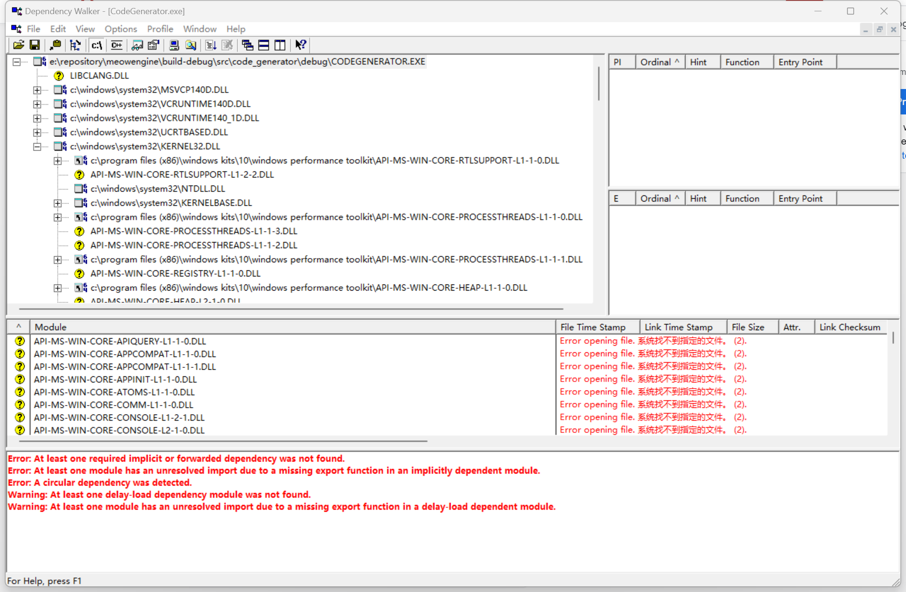
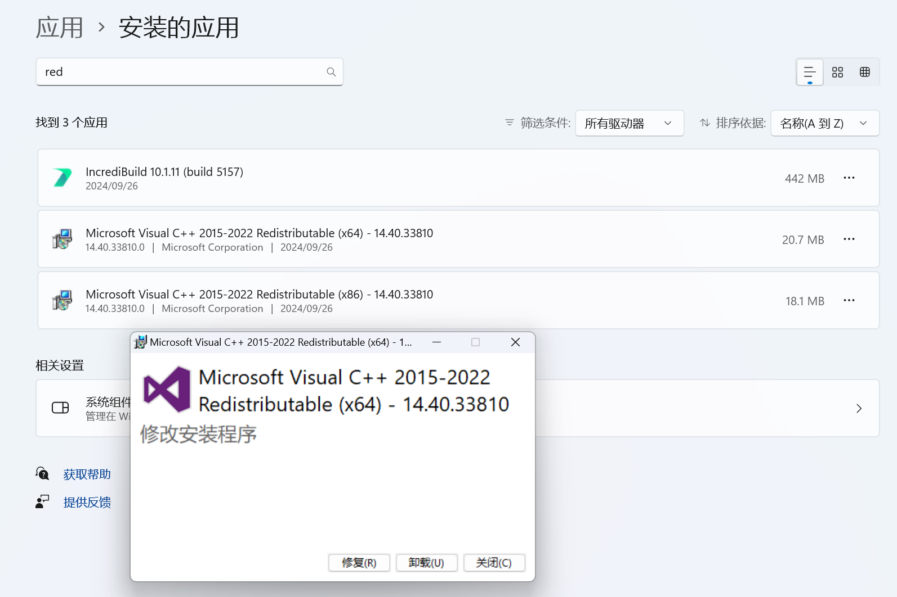

## 启动 exe 失败

```shell
 gdb --args E:\repository\MeowEngine\build-debug\src\code_generator\CodeGenerator.exe -IE:/repository/MeowEngine/src/code_generator/src -IE:/repository/MeowEngine/src/runtime -IE:/repository/MeowEngine/src/3rdparty/glm -IE:/repository/MeowEngine/src/3rdparty/glfw/include -IE:/repository/MeowEngine/src/3rdparty/volk -IE:/software/VulkanSDK/1.3.290.0/Include -IE:/repository/MeowEngine/src/3rdparty/SPIRV-Cross -IE:/repository/MeowEngine/src/3rdparty/stb -IE:/repository/MeowEngine/src/3rdparty/assimp/include -IE:/repository/MeowEngine/build-debug/src/3rdparty/assimp/include -IE:/repository/MeowEngine/src/3rdparty/imgui -SE:/repository/MeowEngine/src/runtime -OE:/repository/MeowEngine/src/runtime/generated
```

```
(gdb) run
Starting program: E:\repository\MeowEngine\build-debug\src\code_generator\CodeGenerator.exe -IE:/repository/MeowEngine/src/code_generator/src -IE:/repository/MeowEngine/src/runtime -IE:/repository/MeowEngine/src/3rdparty/glm -IE:/repository/MeowEngine/src/3rdparty/glfw/include -IE:/repository/MeowEngine/src/3rdparty/volk -IE:/software/VulkanSDK/1.3.290.0/Include -IE:/repository/MeowEngine/src/3rdparty/SPIRV-Cross -IE:/repository/MeowEngine/src/3rdparty/stb -IE:/repository/MeowEngine/src/3rdparty/assimp/include -IE:/repository/MeowEngine/build-debug/src/3rdparty/assimp/include -IE:/repository/MeowEngine/src/3rdparty/imgui -SE:/repository/MeowEngine/src/runtime -OE:/repository/MeowEngine/src/runtime/generated
[New Thread 18060.0x51ec]
[New Thread 18060.0x53f4]
[New Thread 18060.0x94c]
[Thread 18060.0x53f0 exited with code 3221225781]
[Thread 18060.0x94c exited with code 3221225781]
[Thread 18060.0x51ec exited with code 3221225781]
During startup program exited with code 0xc0000135.
```

用 dependency walker 看了一下，似乎是 urt 库找不到



于是我加了一个 link

```cmake
target_link_directories(${CODE_GENERATOR_NAME} PUBLIC "C:/Program Files (x86)/Windows Kits/10/Redist/10.0.22621.0/ucrt/DLLs/x64")
```

也没有用

于是用 msvc 编译

```
E:\software\Microsoft Visual Studio\2022\Community\MSBuild\Microsoft\VC\v170\Microsoft.CppCommon.targets(254,5): error
MSB8066: “E:\repository\MeowEngine\build-debug\CMakeFiles\2d671ee5f42a60e9a73b806408c44d60\register_all.cpp.rule;E:\rep
ository\MeowEngine\build-debug\CMakeFiles\79af65e9bcaf32f02b60478ec74a6c9e\GenerateRegisterFile.rule;E:\repository\Meow
Engine\src\code_generator\CMakeLists.txt”的自定义生成已退出，代码为 -1073741515。 [E:\repository\MeowEngine\build-debug\src\code_gene
rator\GenerateRegisterFile.vcxproj]
```

也是这个 dll 找不到的问题

所以这和编译器无关

于是再上网查是为什么，查到了修复 Redistribution 的选项



重启了之后，运行进程就会弹出缺少的 dll 了

所以还是需要修复 Redistribution，然后才能正常报错