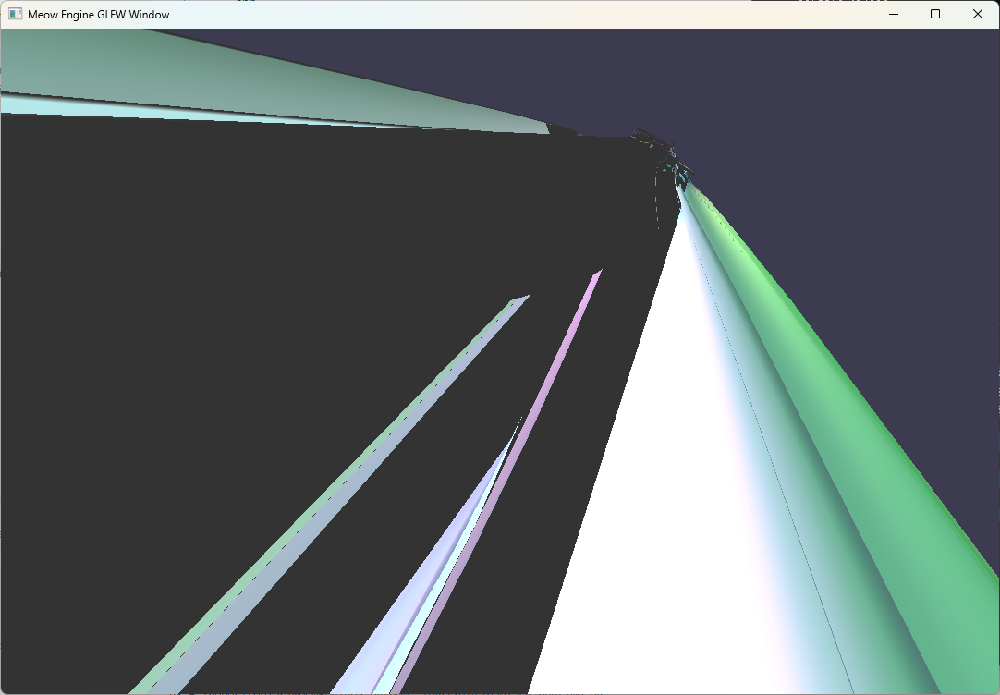

# glm

## Transfrom Debug

不知道为什么，获取变换矩阵的函数始终有问题

```cpp
glm::mat4 GetTransform() const
{
    glm::mat4 transform;

    glm::mat3 rotation_mat = glm::mat3_cast(rotation);

    // Set up final matrix with scale, rotation and translation
    transform[0][0] = scale.x * rotation_mat[0][0];
    transform[0][1] = scale.y * rotation_mat[0][1];
    transform[0][2] = scale.z * rotation_mat[0][2];
    transform[0][3] = position.x;
    transform[1][0] = scale.x * rotation_mat[1][0];
    transform[1][1] = scale.y * rotation_mat[1][1];
    transform[1][2] = scale.z * rotation_mat[1][2];
    transform[1][3] = position.y;
    transform[2][0] = scale.x * rotation_mat[2][0];
    transform[2][1] = scale.y * rotation_mat[2][1];
    transform[2][2] = scale.z * rotation_mat[2][2];
    transform[2][3] = position.z;

    // No projection term
    transform[3][0] = 0;
    transform[3][1] = 0;
    transform[3][2] = 0;
    transform[3][3] = 1;

    return transform;
}
```

如果 position 为 0，那么就不会出现错误

如果 position 不为 0，那么就会出现这样的



试了一下单个物体的


发现会有这样哈哈镜的效果

于是再看 UBO


确实是出错了，位置的信息出现在缩放这里了

于是输出一下我的原始数据

```cpp
            ubo_data.model = transfrom_comp_ptr2->GetTransform();

            std::cout << ubo_data.model[0][0] << ',' << ubo_data.model[0][1] << ',' << ubo_data.model[0][2] << ','
                      << ubo_data.model[0][3] << std::endl;
            std::cout << ubo_data.model[1][0] << ',' << ubo_data.model[1][1] << ',' << ubo_data.model[1][2] << ','
                      << ubo_data.model[1][3] << std::endl;
            std::cout << ubo_data.model[2][0] << ',' << ubo_data.model[2][1] << ',' << ubo_data.model[2][2] << ','
                      << ubo_data.model[2][3] << std::endl;
            std::cout << ubo_data.model[3][0] << ',' << ubo_data.model[3][1] << ',' << ubo_data.model[3][2] << ','
                      << ubo_data.model[3][3] << std::endl;
            std::cout << std::endl;

            // ubo_data.model = glm::rotate(ubo_data.model, glm::radians(180.0f), glm::vec3(0.0f, 1.0f, 0.0f));

            for (int32_t i = 0; i < model_comp_ptr->model_ptr.lock()->meshes.size(); ++i)
            {
                m_obj2attachment_mat.BeginObject();
                m_obj2attachment_mat.SetLocalUniformBuffer("uboMVP", &ubo_data, sizeof(ubo_data));
                m_obj2attachment_mat.EndObject();
            }
        }
```

输出的确实是对的

```
1,0,0,0.5
0,1,0,0
0,0,1,0
0,0,0,1
```

后面发现是 glm 的矩阵是列主序