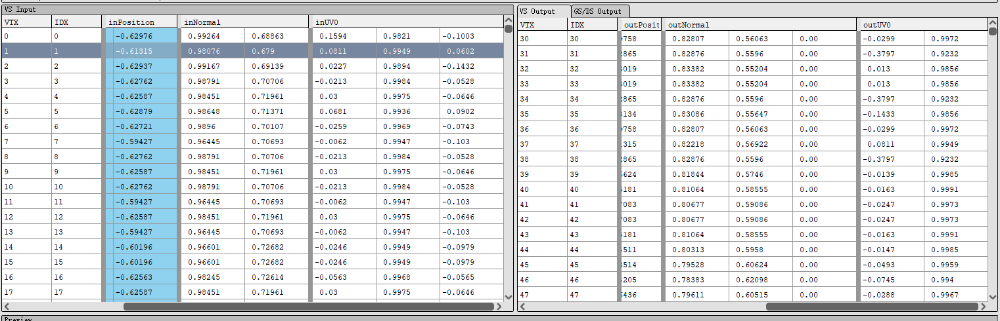

# 模型类

模型需要知道 `Shader` 类的 Vertex Attribute，才方便归纳顶点数组

这是因为现在的顶点数组是 AOS，也就是 `[位置 1 颜色 1 位置 2 颜色 2]` 而不是 SOA 也就是 `[位置 1 位置 2] [颜色 1 颜色 2]`

如果是 SOA，那么模型读取哪些数据完全依赖于模型文件本身，而不是受限于着色器的信息

我觉得这样更好，是个 TODO

## 读取数据的 bug

现在的读取顶点信息的方法是

```cpp
    void Model::LoadVertexDatas(std::unordered_map<size_t, ModelVertexSkin>& skin_info_map,
                                std::vector<float>&                          vertices,
                                glm::vec3&                                   mmax,
                                glm::vec3&                                   mmin,
                                ModelMesh*                                   mesh,
                                const aiMesh*                                ai_mesh,
                                const aiScene*                               ai_scene)
    {
        glm::vec3 defaultColor(glm::linearRand(0.0f, 1.0f), glm::linearRand(0.0f, 1.0f), glm::linearRand(0.0f, 1.0f));

        for (size_t i = 0; i < (size_t)ai_mesh->mNumVertices; ++i)
        {
            if (attributes & VertexAttributeBit::Position)
            {
                float v0 = ai_mesh->mVertices[i].x;
                float v1 = ai_mesh->mVertices[i].y;
                float v2 = ai_mesh->mVertices[i].z;

                vertices.push_back(v0);
                vertices.push_back(v1);
                vertices.push_back(v2);

                mmin.x = glm::min(v0, mmin.x);
                mmin.y = glm::min(v1, mmin.y);
                mmin.z = glm::min(v2, mmin.z);
                mmax.x = glm::max(v0, mmax.x);
                mmax.y = glm::max(v1, mmax.y);
                mmax.z = glm::max(v2, mmax.z);
            }
            if (attributes & VertexAttributeBit::UV0)
            {
                if (ai_mesh->HasTextureCoords(0))
                {
                    vertices.push_back(ai_mesh->mTextureCoords[0][i].x);
                    vertices.push_back(ai_mesh->mTextureCoords[0][i].y);
                }
                else
                {
                    vertices.push_back(0);
                    vertices.push_back(0);
                }
            }
            if (attributes & VertexAttributeBit::UV1)
            {
                if (ai_mesh->HasTextureCoords(1))
                {
                    vertices.push_back(ai_mesh->mTextureCoords[1][i].x);
                    vertices.push_back(ai_mesh->mTextureCoords[1][i].y);
                }
                else
                {
                    vertices.push_back(0);
                    vertices.push_back(0);
                }
            }
            if (attributes & VertexAttributeBit::Normal)
            {
                vertices.push_back(ai_mesh->mNormals[i].x);
                vertices.push_back(ai_mesh->mNormals[i].y);
                vertices.push_back(ai_mesh->mNormals[i].z);
            }
```

类似这样

那么实际上得到的 vertex 就是按照这个顶点顺序来的



但是实际上是应该按照 binding 的顺序来的，所以就出错了

于是 shader 中的变量还是需要用 vector 而不是 bitmask

```cpp
BitMask<VertexAttributeBit> per_vertex_attributes;
BitMask<VertexAttributeBit> instance_attributes;
```
