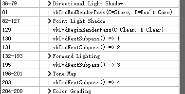

# Render Pass

## 信息依赖

更改渲染通道，例如做延迟渲染的时候，我需要某一个 pass 输出到三个纹理附件，然后下一个 pass 使用这三个纹理附件

那么 render pass 和 frame buffer 都需要更改

render pass 需要知道：

1.各个 subpass 总共要使用到的所有附件的信息

通过 `vk::AttachmentDescription` 存储

2.各个 subpass 对附件集合的引用。正如其名，是一个引用，或者说索引

通过 `vk::AttachmentReference` 存储

之后 subpass 就通过 `vk::AttachmentReference` 来知道，自己使用的是前面 `vk::AttachmentDescription` 中的第几个

3.每一个 subpass 是什么，每一个 subpass 使用的附件

通过 `vk::SubpassDescription` 存储

比如你是什么额外操作都没有，那么就只有一个单独的 subpass

但是比如延迟渲染的话，就需要两个 subpass，一个是输出颜色、法线、深度，一个是读取这些附件做着色

4.每个 subpass 之间的依赖关系

通过 `vk::SubpassDependency` 存储

比如延迟渲染的第二个 pass 需要依赖第一个 pass 的各个附件都输出完

5.最终汇总上面所有的信息，制作一个 render pass

通过 `vk::RenderPassCreateInfo` 存储

render pass 和 frame buffer 都需要知道附件信息

render pass 要知道的是附件的配置，而 frame buffer 要保存附件的 `vk::raii::ImageView` 引用

因为其实是 render pass 决定了附件的配置，所以 frame buffer 应该是 render pass 的数据成员

因为 frame buffer 要保存附件的 `vk::raii::ImageView` 引用，所以 `vk::raii::ImageView` 应该是 frame buffer 的成员

但是既然已经有 `vk::raii::Framebuffer` 了，那我觉得让 `vk::raii::Framebuffer` 和 `vk::raii::ImageView` 平级，都属于 render pass 也无所谓

## 多个 Render Pass 与单独一个 Render Pass 多个 subpass 之前的区别

如果 command 提交过程中你需要切换 framebufferview，则你需要一个新的 renderpass(vkBeginRenderPass),这是 renderpass 的作用。

而 subpass 则是一种加速手段。如果你的 shader 要读取上一个 pass 的输出，并且只读取当前 uv 位置的数据，则可以在 shader 中使用 InputAttachment.load,在满足一定条件下，subpass 可以直接从片上缓存读取到上一个 pass 的输出。

## 结构设计

Pipeline 的创建需要知道颜色附件的信息，存储在 `vk::PipelineColorBlendAttachmentState`

一个颜色附件对应一个 `vk::PipelineColorBlendAttachmentState`

`vk::PipelineColorBlendStateCreateInfo` 汇总这些 `vk::PipelineColorBlendAttachmentState`

也就是 Material 创建 Pipeline 的时候，需要知道对应 subpass 的附件信息

因此 Material 应该是附属于 subpass 的数据结构

一个 render pass 的各个 subpass 应该是独立的类实例

```cpp
DeferredPass::DeferredPass(vk::raii::PhysicalDevice const& physical_device,
                            vk::raii::Device const&         device,
                            SurfaceData&                    surface_data,
                            vk::raii::CommandPool const&    command_pool,
                            vk::raii::Queue const&          queue,
                            DescriptorAllocatorGrowable&    m_descriptor_allocator)
{
    // Create a set to store all information of attachments

    vk::Format color_format =
        PickSurfaceFormat((physical_device).getSurfaceFormatsKHR(*surface_data.surface)).format;
    assert(color_format != vk::Format::eUndefined);

    std::vector<vk::AttachmentDescription> attachment_descriptions;
    // swap chain attachment
    attachment_descriptions.emplace_back(vk::AttachmentDescriptionFlags(), /* flags */
                                          color_format,                     /* format */
                                          sample_count,                     /* samples */
                                          vk::AttachmentLoadOp::eClear,     /* loadOp */
                                          vk::AttachmentStoreOp::eStore,    /* storeOp */
                                          vk::AttachmentLoadOp::eDontCare,  /* stencilLoadOp */
                                          vk::AttachmentStoreOp::eDontCare, /* stencilStoreOp */
                                          vk::ImageLayout::eUndefined,      /* initialLayout */
                                          vk::ImageLayout::ePresentSrcKHR); /* finalLayout */
    // color attachment
    attachment_descriptions.emplace_back(vk::AttachmentDescriptionFlags(),          /* flags */
                                          color_format,                              /* format */
                                          sample_count,                              /* samples */
                                          vk::AttachmentLoadOp::eClear,              /* loadOp */
                                          vk::AttachmentStoreOp::eDontCare,          /* storeOp */
                                          vk::AttachmentLoadOp::eDontCare,           /* stencilLoadOp */
                                          vk::AttachmentStoreOp::eDontCare,          /* stencilStoreOp */
                                          vk::ImageLayout::eUndefined,               /* initialLayout */
                                          vk::ImageLayout::eColorAttachmentOptimal); /* finalLayout */
    // normal attachment
    attachment_descriptions.emplace_back(vk::AttachmentDescriptionFlags(),          /* flags */
                                          vk::Format::eR8G8B8A8Unorm,                /* format */
                                          sample_count,                              /* samples */
                                          vk::AttachmentLoadOp::eClear,              /* loadOp */
                                          vk::AttachmentStoreOp::eDontCare,          /* storeOp */
                                          vk::AttachmentLoadOp::eDontCare,           /* stencilLoadOp */
                                          vk::AttachmentStoreOp::eDontCare,          /* stencilStoreOp */
                                          vk::ImageLayout::eUndefined,               /* initialLayout */
                                          vk::ImageLayout::eColorAttachmentOptimal); /* finalLayout */
    // depth attachment
    attachment_descriptions.emplace_back(vk::AttachmentDescriptionFlags(),                 /* flags */
                                          depth_format,                                     /* format */
                                          sample_count,                                     /* samples */
                                          vk::AttachmentLoadOp::eClear,                     /* loadOp */
                                          vk::AttachmentStoreOp::eDontCare,                 /* storeOp */
                                          vk::AttachmentLoadOp::eDontCare,                  /* stencilLoadOp */
                                          vk::AttachmentStoreOp::eDontCare,                 /* stencilStoreOp */
                                          vk::ImageLayout::eUndefined,                      /* initialLayout */
                                          vk::ImageLayout::eDepthStencilAttachmentOptimal); /* finalLayout */

    // Create reference to attachment information set

    vk::AttachmentReference swapchain_attachment_reference(0, vk::ImageLayout::eColorAttachmentOptimal);

    std::vector<vk::AttachmentReference> color_attachment_references;
    color_attachment_references.emplace_back(1, vk::ImageLayout::eColorAttachmentOptimal);
    color_attachment_references.emplace_back(2, vk::ImageLayout::eColorAttachmentOptimal);

    vk::AttachmentReference depth_attachment_reference(3, vk::ImageLayout::eDepthStencilAttachmentOptimal);

    std::vector<vk::AttachmentReference> input_attachment_references;
    input_attachment_references.emplace_back(1, vk::ImageLayout::eShaderReadOnlyOptimal);
    input_attachment_references.emplace_back(2, vk::ImageLayout::eShaderReadOnlyOptimal);
    input_attachment_references.emplace_back(3, vk::ImageLayout::eShaderReadOnlyOptimal);

    // Create subpass

    std::vector<vk::SubpassDescription> subpass_descriptions;
    subpass_descriptions.push_back(vk::SubpassDescription(vk::SubpassDescriptionFlags(),    /* flags */
                                                          vk::PipelineBindPoint::eGraphics, /* pipelineBindPoint */
                                                          {},                               /* pInputAttachments */
                                                          color_attachment_references,      /* pColorAttachments */
                                                          {},                          /* pResolveAttachments */
                                                          &depth_attachment_reference, /* pDepthStencilAttachment */
                                                          nullptr));                   /* pPreserveAttachments */
    subpass_descriptions.push_back(vk::SubpassDescription(vk::SubpassDescriptionFlags(),    /* flags */
                                                          vk::PipelineBindPoint::eGraphics, /* pipelineBindPoint */
                                                          input_attachment_references,      /* pInputAttachments */
                                                          swapchain_attachment_reference,   /* pColorAttachments */
                                                          {},        /* pResolveAttachments */
                                                          {},        /* pDepthStencilAttachment */
                                                          nullptr)); /* pPreserveAttachments */

    // Create subpass dependency

    std::vector<vk::SubpassDependency> dependencies;
    dependencies.emplace_back(VK_SUBPASS_EXTERNAL,                               /* srcSubpass */
                              0,                                                 /* dstSubpass */
                              vk::PipelineStageFlagBits::eBottomOfPipe,          /* srcStageMask */
                              vk::PipelineStageFlagBits::eColorAttachmentOutput, /* dstStageMask */
                              vk::AccessFlagBits::eMemoryRead,                   /* srcAccessMask */
                              vk::AccessFlagBits::eColorAttachmentWrite,         /* dstAccessMask */
                              vk::DependencyFlagBits::eByRegion);                /* dependencyFlags */
    dependencies.emplace_back(0,                                                 /* srcSubpass */
                              1,                                                 /* dstSubpass */
                              vk::PipelineStageFlagBits::eColorAttachmentOutput, /* srcStageMask */
                              vk::PipelineStageFlagBits::eFragmentShader,        /* dstStageMask */
                              vk::AccessFlagBits::eColorAttachmentWrite,         /* srcAccessMask */
                              vk::AccessFlagBits::eShaderRead,                   /* dstAccessMask */
                              vk::DependencyFlagBits::eByRegion);                /* dependencyFlags */
    dependencies.emplace_back(1,                                                 /* srcSubpass */
                              VK_SUBPASS_EXTERNAL,                               /* dstSubpass */
                              vk::PipelineStageFlagBits::eColorAttachmentOutput, /* srcStageMask */
                              vk::PipelineStageFlagBits::eBottomOfPipe,          /* dstStageMask */
                              vk::AccessFlagBits::eColorAttachmentWrite,         /* srcAccessMask */
                              vk::AccessFlagBits::eMemoryRead,                   /* dstAccessMask */
                              vk::DependencyFlagBits::eByRegion);                /* dependencyFlags */

    // Create render pass
    vk::RenderPassCreateInfo render_pass_create_info(vk::RenderPassCreateFlags(), /* flags */
                                                      attachment_descriptions,     /* pAttachments */
                                                      subpass_descriptions,        /* pSubpasses */
                                                      dependencies);               /* pDependencies */

    render_pass = vk::raii::RenderPass(device, render_pass_create_info);

    // Create Material

    std::shared_ptr<Shader> obj_shader_ptr = std::make_shared<Shader>(physical_device,
                                                                      device,
                                                                      m_descriptor_allocator,
                                                                      "builtin/shaders/obj.vert.spv",
                                                                      "builtin/shaders/obj.frag.spv");

    obj2attachment_mat                        = Material(physical_device, device, obj_shader_ptr);
    obj2attachment_mat.color_attachment_count = 2;
    obj2attachment_mat.UpdateDescriptorSets(device);
    obj2attachment_mat.CreatePipeline(device, render_pass, vk::FrontFace::eClockwise, true);

    std::shared_ptr<Shader> quad_shader_ptr = std::make_shared<Shader>(physical_device,
                                                                        device,
                                                                        m_descriptor_allocator,
                                                                        "builtin/shaders/quad.vert.spv",
                                                                        "builtin/shaders/quad.frag.spv");

    quad_mat         = Material(physical_device, device, quad_shader_ptr);
    quad_mat.subpass = 1;
    quad_mat.CreatePipeline(device, render_pass, vk::FrontFace::eClockwise, true);

    // Create quad model
    std::vector<float>    vertices = {-1.0f, 1.0f,  0.0f, 0.0f, 0.0f, 1.0f,  1.0f,  0.0f, 1.0f, 0.0f,
                                      1.0f,  -1.0f, 0.0f, 1.0f, 1.0f, -1.0f, -1.0f, 0.0f, 0.0f, 1.0f};
    std::vector<uint16_t> indices  = {0, 1, 2, 0, 2, 3};

    quad_model = std::move(Model(physical_device,
                                  device,
                                  command_pool,
                                  queue,
                                  vertices,
                                  indices,
                                  quad_mat.shader_ptr->per_vertex_attributes));
}
```

例如这里的 `attachment_descriptions` `color_attachment_references` `input_attachment_references` 都应该是由各个 subpass 分别添加的

`subpass_descriptions` `dependencies` 更不用说了

各个 subpass 都添加完了之后，render pass 再 create

`VkClearValue` 也应该存储在 render pass 里面，一个 `VkClearValue` 对应一个 attachment

什么时候使用 `cmd_buffer.nextSubpass(vk::SubpassContents::eInline);` 也应该由 render pass 来决定，因为他知道自己有多少个 subpass 

## pending command

因为使用了 subpass，pending command 的执行位置需要额外考虑了

例如我现在得到一个报错

```
[16:37:34] RUNTIME: Error: { Validation }:
        messageIDName   = <VUID-vkCmdPipelineBarrier-None-07889>
        messageIdNumber = -616663606
        message         = <Validation Error: [ VUID-vkCmdPipelineBarrier-None-07889 ] Object 0: handle = 0x9fde6b0000000014, type = VK_OBJECT_TYPE_RENDER_PASS; | MessageID = 0xdb3e75ca | vkCmdPipelineBarrier():  Barriers cannot be set during subpass 0 of VkRenderPass 0x9fde6b0000000014[] with no self-dependency specified. The Vulkan spec states: If vkCmdPipelineBarrier is called within a render pass instance using a VkRenderPass object, the render pass must have been created with at least one subpass dependency that expresses a dependency from the current subpass to itself, does not include VK_DEPENDENCY_BY_REGION_BIT if this command does not, does not include VK_DEPENDENCY_VIEW_LOCAL_BIT if this command does not, and has synchronization scopes and access scopes that are all supersets of the scopes defined in this command (https://vulkan.lunarg.com/doc/view/1.3.275.0/windows/1.3-extensions/vkspec.html#VUID-vkCmdPipelineBarrier-None-07889)>
        Objects:
                Object 0
                        objectType   = RenderPass
                        objectHandle = 11519762544604479508
```

这个报错的意思是，如果我在某个 subpass 里面做 `vkCmdPipelineBarrier`，那么这个 render pass 中应该有一个 subpass dependency， `srcSubpass` `dstSubpass` 都是这个 subpass 自己

如果真的要这么做，就有点复杂了我觉得。在自定义类里面，render pass 还要去管 command buffer 的事，有点耦合了。

他看上去就像是，其实可以不在 render pass 里面做 `vkCmdPipelineBarrier`

那么我为什么要这么做呢。因为我以前的遇到过错误是，command buffer 的使用需要在 command buffer 的录制阶段，然后我一看我的代码，只有 render pass 的 begin 和 end 之间有写 command buffer 的 begin 和 end，所以我就把所有跟 command buffer 有关的执行都存储起来，统一推迟到 render pass 里面执行，以此实现位于 command buffer 的 begin 和 end 之间

现在我才突然发现，其实 command buffer 的 begin 和 end 跟 render pass 没有关系，倒不如说是为了 `cmd_buffer.beginRenderPass` 才需要启动 command buffer 的录制

或许其实 command buffer 它本身就是一个 buffer，所以理论上就是要随时录制的，我这么做再加多一层肯定有问题

所以我把那个 pending command 删了，要用到 command buffer 的地方直接录制就好了

之后再看 command buffer 的使用，发现它的使用方法真的和我的想法一模一样。submit 之前，记录的命令就一直留在 command buffer 里面，submit 之后用 reset 清空就好了

我之前都是在 render pass 的记录之前清空，那是因为简单案例里面，render pass 前面没有 command buffer 相关的其他东西

现在搞懂之后觉得，应该是 submit 之后，wait for fence 结束之后 reset 最合理

这样，一帧里面的所有命令都保存下来了

## 附件不需要为 frames in flight 而备份

[Why is a single depth buffer sufficient for multiple frames in flight?](https://www.reddit.com/r/vulkan/comments/aavxl4/why_is_a_single_depth_buffer_sufficient_for/)

[What exactly is the definition of "frames in flight"?](https://www.reddit.com/r/vulkan/comments/nbu94q/what_exactly_is_the_definition_of_frames_in_flight/)

虽然我们有飞行中的多个帧 multiple frames in flight，但是这并不意味着我们在同时渲染多个帧

实际上，multiple frames in flight 的意思是，一个帧具有三个阶段

1. 记录命令缓冲，上传数据
   
2. GPU 渲染

3. 呈现到屏幕

我们可以有两个帧同时位于不同的阶段，但是我们不会有两个帧同时位于同一个阶段

所以我们在给 frame buffer 提供 `vk::raii::ImageView` 引用的时候，多个 frame buffer 引用不同的 swapchain 的 image view，但是引用同一个深度缓冲

那么如果你再添加其他附件，也是无需为了多个 frame buffer 而备份的

## 动态渲染 Dynamic rendering

[https://www.khronos.org/blog/streamlining-render-passes](https://www.khronos.org/blog/streamlining-render-passes)

[https://www.khronos.org/blog/streamlining-subpasses](https://www.khronos.org/blog/streamlining-subpasses)

现在是可以用动态渲染实现 local read 了

于是完全可以转向动态渲染

## subpass 和 render pass 之间的区别

看到 picoolo 的渲染是

```cpp
static_cast<DirectionalLightShadowPass*>(m_directional_light_pass.get())->draw();

static_cast<PointLightShadowPass*>(m_point_light_shadow_pass.get())->draw();

ColorGradingPass& color_grading_pass = *(static_cast<ColorGradingPass*>(m_color_grading_pass.get()));
FXAAPass&         fxaa_pass          = *(static_cast<FXAAPass*>(m_fxaa_pass.get()));
ToneMappingPass&  tone_mapping_pass  = *(static_cast<ToneMappingPass*>(m_tone_mapping_pass.get()));
UIPass&           ui_pass            = *(static_cast<UIPass*>(m_ui_pass.get()));
CombineUIPass&    combine_ui_pass    = *(static_cast<CombineUIPass*>(m_combine_ui_pass.get()));
ParticlePass&     particle_pass      = *(static_cast<ParticlePass*>(m_particle_pass.get()));

static_cast<ParticlePass*>(m_particle_pass.get())
    ->setRenderCommandBufferHandle(
        static_cast<MainCameraPass*>(m_main_camera_pass.get())->getRenderCommandBuffer());

static_cast<MainCameraPass*>(m_main_camera_pass.get())
    ->draw(color_grading_pass,
            fxaa_pass,
            tone_mapping_pass,
            ui_pass,
            combine_ui_pass,
            particle_pass,
            vulkan_rhi->m_current_swapchain_image_index);
            
g_runtime_global_context.m_debugdraw_manager->draw(vulkan_rhi->m_current_swapchain_image_index);
```

阴影的 pass 是独立的，其他的都是 subpass

为什么呢

哦，因为是用于创建阴影贴图而不是使用颜色附件

所以阴影的 pass 利用不了颜色附件

其他的就可以

## 别人怎么抽象 subpass

于是发现他这个 subpass dependency 就是 hard code 在 `void MainCameraPass::setupRenderPass()` 里面的

并不是我以为的，可以各自单独配置

## dynamic rendering 的意义

看了 [https://www.reddit.com/r/vulkan/comments/sd93nm/the_future_of_renderpass_mechanism_vs_dynamic/](https://www.reddit.com/r/vulkan/comments/sd93nm/the_future_of_renderpass_mechanism_vs_dynamic/)

所说，大部分观点是，动态渲染使得图像布局转换变得清晰了

然后还有说，pipeline 和 render pass 解耦

也就是着色器和渲染状态（储存在 pipeline）和附件（储存在 render pass）解耦

怎么说呢，创建 pipeline 的时候，你还是会需要知道附件信息

只是这个附件信息现在是格式，而不是附件 image 指针

来自 Vulkan-Samples

samples\extensions\dynamic_rendering\dynamic_rendering.cpp

```cpp
// Provide information for dynamic rendering
VkPipelineRenderingCreateInfoKHR pipeline_create{VK_STRUCTURE_TYPE_PIPELINE_RENDERING_CREATE_INFO_KHR};
pipeline_create.pNext                   = VK_NULL_HANDLE;
pipeline_create.colorAttachmentCount    = 1;
pipeline_create.pColorAttachmentFormats = &color_rendering_format;
pipeline_create.depthAttachmentFormat   = depth_format;
if (!vkb::is_depth_only_format(depth_format))
{
    pipeline_create.stencilAttachmentFormat = depth_format;
}

// Use the pNext to point to the rendering create struct
VkGraphicsPipelineCreateInfo graphics_create{VK_STRUCTURE_TYPE_GRAPHICS_PIPELINE_CREATE_INFO};
graphics_create.pNext               = &pipeline_create;
graphics_create.renderPass          = VK_NULL_HANDLE;
graphics_create.pInputAssemblyState = &input_assembly_state;
graphics_create.pRasterizationState = &rasterization_state;
graphics_create.pColorBlendState    = &color_blend_state;
graphics_create.pMultisampleState   = &multisample_state;
graphics_create.pViewportState      = &viewport_state;
graphics_create.pDepthStencilState  = &depth_stencil_state;
graphics_create.pDynamicState       = &dynamic_state;
graphics_create.pVertexInputState   = &vertex_input_state;
graphics_create.stageCount          = static_cast<uint32_t>(shader_stages.size());
graphics_create.pStages             = shader_stages.data();
graphics_create.layout              = pipeline_layout;

// Skybox pipeline (background cube)
VkSpecializationInfo                    specialization_info;
std::array<VkSpecializationMapEntry, 1> specialization_map_entries{};
specialization_map_entries[0]        = vkb::initializers::specialization_map_entry(0, 0, sizeof(uint32_t));
uint32_t shadertype                  = 0;
specialization_info                  = vkb::initializers::specialization_info(1, specialization_map_entries.data(), sizeof(shadertype), &shadertype);
shader_stages[0].pSpecializationInfo = &specialization_info;
shader_stages[1].pSpecializationInfo = &specialization_info;

if (!enable_dynamic)
{
    graphics_create.pNext      = VK_NULL_HANDLE;
    graphics_create.renderPass = render_pass;
}

vkCreateGraphicsPipelines(get_device().get_handle(), VK_NULL_HANDLE, 1, &graphics_create, VK_NULL_HANDLE, &skybox_pipeline);
```

我倒觉得这个解耦体现在不需要传入 render pass 了

（因为你已经没有 render pass 对象了）

也就是体现在

```cpp
graphics_create.renderPass          = VK_NULL_HANDLE;
```

和 render pass 解耦之后，你就可以用在颜色格式相同的任何 pass 了

在 pass 之间共享的意义并不大，因为你不是完全自由的，因为你还是需要客户端知晓哪些是颜色格式相同的 pass

还是有一层心智负担的

但是能够脱离 render pass 来创建 pipeline 还是很爽的

比如你的设计如果是不从你对 pass 的抽象类里面获取颜色附件的格式、深度附件的格式

而是从别人地方获取，比如使用默认值，或者从自己创建的 meta 文件中获取

那么创建 material 这种包含 pipeline 的抽象类的时候，就与 render pass 的抽象类完全无关了

现在想想似乎还有第三点

就是推出了 local read 之后，你不需要在创建 render pass 的时候就知道 subpass 的所有信息

这使得 render pass 和 subpass 之间是可以解耦的，这其实我觉得是最大的意义

综合这些的话：

1. 由程序客户端控制图像布局转换

2. 拥有 pipeline 的抽象类（如 material）与 render pass 抽象类之间解耦

3. render pass 和 subpass 之间解耦

## 启动 dynamic rendering

想通过这个来启动

```cpp
// prepare for create vk::InstanceCreateInfo
std::vector<vk::ExtensionProperties> available_instance_extensions =
    m_vulkan_context.enumerateInstanceExtensionProperties();
std::vector<const char*> required_instance_extensions = GetRequiredInstanceExtensions({
    VK_KHR_SURFACE_EXTENSION_NAME,
    VK_KHR_DYNAMIC_RENDERING_EXTENSION_NAME,
});
if (!ValidateExtensions(required_instance_extensions, available_instance_extensions))
{
    throw std::runtime_error("Required instance extensions are missing.");
}
```

但是看上去 1.3 里面已经不是 extension 了，我找不到

于是发现是在 device extension 里面而不是 instance extension 里面

```cpp
std::vector<const char*> k_required_device_extensions = {
    VK_KHR_SWAPCHAIN_EXTENSION_NAME,
    VK_KHR_DYNAMIC_RENDERING_EXTENSION_NAME,
};

void RenderSystem::CreateLogicalDevice()
{
    // Logical Device

    std::vector<vk::ExtensionProperties> device_extensions = m_physical_device.enumerateDeviceExtensionProperties();
    if (!ValidateExtensions(k_required_device_extensions, device_extensions))
    {
        throw std::runtime_error("Required device extensions are missing, will try without.");
    }
```

这样检查就好了

## 创建用于 dynamic rendering 的 pipeline

现在 `vk::GraphicsPipelineCreateInfo` 不需要 `renderPass` 和 `subpass` 了

但是需要一个额外的用于 dynamic rendering 的 info

在创建 `vk::PipelineRenderingCreateInfoKHR` 的时候就发现了

不管是 render pass 还是 dynamic rendering

始终都是要知道附件信息传入的

所以 dynamic rendering 并不能和抽象的 render pass 之间分来

附件信息始终是需要输入的

所以优势或许可以总结为

1. 由客户端控制图像布局转换，不需要静态地定义出完整 render pass 的抽象的图像布局

2. 客户端对 subpass 的抽象之间解耦

客户端对 vulkan render pass 的抽象之间在 dynamic 之前自然就是解耦的

看到这些 pipeline 的状态就感觉会有很多都可以用数据驱动的

就不用我 hard code material 类的变体，或者是构造函数的变体，或者之类的

比如 `vk::PipelineColorBlendAttachmentState` 管理 alpha 混合的，和 `vk::PipelineDepthStencilStateCreateInfo` 管理模板测试的之类的，都可以用数据驱动啊

但是这仅仅是想想

现在在写 dynamic rendering 的时候还是不要做这些了

## vkCmdBeginRenderingKHR 时需要的附件信息

使用 `vkCmdBeginRenderingKHR` 时需要转变附件布局，也需要传入 image view 到 info 里面

原来的 vulkan render pass 体系中，这些附件是通过 frame buffer 传入的

现在只是转变成了自己传入附件

并且你传入的附件数实际上跟 framebuffer 时期应该是一样的

如果你自己创建一个 frame buffer 的抽象类的话，甚至可以认为 framebuffer 还在

但是以这么来看的话，subpass 似乎也并没有单独抽象的价值

因为毕竟如果要抽象成单独的类，那么还需要协调怎么传递附件信息

那还不如不协调

那么其实 subpass 并没有抽象解耦的优势

所以优势仅仅是由客户端控制图像布局转换，不需要静态地定义出完整 render pass 的抽象的图像布局，这一点

所以他对代码架构组织并没有帮助

仅仅会影响对 vulkan 的调用风格而已

## transit layout

Vulkan Samples 是这样做布局转换

```cpp
vkb::image_layout_transition(draw_cmd_buffer,
                                swapchain_buffers[i].image,
                                VK_PIPELINE_STAGE_COLOR_ATTACHMENT_OUTPUT_BIT,
                                VK_PIPELINE_STAGE_COLOR_ATTACHMENT_OUTPUT_BIT,
                                0,
                                VK_ACCESS_COLOR_ATTACHMENT_WRITE_BIT,
                                VK_IMAGE_LAYOUT_UNDEFINED,
                                VK_IMAGE_LAYOUT_COLOR_ATTACHMENT_OPTIMAL,
                                range);

vkb::image_layout_transition(draw_cmd_buffer,
                                depth_stencil.image,
                                VK_IMAGE_LAYOUT_UNDEFINED,
                                VK_IMAGE_LAYOUT_DEPTH_ATTACHMENT_OPTIMAL,
                                depth_range);
```

主要是给布局转换的设了两个接口

怎么说呢

可能是因为他的内部

```cpp
void image_layout_transition(VkCommandBuffer                command_buffer,
                             VkImage                        image,
                             VkImageLayout                  old_layout,
                             VkImageLayout                  new_layout,
                             VkImageSubresourceRange const &subresource_range)
{
	VkPipelineStageFlags src_stage_mask  = getPipelineStageFlags(old_layout);
	VkPipelineStageFlags dst_stage_mask  = getPipelineStageFlags(new_layout);
	VkAccessFlags        src_access_mask = getAccessFlags(old_layout);
	VkAccessFlags        dst_access_mask = getAccessFlags(new_layout);

	image_layout_transition(command_buffer, image, src_stage_mask, dst_stage_mask, src_access_mask, dst_access_mask, old_layout, new_layout, subresource_range);
}
```

因为是对 old layout 和 new layout 都是相同的处理函数

所以处理能力有点弱

所以才额外多一个直接设置各个 flag 的版本

我的话……等到出问题再说吧

## dynamic rendering 的用处

突然想到，如果 undefined 可以表示任意 layout 的话

那么其实 editor 和 game 的区别就仅仅在于末尾的 layout 变化了

所以如果真的可以这样的话

那么 editor 和 game 的合并就方便了

再也不需要我分叉创建类了

## 对照 piccolo 的 render pass

看了一下 piccolo，他的 render pass 竟然是只有一个的，forward 和 deferred 通用的

不对啊，但是位置贴图 法线贴图那些的，怎么处理的啊，forward 和 deferred 在这里肯定是不一样的吧

然后看到他这个 layout 和 pipeline 居然都是写死了数组，然后用枚举去索引

```cpp
// 1: per mesh layout
// 2: global layout
// 3: mesh per material layout
// 4: sky box layout
// 5: axis layout
// 6: billboard type particle layout
// 7: gbuffer lighting
enum LayoutType : uint8_t
{
    _per_mesh = 0,
    _mesh_global,
    _mesh_per_material,
    _skybox,
    _axis,
    _particle,
    _deferred_lighting,
    _layout_type_count
};

// 1. model
// 2. sky box
// 3. axis
// 4. billboard type particle
enum RenderPipeLineType : uint8_t
{
    _render_pipeline_type_mesh_gbuffer = 0,
    _render_pipeline_type_deferred_lighting,
    _render_pipeline_type_mesh_lighting,
    _render_pipeline_type_skybox,
    _render_pipeline_type_axis,
    _render_pipeline_type_particle,
    _render_pipeline_type_count
};
```

render pass 也是

```cpp
enum
{
    _main_camera_pass_gbuffer_a                     = 0,
    _main_camera_pass_gbuffer_b                     = 1,
    _main_camera_pass_gbuffer_c                     = 2,
    _main_camera_pass_backup_buffer_odd             = 3,
    _main_camera_pass_backup_buffer_even            = 4,
    _main_camera_pass_post_process_buffer_odd       = 5,
    _main_camera_pass_post_process_buffer_even      = 6,
    _main_camera_pass_depth                         = 7,
    _main_camera_pass_swap_chain_image              = 8,
    _main_camera_pass_custom_attachment_count       = 5,
    _main_camera_pass_post_process_attachment_count = 2,
    _main_camera_pass_attachment_count              = 9,
};

enum
{
    _main_camera_subpass_basepass = 0,
    _main_camera_subpass_deferred_lighting,
    _main_camera_subpass_forward_lighting,
    _main_camera_subpass_tone_mapping,
    _main_camera_subpass_color_grading,
    _main_camera_subpass_fxaa,
    _main_camera_subpass_ui,
    _main_camera_subpass_combine_ui,
    _main_camera_subpass_count
};
```

这都是 hard code 啊

然后看懂了他是为什么可以一个 render pass 实现 forward 和 deferred 了

deferred 的两个阶段在 forward pass 这里就是直接跳过了

```cpp
    void MainCameraPass::drawForward(ColorGradingPass& color_grading_pass,
                                     FXAAPass&         fxaa_pass,
                                     ToneMappingPass&  tone_mapping_pass,
                                     UIPass&           ui_pass,
                                     CombineUIPass&    combine_ui_pass,
                                     ParticlePass&     particle_pass,
                                     uint32_t          current_swapchain_image_index)
    {
        ...

        m_rhi->cmdNextSubpassPFN(m_rhi->getCurrentCommandBuffer(), RHI_SUBPASS_CONTENTS_INLINE);

        m_rhi->cmdNextSubpassPFN(m_rhi->getCurrentCommandBuffer(), RHI_SUBPASS_CONTENTS_INLINE);

        float color[4] = { 1.0f, 1.0f, 1.0f, 1.0f };
        m_rhi->pushEvent(m_rhi->getCurrentCommandBuffer(), "Forward Lighting", color);

        drawMeshLighting();
        drawSkybox();
        particle_pass.draw();

        ...
```

顶上两个 `cmdNextSubpassPFN` 就是跳过 deferred 的 subpass

如图可见 `Forward Lighting` 顶上两个跳过



然后如果是 deferred render，却还需要 forward lighting 的 subpass

```cpp
m_rhi->pushEvent(m_rhi->getCurrentCommandBuffer(), "Forward Lighting", color);

particle_pass.draw();

m_rhi->popEvent(m_rhi->getCurrentCommandBuffer());
```

forward render 中轮到这个 subpass 里面就是正经画 mesh

```cpp
m_rhi->pushEvent(m_rhi->getCurrentCommandBuffer(), "Forward Lighting", color);

drawMeshLighting();
drawSkybox();
particle_pass.draw();

m_rhi->popEvent(m_rhi->getCurrentCommandBuffer());
```

如此神奇

render pass 是在 deferred 和 forward 之间共享的

framebuffer 也是在 deferred 和 forward 之间共享的

那么这就有额外的绑定了，maybe

当然这里的 pass 绝大部分共享的话就还好

但是 hard code 实在是太丑了

果然还是需要 dynamic rendering

不用 dynamic rendering 的话，要对不同的 render pass 抽象类的组合创建不同的 vulkan render pass

或者如果你的组合数目有限，或者发生变动的 vulkan sub render pass 的数目很少的时候，你可以将所有的 vulkan sub render pass 都写成一个大的 render pass

然后按需使用 `cmdNextSubpassPFN` 跳过不需要的 subpass

一个是列出所有的排列组合，一个是将所有的排列组合统一为一个 vulkan render pass

前者可能需要一些复杂的生成胶水代码，后者需要 hard code 一个臃肿的结构

果然还是 dynamic rendering 更好

## 重构

### query_pool 高于 render pass？

以前的 render pass 的 draw 是这样

```cpp
void EditorForwardLightingPass::Draw(const vk::raii::CommandBuffer& command_buffer)
{
    FUNCTION_TIMER();

    m_forward_mat.BindPipeline(command_buffer);

    if (m_query_enabled)
        command_buffer.beginQuery(*query_pool, 0, {});

    ForwardLightingPass::DrawOnly(command_buffer);

    if (m_query_enabled)
        command_buffer.endQuery(*query_pool, 0);
}
```

现在把 `query_pool` 提到 render pass 之上

```cpp
void
ForwardPath::Draw(const vk::raii::CommandBuffer& command_buffer, vk::Extent2D extent, ImageData& color_attachment)
{

    m_forward_light_pass.Start(command_buffer, extent, color_attachment, m_depth_attachment);
    m_forward_light_pass.Bind();

#ifdef MEOW_DEBUG
    if (m_query_enabled)
        command_buffer.beginQuery(*query_pool, 0, {});
#endif

    m_forward_light_pass.Draw(command_buffer);

#ifdef MEOW_DEBUG
    if (m_query_enabled)
        command_buffer.endQuery(*query_pool, 0);
#endif

    m_forward_light_pass.End(command_buffer);
}
```

于是发现是我 naive

对于多个 subpass 的话，那么还是需要在不同的 subpass 之间做

```cpp
    void EditorDeferredLightingPass::Draw(const vk::raii::CommandBuffer& command_buffer)
    {
        FUNCTION_TIMER();

        m_obj2attachment_mat.BindPipeline(command_buffer);

        if (m_query_enabled)
            command_buffer.beginQuery(*query_pool, 0, {});

        DrawObjOnly(command_buffer);

        if (m_query_enabled)
            command_buffer.endQuery(*query_pool, 0);

        command_buffer.nextSubpass(vk::SubpassContents::eInline);

        m_quad_mat.BindPipeline(command_buffer);

        if (m_query_enabled)
            command_buffer.beginQuery(*query_pool, 1, {});

        DrawQuadOnly(command_buffer);

        if (m_query_enabled)
            command_buffer.endQuery(*query_pool, 1);
    }
```

那么其实我觉得，现在的 render pass 应该就单独只管一个 pipeline？

但是仔细一想，后面允许任意 material 的时候，其实也是会导致 query 需要更深入

那么又是一场灾难了

但是看了一下 renderdoc，vulkan query 的这些东西他还真的没有

所以就……之后再说吧，先记着

### 还是把 query pool 放在 render pass

果然还是要把 query pool 放在 render pass

毕竟一个 render pass 可以有多个 pipeline

然后 query 又是逐 pipeline 的

然后这样 render pass 也不用暴露一个奇怪的 Bind 接口

这种接口就意味着只有一个 pipeline 就很怪

### imgui descriptor pool

这个 descriptor pool 放在 window 就很怪

应该在 imgui pass 才对

不过现在一看，似乎是因为要依赖 render pass

于是现在设为 nullptr

```cpp
        ImGui_ImplGlfw_InitForVulkan(m_glfw_window, true);
        ImGui_ImplVulkan_InitInfo init_info = {};
        init_info.Instance                  = *vulkan_instance;
        init_info.PhysicalDevice            = *physical_device;
        init_info.Device                    = *logical_device;
        init_info.QueueFamily               = graphics_queue_family_index;
        init_info.Queue                     = *graphics_queue;
        init_info.DescriptorPool            = *m_imgui_descriptor_pool;
        init_info.Subpass                   = 0;
        init_info.MinImageCount             = k_max_frames_in_flight;
        init_info.ImageCount                = k_max_frames_in_flight;
        init_info.MSAASamples               = VK_SAMPLE_COUNT_1_BIT;
        init_info.RenderPass                = nullptr;
```

### 重新初始化

vulkan 重新创建 swapchain image 需要重新初始化 imgui 吗

应该是不需要的

之前只是需要重建用于 imgui 的 Framebuffer

现在是完全不需要了

### imgui 需要的 attachment

可以看到，仅仅是需要 swapchain image 就够了

### forward path

```cpp
void
ForwardPath::Draw(const vk::raii::CommandBuffer& command_buffer, vk::Extent2D extent, ImageData& swapchain_image)
{
    FUNCTION_TIMER();

#ifdef MEOW_EDITOR
    m_forward_light_pass.Start(command_buffer, extent, m_offscreen_render_target, m_depth_attachment);
#else
    m_forward_light_pass.Start(command_buffer, extent, swapchain_image, m_depth_attachment);
#endif
    m_forward_light_pass.Draw(command_buffer);
    m_forward_light_pass.End(command_buffer);

#ifdef MEOW_EDITOR
    m_imgui_pass.Start(command_buffer, extent, swapchain_image);
#endif
}
```

这大概是我想做的

editor 和 game 的路径混在一起

但是可以共用代码

### local read 的写法

现在才发现 local read 的写法不是我想的那样

根据例子

```cpp
#if defined(USE_DYNAMIC_RENDERING)
		// With dynamic rendering and local read there are no render passes

		const std::vector<FrameBufferAttachment> attachment_list = {attachments.positionDepth, attachments.normal, attachments.albedo};

		VkImageSubresourceRange subresource_range_color{};
		subresource_range_color.aspectMask = VK_IMAGE_ASPECT_COLOR_BIT;
		subresource_range_color.levelCount = VK_REMAINING_MIP_LEVELS;
		subresource_range_color.layerCount = VK_REMAINING_ARRAY_LAYERS;

		VkImageSubresourceRange subresource_range_depth{};
		subresource_range_depth.aspectMask = VK_IMAGE_ASPECT_DEPTH_BIT;
		subresource_range_depth.levelCount = VK_REMAINING_MIP_LEVELS;
		subresource_range_depth.layerCount = VK_REMAINING_ARRAY_LAYERS;

		vkb::image_layout_transition(cmd, swapchain_buffers[i].image, VK_IMAGE_LAYOUT_UNDEFINED, VK_IMAGE_LAYOUT_COLOR_ATTACHMENT_OPTIMAL, subresource_range_color);
		vkb::image_layout_transition(cmd, depth_stencil.image, VK_IMAGE_LAYOUT_UNDEFINED, VK_IMAGE_LAYOUT_DEPTH_ATTACHMENT_OPTIMAL, subresource_range_depth);

		VkRenderingAttachmentInfoKHR color_attachment_info[4]{};
		for (auto j = 0; j < 4; j++)
		{
			color_attachment_info[j]             = vkb::initializers::rendering_attachment_info();
			color_attachment_info[j].imageLayout = VK_IMAGE_LAYOUT_RENDERING_LOCAL_READ_KHR;
			color_attachment_info[j].resolveMode = VK_RESOLVE_MODE_NONE;
			color_attachment_info[j].loadOp      = VK_ATTACHMENT_LOAD_OP_CLEAR;
			color_attachment_info[j].storeOp     = VK_ATTACHMENT_STORE_OP_STORE;
			color_attachment_info[j].clearValue  = clear_values[j];
		}

		color_attachment_info[0].imageView = swapchain_buffers[i].view;
		for (auto i = 0; i < 3; i++)
		{
			color_attachment_info[i + 1].imageView = attachment_list[i].view;
		}

		VkRenderingAttachmentInfoKHR depth_attachment_info = vkb::initializers::rendering_attachment_info();
		depth_attachment_info.imageView                    = depth_stencil.view;
		depth_attachment_info.imageLayout                  = VK_IMAGE_LAYOUT_DEPTH_ATTACHMENT_OPTIMAL;
		depth_attachment_info.resolveMode                  = VK_RESOLVE_MODE_NONE;
		depth_attachment_info.loadOp                       = VK_ATTACHMENT_LOAD_OP_CLEAR;
		depth_attachment_info.storeOp                      = VK_ATTACHMENT_STORE_OP_DONT_CARE;
		depth_attachment_info.clearValue                   = clear_values[1];

		VkRenderingInfoKHR render_info   = vkb::initializers::rendering_info();
		render_info.renderArea           = {0, 0, width, height};
		render_info.layerCount           = 1;
		render_info.colorAttachmentCount = 4;
		render_info.pColorAttachments    = &color_attachment_info[0];
		render_info.renderArea           = {0, 0, width, height};

		render_info.pDepthAttachment = &depth_attachment_info;
		if (!vkb::is_depth_only_format(depth_format))
		{
			render_info.pStencilAttachment = &depth_attachment_info;
		}

		/*
		    Dynamic rendering start
		*/
		vkCmdBeginRenderingKHR(cmd, &render_info);

		VkViewport viewport = vkb::initializers::viewport(static_cast<float>(width), static_cast<float>(height), 0.0f, 1.0f);
		vkCmdSetViewport(cmd, 0, 1, &viewport);

		VkRect2D scissor = vkb::initializers::rect2D(width, height, 0, 0);
		vkCmdSetScissor(cmd, 0, 1, &scissor);

		/*
		    First draw
		    Fills the G-Buffer attachments containing image data for the deferred composition (color+depth, normals, albedo)
		*/

		vkCmdBindPipeline(cmd, VK_PIPELINE_BIND_POINT_GRAPHICS, scene_opaque_pass.pipeline);
		vkCmdBindDescriptorSets(cmd, VK_PIPELINE_BIND_POINT_GRAPHICS, scene_opaque_pass.pipeline_layout, 0, 1, &scene_opaque_pass.descriptor_set, 0, nullptr);
		draw_scene(scenes.opaque, cmd, scene_opaque_pass.pipeline_layout);

		// We want to read the input attachments in the next pass, with dynamic rendering local read this requires use of a barrier with the "by region" flag set

		// A new feature of the dynamic rendering local read extension is the ability to use pipeline barriers in the dynamic render pass
		// to allow framebuffer-local dependencies (i.e. read-after-write) between draw calls using the "by region" flag
		// So with this barrier we can use the output attachments from the draw call above as input attachments in the next call
		VkMemoryBarrier2KHR memoryBarrier{};
		memoryBarrier.sType         = VK_STRUCTURE_TYPE_MEMORY_BARRIER_2_KHR;
		memoryBarrier.srcStageMask  = VK_PIPELINE_STAGE_2_COLOR_ATTACHMENT_OUTPUT_BIT;
		memoryBarrier.dstStageMask  = VK_PIPELINE_STAGE_2_FRAGMENT_SHADER_BIT;
		memoryBarrier.srcAccessMask = VK_ACCESS_2_COLOR_ATTACHMENT_WRITE_BIT;
		memoryBarrier.dstAccessMask = VK_ACCESS_2_INPUT_ATTACHMENT_READ_BIT;

		VkDependencyInfoKHR dependencyInfo{};
		dependencyInfo.sType              = VK_STRUCTURE_TYPE_DEPENDENCY_INFO_KHR;
		dependencyInfo.dependencyFlags    = VK_DEPENDENCY_BY_REGION_BIT;
		dependencyInfo.memoryBarrierCount = 1;
		dependencyInfo.pMemoryBarriers    = &memoryBarrier;

		vkCmdPipelineBarrier2KHR(cmd, &dependencyInfo);

		/*
		    Second draw
		    This will use the G-Buffer attachments that have been filled in the first draw as input attachment for the deferred scene composition
		*/
		vkCmdBindPipeline(cmd, VK_PIPELINE_BIND_POINT_GRAPHICS, composition_pass.pipeline);
		vkCmdBindDescriptorSets(cmd, VK_PIPELINE_BIND_POINT_GRAPHICS, composition_pass.pipeline_layout, 0, 1, &composition_pass.descriptor_set, 0, nullptr);
		vkCmdDraw(cmd, 3, 1, 0, 0);

		// Third draw
		// Render transparent geometry using a forward pass that compares against depth generated during the first draw
		vkCmdBindPipeline(cmd, VK_PIPELINE_BIND_POINT_GRAPHICS, scene_transparent_pass.pipeline);
		vkCmdBindDescriptorSets(cmd, VK_PIPELINE_BIND_POINT_GRAPHICS, scene_transparent_pass.pipeline_layout, 0, 1, &scene_transparent_pass.descriptor_set, 0, nullptr);
		draw_scene(scenes.transparent, cmd, scene_transparent_pass.pipeline_layout);

		// @todo: UI is disabled for now, required some fixup in the framework to make it work properly with dynamic rendering local reads
		// draw_ui(draw_cmd_buffers[i]);

		vkCmdEndRenderingKHR(cmd);

		/*
		    Dynamic rendering end
		*/

		vkb::image_layout_transition(cmd, swapchain_buffers[i].image, VK_IMAGE_LAYOUT_COLOR_ATTACHMENT_OPTIMAL, VK_IMAGE_LAYOUT_PRESENT_SRC_KHR, subresource_range_color);
#else
```

实际上是仅仅在一对 `vkCmdBeginRenderingKHR` 和 `vkCmdEndRenderingKHR` 之间的

我之前想的都是，deferred pass 的第一个 subpass 有一对 `vkCmdBeginRenderingKHR` 和 `vkCmdEndRenderingKHR`，第二个 subpass 又有一对

但是不是

这样的话我对 render pass 的 Start 和 End 的抽象看上去就很没有必要了

因为现在什么时候调用 `vkCmdBeginRenderingKHR` 和 `vkCmdEndRenderingKHR` 是不取决于 render pass 的，而是取决于客户端对 render pass 需要的附件的判断

所以就是需要放在外面了

所以现在 render pass 就少了 Start 和 End

### 附件的约定

现在的附件的数量和顺序完全是按照 `vkCmdBeginRenderingKHR` 传入的 info 来的

看了半天才反应过来，这就意味这之后所有的 fragment shader 的 output 的附件的顺序都需要是按照 `vkCmdBeginRenderingKHR` 传入的 info 来

之前用 render pass 的话是可以指定每个 pass 需要什么附件的

```cpp
vk::AttachmentReference swapchain_attachment_reference {0, vk::ImageLayout::eColorAttachmentOptimal};

std::vector<vk::AttachmentReference> color_attachment_references {
    {1, vk::ImageLayout::eColorAttachmentOptimal},
    {2, vk::ImageLayout::eColorAttachmentOptimal},
    {3, vk::ImageLayout::eColorAttachmentOptimal},
};

vk::AttachmentReference depth_attachment_reference {4, vk::ImageLayout::eDepthStencilAttachmentOptimal};

std::vector<vk::AttachmentReference> input_attachment_references {
    {1, vk::ImageLayout::eShaderReadOnlyOptimal},
    {2, vk::ImageLayout::eShaderReadOnlyOptimal},
    {3, vk::ImageLayout::eShaderReadOnlyOptimal},
    {4, vk::ImageLayout::eShaderReadOnlyOptimal},
};

// Create subpass

std::vector<vk::SubpassDescription> subpass_descriptions {
    // obj2attachment pass
    {
        vk::SubpassDescriptionFlags(),    /* flags */
        vk::PipelineBindPoint::eGraphics, /* pipelineBindPoint */
        {},                               /* pInputAttachments */
        color_attachment_references,      /* pColorAttachments */
        {},                               /* pResolveAttachments */
        &depth_attachment_reference,      /* pDepthStencilAttachment */
        nullptr,                          /* pPreserveAttachments */
    },
    // quad rendering pass
    {
        vk::SubpassDescriptionFlags(),    /* flags */
        vk::PipelineBindPoint::eGraphics, /* pipelineBindPoint */
        input_attachment_references,      /* pInputAttachments */
        swapchain_attachment_reference,   /* pColorAttachments */
        {},                               /* pResolveAttachments */
        {},                               /* pDepthStencilAttachment */
        nullptr,                          /* pPreserveAttachments */
    },
};
```

但是……算了，总之就是要知道这个事情

这也更加适合在启动了 dynamic rendering 之后，在 render pass 的抽象类的外部启动 `vkCmdBeginRenderingKHR` 和 `vkCmdEndRenderingKHR` 了

还有一个影响就是，如果你有多个 subpass，其中一个 subpass 是需要向交换链图像写入东西的话，那么虽然其他的 subpass 用不到这个图像，这些 subpass 里面的 shader 仍然要考虑到这个交换链图像的占位

因为你一次绑定的图像适用于所有的 subpass 了嘛

### swap

我对 swap 的使用有问题

这个乍一看没有问题

```cpp
    void swap(ForwardLightingPass& lhs, ForwardLightingPass& rhs)
    {
        using std::swap;

        swap(lhs.m_forward_lighting_mat, rhs.m_forward_lighting_mat);
        swap(lhs.m_skybox_mat, rhs.m_skybox_mat);
    }
```

但是如果他的上一层调用了他

```cpp
    void swap(ForwardPath& lhs, ForwardPath& rhs)
    {
        using std::swap;

        swap(lhs.m_forward_light_pass, rhs.m_forward_light_pass);
    }
```

`void swap(ForwardPath& lhs, ForwardPath& rhs)` 会直接调用 `void swap(ForwardLightingPass& lhs, ForwardLightingPass& rhs)`

但是我的 `void swap(ForwardLightingPass& lhs, ForwardLightingPass& rhs)` 如果还有基类

我还想这么用的时候

```cpp
class ForwardLightingPass : public RenderPass
{
public:
    ForwardLightingPass(std::nullptr_t)
        : RenderPass(nullptr)
    {}

    ForwardLightingPass(ForwardLightingPass&& rhs) noexcept
        : RenderPass(std::move(rhs))
    {
        swap(*this, rhs);
    }

    ForwardLightingPass& operator=(ForwardLightingPass&& rhs) noexcept
    {
        if (this != &rhs)
        {
            RenderPass::operator=(std::move(rhs));

            swap(*this, rhs);
        }
        return *this;
    }
```

那就不对了

因为 `ForwardLightingPass` 的 `swap` 仅仅管理自己的成员

结果被更上层的调用 swap 之后，`ForwardLightingPass` 的子类的内容没有 `swap`

所以实际上使用应该转到基类

并且移动拷贝和移动赋值不应该那么写

但是问题就来了，移动拷贝需要调用一个不做任何事情的基类构造

default 解决不了问题

```cpp
#include <iostream>

class A
{
public:
    A() { arr = new int[100]; }
    virtual ~A() { delete[] arr; }

    A(const A&)                = delete;
    A(A&&) noexcept            = default;
    A& operator=(const A&)     = delete;
    A& operator=(A&&) noexcept = default;

    int* arr = nullptr;
};

class B : public A
{
public:
    B()
        : A()
    {
        arr2 = new int[100];
    }

    ~B() override { delete[] arr2; }

    B(B&&) noexcept            = default;
    B& operator=(B&&) noexcept = default;

    int* arr2 = nullptr;
};

int main()
{
    B b1;

    std::cout << b1.arr << std::endl;
    std::cout << b1.arr2 << std::endl;

    B b2 = std::move(b1);

    std::cout << b1.arr << std::endl;
    std::cout << b1.arr2 << std::endl;

    std::cout << b2.arr << std::endl;
    std::cout << b2.arr2 << std::endl;

    return 0;
}
```

输出

```
00000230430F6500
00000230430F66D0
00000230430F6500
00000230430F66D0
00000230430F6500
00000230430F66D0
```

可见默认的 default 是复制而不是 swap

### dynamicRenderingUnusedAttachments

```
VUID-vkCmdDrawIndexed-dynamicRenderingUnusedAttachments-08910(ERROR / SPEC): msgNum: 1284683401 - Validation Error: [ VUID-vkCmdDrawIndexed-dynamicRenderingUnusedAttachments-08910 ] Object 0: handle = 0x1a1320de298, type = VK_OBJECT_TYPE_COMMAND_BUFFER; Object 1: handle = 0x2b424a0000000034, type = VK_OBJECT_TYPE_PIPELINE; | MessageID = 0x4c92b689 | vkCmdDrawIndexed():  VkRenderingInfo::pColorAttachments[0].imageView format (VK_FORMAT_B8G8R8A8_UNORM) must match corresponding format in VkPipelineRenderingCreateInfo::pColorAttachmentFormats[0] (VK_FORMAT_R8G8B8A8_UNORM). The Vulkan spec states: If the dynamicRenderingUnusedAttachments feature is not enabled, and the current render pass instance was begun with vkCmdBeginRendering and VkRenderingInfo::colorAttachmentCount greater than 0, then each element of the VkRenderingInfo::pColorAttachments array with an imageView not equal to VK_NULL_HANDLE must have been created with a VkFormat equal to the corresponding element of VkPipelineRenderingCreateInfo::pColorAttachmentFormats used to create the currently bound graphics pipeline (https://vulkan.lunarg.com/doc/view/1.3.290.0/windows/1.3-extensions/vkspec.html#VUID-vkCmdDrawIndexed-dynamicRenderingUnusedAttachments-08910)
    Objects: 2
        [0] 0x1a1320de298, type: 6, name: NULL
        [1] 0x2b424a0000000034, type: 19, name: NULL
```

于是发现是我的 material hard code 的 format 不对啊

我的 surface 是 eB8G8R8A8Unorm

但是我之前写的是 eR8G8B8A8Unorm

imgui 用的是 eR8G8B8A8Unorm

于是我把所有的都改成 eR8G8B8A8Unorm

但是不知道哪里还有 eB8G8R8A8Unorm 在报错

还是 `VkRenderingInfo::pColorAttachments[0].imageView format (VK_FORMAT_B8G8R8A8_UNORM) must match corresponding format`

这就不太合理啊

如果我全部改成 `eB8G8R8A8Unorm`

imgui 中的图像就会变蓝

但是很奇怪啊，imgui 的 swapchain 也应该是 `eB8G8R8A8Unorm`

```cpp
// All the ImGui_ImplVulkanH_XXX structures/functions are optional helpers used by the demo.
// Your real engine/app may not use them.
static void SetupVulkanWindow(ImGui_ImplVulkanH_Window* wd, VkSurfaceKHR surface, int width, int height)
{
    wd->Surface = surface;

    // Check for WSI support
    VkBool32 res;
    vkGetPhysicalDeviceSurfaceSupportKHR(g_PhysicalDevice, g_QueueFamily, wd->Surface, &res);
    if (res != VK_TRUE)
    {
        fprintf(stderr, "Error no WSI support on physical device 0\n");
        exit(-1);
    }

    // Select Surface Format
    const VkFormat requestSurfaceImageFormat[] = { VK_FORMAT_B8G8R8A8_UNORM, VK_FORMAT_R8G8B8A8_UNORM, VK_FORMAT_B8G8R8_UNORM, VK_FORMAT_R8G8B8_UNORM };
    const VkColorSpaceKHR requestSurfaceColorSpace = VK_COLORSPACE_SRGB_NONLINEAR_KHR;
    wd->SurfaceFormat = ImGui_ImplVulkanH_SelectSurfaceFormat(g_PhysicalDevice, wd->Surface, requestSurfaceImageFormat, (size_t)IM_ARRAYSIZE(requestSurfaceImageFormat), requestSurfaceColorSpace);

```

### swapchain 

为了 swapchain 能够提供我的 image data 类

我自己又封了一下

```cpp
#include "swapchain_data.h"

namespace Meow
{
    SwapChainData::SwapChainData(const vk::raii::PhysicalDevice& physical_device,
                                 const vk::raii::Device&         logical_device,
                                 const vk::raii::SurfaceKHR&     surface,
                                 const vk::Extent2D&             extent,
                                 vk::ImageUsageFlags             usage,
                                 const vk::raii::SwapchainKHR*   p_old_swapchain,
                                 uint32_t                        graphics_queue_family_index,
                                 uint32_t                        present_queue_family_index)
    {
        ...

        swap_chain = vk::raii::SwapchainKHR(logical_device, swap_chain_create_info);

        auto vk_images = swap_chain.getImages();

        vk::ImageViewCreateInfo image_view_create_info(
            {}, {}, vk::ImageViewType::e2D, color_format, {}, {vk::ImageAspectFlagBits::eColor, 0, 1, 0, 1});
        for (std::size_t i = 0; i < vk_images.size(); ++i)
        {
            images.emplace_back(nullptr);
            images[i].image              = vk::raii::Image(logical_device, vk_images[i]);
            image_view_create_info.image = vk_images[i];
            images[i].image_view         = vk::raii::ImageView(logical_device, image_view_create_info);
            images[i].aspect_mask        = vk::ImageAspectFlagBits::eColor;
        }
    }
} // namespace Meow
```

但是这样会导致重复释放

我是有点蠢的

之前想这么做是因为 `TransitLayout` 是 `ImageData` 类的成员函数

但是现在一想，真的需要吗

于是看到 `TransitLayout` 只是用了 `vk::Image` 而已

所以不一定是要是 `ImageData` 类的成员函数

但是他也是有点用的

因为他这里改了 imagedata 的 layout

但是当然我们可以不在函数里记录这个东西

在外面记录

于是改了

### DrawState InvalidImageLayout

```
UNASSIGNED-CoreValidation-DrawState-InvalidImageLayout(ERROR / SPEC): msgNum: 1303270965 - Validation Error: [ UNASSIGNED-CoreValidation-DrawState-InvalidImageLayout ] Object 0: handle = 0x28d9da0ab68, type = VK_OBJECT_TYPE_COMMAND_BUFFER; Object 1: handle = 0x93d4f20000000089, type = VK_OBJECT_TYPE_IMAGE; | MessageID = 0x4dae5635 | vkQueueSubmit(): pSubmits[0].pCommandBuffers[0] command buffer VkCommandBuffer 0x28d9da0ab68[] expects VkImage 0x93d4f20000000089[] (subresource: aspectMask 0x1 array layer 0, mip level 0) to be in layout VK_IMAGE_LAYOUT_COLOR_ATTACHMENT_OPTIMAL--instead, current layout is VK_IMAGE_LAYOUT_SHADER_READ_ONLY_OPTIMAL.
    Objects: 2
        [0] 0x28d9da0ab68, type: 6, name: NULL
        [1] 0x93d4f20000000089, type: 10, name: NULL
```

这是由于 render target 在启动的时候我没改回 vk::ImageLayout::eColorAttachmentOptimal

补上就好了