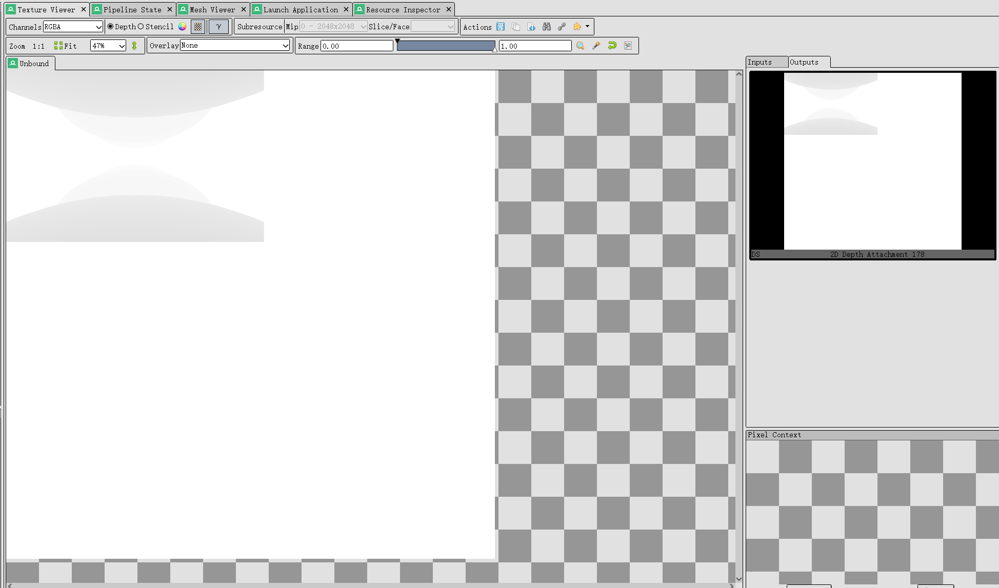
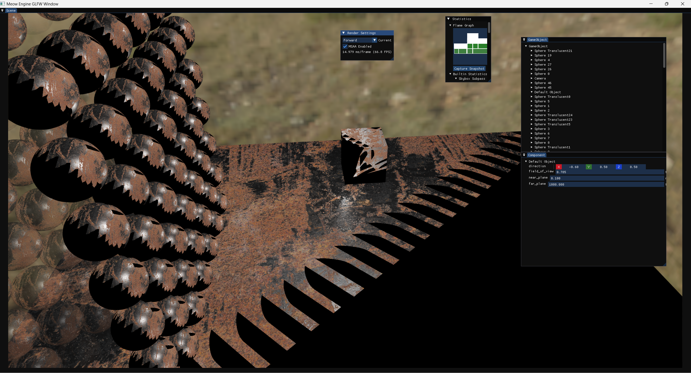
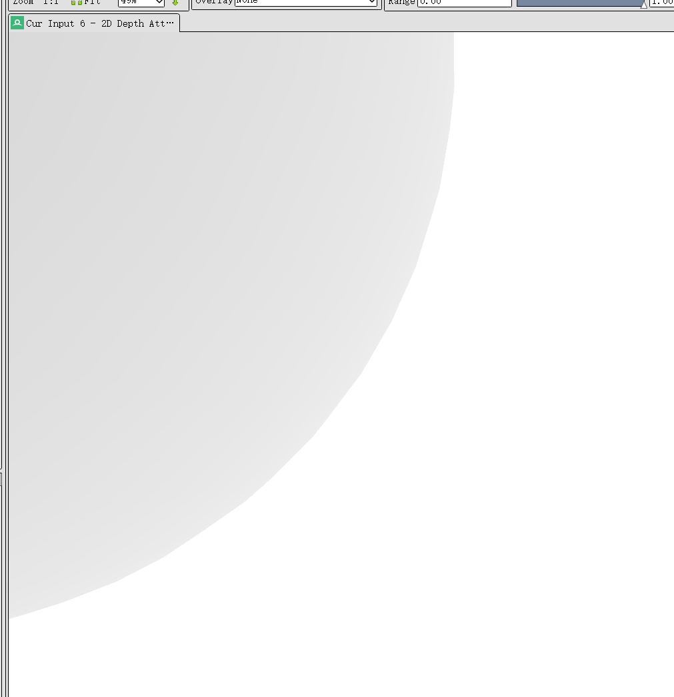
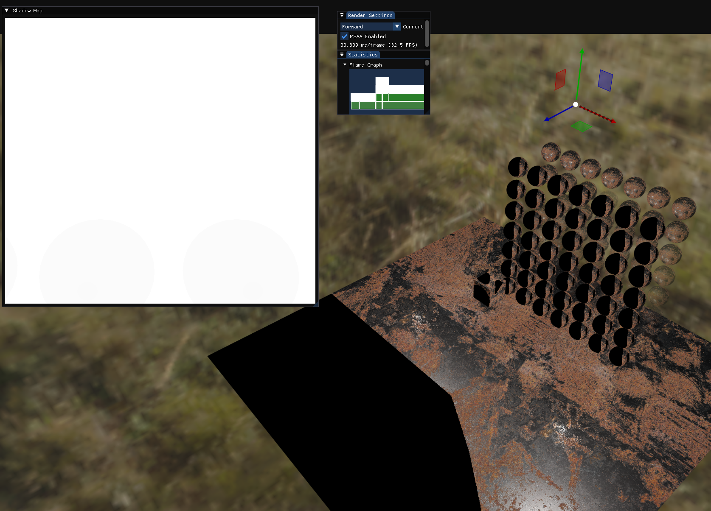
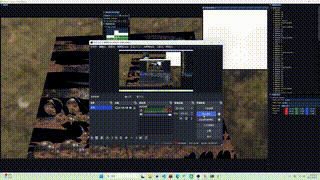

# Shadow Map

## Debug

```
VUID-VkFramebufferCreateInfo-attachmentCount-00876(ERROR / SPEC): msgNum: -732776389 - Validation Error: [ VUID-VkFramebufferCreateInfo-attachmentCount-00876 ] Object 0: handle = 0xd10d270000000018, name = Shadow Map RenderPass, type = VK_OBJECT_TYPE_RENDER_PASS; | MessageID = 0xd452b83b | vkCreateFramebuffer(): pCreateInfo->attachmentCount 2 does not match attachmentCount of 1 of VkRenderPass 0xd10d270000000018[Shadow Map RenderPass] being used to create Framebuffer. The Vulkan spec states: attachmentCount must be equal to the attachment count specified in renderPass (https://vulkan.lunarg.com/doc/view/1.3.275.0/windows/1.3-extensions/vkspec.html#VUID-VkFramebufferCreateInfo-attachmentCount-00876)
    Objects: 1
        [0] 0xd10d270000000018, type: 18, name: Shadow Map RenderPass
```

framebuffer 那边填错了

```
VUID-vkCmdResetQueryPool-renderpass(ERROR / SPEC): msgNum: -1332528324 - Validation Error: [ VUID-vkCmdResetQueryPool-renderpass ] Object 0: handle = 0x228bf59bd30, type = VK_OBJECT_TYPE_COMMAND_BUFFER; | MessageID = 0xb0933b3c | vkCmdResetQueryPool():  It is invalid to issue this call inside an active VkRenderPass 0xd10d270000000018[Shadow Map RenderPass]. The Vulkan spec states: This command must only be called outside of a render pass instance (https://vulkan.lunarg.com/doc/view/1.3.275.0/windows/1.3-extensions/vkspec.html#VUID-vkCmdResetQueryPool-renderpass)
    Objects: 1
        [0] 0x228bf59bd30, type: 6, name: NULL
VUID-vkCmdBeginRenderPass-renderpass(ERROR / SPEC): msgNum: 339535253 - Validation Error: [ VUID-vkCmdBeginRenderPass-renderpass ] Object 0: handle = 0x228bf59bd30, type = VK_OBJECT_TYPE_COMMAND_BUFFER; | MessageID = 0x143ce595 | vkCmdBeginRenderPass():  It is invalid to issue this call inside an active VkRenderPass 0xd10d270000000018[Shadow Map RenderPass]. The Vulkan spec states: This command must only be called outside of a render pass instance (https://vulkan.lunarg.com/doc/view/1.3.275.0/windows/1.3-extensions/vkspec.html#VUID-vkCmdBeginRenderPass-renderpass)
    Objects: 1
        [0] 0x228bf59bd30, type: 6, name: NULL
VUID-vkCmdResetQueryPool-renderpass(ERROR / SPEC): msgNum: -1332528324 - Validation Error: [ VUID-vkCmdResetQueryPool-renderpass ] Object 0: handle = 0x228bf5a8330, type = VK_OBJECT_TYPE_COMMAND_BUFFER; | MessageID = 0xb0933b3c | vkCmdResetQueryPool():  It is invalid to issue this call inside an active VkRenderPass 0xd10d270000000018[Shadow Map RenderPass]. The Vulkan spec states: This command must only be called outside of a render pass instance (https://vulkan.lunarg.com/doc/view/1.3.275.0/windows/1.3-extensions/vkspec.html#VUID-vkCmdResetQueryPool-renderpass)
    Objects: 1
        [0] 0x228bf5a8330, type: 6, name: NULL
VUID-vkCmdBeginRenderPass-renderpass(ERROR / SPEC): msgNum: 339535253 - Validation Error: [ VUID-vkCmdBeginRenderPass-renderpass ] Object 0: handle = 0x228bf5a8330, type = VK_OBJECT_TYPE_COMMAND_BUFFER; | MessageID = 0x143ce595 | vkCmdBeginRenderPass():  It is invalid to issue this call inside an active VkRenderPass 0xd10d270000000018[Shadow Map RenderPass]. The Vulkan spec states: This command must only be called outside of a render pass instance (https://vulkan.lunarg.com/doc/view/1.3.275.0/windows/1.3-extensions/vkspec.html#VUID-vkCmdBeginRenderPass-renderpass)
    Objects: 1
        [0] 0x228bf5a8330, type: 6, name: NULL
VUID-vkCmdResetQueryPool-renderpass(ERROR / SPEC): msgNum: -1332528324 - Validation Error: [ VUID-vkCmdResetQueryPool-renderpass ] Object 0: handle = 0x228bf59bd30, type = VK_OBJECT_TYPE_COMMAND_BUFFER; | MessageID = 0xb0933b3c | vkCmdResetQueryPool():  It is invalid to issue this call inside an active VkRenderPass 0xd10d270000000018[Shadow Map RenderPass]. The Vulkan spec states: This command must only be called outside of a render pass instance (https://vulkan.lunarg.com/doc/view/1.3.275.0/windows/1.3-extensions/vkspec.html#VUID-vkCmdResetQueryPool-renderpass)
    Objects: 1
        [0] 0x228bf59bd30, type: 6, name: NULL
VUID-vkCmdBeginRenderPass-renderpass(ERROR / SPEC): msgNum: 339535253 - Validation Error: [ VUID-vkCmdBeginRenderPass-renderpass ] Object 0: handle = 0x228bf59bd30, type = VK_OBJECT_TYPE_COMMAND_BUFFER; | MessageID = 0x143ce595 | vkCmdBeginRenderPass():  It is invalid to issue this call inside an active VkRenderPass 0xd10d270000000018[Shadow Map RenderPass]. The Vulkan spec states: This command must only be called outside of a render pass instance (https://vulkan.lunarg.com/doc/view/1.3.275.0/windows/1.3-extensions/vkspec.html#VUID-vkCmdBeginRenderPass-renderpass)
    Objects: 1
        [0] 0x228bf59bd30, type: 6, name: NULL
VUID-vkCmdResetQueryPool-renderpass(ERROR / SPEC): msgNum: -1332528324 - Validation Error: [ VUID-vkCmdResetQueryPool-renderpass ] Object 0: handle = 0x228bf5a8330, type = VK_OBJECT_TYPE_COMMAND_BUFFER; | MessageID = 0xb0933b3c | vkCmdResetQueryPool():  It is invalid to issue this call inside an active VkRenderPass 0xd10d270000000018[Shadow Map RenderPass]. The Vulkan spec states: This command must only be called outside of a render pass instance (https://vulkan.lunarg.com/doc/view/1.3.275.0/windows/1.3-extensions/vkspec.html#VUID-vkCmdResetQueryPool-renderpass)
    Objects: 1
        [0] 0x228bf5a8330, type: 6, name: NULL
VUID-vkCmdBeginRenderPass-renderpass(ERROR / SPEC): msgNum: 339535253 - Validation Error: [ VUID-vkCmdBeginRenderPass-renderpass ] Object 0: handle = 0x228bf5a8330, type = VK_OBJECT_TYPE_COMMAND_BUFFER; | MessageID = 0x143ce595 | vkCmdBeginRenderPass():  It is invalid to issue this call inside an active VkRenderPass 0xd10d270000000018[Shadow Map RenderPass]. The Vulkan spec states: This command must only be called outside of a render pass instance (https://vulkan.lunarg.com/doc/view/1.3.275.0/windows/1.3-extensions/vkspec.html#VUID-vkCmdBeginRenderPass-renderpass)
    Objects: 1
        [0] 0x228bf5a8330, type: 6, name: NULL
VUID-vkCmdResetQueryPool-renderpass(ERROR / SPEC): msgNum: -1332528324 - Validation Error: [ VUID-vkCmdResetQueryPool-renderpass ] Object 0: handle = 0x228bf59bd30, type = VK_OBJECT_TYPE_COMMAND_BUFFER; | MessageID = 0xb0933b3c | vkCmdResetQueryPool():  It is invalid to issue this call inside an active VkRenderPass 0xd10d270000000018[Shadow Map RenderPass]. The Vulkan spec states: This command must only be called outside of a render pass instance (https://vulkan.lunarg.com/doc/view/1.3.275.0/windows/1.3-extensions/vkspec.html#VUID-vkCmdResetQueryPool-renderpass)
    Objects: 1
        [0] 0x228bf59bd30, type: 6, name: NULL
VUID-vkCmdBeginRenderPass-renderpass(ERROR / SPEC): msgNum: 339535253 - Validation Error: [ VUID-vkCmdBeginRenderPass-renderpass ] Object 0: handle = 0x228bf59bd30, type = VK_OBJECT_TYPE_COMMAND_BUFFER; | MessageID = 0x143ce595 | vkCmdBeginRenderPass():  It is invalid to issue this call inside an active VkRenderPass 0xd10d270000000018[Shadow Map RenderPass]. The Vulkan spec states: This command must only be called outside of a render pass instance (https://vulkan.lunarg.com/doc/view/1.3.275.0/windows/1.3-extensions/vkspec.html#VUID-vkCmdBeginRenderPass-renderpass)
    Objects: 1
        [0] 0x228bf59bd30, type: 6, name: NULL
VUID-vkCmdResetQueryPool-renderpass(ERROR / SPEC): msgNum: -1332528324 - Validation Error: [ VUID-vkCmdResetQueryPool-renderpass ] Object 0: handle = 0x228bf5a8330, type = VK_OBJECT_TYPE_COMMAND_BUFFER; | MessageID = 0xb0933b3c | vkCmdResetQueryPool():  It is invalid to issue this call inside an active VkRenderPass 0xd10d270000000018[Shadow Map RenderPass]. The Vulkan spec states: This command must only be called outside of a render pass instance (https://vulkan.lunarg.com/doc/view/1.3.275.0/windows/1.3-extensions/vkspec.html#VUID-vkCmdResetQueryPool-renderpass)
    Objects: 1
        [0] 0x228bf5a8330, type: 6, name: NULL
VUID-vkCmdBeginRenderPass-renderpass(ERROR / SPEC): msgNum: 339535253 - Validation Error: [ VUID-vkCmdBeginRenderPass-renderpass ] Object 0: handle = 0x228bf5a8330, type = VK_OBJECT_TYPE_COMMAND_BUFFER; | MessageID = 0x143ce595 | vkCmdBeginRenderPass():  It is invalid to issue this call inside an active VkRenderPass 0xd10d270000000018[Shadow Map RenderPass]. The Vulkan spec states: This command must only be called outside of a render pass instance (https://vulkan.lunarg.com/doc/view/1.3.275.0/windows/1.3-extensions/vkspec.html#VUID-vkCmdBeginRenderPass-renderpass)
    Objects: 1
        [0] 0x228bf5a8330, type: 6, name: NULL
VUID-vkCmdResetQueryPool-renderpass(ERROR / SPEC): msgNum: -1332528324 - Validation Error: [ VUID-vkCmdResetQueryPool-renderpass ] Object 0: handle = 0x228bf59bd30, type = VK_OBJECT_TYPE_COMMAND_BUFFER; | MessageID = 0xb0933b3c | vkCmdResetQueryPool():  It is invalid to issue this call inside an active VkRenderPass 0xd10d270000000018[Shadow Map RenderPass]. The Vulkan spec states: This command must only be called outside of a render pass instance (https://vulkan.lunarg.com/doc/view/1.3.275.0/windows/1.3-extensions/vkspec.html#VUID-vkCmdResetQueryPool-renderpass)
    Objects: 1
        [0] 0x228bf59bd30, type: 6, name: NULL
VUID-vkCmdBeginRenderPass-renderpass(ERROR / SPEC): msgNum: 339535253 - Validation Error: [ VUID-vkCmdBeginRenderPass-renderpass ] Object 0: handle = 0x228bf59bd30, type = VK_OBJECT_TYPE_COMMAND_BUFFER; | MessageID = 0x143ce595 | vkCmdBeginRenderPass():  It is invalid to issue this call inside an active VkRenderPass 0xd10d270000000018[Shadow Map RenderPass]. The Vulkan spec states: This command must only be called outside of a render pass instance (https://vulkan.lunarg.com/doc/view/1.3.275.0/windows/1.3-extensions/vkspec.html#VUID-vkCmdBeginRenderPass-renderpass)
    Objects: 1
        [0] 0x228bf59bd30, type: 6, name: NULL
VUID-vkCmdResetQueryPool-renderpass(ERROR / SPEC): msgNum: -1332528324 - Validation Error: [ VUID-vkCmdResetQueryPool-renderpass ] Object 0: handle = 0x228bf5a8330, type = VK_OBJECT_TYPE_COMMAND_BUFFER; | MessageID = 0xb0933b3c | vkCmdResetQueryPool():  It is invalid to issue this call inside an active VkRenderPass 0xd10d270000000018[Shadow Map RenderPass]. The Vulkan spec states: This command must only be called outside of a render pass instance (https://vulkan.lunarg.com/doc/view/1.3.275.0/windows/1.3-extensions/vkspec.html#VUID-vkCmdResetQueryPool-renderpass)
    Objects: 1
        [0] 0x228bf5a8330, type: 6, name: NULL
VUID-vkCmdBeginRenderPass-renderpass(ERROR / SPEC): msgNum: 339535253 - Validation Error: [ VUID-vkCmdBeginRenderPass-renderpass ] Object 0: handle = 0x228bf5a8330, type = VK_OBJECT_TYPE_COMMAND_BUFFER; | MessageID = 0x143ce595 | vkCmdBeginRenderPass():  It is invalid to issue this call inside an active VkRenderPass 0xd10d270000000018[Shadow Map RenderPass]. The Vulkan spec states: This command must only be called outside of a render pass instance (https://vulkan.lunarg.com/doc/view/1.3.275.0/windows/1.3-extensions/vkspec.html#VUID-vkCmdBeginRenderPass-renderpass)
    Objects: 1
        [0] 0x228bf5a8330, type: 6, name: NULL
VUID-vkCmdResetQueryPool-renderpass(ERROR / SPEC): msgNum: -1332528324 - Validation Error: [ VUID-vkCmdResetQueryPool-renderpass ] Object 0: handle = 0x228bf59bd30, type = VK_OBJECT_TYPE_COMMAND_BUFFER; | MessageID = 0xb0933b3c | vkCmdResetQueryPool():  It is invalid to issue this call inside an active VkRenderPass 0xd10d270000000018[Shadow Map RenderPass]. The Vulkan spec states: This command must only be called outside of a render pass instance (https://vulkan.lunarg.com/doc/view/1.3.275.0/windows/1.3-extensions/vkspec.html#VUID-vkCmdResetQueryPool-renderpass)
    Objects: 1
        [0] 0x228bf59bd30, type: 6, name: NULL
VUID-vkCmdBeginRenderPass-renderpass(ERROR / SPEC): msgNum: 339535253 - Validation Error: [ VUID-vkCmdBeginRenderPass-renderpass ] Object 0: handle = 0x228bf59bd30, type = VK_OBJECT_TYPE_COMMAND_BUFFER; | MessageID = 0x143ce595 | vkCmdBeginRenderPass():  It is invalid to issue this call inside an active VkRenderPass 0xd10d270000000018[Shadow Map RenderPass]. The Vulkan spec states: This command must only be called outside of a render pass instance (https://vulkan.lunarg.com/doc/view/1.3.275.0/windows/1.3-extensions/vkspec.html#VUID-vkCmdBeginRenderPass-renderpass)
    Objects: 1
        [0] 0x228bf59bd30, type: 6, name: NULL
VUID-vkCmdResetQueryPool-renderpass(ERROR / SPEC): msgNum: -1332528324 - Validation Error: [ VUID-vkCmdResetQueryPool-renderpass ] Object 0: handle = 0x228bf5a8330, type = VK_OBJECT_TYPE_COMMAND_BUFFER; | MessageID = 0xb0933b3c | vkCmdResetQueryPool():  It is invalid to issue this call inside an active VkRenderPass 0xd10d270000000018[Shadow Map RenderPass]. The Vulkan spec states: This command must only be called outside of a render pass instance (https://vulkan.lunarg.com/doc/view/1.3.275.0/windows/1.3-extensions/vkspec.html#VUID-vkCmdResetQueryPool-renderpass)
    Objects: 1
        [0] 0x228bf5a8330, type: 6, name: NULL
VUID-vkCmdBeginRenderPass-renderpass(ERROR / SPEC): msgNum: 339535253 - Validation Error: [ VUID-vkCmdBeginRenderPass-renderpass ] Object 0: handle = 0x228bf5a8330, type = VK_OBJECT_TYPE_COMMAND_BUFFER; | MessageID = 0x143ce595 | vkCmdBeginRenderPass():  It is invalid to issue this call inside an active VkRenderPass 0xd10d270000000018[Shadow Map RenderPass]. The Vulkan spec states: This command must only be called outside of a render pass instance (https://vulkan.lunarg.com/doc/view/1.3.275.0/windows/1.3-extensions/vkspec.html#VUID-vkCmdBeginRenderPass-renderpass)
    Objects: 1
        [0] 0x228bf5a8330, type: 6, name: NULL
```

忘记 end render pass 了

```
VUID-vkCmdDrawIndexed-None-08600(ERROR / SPEC): msgNum: 941228658 - Validation Error: [ VUID-vkCmdDrawIndexed-None-08600 ] Object 0: handle = 0xfef35a00000000a0, name = Forward Shadow Map Material, type = VK_OBJECT_TYPE_PIPELINE; Object 1: handle = 0xe9b2ee0000000094, type = VK_OBJECT_TYPE_PIPELINE_LAYOUT; | MessageID = 0x381a0272 | vkCmdDrawIndexed():  The VkPipeline 0xfef35a00000000a0[Forward Shadow Map Material] (created with VkPipelineLayout 0xe9b2ee0000000094[]) statically uses descriptor set (index #1) which is not compatible with the currently bound descriptor set's pipeline layout (VkPipelineLayout 0xe9b2ee0000000094[]). The Vulkan spec states: For each set n that is statically used by a bound shader, a descriptor set must have been bound to n at the same pipeline bind point, with a VkPipelineLayout that is compatible for set n, with the VkPipelineLayout used to create the current VkPipeline or the VkDescriptorSetLayout array used to create the current VkShaderEXT , as described in Pipeline Layout Compatibility (https://vulkan.lunarg.com/doc/view/1.3.275.0/windows/1.3-extensions/vkspec.html#VUID-vkCmdDrawIndexed-None-08600)
    Objects: 2
        [0] 0xfef35a00000000a0, type: 19, name: Forward Shadow Map Material
        [1] 0xe9b2ee0000000094, type: 17, name: NULL
VUID-vkCmdDrawIndexed-None-08600(ERROR / SPEC): msgNum: 941228658 - Validation Error: [ VUID-vkCmdDrawIndexed-None-08600 ] Object 0: handle = 0xfef35a00000000a0, name = Forward Shadow Map Material, type = VK_OBJECT_TYPE_PIPELINE; Object 1: handle = 0xe9b2ee0000000094, type = VK_OBJECT_TYPE_PIPELINE_LAYOUT; | MessageID = 0x381a0272 | vkCmdDrawIndexed():  The VkPipeline 0xfef35a00000000a0[Forward Shadow Map Material] (created with VkPipelineLayout 0xe9b2ee0000000094[]) statically uses descriptor set (index #1) which is not compatible with the currently bound descriptor set's pipeline layout (VkPipelineLayout 0xe9b2ee0000000094[]). The Vulkan spec states: For each set n that is statically used by a bound shader, a descriptor set must have been bound to n at the same pipeline bind point, with a VkPipelineLayout that is compatible for set n, with the VkPipelineLayout used to create the current VkPipeline or the VkDescriptorSetLayout array used to create the current VkShaderEXT , as described in Pipeline Layout Compatibility (https://vulkan.lunarg.com/doc/view/1.3.275.0/windows/1.3-extensions/vkspec.html#VUID-vkCmdDrawIndexed-None-08600)
    Objects: 2
        [0] 0xfef35a00000000a0, type: 19, name: Forward Shadow Map Material
        [1] 0xe9b2ee0000000094, type: 17, name: NULL
VUID-vkCmdDrawIndexed-None-08600(ERROR / SPEC): msgNum: 941228658 - Validation Error: [ VUID-vkCmdDrawIndexed-None-08600 ] Object 0: handle = 0xfef35a00000000a0, name = Forward Shadow Map Material, type = VK_OBJECT_TYPE_PIPELINE; Object 1: handle = 0xe9b2ee0000000094, type = VK_OBJECT_TYPE_PIPELINE_LAYOUT; | MessageID = 0x381a0272 | vkCmdDrawIndexed():  The VkPipeline 0xfef35a00000000a0[Forward Shadow Map Material] (created with VkPipelineLayout 0xe9b2ee0000000094[]) statically uses descriptor set (index #1) which is not compatible with the currently bound descriptor set's pipeline layout (VkPipelineLayout 0xe9b2ee0000000094[]). The Vulkan spec states: For each set n that is statically used by a bound shader, a descriptor set must have been bound to n at the same pipeline bind point, with a VkPipelineLayout that is compatible for set n, with the VkPipelineLayout used to create the current VkPipeline or the VkDescriptorSetLayout array used to create the current VkShaderEXT , as described in Pipeline Layout Compatibility (https://vulkan.lunarg.com/doc/view/1.3.275.0/windows/1.3-extensions/vkspec.html#VUID-vkCmdDrawIndexed-None-08600)
    Objects: 2
        [0] 0xfef35a00000000a0, type: 19, name: Forward Shadow Map Material
        [1] 0xe9b2ee0000000094, type: 17, name: NULL
VUID-vkCmdDrawIndexed-None-08600(ERROR / SPEC): msgNum: 941228658 - Validation Error: [ VUID-vkCmdDrawIndexed-None-08600 ] Object 0: handle = 0xfef35a00000000a0, name = Forward Shadow Map Material, type = VK_OBJECT_TYPE_PIPELINE; Object 1: handle = 0xe9b2ee0000000094, type = VK_OBJECT_TYPE_PIPELINE_LAYOUT; | MessageID = 0x381a0272 | vkCmdDrawIndexed():  The VkPipeline 0xfef35a00000000a0[Forward Shadow Map Material] (created with VkPipelineLayout 0xe9b2ee0000000094[]) statically uses descriptor set (index #1) which is not compatible with the currently bound descriptor set's pipeline layout (VkPipelineLayout 0xe9b2ee0000000094[]). The Vulkan spec states: For each set n that is statically used by a bound shader, a descriptor set must have been bound to n at the same pipeline bind point, with a VkPipelineLayout that is compatible for set n, with the VkPipelineLayout used to create the current VkPipeline or the VkDescriptorSetLayout array used to create the current VkShaderEXT , as described in Pipeline Layout Compatibility (https://vulkan.lunarg.com/doc/view/1.3.275.0/windows/1.3-extensions/vkspec.html#VUID-vkCmdDrawIndexed-None-08600)
    Objects: 2
        [0] 0xfef35a00000000a0, type: 19, name: Forward Shadow Map Material
        [1] 0xe9b2ee0000000094, type: 17, name: NULL
VUID-vkCmdDrawIndexed-None-08600(ERROR / SPEC): msgNum: 941228658 - Validation Error: [ VUID-vkCmdDrawIndexed-None-08600 ] Object 0: handle = 0xfef35a00000000a0, name = Forward Shadow Map Material, type = VK_OBJECT_TYPE_PIPELINE; Object 1: handle = 0xe9b2ee0000000094, type = VK_OBJECT_TYPE_PIPELINE_LAYOUT; | MessageID = 0x381a0272 | vkCmdDrawIndexed():  The VkPipeline 0xfef35a00000000a0[Forward Shadow Map Material] (created with VkPipelineLayout 0xe9b2ee0000000094[]) statically uses descriptor set (index #1) which is not compatible with the currently bound descriptor set's pipeline layout (VkPipelineLayout 0xe9b2ee0000000094[]). The Vulkan spec states: For each set n that is statically used by a bound shader, a descriptor set must have been bound to n at the same pipeline bind point, with a VkPipelineLayout that is compatible for set n, with the VkPipelineLayout used to create the current VkPipeline or the VkDescriptorSetLayout array used to create the current VkShaderEXT , as described in Pipeline Layout Compatibility (https://vulkan.lunarg.com/doc/view/1.3.275.0/windows/1.3-extensions/vkspec.html#VUID-vkCmdDrawIndexed-None-08600)
    Objects: 2
        [0] 0xfef35a00000000a0, type: 19, name: Forward Shadow Map Material
        [1] 0xe9b2ee0000000094, type: 17, name: NULL
VUID-vkCmdDrawIndexed-None-08600(ERROR / SPEC): msgNum: 941228658 - Validation Error: [ VUID-vkCmdDrawIndexed-None-08600 ] Object 0: handle = 0xfef35a00000000a0, name = Forward Shadow Map Material, type = VK_OBJECT_TYPE_PIPELINE; Object 1: handle = 0xe9b2ee0000000094, type = VK_OBJECT_TYPE_PIPELINE_LAYOUT; | MessageID = 0x381a0272 | vkCmdDrawIndexed():  The VkPipeline 0xfef35a00000000a0[Forward Shadow Map Material] (created with VkPipelineLayout 0xe9b2ee0000000094[]) statically uses descriptor set (index #1) which is not compatible with the currently bound descriptor set's pipeline layout (VkPipelineLayout 0xe9b2ee0000000094[]). The Vulkan spec states: For each set n that is statically used by a bound shader, a descriptor set must have been bound to n at the same pipeline bind point, with a VkPipelineLayout that is compatible for set n, with the VkPipelineLayout used to create the current VkPipeline or the VkDescriptorSetLayout array used to create the current VkShaderEXT , as described in Pipeline Layout Compatibility (https://vulkan.lunarg.com/doc/view/1.3.275.0/windows/1.3-extensions/vkspec.html#VUID-vkCmdDrawIndexed-None-08600)
    Objects: 2
        [0] 0xfef35a00000000a0, type: 19, name: Forward Shadow Map Material
        [1] 0xe9b2ee0000000094, type: 17, name: NULL
VUID-vkCmdDrawIndexed-None-08600(ERROR / SPEC): msgNum: 941228658 - Validation Error: [ VUID-vkCmdDrawIndexed-None-08600 ] Object 0: handle = 0xfef35a00000000a0, name = Forward Shadow Map Material, type = VK_OBJECT_TYPE_PIPELINE; Object 1: handle = 0xe9b2ee0000000094, type = VK_OBJECT_TYPE_PIPELINE_LAYOUT; | MessageID = 0x381a0272 | vkCmdDrawIndexed():  The VkPipeline 0xfef35a00000000a0[Forward Shadow Map Material] (created with VkPipelineLayout 0xe9b2ee0000000094[]) statically uses descriptor set (index #1) which is not compatible with the currently bound descriptor set's pipeline layout (VkPipelineLayout 0xe9b2ee0000000094[]). The Vulkan spec states: For each set n that is statically used by a bound shader, a descriptor set must have been bound to n at the same pipeline bind point, with a VkPipelineLayout that is compatible for set n, with the VkPipelineLayout used to create the current VkPipeline or the VkDescriptorSetLayout array used to create the current VkShaderEXT , as described in Pipeline Layout Compatibility (https://vulkan.lunarg.com/doc/view/1.3.275.0/windows/1.3-extensions/vkspec.html#VUID-vkCmdDrawIndexed-None-08600)
    Objects: 2
        [0] 0xfef35a00000000a0, type: 19, name: Forward Shadow Map Material
        [1] 0xe9b2ee0000000094, type: 17, name: NULL
VUID-vkCmdDrawIndexed-None-08600(ERROR / SPEC): msgNum: 941228658 - Validation Error: [ VUID-vkCmdDrawIndexed-None-08600 ] Object 0: handle = 0xfef35a00000000a0, name = Forward Shadow Map Material, type = VK_OBJECT_TYPE_PIPELINE; Object 1: handle = 0xe9b2ee0000000094, type = VK_OBJECT_TYPE_PIPELINE_LAYOUT; | MessageID = 0x381a0272 | vkCmdDrawIndexed():  The VkPipeline 0xfef35a00000000a0[Forward Shadow Map Material] (created with VkPipelineLayout 0xe9b2ee0000000094[]) statically uses descriptor set (index #1) which is not compatible with the currently bound descriptor set's pipeline layout (VkPipelineLayout 0xe9b2ee0000000094[]). The Vulkan spec states: For each set n that is statically used by a bound shader, a descriptor set must have been bound to n at the same pipeline bind point, with a VkPipelineLayout that is compatible for set n, with the VkPipelineLayout used to create the current VkPipeline or the VkDescriptorSetLayout array used to create the current VkShaderEXT , as described in Pipeline Layout Compatibility (https://vulkan.lunarg.com/doc/view/1.3.275.0/windows/1.3-extensions/vkspec.html#VUID-vkCmdDrawIndexed-None-08600)
    Objects: 2
        [0] 0xfef35a00000000a0, type: 19, name: Forward Shadow Map Material
        [1] 0xe9b2ee0000000094, type: 17, name: NULL
VUID-vkCmdDrawIndexed-None-08600(ERROR / SPEC): msgNum: 941228658 - Validation Error: [ VUID-vkCmdDrawIndexed-None-08600 ] Object 0: handle = 0xfef35a00000000a0, name = Forward Shadow Map Material, type = VK_OBJECT_TYPE_PIPELINE; Object 1: handle = 0xe9b2ee0000000094, type = VK_OBJECT_TYPE_PIPELINE_LAYOUT; | MessageID = 0x381a0272 | vkCmdDrawIndexed():  The VkPipeline 0xfef35a00000000a0[Forward Shadow Map Material] (created with VkPipelineLayout 0xe9b2ee0000000094[]) statically uses descriptor set (index #1) which is not compatible with the currently bound descriptor set's pipeline layout (VkPipelineLayout 0xe9b2ee0000000094[]). The Vulkan spec states: For each set n that is statically used by a bound shader, a descriptor set must have been bound to n at the same pipeline bind point, with a VkPipelineLayout that is compatible for set n, with the VkPipelineLayout used to create the current VkPipeline or the VkDescriptorSetLayout array used to create the current VkShaderEXT , as described in Pipeline Layout Compatibility (https://vulkan.lunarg.com/doc/view/1.3.275.0/windows/1.3-extensions/vkspec.html#VUID-vkCmdDrawIndexed-None-08600)
    Objects: 2
        [0] 0xfef35a00000000a0, type: 19, name: Forward Shadow Map Material
        [1] 0xe9b2ee0000000094, type: 17, name: NULL
VUID-vkCmdDrawIndexed-None-08600(ERROR / SPEC): msgNum: 941228658 - Validation Error: [ VUID-vkCmdDrawIndexed-None-08600 ] Object 0: handle = 0xfef35a00000000a0, name = Forward Shadow Map Material, type = VK_OBJECT_TYPE_PIPELINE; Object 1: handle = 0xe9b2ee0000000094, type = VK_OBJECT_TYPE_PIPELINE_LAYOUT; | MessageID = 0x381a0272 | vkCmdDrawIndexed():  The VkPipeline 0xfef35a00000000a0[Forward Shadow Map Material] (created with VkPipelineLayout 0xe9b2ee0000000094[]) statically uses descriptor set (index #1) which is not compatible with the currently bound descriptor set's pipeline layout (VkPipelineLayout 0xe9b2ee0000000094[]). The Vulkan spec states: For each set n that is statically used by a bound shader, a descriptor set must have been bound to n at the same pipeline bind point, with a VkPipelineLayout that is compatible for set n, with the VkPipelineLayout used to create the current VkPipeline or the VkDescriptorSetLayout array used to create the current VkShaderEXT , as described in Pipeline Layout Compatibility (https://vulkan.lunarg.com/doc/view/1.3.275.0/windows/1.3-extensions/vkspec.html#VUID-vkCmdDrawIndexed-None-08600)
    Objects: 2
        [0] 0xfef35a00000000a0, type: 19, name: Forward Shadow Map Material
        [1] 0xe9b2ee0000000094, type: 17, name: NULL
VUID-vkCmdDraw-None-08600(ERROR / SPEC): msgNum: 1198051129 - Validation Error: [ VUID-vkCmdDraw-None-08600 ] Object 0: handle = 0xfef35a00000000a0, name = Forward Shadow Map Material, type = VK_OBJECT_TYPE_PIPELINE; Object 1: handle = 0xe9b2ee0000000094, type = VK_OBJECT_TYPE_PIPELINE_LAYOUT; | MessageID = 0x4768cf39 | vkCmdDraw():  The VkPipeline 0xfef35a00000000a0[Forward Shadow Map Material] (created with VkPipelineLayout 0xe9b2ee0000000094[]) statically uses descriptor set (index #1) which is not compatible with the currently bound descriptor set's pipeline layout (VkPipelineLayout 0xe9b2ee0000000094[]). The Vulkan spec states: For each set n that is statically used by a bound shader, a descriptor set must have been bound to n at the same pipeline bind point, with a VkPipelineLayout that is compatible for set n, with the VkPipelineLayout used to create the current VkPipeline or the VkDescriptorSetLayout array used to create the current VkShaderEXT , as described in Pipeline Layout Compatibility (https://vulkan.lunarg.com/doc/view/1.3.275.0/windows/1.3-extensions/vkspec.html#VUID-vkCmdDraw-None-08600)
    Objects: 2
        [0] 0xfef35a00000000a0, type: 19, name: Forward Shadow Map Material
        [1] 0xe9b2ee0000000094, type: 17, name: NULL
VUID-vkCmdDraw-None-08600(ERROR / SPEC): msgNum: 1198051129 - Validation Error: [ VUID-vkCmdDraw-None-08600 ] Object 0: handle = 0xfef35a00000000a0, name = Forward Shadow Map Material, type = VK_OBJECT_TYPE_PIPELINE; Object 1: handle = 0xe9b2ee0000000094, type = VK_OBJECT_TYPE_PIPELINE_LAYOUT; | MessageID = 0x4768cf39 | vkCmdDraw():  The VkPipeline 0xfef35a00000000a0[Forward Shadow Map Material] (created with VkPipelineLayout 0xe9b2ee0000000094[]) statically uses descriptor set (index #1) which is not compatible with the currently bound descriptor set's pipeline layout (VkPipelineLayout 0xe9b2ee0000000094[]). The Vulkan spec states: For each set n that is statically used by a bound shader, a descriptor set must have been bound to n at the same pipeline bind point, with a VkPipelineLayout that is compatible for set n, with the VkPipelineLayout used to create the current VkPipeline or the VkDescriptorSetLayout array used to create the current VkShaderEXT , as described in Pipeline Layout Compatibility (https://vulkan.lunarg.com/doc/view/1.3.275.0/windows/1.3-extensions/vkspec.html#VUID-vkCmdDraw-None-08600)
    Objects: 2
        [0] 0xfef35a00000000a0, type: 19, name: Forward Shadow Map Material
        [1] 0xe9b2ee0000000094, type: 17, name: NULL
VUID-vkCmdDraw-None-08600(ERROR / SPEC): msgNum: 1198051129 - Validation Error: [ VUID-vkCmdDraw-None-08600 ] Object 0: handle = 0xfef35a00000000a0, name = Forward Shadow Map Material, type = VK_OBJECT_TYPE_PIPELINE; Object 1: handle = 0xe9b2ee0000000094, type = VK_OBJECT_TYPE_PIPELINE_LAYOUT; | MessageID = 0x4768cf39 | vkCmdDraw():  The VkPipeline 0xfef35a00000000a0[Forward Shadow Map Material] (created with VkPipelineLayout 0xe9b2ee0000000094[]) statically uses descriptor set (index #1) which is not compatible with the currently bound descriptor set's pipeline layout (VkPipelineLayout 0xe9b2ee0000000094[]). The Vulkan spec states: For each set n that is statically used by a bound shader, a descriptor set must have been bound to n at the same pipeline bind point, with a VkPipelineLayout that is compatible for set n, with the VkPipelineLayout used to create the current VkPipeline or the VkDescriptorSetLayout array used to create the current VkShaderEXT , as described in Pipeline Layout Compatibility (https://vulkan.lunarg.com/doc/view/1.3.275.0/windows/1.3-extensions/vkspec.html#VUID-vkCmdDraw-None-08600)
    Objects: 2
        [0] 0xfef35a00000000a0, type: 19, name: Forward Shadow Map Material
        [1] 0xe9b2ee0000000094, type: 17, name: NULL
VUID-vkCmdDraw-None-08600(ERROR / SPEC): msgNum: 1198051129 - Validation Error: [ VUID-vkCmdDraw-None-08600 ] Object 0: handle = 0xfef35a00000000a0, name = Forward Shadow Map Material, type = VK_OBJECT_TYPE_PIPELINE; Object 1: handle = 0xe9b2ee0000000094, type = VK_OBJECT_TYPE_PIPELINE_LAYOUT; | MessageID = 0x4768cf39 | vkCmdDraw():  The VkPipeline 0xfef35a00000000a0[Forward Shadow Map Material] (created with VkPipelineLayout 0xe9b2ee0000000094[]) statically uses descriptor set (index #1) which is not compatible with the currently bound descriptor set's pipeline layout (VkPipelineLayout 0xe9b2ee0000000094[]). The Vulkan spec states: For each set n that is statically used by a bound shader, a descriptor set must have been bound to n at the same pipeline bind point, with a VkPipelineLayout that is compatible for set n, with the VkPipelineLayout used to create the current VkPipeline or the VkDescriptorSetLayout array used to create the current VkShaderEXT , as described in Pipeline Layout Compatibility (https://vulkan.lunarg.com/doc/view/1.3.275.0/windows/1.3-extensions/vkspec.html#VUID-vkCmdDraw-None-08600)
    Objects: 2
        [0] 0xfef35a00000000a0, type: 19, name: Forward Shadow Map Material
        [1] 0xe9b2ee0000000094, type: 17, name: NULL
VUID-vkCmdDraw-None-08600(ERROR / SPEC): msgNum: 1198051129 - Validation Error: [ VUID-vkCmdDraw-None-08600 ] Object 0: handle = 0xfef35a00000000a0, name = Forward Shadow Map Material, type = VK_OBJECT_TYPE_PIPELINE; Object 1: handle = 0xe9b2ee0000000094, type = VK_OBJECT_TYPE_PIPELINE_LAYOUT; | MessageID = 0x4768cf39 | vkCmdDraw():  The VkPipeline 0xfef35a00000000a0[Forward Shadow Map Material] (created with VkPipelineLayout 0xe9b2ee0000000094[]) statically uses descriptor set (index #1) which is not compatible with the currently bound descriptor set's pipeline layout (VkPipelineLayout 0xe9b2ee0000000094[]). The Vulkan spec states: For each set n that is statically used by a bound shader, a descriptor set must have been bound to n at the same pipeline bind point, with a VkPipelineLayout that is compatible for set n, with the VkPipelineLayout used to create the current VkPipeline or the VkDescriptorSetLayout array used to create the current VkShaderEXT , as described in Pipeline Layout Compatibility (https://vulkan.lunarg.com/doc/view/1.3.275.0/windows/1.3-extensions/vkspec.html#VUID-vkCmdDraw-None-08600)
    Objects: 2
        [0] 0xfef35a00000000a0, type: 19, name: Forward Shadow Map Material
        [1] 0xe9b2ee0000000094, type: 17, name: NULL
VUID-vkCmdDraw-None-08600(ERROR / SPEC): msgNum: 1198051129 - Validation Error: [ VUID-vkCmdDraw-None-08600 ] Object 0: handle = 0xfef35a00000000a0, name = Forward Shadow Map Material, type = VK_OBJECT_TYPE_PIPELINE; Object 1: handle = 0xe9b2ee0000000094, type = VK_OBJECT_TYPE_PIPELINE_LAYOUT; | MessageID = 0x4768cf39 | vkCmdDraw():  The VkPipeline 0xfef35a00000000a0[Forward Shadow Map Material] (created with VkPipelineLayout 0xe9b2ee0000000094[]) statically uses descriptor set (index #1) which is not compatible with the currently bound descriptor set's pipeline layout (VkPipelineLayout 0xe9b2ee0000000094[]). The Vulkan spec states: For each set n that is statically used by a bound shader, a descriptor set must have been bound to n at the same pipeline bind point, with a VkPipelineLayout that is compatible for set n, with the VkPipelineLayout used to create the current VkPipeline or the VkDescriptorSetLayout array used to create the current VkShaderEXT , as described in Pipeline Layout Compatibility (https://vulkan.lunarg.com/doc/view/1.3.275.0/windows/1.3-extensions/vkspec.html#VUID-vkCmdDraw-None-08600)
    Objects: 2
        [0] 0xfef35a00000000a0, type: 19, name: Forward Shadow Map Material
        [1] 0xe9b2ee0000000094, type: 17, name: NULL
VUID-vkCmdDraw-None-08600(ERROR / SPEC): msgNum: 1198051129 - Validation Error: [ VUID-vkCmdDraw-None-08600 ] Object 0: handle = 0xfef35a00000000a0, name = Forward Shadow Map Material, type = VK_OBJECT_TYPE_PIPELINE; Object 1: handle = 0xe9b2ee0000000094, type = VK_OBJECT_TYPE_PIPELINE_LAYOUT; | MessageID = 0x4768cf39 | vkCmdDraw():  The VkPipeline 0xfef35a00000000a0[Forward Shadow Map Material] (created with VkPipelineLayout 0xe9b2ee0000000094[]) statically uses descriptor set (index #1) which is not compatible with the currently bound descriptor set's pipeline layout (VkPipelineLayout 0xe9b2ee0000000094[]). The Vulkan spec states: For each set n that is statically used by a bound shader, a descriptor set must have been bound to n at the same pipeline bind point, with a VkPipelineLayout that is compatible for set n, with the VkPipelineLayout used to create the current VkPipeline or the VkDescriptorSetLayout array used to create the current VkShaderEXT , as described in Pipeline Layout Compatibility (https://vulkan.lunarg.com/doc/view/1.3.275.0/windows/1.3-extensions/vkspec.html#VUID-vkCmdDraw-None-08600)
    Objects: 2
        [0] 0xfef35a00000000a0, type: 19, name: Forward Shadow Map Material
        [1] 0xe9b2ee0000000094, type: 17, name: NULL
VUID-vkCmdDraw-None-08600(ERROR / SPEC): msgNum: 1198051129 - Validation Error: [ VUID-vkCmdDraw-None-08600 ] Object 0: handle = 0xfef35a00000000a0, name = Forward Shadow Map Material, type = VK_OBJECT_TYPE_PIPELINE; Object 1: handle = 0xe9b2ee0000000094, type = VK_OBJECT_TYPE_PIPELINE_LAYOUT; | MessageID = 0x4768cf39 | vkCmdDraw():  The VkPipeline 0xfef35a00000000a0[Forward Shadow Map Material] (created with VkPipelineLayout 0xe9b2ee0000000094[]) statically uses descriptor set (index #1) which is not compatible with the currently bound descriptor set's pipeline layout (VkPipelineLayout 0xe9b2ee0000000094[]). The Vulkan spec states: For each set n that is statically used by a bound shader, a descriptor set must have been bound to n at the same pipeline bind point, with a VkPipelineLayout that is compatible for set n, with the VkPipelineLayout used to create the current VkPipeline or the VkDescriptorSetLayout array used to create the current VkShaderEXT , as described in Pipeline Layout Compatibility (https://vulkan.lunarg.com/doc/view/1.3.275.0/windows/1.3-extensions/vkspec.html#VUID-vkCmdDraw-None-08600)
    Objects: 2
        [0] 0xfef35a00000000a0, type: 19, name: Forward Shadow Map Material
        [1] 0xe9b2ee0000000094, type: 17, name: NULL
VUID-vkCmdDraw-None-08600(ERROR / SPEC): msgNum: 1198051129 - Validation Error: [ VUID-vkCmdDraw-None-08600 ] Object 0: handle = 0xfef35a00000000a0, name = Forward Shadow Map Material, type = VK_OBJECT_TYPE_PIPELINE; Object 1: handle = 0xe9b2ee0000000094, type = VK_OBJECT_TYPE_PIPELINE_LAYOUT; | MessageID = 0x4768cf39 | vkCmdDraw():  The VkPipeline 0xfef35a00000000a0[Forward Shadow Map Material] (created with VkPipelineLayout 0xe9b2ee0000000094[]) statically uses descriptor set (index #1) which is not compatible with the currently bound descriptor set's pipeline layout (VkPipelineLayout 0xe9b2ee0000000094[]). The Vulkan spec states: For each set n that is statically used by a bound shader, a descriptor set must have been bound to n at the same pipeline bind point, with a VkPipelineLayout that is compatible for set n, with the VkPipelineLayout used to create the current VkPipeline or the VkDescriptorSetLayout array used to create the current VkShaderEXT , as described in Pipeline Layout Compatibility (https://vulkan.lunarg.com/doc/view/1.3.275.0/windows/1.3-extensions/vkspec.html#VUID-vkCmdDraw-None-08600)
    Objects: 2
        [0] 0xfef35a00000000a0, type: 19, name: Forward Shadow Map Material
        [1] 0xe9b2ee0000000094, type: 17, name: NULL
VUID-vkCmdDraw-None-08600(ERROR / SPEC): msgNum: 1198051129 - Validation Error: [ VUID-vkCmdDraw-None-08600 ] Object 0: handle = 0xfef35a00000000a0, name = Forward Shadow Map Material, type = VK_OBJECT_TYPE_PIPELINE; Object 1: handle = 0xe9b2ee0000000094, type = VK_OBJECT_TYPE_PIPELINE_LAYOUT; | MessageID = 0x4768cf39 | vkCmdDraw():  The VkPipeline 0xfef35a00000000a0[Forward Shadow Map Material] (created with VkPipelineLayout 0xe9b2ee0000000094[]) statically uses descriptor set (index #1) which is not compatible with the currently bound descriptor set's pipeline layout (VkPipelineLayout 0xe9b2ee0000000094[]). The Vulkan spec states: For each set n that is statically used by a bound shader, a descriptor set must have been bound to n at the same pipeline bind point, with a VkPipelineLayout that is compatible for set n, with the VkPipelineLayout used to create the current VkPipeline or the VkDescriptorSetLayout array used to create the current VkShaderEXT , as described in Pipeline Layout Compatibility (https://vulkan.lunarg.com/doc/view/1.3.275.0/windows/1.3-extensions/vkspec.html#VUID-vkCmdDraw-None-08600)
    Objects: 2
        [0] 0xfef35a00000000a0, type: 19, name: Forward Shadow Map Material
        [1] 0xe9b2ee0000000094, type: 17, name: NULL
```

没 UpdateUniformBuffer 导致没有绑 dynamic uniform buffer offset

## size

画出来的 shadow map 都是一片白色

并且 shadow map 绘制的尺寸没有全屏绘制

因为我对 shadow map 的尺寸要求还是 swap chain 的尺寸

于是 framebuffer 的尺寸和 render pass start 的尺寸都要跟着改

这样看来的话，确实是需要一个 render target 作为 render pass 的接口参数比较好

## 绘制范围

绘制范围出错



看了别人是怎么做的

[https://github.com/SaschaWillems/Vulkan.git](https://github.com/SaschaWillems/Vulkan.git)

examples\shadowmapping\shadowmapping.cpp

```cpp
void buildCommandBuffers()
{
    VkCommandBufferBeginInfo cmdBufInfo = vks::initializers::commandBufferBeginInfo();

    VkClearValue clearValues[2];
    VkViewport viewport;
    VkRect2D scissor;

    for (int32_t i = 0; i < drawCmdBuffers.size(); ++i)
    {
        VK_CHECK_RESULT(vkBeginCommandBuffer(drawCmdBuffers[i], &cmdBufInfo));

        /*
            First render pass: Generate shadow map by rendering the scene from light's POV
        */
        {
            clearValues[0].depthStencil = { 1.0f, 0 };

            VkRenderPassBeginInfo renderPassBeginInfo = vks::initializers::renderPassBeginInfo();
            renderPassBeginInfo.renderPass = offscreenPass.renderPass;
            renderPassBeginInfo.framebuffer = offscreenPass.frameBuffer;
            renderPassBeginInfo.renderArea.extent.width = offscreenPass.width;
            renderPassBeginInfo.renderArea.extent.height = offscreenPass.height;
            renderPassBeginInfo.clearValueCount = 1;
            renderPassBeginInfo.pClearValues = clearValues;

            vkCmdBeginRenderPass(drawCmdBuffers[i], &renderPassBeginInfo, VK_SUBPASS_CONTENTS_INLINE);

            viewport = vks::initializers::viewport((float)offscreenPass.width, (float)offscreenPass.height, 0.0f, 1.0f);
            vkCmdSetViewport(drawCmdBuffers[i], 0, 1, &viewport);

            scissor = vks::initializers::rect2D(offscreenPass.width, offscreenPass.height, 0, 0);
            vkCmdSetScissor(drawCmdBuffers[i], 0, 1, &scissor);

            // Set depth bias (aka "Polygon offset")
            // Required to avoid shadow mapping artifacts
            vkCmdSetDepthBias(
                drawCmdBuffers[i],
                depthBiasConstant,
                0.0f,
                depthBiasSlope);

            vkCmdBindPipeline(drawCmdBuffers[i], VK_PIPELINE_BIND_POINT_GRAPHICS, pipelines.offscreen);
            vkCmdBindDescriptorSets(drawCmdBuffers[i], VK_PIPELINE_BIND_POINT_GRAPHICS, pipelineLayout, 0, 1, &descriptorSets.offscreen, 0, nullptr);
            scenes[sceneIndex].draw(drawCmdBuffers[i]);

            vkCmdEndRenderPass(drawCmdBuffers[i]);
        }

        /*
            Note: Explicit synchronization is not required between the render pass, as this is done implicit via sub pass dependencies
        */

        /*
            Second pass: Scene rendering with applied shadow map
        */

        {
            clearValues[0].color = defaultClearColor;
            clearValues[1].depthStencil = { 1.0f, 0 };

            VkRenderPassBeginInfo renderPassBeginInfo = vks::initializers::renderPassBeginInfo();
            renderPassBeginInfo.renderPass = renderPass;
            renderPassBeginInfo.framebuffer = frameBuffers[i];
            renderPassBeginInfo.renderArea.extent.width = width;
            renderPassBeginInfo.renderArea.extent.height = height;
            renderPassBeginInfo.clearValueCount = 2;
            renderPassBeginInfo.pClearValues = clearValues;

            vkCmdBeginRenderPass(drawCmdBuffers[i], &renderPassBeginInfo, VK_SUBPASS_CONTENTS_INLINE);

            viewport = vks::initializers::viewport((float)width, (float)height, 0.0f, 1.0f);
            vkCmdSetViewport(drawCmdBuffers[i], 0, 1, &viewport);

            scissor = vks::initializers::rect2D(width, height, 0, 0);
            vkCmdSetScissor(drawCmdBuffers[i], 0, 1, &scissor);

            // Visualize shadow map
            if (displayShadowMap) {
                vkCmdBindDescriptorSets(drawCmdBuffers[i], VK_PIPELINE_BIND_POINT_GRAPHICS, pipelineLayout, 0, 1, &descriptorSets.debug, 0, nullptr);
                vkCmdBindPipeline(drawCmdBuffers[i], VK_PIPELINE_BIND_POINT_GRAPHICS, pipelines.debug);
                vkCmdDraw(drawCmdBuffers[i], 3, 1, 0, 0);
            } else {
                // Render the shadows scene
                vkCmdBindDescriptorSets(drawCmdBuffers[i], VK_PIPELINE_BIND_POINT_GRAPHICS, pipelineLayout, 0, 1, &descriptorSets.scene, 0, nullptr);
                vkCmdBindPipeline(drawCmdBuffers[i], VK_PIPELINE_BIND_POINT_GRAPHICS, (filterPCF) ? pipelines.sceneShadowPCF : pipelines.sceneShadow);
                scenes[sceneIndex].draw(drawCmdBuffers[i]);
            }

            drawUI(drawCmdBuffers[i]);

            vkCmdEndRenderPass(drawCmdBuffers[i]);
        }

        VK_CHECK_RESULT(vkEndCommandBuffer(drawCmdBuffers[i]));
    }
}
```

他这个就是启动两个 render pass，然后在每一个 render pass 的开头设置裁剪大小

于是我把 viewport 和 scissor 放到 render pass 里面就好了

## 阴影质量很差

调一下阴影的角度就知道现在的阴影质量很差



截帧发现，使用的 shadow map 渲染的结果非常差



## 渲染阴影贴图时出现的 layout 问题

```
VUID-VkDescriptorImageInfo-imageLayout-00344(ERROR / SPEC): msgNum: -564812795 - Validation Error: [ VUID-VkDescriptorImageInfo-imageLayout-00344 ] Object 0: handle = 0x16435a1ec10, type = VK_OBJECT_TYPE_COMMAND_BUFFER; Object 1: handle = 0xb097c90000000027, type = VK_OBJECT_TYPE_IMAGE; | MessageID = 0xde55a405 | vkCmdDrawIndexed():  Cannot use VkImage 0xb097c90000000027[] (layer=0 mip=0) with specific layout VK_IMAGE_LAYOUT_SHADER_READ_ONLY_OPTIMAL that doesn't match the previous known layout VK_IMAGE_LAYOUT_DEPTH_STENCIL_ATTACHMENT_OPTIMAL. The Vulkan spec states: imageLayout must match the actual VkImageLayout of each subresource accessible from imageView at the time this descriptor is accessed as defined by the image layout matching rules (https://vulkan.lunarg.com/doc/view/1.3.290.0/windows/1.3-extensions/vkspec.html#VUID-VkDescriptorImageInfo-imageLayout-00344)
    Objects: 2
        [0] 0x16435a1ec10, type: 6, name: NULL
        [1] 0xb097c90000000027, type: 10, name: NULL
VUID-vkCmdDrawIndexed-None-08114(ERROR / SPEC): msgNum: 1064294454 - Validation Error: [ VUID-vkCmdDrawIndexed-None-08114 ] Object 0: handle = 0x980b0000000002e, name = Depth to Color Material DescriptorSet0, type = VK_OBJECT_TYPE_DESCRIPTOR_SET; | MessageID = 0x3f6fd836 | vkCmdDrawIndexed():  Descriptor set VkDescriptorSet 0x980b0000000002e[Depth to Color Material DescriptorSet0] Image layout specified by vkCmdBindDescriptorSets doesn't match actual image layout at time descriptor is used. See previous error callback for specific details. The Vulkan spec states: Descriptors in each bound descriptor set, specified via vkCmdBindDescriptorSets, must be valid as described by descriptor validity if they are statically used by the VkPipeline bound to the pipeline bind point used by this command and the bound VkPipeline was not created with VK_PIPELINE_CREATE_DESCRIPTOR_BUFFER_BIT_EXT (https://vulkan.lunarg.com/doc/view/1.3.290.0/windows/1.3-extensions/vkspec.html#VUID-vkCmdDrawIndexed-None-08114)
    Objects: 1
        [0] 0x980b0000000002e, type: 23, name: Depth to Color Material DescriptorSet0
```

程序要求的格式（正确格式）是 VK_IMAGE_LAYOUT_SHADER_READ_ONLY_OPTIMAL

这是在描述符集（DescriptorSet）中指定的布局，表示着色器期望以只读方式访问该图像。

当前实际格式（错误格式）是 VK_IMAGE_LAYOUT_DEPTH_STENCIL_ATTACHMENT_OPTIMAL

这是图像当前的布局状态，表示该图像被用作深度/模板附件

但是我应该确实是 color attachment 啊

于是发现是我的 shadow map 仅仅是在

```cpp
        std::vector<vk::AttachmentDescription> attachment_descriptions;

        attachment_descriptions = {
            // depth attachment
            {
                vk::AttachmentDescriptionFlags(),        /* flags */
                m_depth_format,                          /* format */
                vk::SampleCountFlagBits::e1,             /* samples */
                vk::AttachmentLoadOp::eClear,            /* loadOp */
                vk::AttachmentStoreOp::eStore,           /* storeOp */
                vk::AttachmentLoadOp::eClear,            /* stencilLoadOp */
                vk::AttachmentStoreOp::eStore,           /* stencilStoreOp */
                vk::ImageLayout::eUndefined,             /* initialLayout */
                vk::ImageLayout::eShaderReadOnlyOptimal, /* finalLayout */
            },
#ifdef MEOW_EDITOR
            // depth to color attachment
            {
                vk::AttachmentDescriptionFlags(),         /* flags */
                m_color_format,                           /* format */
                vk::SampleCountFlagBits::e1,              /* samples */
                vk::AttachmentLoadOp::eClear,             /* loadOp */
                vk::AttachmentStoreOp::eStore,            /* storeOp */
                vk::AttachmentLoadOp::eDontCare,          /* stencilLoadOp */
                vk::AttachmentStoreOp::eDontCare,         /* stencilStoreOp */
                vk::ImageLayout::eUndefined,              /* initialLayout */
                vk::ImageLayout::eColorAttachmentOptimal, /* finalLayout */
            },
#endif
        };
```

这里指定了布局转换

但是这里的转换是在 render pass 结束的时候的转换，管不到 subpass

难道 subpass 就没有办法控制了吗？是可以的，在 SubpassDescription

之前我写的是

```cpp
        vk::AttachmentReference depth_attachment_reference(0, vk::ImageLayout::eDepthStencilAttachmentOptimal);
#ifdef MEOW_EDITOR
        vk::AttachmentReference color_attachment_reference(1, vk::ImageLayout::eColorAttachmentOptimal);
#endif

        std::vector<vk::SubpassDescription> subpass_descriptions {
            // shadow map pass
            {
                vk::SubpassDescriptionFlags(),    /* flags */
                vk::PipelineBindPoint::eGraphics, /* pipelineBindPoint */
                0,                                /* inputAttachmentCount */
                nullptr,                          /* pInputAttachments */
                0,                                /* colorAttachmentCount */
                nullptr,                          /* pColorAttachments */
                nullptr,                          /* pResolveAttachments */
                &depth_attachment_reference,      /* pDepthStencilAttachment */
                0,                                /* preserveAttachmentCount */
                nullptr,                          /* pPreserveAttachments */
            },
#ifdef MEOW_EDITOR
            // depth to color pass
            {
                vk::SubpassDescriptionFlags(),    /* flags */
                vk::PipelineBindPoint::eGraphics, /* pipelineBindPoint */
                0,                                /* inputAttachmentCount */
                nullptr,                          /* pInputAttachments */
                1,                                /* colorAttachmentCount */
                &color_attachment_reference,      /* pColorAttachments */
                nullptr,                          /* pResolveAttachments */
                &depth_attachment_reference,      /* pDepthStencilAttachment */
                0,                                /* preserveAttachmentCount */
                nullptr,                          /* pPreserveAttachments */
            },
#endif
        };
```

这一看就不对了，在 shadow map pass 结束的时候，用的是 `depth_attachment_reference`，这个时候它还是 `eDepthStencilAttachmentOptimal`

于是改为

```cpp
        vk::AttachmentReference depth_attachment_reference(0, vk::ImageLayout::eDepthStencilAttachmentOptimal);
#ifdef MEOW_EDITOR
        std::vector<vk::AttachmentReference> color_attachment_references {
            {0, vk::ImageLayout::eShaderReadOnlyOptimal},
            {1, vk::ImageLayout::eColorAttachmentOptimal},
        };
#endif

        std::vector<vk::SubpassDescription> subpass_descriptions {
            // shadow map pass
            {
                vk::SubpassDescriptionFlags(),    /* flags */
                vk::PipelineBindPoint::eGraphics, /* pipelineBindPoint */
                0,                                /* inputAttachmentCount */
                nullptr,                          /* pInputAttachments */
                0,                                /* colorAttachmentCount */
                nullptr,                          /* pColorAttachments */
                nullptr,                          /* pResolveAttachments */
                &depth_attachment_reference,      /* pDepthStencilAttachment */
                0,                                /* preserveAttachmentCount */
                nullptr,                          /* pPreserveAttachments */
            },
#ifdef MEOW_EDITOR
            // depth to color pass
            {
                vk::SubpassDescriptionFlags(),    /* flags */
                vk::PipelineBindPoint::eGraphics, /* pipelineBindPoint */
                0,                                /* inputAttachmentCount */
                nullptr,                          /* pInputAttachments */
                2,                                /* colorAttachmentCount */
                &color_attachment_references,     /* pColorAttachments */
                nullptr,                          /* pResolveAttachments */
                nullptr,                          /* pDepthStencilAttachment */
                0,                                /* preserveAttachmentCount */
                nullptr,                          /* pPreserveAttachments */
            },
#endif
        };
```

但是其实这样的变换是把 shadow map 当作了 attachment 是不对的，他在第二个 subpass 是 sampler

是否可以在 subpass 间隔中，把一个 attachment 做 layout 转换

并且这个 attachment 不作为之后的 subpass 的 attachment，所以无法使用 `AttachmentReference` 在 `SubpassDescription` 中指定 subpass 对 attachment 的转换

比如现在的问题就是，我希望深度图被渲染了之后，直接转为 shader read 的格式，作为下一个 subpass 的 sampler

应该是可以 vkCmdPipelineBarrier

## 继续 debug 阴影：model 矩阵



重新认真看这个图

发现似乎每个物体的阴影都落在本地空间

于是似乎是 shader 的问题

于是回去看 shader

发现真的是我的 shader 的问题

我之前写的顶点着色是

```glsl
#version 450

layout (location = 0) in vec3 inPosition;
layout (location = 1) in vec3 inNormal;
layout (location = 2) in vec2 inUV0;

layout (set = 0, binding = 0) uniform PerSceneData 
{
	mat4 viewMatrix;
	mat4 projectionMatrix;
} sceneData;

layout (set = 0, binding = 1) uniform DirectionalLightData 
{
	mat4 viewMatrix;
	mat4 projectionMatrix;
} lightData;

layout (set = 2, binding = 0) uniform PerObjDataDynamic 
{
	mat4 modelMatrix;
} objData;

layout (location = 0) out vec3 outPosition;
layout (location = 1) out vec3 outNormal;
layout (location = 2) out vec2 outUV0;
layout (location = 3) out vec3 outShadowCoord;

void main() 
{
	mat3 normalMatrix = transpose(inverse(mat3(objData.modelMatrix)));

	gl_Position = sceneData.projectionMatrix * sceneData.viewMatrix * objData.modelMatrix * vec4(inPosition.xyz, 1.0);

    outPosition = (objData.modelMatrix * vec4(inPosition.xyz, 1.0)).xyz;
	outNormal = normalize(normalMatrix * inNormal);
    outUV0 = inUV0;

	vec4 shadowProj = lightData.projectionMatrix * lightData.viewMatrix * vec4(inPosition.xyz, 1.0);
	outShadowCoord.xyz = shadowProj.xyz / shadowProj.w;
	// [-1, 1] -> [0, 1]
	outShadowCoord.xy = outShadowCoord.xy * 0.5 + 0.5;
	// flip y
	outShadowCoord.y = 1.0 - outShadowCoord.y;
}

```

其实我参考的是

```glsl
#version 450

layout (location = 0) in vec3 inPosition;
layout (location = 1) in vec3 inNormal;

layout (binding = 0) uniform MVPBlock 
{
	mat4 modelMatrix;
	mat4 viewMatrix;
	mat4 projectionMatrix;
} uboMVP;

layout (binding = 1) uniform LightMVPBlock 
{
	mat4 modelMatrix;
	mat4 viewMatrix;
	mat4 projectionMatrix;
	vec4 direction;
} lightMVP;

layout (location = 0) out vec3 outNormal;
layout (location = 1) out vec3 outShadowCoord;

out gl_PerVertex 
{
    vec4 gl_Position;   
};

void main() 
{
	vec4 worldPos   = uboMVP.modelMatrix * vec4(inPosition.xyz, 1.0);
	vec4 shadowProj = lightMVP.projectionMatrix * lightMVP.viewMatrix * worldPos;
	outShadowCoord.xyz = shadowProj.xyz / shadowProj.w;
	// [-1, 1] -> [0, 1]
	outShadowCoord.xy = outShadowCoord.xy * 0.5 + 0.5;
	// flip y
	outShadowCoord.y = 1.0 - outShadowCoord.y;

	mat3 normalMatrix = transpose(inverse(mat3(uboMVP.modelMatrix)));
	vec3 normal  = normalize(normalMatrix * inNormal.xyz);
	outNormal    = normal;

	gl_Position  = uboMVP.projectionMatrix * uboMVP.viewMatrix * worldPos;
}
```

他这里写了一行 `vec4 shadowProj = lightMVP.projectionMatrix * lightMVP.viewMatrix * worldPos;` 我直接没有多想直接复制过来了，于是少了一个 model 矩阵的变换，woc

## 继续 debug



这个就已经是有正常的 model 变换的效果的

但是做出来结果仍然不对

于是还是输出一下采样坐标到一个 RT 上吧