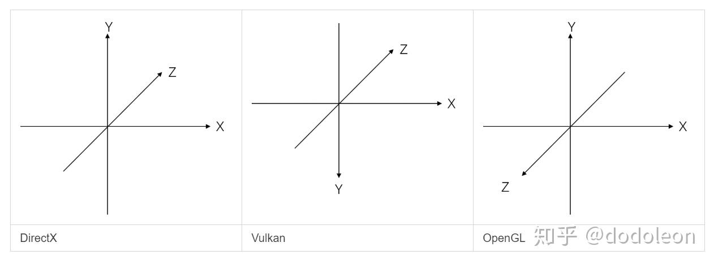

# 天空盒

## 渲染顺序

天空盒应该在渲染不透明物体之后，避免 overdraw

天空盒应该在渲染透明物体之前，因为渲染透明物体不写入深度，如果天空盒在渲染透明物体之后渲染，那么原先透明物体对应的没有写入深度的部分就会被写入天空盒的深度，颜色缓冲也同时被覆盖为天空盒的颜色

所以渲染顺序是

1.不透明物体

2.天空盒

3.透明物体

## cubemap error

```
[MeowEngine][2024-11-26 00:30:28] Error: { Validation }:
	messageIDName   = <VUID-VkImageCreateInfo-imageCreateMaxMipLevels-02251>
	messageIdNumber = -1094930823
	message         = <Validation Error: [ VUID-VkImageCreateInfo-imageCreateMaxMipLevels-02251 ] | MessageID = 0xbebcae79 | vkCreateImage(): pCreateInfo The following parameters -
format (VK_FORMAT_R8G8B8A8_UNORM)
type (VK_IMAGE_TYPE_2D)
tiling (VK_IMAGE_TILING_LINEAR)
usage (VK_IMAGE_USAGE_SAMPLED_BIT)
flags (VK_IMAGE_CREATE_CUBE_COMPATIBLE_BIT)
returned (VK_ERROR_FORMAT_NOT_SUPPORTED) when calling vkGetPhysicalDeviceImageFormatProperties2. The Vulkan spec states: Each of the following values (as described in Image Creation Limits) must not be undefined : imageCreateMaxMipLevels, imageCreateMaxArrayLayers, imageCreateMaxExtent, and imageCreateSampleCounts (https://vulkan.lunarg.com/doc/view/1.3.275.0/windows/1.3-extensions/vkspec.html#VUID-VkImageCreateInfo-imageCreateMaxMipLevels-02251)>

VUID-VkImageCreateInfo-imageCreateMaxMipLevels-02251(ERROR / SPEC): msgNum: -1094930823 - Validation Error: [ VUID-VkImageCreateInfo-imageCreateMaxMipLevels-02251 ] | MessageID = 0xbebcae79 | vkCreateImage(): pCreateInfo The following parameters -
format (VK_FORMAT_R8G8B8A8_UNORM)
type (VK_IMAGE_TYPE_2D)
tiling (VK_IMAGE_TILING_LINEAR)
usage (VK_IMAGE_USAGE_SAMPLED_BIT)
flags (VK_IMAGE_CREATE_CUBE_COMPATIBLE_BIT)
returned (VK_ERROR_FORMAT_NOT_SUPPORTED) when calling vkGetPhysicalDeviceImageFormatProperties2. The Vulkan spec states: Each of the following values (as described in Image Creation Limits) must not be undefined : imageCreateMaxMipLevels, imageCreateMaxArrayLayers, imageCreateMaxExtent, and imageCreateSampleCounts (https://vulkan.lunarg.com/doc/view/1.3.275.0/windows/1.3-extensions/vkspec.html#VUID-VkImageCreateInfo-imageCreateMaxMipLevels-02251)
    Objects: 0
异常: Exception 0xe06d7363 encountered at address 0x7fffb549fe4c
```

怎么就 `vk::ImageCreateInfo` 出错了？

于是发现是我的图像格式和布局设错了

## VkImageViewCreateInfo error

```
[MeowEngine][2024-11-26 00:55:55] Error: { Validation }:
	messageIDName   = <VUID-VkImageViewCreateInfo-imageViewType-04973>
	messageIdNumber = -1968073940
	message         = <Validation Error: [ VUID-VkImageViewCreateInfo-imageViewType-04973 ] Object 0: handle = 0xa182620000000079, type = VK_OBJECT_TYPE_IMAGE; | MessageID = 0x8ab1932c | vkCreateImageView(): pCreateInfo->subresourceRange.layerCount (6) must be 1 when using viewType VK_IMAGE_VIEW_TYPE_2D (try looking into VK_IMAGE_VIEW_TYPE_*_ARRAY). The Vulkan spec states: If viewType is VK_IMAGE_VIEW_TYPE_1D, VK_IMAGE_VIEW_TYPE_2D, or VK_IMAGE_VIEW_TYPE_3D; and subresourceRange.layerCount is not VK_REMAINING_ARRAY_LAYERS, then subresourceRange.layerCount must be 1 (https://vulkan.lunarg.com/doc/view/1.3.275.0/windows/1.3-extensions/vkspec.html#VUID-VkImageViewCreateInfo-imageViewType-04973)>
	Objects:
		Object 0
			objectType   = Image
			objectHandle = 11637972139218305145

VUID-VkImageViewCreateInfo-imageViewType-04973(ERROR / SPEC): msgNum: -1968073940 - Validation Error: [ VUID-VkImageViewCreateInfo-imageViewType-04973 ] Object 0: handle = 0xa182620000000079, type = VK_OBJECT_TYPE_IMAGE; | MessageID = 0x8ab1932c | vkCreateImageView(): pCreateInfo->subresourceRange.layerCount (6) must be 1 when using viewType VK_IMAGE_VIEW_TYPE_2D (try looking into VK_IMAGE_VIEW_TYPE_*_ARRAY). The Vulkan spec states: If viewType is VK_IMAGE_VIEW_TYPE_1D, VK_IMAGE_VIEW_TYPE_2D, or VK_IMAGE_VIEW_TYPE_3D; and subresourceRange.layerCount is not VK_REMAINING_ARRAY_LAYERS, then subresourceRange.layerCount must be 1 (https://vulkan.lunarg.com/doc/view/1.3.275.0/windows/1.3-extensions/vkspec.html#VUID-VkImageViewCreateInfo-imageViewType-04973)
    Objects: 1
        [0] 0xa182620000000079, type: 10, name: NULL
VUID-vkCmdCopyBufferToImage-pRegions-00171(ERROR / SPEC): msgNum: 1867332608 - Validation Error: [ VUID-vkCmdCopyBufferToImage-pRegions-00171 ] Object 0: handle = 0x233ce89a0c0, type = VK_OBJECT_TYPE_COMMAND_BUFFER; Object 1: handle = 0xb82de40000000077, type = VK_OBJECT_TYPE_BUFFER; | MessageID = 0x6f4d3c00 | vkCmdCopyBufferToImage(): pRegions[3] is trying to copy 262144 bytes plus 196608 offset to/from the VkBuffer (VkBuffer 0xb82de40000000077[]) which exceeds the VkBuffer total size of 393216 bytes. The Vulkan spec states: srcBuffer must be large enough to contain all buffer locations that are accessed according to Buffer and Image Addressing, for each element of pRegions (https://vulkan.lunarg.com/doc/view/1.3.275.0/windows/1.3-extensions/vkspec.html#VUID-vkCmdCopyBufferToImage-pRegions-00171)
    Objects: 2
        [0] 0x233ce89a0c0, type: 6, name: NULL
        [1] 0xb82de40000000077, type: 9, name: NULL
```

是因为 `vk::ImageViewCreateInfo` 的 `vk::ImageViewType` 要设为 `vk::ImageViewType::eCube`

## vkCmdCopyBufferToImage exceeds the VkBuffer total size

```
VUID-vkCmdCopyBufferToImage-pRegions-00171(ERROR / SPEC): msgNum: 1867332608 - Validation Error: [ VUID-vkCmdCopyBufferToImage-pRegions-00171 ] Object 0: handle = 0x2d36c6683d0, type = VK_OBJECT_TYPE_COMMAND_BUFFER; Object 1: handle = 0xb82de40000000077, type = VK_OBJECT_TYPE_BUFFER; | MessageID = 0x6f4d3c00 | vkCmdCopyBufferToImage(): pRegions[3] is trying to copy 262144 bytes plus 196608 offset to/from the VkBuffer (VkBuffer 0xb82de40000000077[]) which   the VkBuffer total size of 393216 bytes. The Vulkan spec states: srcBuffer must be large enough to contain all buffer locations that are accessed according to Buffer and Image Addressing, for each element of pRegions (https://vulkan.lunarg.com/doc/view/1.3.275.0/windows/1.3-extensions/vkspec.html#VUID-vkCmdCopyBufferToImage-pRegions-00171)
    Objects: 2
        [0] 0x2d36c6683d0, type: 6, name: NULL
        [1] 0xb82de40000000077, type: 9, name: NULL
```

于是输出了总数据量

```cpp
        if (image_data_ptr->need_staging)
        {
            assert((format_properties.optimalTilingFeatures & format_feature_flags) == format_feature_flags);
            image_data_ptr->staging_buffer_data =
                BufferData(physical_device,
                           logical_device,
                           extent.width * extent.height * 4 * 6, // cubemap have 6 images
                           vk::BufferUsageFlagBits::eTransferSrc);
            MEOW_INFO("extent.width * extent.height * 4 * 6 = {}", extent.width * extent.height * 4 * 6);
            image_tiling = vk::ImageTiling::eOptimal;
            usage_flags |= vk::ImageUsageFlagBits::eTransferDst;
            initial_layout = vk::ImageLayout::eUndefined;
        }
```

确实是 393216

于是再输出每个 copy region 的 offset

```cpp
        OneTimeSubmit(
            logical_device,
            onetime_submit_command_pool,
            graphics_queue,
            [&](const vk::raii::CommandBuffer& command_buffer) {
                if (image_data_ptr->need_staging)
                {
                    // Since we're going to blit to the texture image, set its layout to eTransferDstOptimal
                    image_data_ptr->SetLayout(
                        command_buffer, vk::ImageLayout::eUndefined, vk::ImageLayout::eTransferDstOptimal);
                    std::vector<vk::BufferImageCopy> copy_regions;
                    // cubemap have 6 images
                    for (std::size_t i = 0; i < 6; ++i)
                    {
                        copy_regions.emplace_back(extent.width * extent.height * 4 * i, /* bufferOffset */
                                                  image_data_ptr->extent.width,
                                                  image_data_ptr->extent.height,
                                                  vk::ImageSubresourceLayers(aspect_mask, 0, i, 1),
                                                  vk::Offset3D(0, 0, 0),
                                                  vk::Extent3D(image_data_ptr->extent, 1));
                        MEOW_INFO("i = {}", i);
                        MEOW_INFO("extent.width * extent.height * 4 * i = {}", extent.width * extent.height * 4 * i);
                    }
```

结果

```
[MeowEngine][2024-11-26 09:19:36] extent.width * extent.height * 4 * 6 = 393216
[MeowEngine][2024-11-26 09:19:36] i = 0
[MeowEngine][2024-11-26 09:19:36] extent.width * extent.height * 4 * i = 0
[MeowEngine][2024-11-26 09:19:36] i = 1
[MeowEngine][2024-11-26 09:19:36] extent.width * extent.height * 4 * i = 65536
[MeowEngine][2024-11-26 09:19:36] i = 2
[MeowEngine][2024-11-26 09:19:36] extent.width * extent.height * 4 * i = 131072
[MeowEngine][2024-11-26 09:19:36] i = 3
[MeowEngine][2024-11-26 09:19:36] extent.width * extent.height * 4 * i = 196608
[MeowEngine][2024-11-26 09:19:36] i = 4
[MeowEngine][2024-11-26 09:19:36] extent.width * extent.height * 4 * i = 262144
[MeowEngine][2024-11-26 09:19:36] i = 5
[MeowEngine][2024-11-26 09:19:36] extent.width * extent.height * 4 * i = 327680
```

那确实没问题啊

为什么会 `trying to copy 262144 bytes`

65536*4=262144

于是发现是我的图像格式是 16B 的，之前是 4B 的所以乘 4，现在应该乘 16

copy region 按照图像格式算出来的是对的，我自己的是错的

## InvalidImageLayout

```
UNASSIGNED-CoreValidation-DrawState-InvalidImageLayout(ERROR / SPEC): msgNum: 1303270965 - Validation Error: [ UNASSIGNED-CoreValidation-DrawState-InvalidImageLayout ] Object 0: handle = 0x1d084cf4d10, type = VK_OBJECT_TYPE_COMMAND_BUFFER; Object 1: handle = 0xa182620000000079, type = VK_OBJECT_TYPE_IMAGE; | MessageID = 0x4dae5635 | vkQueueSubmit(): pSubmits[0].pCommandBuffers[0] command buffer VkCommandBuffer 0x1d084cf4d10[] expects VkImage 0xa182620000000079[] (subresource: aspectMask 0x1 array layer 1, mip level 0) to be in layout VK_IMAGE_LAYOUT_TRANSFER_DST_OPTIMAL--instead, current layout is VK_IMAGE_LAYOUT_UNDEFINED.
    Objects: 2
        [0] 0x1d084cf4d10, type: 6, name: NULL
        [1] 0xa182620000000079, type: 10, name: NULL
```

这就不合理了啊，我的 `SetLayout` 应该起效果才对

于是试试简单纹理的，没错

于是发现问题在于 `vk::ImageSubresourceRange`

`SetLayout` 也需要 `vk::ImageSubresourceRange`，那里面需要指定 mip level 和 layer count

所以 cubemap 的 6 个 layer 只被我转了 1 个，怪不得 5 个 error

## 为啥你们都对 skybox 用 mipmap

不知道为什么你们对 skybox 用 mipmap

明明渲染天空盒的时候与天空盒之间的距离不变

我搜了一下，别人也是这样想

[https://gamedev.net/forums/topic/494832-skybox-mip-maps/4227380/](https://gamedev.net/forums/topic/494832-skybox-mip-maps/4227380/)

## 同一个 pass

看了 piccolo

```cpp
m_rhi->cmdNextSubpassPFN(m_rhi->getCurrentCommandBuffer(), RHI_SUBPASS_CONTENTS_INLINE);

float color[4] = { 1.0f, 1.0f, 1.0f, 1.0f };
m_rhi->pushEvent(m_rhi->getCurrentCommandBuffer(), "Forward Lighting", color);

drawMeshLighting();
drawSkybox();
particle_pass.draw();

m_rhi->popEvent(m_rhi->getCurrentCommandBuffer());

m_rhi->cmdNextSubpassPFN(m_rhi->getCurrentCommandBuffer(), RHI_SUBPASS_CONTENTS_INLINE);
```

人家就是直接在同一个 pass 画 mesh lighting 和 skybox 的

## 纹理是黑色的

可以输出 stb 读取的第一个纹理，来验证 stb 读到了值

```cpp
uint32_t FileSystem::ReadImageFileToPtr(std::string const& file_path, uint8_t* data_ptr)
{
    FUNCTION_TIMER();

    if (!Exists(file_path))
    {
        MEOW_ERROR("Image at {} not found!", file_path);
        return 0;
    }

    int texture_width, texture_height, texture_channels;

    auto absolute_file_path = m_root_path / file_path;
    absolute_file_path      = absolute_file_path.lexically_normal();

    stbi_uc* pixels = stbi_load(
        absolute_file_path.string().c_str(), &texture_width, &texture_height, &texture_channels, STBI_rgb_alpha);
    uint32_t data_size = texture_width * texture_height * 4;

    std::cout << "First pixel RGBA: " << static_cast<int>(pixels[0]) << ", " << static_cast<int>(pixels[1]) << ", "
                << static_cast<int>(pixels[2]) << ", " << static_cast<int>(pixels[3]) << std::endl;

    if (!pixels)
    {
        MEOW_WARN("Failed to load texture file: {}", file_path);
        return 0;
    }

    memcpy(data_ptr, pixels, data_size);

    return data_size;
}
```

那么全黑的纹理就不是 stb 的问题

之后发现了，是我要 load float

然后之前是一个 R 或 G 或 B 就是一个字节 uint8_t

所以是 `长*高*4`

现在是 R 或 G 或 B 就是一个 float 四个字节

所以是 `长*高*4*4`

## 没有绘制的 bug

还是需要 vulkan 的 query 才能看到更多信息

比如 frag invocation 现在可以看到是 0

说明根本没有画

换个反面就好了

## 多次绘制的 bug

抄的别人的绘制六次

```cpp
        // skybox

        static glm::mat4 capture_views[] = {
            glm::lookAt(glm::vec3(0.0f, 0.0f, 0.0f), glm::vec3(1.0f, 0.0f, 0.0f), glm::vec3(0.0f, -1.0f, 0.0f)),
            glm::lookAt(glm::vec3(0.0f, 0.0f, 0.0f), glm::vec3(-1.0f, 0.0f, 0.0f), glm::vec3(0.0f, -1.0f, 0.0f)),
            glm::lookAt(glm::vec3(0.0f, 0.0f, 0.0f), glm::vec3(0.0f, 1.0f, 0.0f), glm::vec3(0.0f, 0.0f, 1.0f)),
            glm::lookAt(glm::vec3(0.0f, 0.0f, 0.0f), glm::vec3(0.0f, -1.0f, 0.0f), glm::vec3(0.0f, 0.0f, -1.0f)),
            glm::lookAt(glm::vec3(0.0f, 0.0f, 0.0f), glm::vec3(0.0f, 0.0f, 1.0f), glm::vec3(0.0f, -1.0f, 0.0f)),
            glm::lookAt(glm::vec3(0.0f, 0.0f, 0.0f), glm::vec3(0.0f, 0.0f, -1.0f), glm::vec3(0.0f, -1.0f, 0.0f))};

        m_skybox_mat.BeginPopulatingDynamicUniformBufferPerFrame();
        per_scene_data.projection = Math::perspective_vk(
            glm::radians(90.0f), static_cast<float>(window_size[0]) / static_cast<float>(window_size[1]), 0.1f, 10.0f);
        for (uint32_t i = 0; i < 6; ++i)
        {
            m_skybox_mat.BeginPopulatingDynamicUniformBufferPerObject();
            per_scene_data.view = capture_views[i];
            m_skybox_mat.PopulateDynamicUniformBuffer("sceneData", &per_scene_data, sizeof(per_scene_data));
            m_skybox_mat.EndPopulatingDynamicUniformBufferPerObject();
        }
        m_skybox_mat.EndPopulatingDynamicUniformBufferPerFrame();
```

```cpp
    void ForwardPass::RenderSkybox(const vk::raii::CommandBuffer& command_buffer)
    {
        FUNCTION_TIMER();

        m_skybox_mat.BindDescriptorSetToPipeline(command_buffer, 0, 1);

        for (uint32_t i = 0; i < 6; ++i)
        {
            m_skybox_mat.BindDescriptorSetToPipeline(command_buffer, 1, 1, i, true);
            m_skybox_model.meshes[0]->BindDrawCmd(command_buffer);
            ++draw_call[1];
        }
    }
```

但是我可能是没想清楚

实际上他这个绘制六次应该是进行天空盒的转换

我现在有现成的天空盒贴图之后，我应该直接画一次，使用我的摄像机方向

```cpp
        per_scene_data.view = lookAt(glm::vec3(0.0f), glm::vec3(0.0f) + forward, glm::vec3(0.0f, 1.0f, 0.0f));
        m_skybox_mat.PopulateUniformBuffer("sceneData", &per_scene_data, sizeof(per_scene_data));
```

现在就好了

但是深度测试有点问题，我的天空盒把所有的都遮住了

这是因为天空盒的深度应该是 1

```glsl
gl_Position = gl_Position.xyww;
```

把 w 分量设置为 z，那么透视除法之后就是 1

把物体固定在远平面

## 图片位置不对的问题

现在虽然显示出来了天空盒，但是图片的位置都不对

因为不同的 skybox 面有点类似，所以直接看是很难分出来怎么错了

于是我直接写了 X+ X- Y+ Y- Z+ Z- 的字样做成 HDR

vulkan 是 X 向右，Z 向屏幕内侧，Y 向下



使用 Y 方向 flip，于是现在是 X 向右，Z 向屏幕内侧，Y 向上，现在是左手系了

但是 cubemap 是在右手系下生成的

于是实际写 cubemap 贴图的时候把 y 和 z 对换一下，变成右手系

```cpp
auto texture_ptr = ImageData::CreateCubemap({
    "builtin/textures/cubemap/skybox_specular_X+.hdr",
    "builtin/textures/cubemap/skybox_specular_X-.hdr",
    "builtin/textures/cubemap/skybox_specular_Z+.hdr",
    "builtin/textures/cubemap/skybox_specular_Z-.hdr",
    "builtin/textures/cubemap/skybox_specular_Y+.hdr",
    "builtin/textures/cubemap/skybox_specular_Y-.hdr",
});
```

## 延迟渲染中实现天空盒

也是类似的加 subpass，在 quad 之后渲染就好了，shader 都不用改
