# SpirvCross 解析错误

## 报错

堆栈

```
std::_Adjust_manually_vector_aligned(void *&, unsigned long long &) xmemory:159
spirv_cross::Parser::parse(const spirv_cross::Instruction &) spirv_parser.cpp:325
spirv_cross::Parser::parse() spirv_parser.cpp:128
spirv_cross::Compiler::Compiler(const unsigned int *, unsigned long long) spirv_cross.cpp:47
Meow::ShaderFactory::CreateShaderModuleAndGetMeta(Meow::Shader &, vk::raii::ShaderModule &, const std::string &, ShaderStageFlagBits, std::vector<…> &) shader_factory.cpp:142
Meow::ShaderFactory::Create() shader_factory.cpp:65
Meow::ShadowMapPass::CreateMaterial() shadow_map_pass.cpp:111
Meow::ShadowMapPass::ShadowMapPass(Meow::SurfaceData &) shadow_map_pass.cpp:24
Meow::EditorWindow::CreateRenderPass() editor_window.cpp:388
Meow::EditorWindow::EditorWindow(unsigned long long, GLFWwindow *) editor_window.cpp:28
Meow::MeowEditor::Start() editor.cpp:29
main() main.cpp:14
```

这里报错的点是访问了未初始化的指针

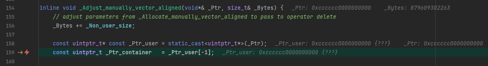

因为 0xCCCCCC0000000000 可能表示表示该值来源于未初始化的栈内存，并且部分被覆盖或截断了

| 内存模式         | 含义                    | 场景             |
| ------------ | --------------------- | -------------- |
| `0xCCCCCCCC` | 未初始化的栈内存              | 局部变量未赋值        |
| `0xCDCDCDCD` | 未初始化的堆内存              | `new` 分配但未构造   |
| `0xFDFDFDFD` | 堆尾保护字节                | 检测内存越界         |
| `0xDDDDDDDD` | 已释放的堆内存               | 调用 `delete` 之后 |
| `0xBAADF00D` | 未分配的内存页（Windows Heap） | 使用前未分配         |

于是用了这个

```
# Disable inlining only in Debug mode,
# to get full calling stack
if(MSVC)
    add_compile_options("$<$<CONFIG:Debug>:/Ob0>")
endif()
```

但是我想错了，这个 libc 又不是我编译的，我自己定义的 flag 影响不到他

好吧，IDE 可以看到 framework，有一个选项

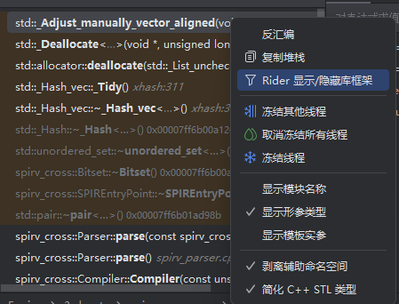

全部堆栈

```
std::_Adjust_manually_vector_aligned(void *&, unsigned long long &) xmemory:159
std::_Deallocate<…>(void *, unsigned long long) xmemory:261
std::allocator::deallocate(std::_List_unchecked_const_iterator<…> *const, const unsigned long long) xmemory:973
std::_Hash_vec::_Tidy() xhash:311
std::_Hash_vec::~_Hash_vec<…>() xhash:319
std::_Hash::~_Hash<…>() 0x00007ff6b00a126b
std::unordered_set::~unordered_set<…>() 0x00007ff6b00a2d14
spirv_cross::Bitset::~Bitset() 0x00007ff6b00a303b
spirv_cross::SPIREntryPoint::~SPIREntryPoint() 0x00007ff6b00a372d
std::pair::~pair<…>() 0x00007ff6b01ad98b
spirv_cross::Parser::parse(const spirv_cross::Instruction &) spirv_parser.cpp:325
spirv_cross::Parser::parse() spirv_parser.cpp:128
spirv_cross::Compiler::Compiler(const unsigned int *, unsigned long long) spirv_cross.cpp:47
Meow::ShaderFactory::CreateShaderModuleAndGetMeta(Meow::Shader &, vk::raii::ShaderModule &, const std::string &, ShaderStageFlagBits, std::vector<…> &) shader_factory.cpp:142
Meow::ShaderFactory::Create() shader_factory.cpp:65
Meow::ShadowMapPass::CreateMaterial() shadow_map_pass.cpp:111
Meow::ShadowMapPass::ShadowMapPass(Meow::SurfaceData &) shadow_map_pass.cpp:24
Meow::EditorWindow::CreateRenderPass() editor_window.cpp:388
Meow::EditorWindow::EditorWindow(unsigned long long, GLFWwindow *) editor_window.cpp:28
std::_Construct_in_place<…>(Meow::EditorWindow &, int &&, GLFWwindow *&&) xutility:255
std::_Ref_count_obj2::_Ref_count_obj2<…><…>(int &&, GLFWwindow *&&) memory:2094
std::make_shared<…>(int &&, GLFWwindow *&&) memory:2769
Meow::MeowEditor::Start() editor.cpp:29
main() main.cpp:14
invoke_main() 0x00007ff6b0f0aef9
__scrt_common_main_seh() 0x00007ff6b0f0adde
__scrt_common_main() 0x00007ff6b0f0ac9e
mainCRTStartup(void *) 0x00007ff6b0f0af8e
<unknown> 0x00007ff88e01e8d7
<unknown> 0x00007ff890228d9c
```

开了 asan 之后报错的位置变为

```
=================================================================
==37004==ERROR: AddressSanitizer: access-violation on unknown address 0x000000000008 (pc 0x7ff77e111e64 bp 0x000000000000 sp 0x002424d022c0 T0)
==37004==The signal is caused by a READ memory access.
==37004==Hint: address points to the zero page.
    #0 0x7ff77e111e63 in std::_List_node<unsigned int, void *>::_Free_non_head<class std::allocator<struct std::_List_node<unsigned int, void *>>>(class std::allocator<struct std::_List_node<unsigned int, void *>> &, struct std::_List_node<unsigned int, void *> *) E:\software\Microsoft Visual Studio\2022\Community\VC\Tools\MSVC\14.44.35207\include\list:324
    #1 0x7ff77e13fb48 in std::list<unsigned int, class std::allocator<unsigned int>>::_Tidy(void) E:\software\Microsoft Visual Studio\2022\Community\VC\Tools\MSVC\14.44.35207\include\list:1518
    #2 0x7ff77e12a338 in std::list<unsigned int, class std::allocator<unsigned int>>::~list<unsigned int, class std::allocator<unsigned int>>(void) E:\software\Microsoft Visual Studio\2022\Community\VC\Tools\MSVC\14.44.35207\include\list:1061
    #3 0x7ff77e127d2a in std::_Hash<class std::_Uset_traits<unsigned int, class std::_Uhash_compare<unsigned int, struct std::hash<unsigned int>, struct std::equal_to<unsigned int>>, class std::allocator<unsigned int>, 0>>::~_Hash<class std::_Uset_traits<unsigned int, class std::_Uhash_compare<unsigned int, struct std::hash<unsigned int>, struct std::equal_to<unsigned int>>, class std::allocator<unsigned int>, 0>>(void) (E:\repo\MeowEngine\build\src\meow_editor\Debug\MeowEditor.exe+0x1403d7d2a)
    #4 0x7ff77e12bd12 in std::unordered_set<unsigned int, struct std::hash<unsigned int>, struct std::equal_to<unsigned int>, class std::allocator<unsigned int>>::~unordered_set<unsigned int, struct std::hash<unsigned int>, struct std::equal_to<unsigned int>, class std::allocator<unsigned int>>(void) (E:\repo\MeowEngine\build\src\meow_editor\Debug\MeowEditor.exe+0x1403dbd12)   
    #5 0x7ff77e12c4f9 in spirv_cross::Bitset::~Bitset(void) (E:\repo\MeowEngine\build\src\meow_editor\Debug\MeowEditor.exe+0x1403dc4f9)
    #6 0x7ff77e12ca6b in spirv_cross::SPIREntryPoint::~SPIREntryPoint(void) (E:\repo\MeowEngine\build\src\meow_editor\Debug\MeowEditor.exe+0x1403dca6b)
    #7 0x7ff77e382f29 in std::pair<unsigned int, struct spirv_cross::SPIREntryPoint>::~pair<unsigned int, struct spirv_cross::SPIREntryPoint>(void) (E:\repo\MeowEngine\build\src\meow_editor\Debug\MeowEditor.exe+0x140632f29)
    #8 0x7ff77e44592e in spirv_cross::Parser::parse(struct spirv_cross::Instruction const &) E:\repo\MeowEngine\src\3rdparty\SPIRV-Cross\spirv_parser.cpp:325
    #9 0x7ff77e443471 in spirv_cross::Parser::parse(void) E:\repo\MeowEngine\src\3rdparty\SPIRV-Cross\spirv_parser.cpp:128
    #10 0x7ff77e2ec12d in spirv_cross::Compiler::Compiler(unsigned int const *, unsigned __int64) E:\repo\MeowEngine\src\3rdparty\SPIRV-Cross\spirv_cross.cpp:47
    #11 0x7ff77e10117f in Meow::ShaderFactory::CreateShaderModuleAndGetMeta(struct Meow::Shader &, class vk::raii::ShaderModule &, class std::basic_string<char, struct std::char_traits<char>, class std::allocator<char>> const &, enum vk::ShaderStageFlagBits, class std::vector<struct vk::PipelineShaderStageCreateInfo, class std::allocator<struct vk::PipelineShaderStageCreateInfo>> &) E:\repo\MeowEngine\src\meow_runtime\function\render\material\shader_factory.cpp:142
    #12 0x7ff77e1001e9 in Meow::ShaderFactory::Create(void) E:\repo\MeowEngine\src\meow_runtime\function\render\material\shader_factory.cpp:65
    #13 0x7ff77e02727d in Meow::ShadowMapPass::CreateMaterial(void) E:\repo\MeowEngine\src\meow_runtime\function\render\render_pass\shadow_map_pass.cpp:111
    #14 0x7ff77e025554 in Meow::ShadowMapPass::ShadowMapPass(struct Meow::SurfaceData &) E:\repo\MeowEngine\src\meow_runtime\function\render\render_pass\shadow_map_pass.cpp:24
    #15 0x7ff77dd7cdaa in Meow::EditorWindow::CreateRenderPass(void) E:\repo\MeowEngine\src\meow_editor\render\editor_window.cpp:388
    #16 0x7ff77dd73a4e in Meow::EditorWindow::EditorWindow(unsigned __int64, struct GLFWwindow *) E:\repo\MeowEngine\src\meow_editor\render\editor_window.cpp:28
    #17 0x7ff77dd5e814 in std::_Construct_in_place<class Meow::EditorWindow, int, struct GLFWwindow *>(class Meow::EditorWindow &, int &&, struct GLFWwindow *&&) E:\software\Microsoft Visual Studio\2022\Community\VC\Tools\MSVC\14.44.35207\include\xutility:476
    #18 0x7ff77dd5cc66 in std::_Ref_count_obj2<class Meow::EditorWindow>::_Ref_count_obj2<class Meow::EditorWindow><int, struct GLFWwindow *>(int &&, struct GLFWwindow *&&) E:\software\Microsoft Visual Studio\2022\Community\VC\Tools\MSVC\14.44.35207\include\memory:2100
    #19 0x7ff77dd615f5 in std::make_shared<class Meow::EditorWindow, int, struct GLFWwindow *>(int &&, struct GLFWwindow *&&) E:\software\Microsoft Visual Studio\2022\Community\VC\Tools\MSVC\14.44.35207\include\memory:2913
    #20 0x7ff77dd5c183 in Meow::MeowEditor::Start(void) E:\repo\MeowEngine\src\meow_editor\editor.cpp:29
    #21 0x7ff77dd6dc8b in main E:\repo\MeowEngine\src\meow_editor\main.cpp:14
    #22 0x7ff78011b3c8 in invoke_main D:\a\_work\1\s\src\vctools\crt\vcstartup\src\startup\exe_common.inl:78
    #23 0x7ff78011b311 in __scrt_common_main_seh D:\a\_work\1\s\src\vctools\crt\vcstartup\src\startup\exe_common.inl:288
    #24 0x7ff78011b1cd in __scrt_common_main D:\a\_work\1\s\src\vctools\crt\vcstartup\src\startup\exe_common.inl:330
    #25 0x7ff78011b43d in mainCRTStartup D:\a\_work\1\s\src\vctools\crt\vcstartup\src\startup\exe_main.cpp:16
    #26 0x7ff88e01e8d6  (C:\WINDOWS\System32\KERNEL32.DLL+0x18002e8d6)
    #27 0x7ff890228d9b  (C:\WINDOWS\SYSTEM32\ntdll.dll+0x180008d9b)

==37004==Register values:
rax = 8  rbx = 0  rcx = 1a0ba280000  rdx = 0
rdi = 0  rsi = 0  rbp = 0  rsp = 2424d022c0
r8  = 0  r9  = 1a53ec20455  r10 = 178a  r11 = 2424d019f0
r12 = 0  r13 = 0  r14 = 0  r15 = 0
AddressSanitizer can not provide additional info.
SUMMARY: AddressSanitizer: access-violation E:\software\Microsoft Visual Studio\2022\Community\VC\Tools\MSVC\14.44.35207\include\list:324 in std::_List_node<unsigned int, void *>::_Free_non_head<class std::allocator<struct std::_List_node<unsigned int, void *>>>(class std::allocator<struct std::_List_node<unsigned int, void *>> &, struct std::_List_node<unsigned int, void *> *)
==37004==ABORTING
```

最终报错的那个函数

```cpp
    template <class _Alnode>
    static void _Free_non_head(
        _Alnode& _Al, _Nodeptr _Head) noexcept { // free a list starting at _First and terminated at nullptr
        _Head->_Prev->_Next = nullptr;

        auto _Pnode = _Head->_Next;
        for (_Nodeptr _Pnext; _Pnode; _Pnode = _Pnext) {
            _Pnext = _Pnode->_Next;
            _Freenode(_Al, _Pnode);
        }
    }
```

其中 _Head 为 NULL

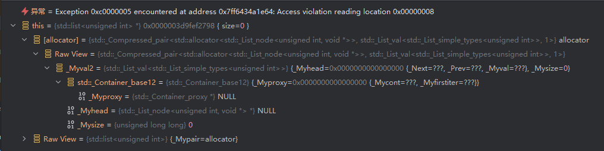

问了 AI，说是

在 MSVC 的 std::list 实现里，_Head 应该永远是一个 哨兵节点 (sentinel)，不可能为 nullptr。

只有在内存被破坏时才会出现 _Head == nullptr

或许他是说的是

```cpp
void _Alloc_sentinel_and_proxy() {
    auto&& _Alproxy = _GET_PROXY_ALLOCATOR(_Alnode, _Getal());
    _Container_proxy_ptr<_Alty> _Proxy(_Alproxy, _Mypair._Myval2);
    auto& _Al     = _Getal();
    auto _Newhead = _Al.allocate(1);
    _Construct_in_place(_Newhead->_Next, _Newhead);
    _Construct_in_place(_Newhead->_Prev, _Newhead);
    _Mypair._Myval2._Myhead = _Newhead;
    _Proxy._Release();
}
```

嗯……测试一下

```cpp
#include <unordered_set>

int main()
{
    {
        std::unordered_set<int> mySet;
        mySet.insert(1);
        mySet.insert(2);
        mySet.insert(3);
    }
    return 0;
}
```

在 `~list` 断点

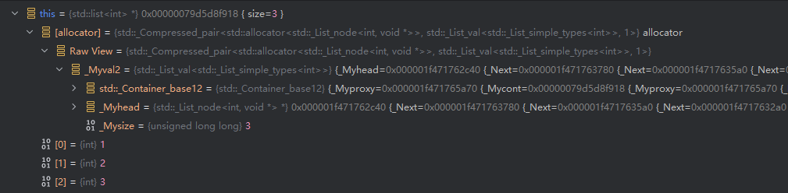

如果仅有一个实例化

```cpp
#include <unordered_set>

int main()
{
    {
        std::unordered_set<int> mySet;
    }
    return 0;
}
```

确实 head 也是有值的

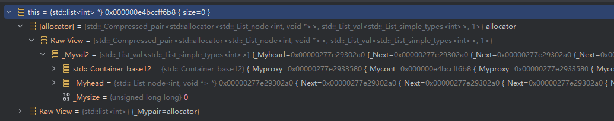

## 总结一下我的问题

我现在遇到了一个 stl 容器析构时报错的问题。编译开了 asan 之后，报错的第一现场确实转移了，是在 stl list 容器析构时 head 为空报错。

正常来说，这个 list 在构造的时候就会 new head 指针。所以如果析构的时候 head 为空，要么是双重释放，要么是内存写坏了。我在 list 的析构函数打断点，确认是第一次析构的时候就遇到这个问题。所以我觉得是后者。

我怀疑这里仍然不是第一现场，但是我不知道接下来怎么 debug 了，请问有啥办法？


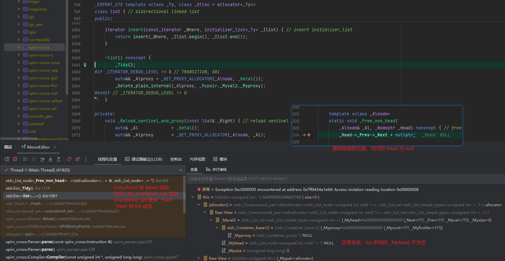

## 从构造的时候开始找

> 往调用栈向前一直找，直到找到他有效的地方
>
> 最多在有效的地方下个内存断点，一点点往后查

按照这个思路

EntryPoint 构造结束的时候，这个 Bitset 是没问题的

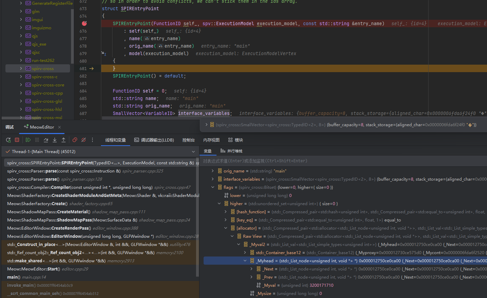

重来一次，我在 EntryPoint 构造结束的时候的 head 添加数据断点

然后命中了

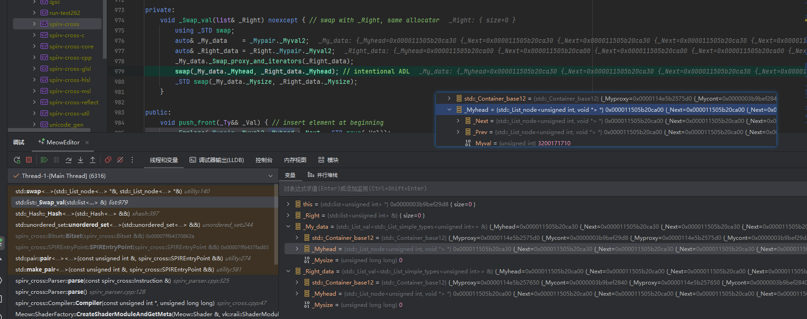

看 head 的尾部，这里是 ca30 和 ca00 对换

insert 的时候 emplace 还有一次移动构造

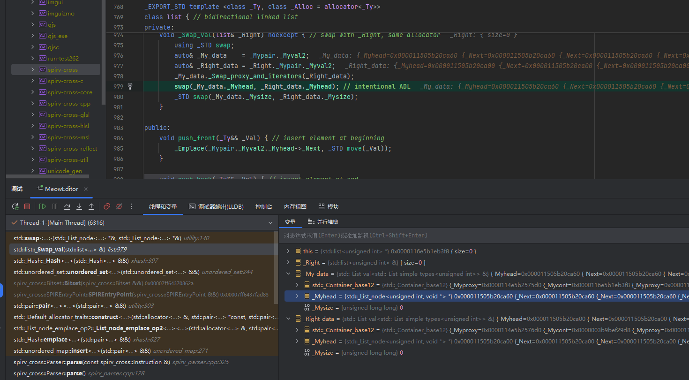

这里是 ca60 和 ca00 对换

然后就没有了，就跳到了报错的地方

是不是我不应该给 head 添加断点，应该给 list 添加数据断点？

## 获得某个变量的内存地址

这个找内存地址还有点意思

比如某个变量右键，复制地址是灰色的，那么点查看内存视图

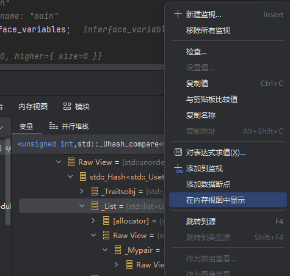

内存视图里面甚至会把它的地址表达式给出来，也会给地址

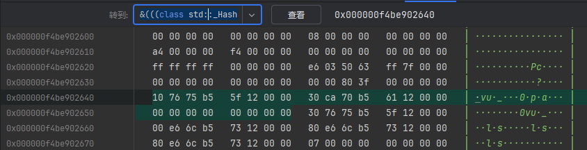

内存视图里面的地址有点难复制

在变量的窗口输入这个表达式也可以得到结果，可以直接复制

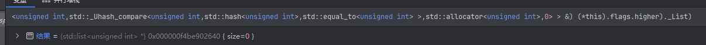

## 尝试 lldb 内存断点

第一次创建 EntryPoint 时，其中的 list 的地址是 0xf4be902640

make pair 的时候触发 EntryPoint 移动，pair 中的 list 的地址是 0xf4be9027d8

向 unordered_map insert pair 的时候，触发 emplace，就地构造，触发 EntryPoint 移动，unordered_map 中的 list 的地址是 

全加了 watchpoint，都是 swap，没有在报错之前有什么特别操作，跟我用 IDE 在 head 加数据断点一样的结果

仔细一看，这个报错位于的 list 的地址还是一个新的，我都没见过的地址，wtf？

## 查看内存

在报错的堆栈中，仔细去看内存

可以看到 EntryPoint 的析构中，head 还是有效的

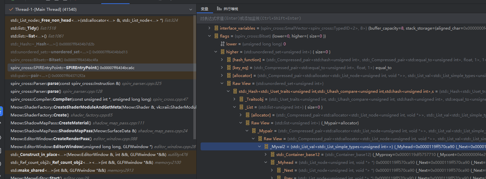

去查看 high 的内存地址

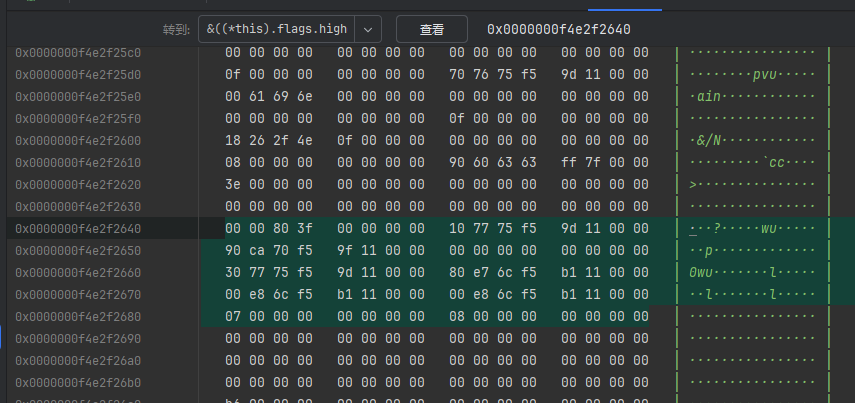

去查看 list 的内存地址

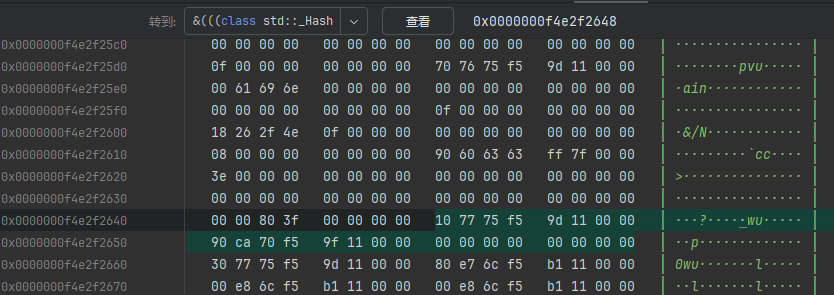

高字节放高地址，这是小端存储

可以看到 0x0000119ff570ca90

所以 head 是有值的，我之前的数据断点和 lldb watchpoint 都是没错的，数据没变过

但是堆栈走到下一层，走到 Bitset 的析构函数，Bitset 对象的地址就出错了

之前在 EntryPoint 里面看的是 0xf4e2f2638，现在就变成 0xf4e2f2688 了，多了 0x50

然后他这个 0xf4e2f2688 看到的全部都是 0

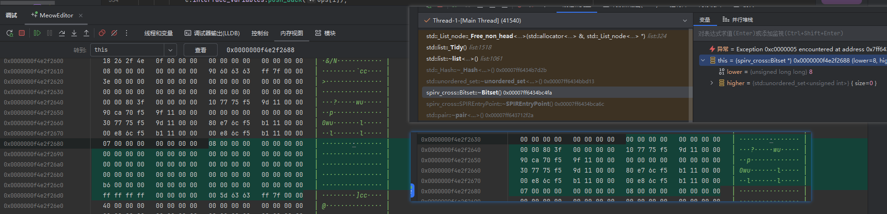

这是为啥？为啥 ClassA 析构的时候，看到成员 ClassB b 的地址是 address1，在 ClassB 析构的时候看到 b 的地址是 address1 + 0x50？

为了验证是否是 ABI mismatch

spirv cross 库中

```cpp
void print_layouts()
{
	fprintf(stdout,"In spirv cross\n");
	fprintf(stdout,"sizeof(SPIREntryPoint) = %llu\n", sizeof(SPIREntryPoint));
	fprintf(stdout,"offsetof(SPIREntryPoint, flags) =  %llu\n", offsetof(SPIREntryPoint, flags));
	fprintf(stdout,"sizeof(SPIREntryPoint::flags) =  %llu\n", sizeof(SPIREntryPoint::flags));
}
```

meow runtime 库中

```cpp
void print_layouts()
{
    std::cout << "In MeowRuntime" << std::endl;
    std::cout << "sizeof(SPIREntryPoint) = " << sizeof(spirv_cross::SPIREntryPoint) << "\n";
    std::cout << "offsetof(SPIREntryPoint, flags) = " << offsetof(spirv_cross::SPIREntryPoint, flags) << "\n";
    std::cout << "sizeof(SPIREntryPoint::flags) = " << sizeof(spirv_cross::SPIREntryPoint::flags) << "\n";
}
```

写函数调用的地方，是在报错的路径上

结果输出的确实不一样

```
In MeowRuntime
sizeof(SPIREntryPoint) = 360
offsetof(SPIREntryPoint, flags) = 224
sizeof(SPIREntryPoint::flags) = 88
In spirv cross
sizeof(SPIREntryPoint) = 280
offsetof(SPIREntryPoint, flags) =  144
sizeof(SPIREntryPoint::flags) =  88
```

好吧，但是这样我不知道是谁导致了问题

于是更详细的输出

```cpp
void print_layouts()
{
	fprintf(stdout, "In spirv cross\n");
	fprintf(stdout, "sizeof(SPIREntryPoint) = %llu\n", sizeof(SPIREntryPoint));
	fprintf(stdout, "offsetof(SPIREntryPoint, self) =  %llu\n", offsetof(SPIREntryPoint, self));
	fprintf(stdout, "offsetof(SPIREntryPoint, name) =  %llu\n", offsetof(SPIREntryPoint, name));
	fprintf(stdout, "offsetof(SPIREntryPoint, orig_name) =  %llu\n", offsetof(SPIREntryPoint, orig_name));
	fprintf(stdout, "offsetof(SPIREntryPoint, interface_variables) =  %llu\n",
	        offsetof(SPIREntryPoint, interface_variables));
	fprintf(stdout, "offsetof(SPIREntryPoint, flags) =  %llu\n", offsetof(SPIREntryPoint, flags));
	fprintf(stdout, "sizeof(SPIREntryPoint::flags) =  %llu\n", sizeof(SPIREntryPoint::flags));
}
```

```cpp
void print_layouts()
{
    std::cout << "In MeowRuntime" << std::endl;
    std::cout << "sizeof(SPIREntryPoint) = " << sizeof(spirv_cross::SPIREntryPoint) << "\n";
    std::cout << "offsetof(SPIREntryPoint, self) = " << offsetof(spirv_cross::SPIREntryPoint, self) << "\n";
    std::cout << "offsetof(SPIREntryPoint, name) = " << offsetof(spirv_cross::SPIREntryPoint, name) << "\n";
    std::cout << "offsetof(SPIREntryPoint, orig_name) = " << offsetof(spirv_cross::SPIREntryPoint, orig_name)
                << "\n";
    std::cout << "offsetof(SPIREntryPoint, interface_variables) = "
                << offsetof(spirv_cross::SPIREntryPoint, interface_variables) << "\n";
    std::cout << "offsetof(SPIREntryPoint, flags) = " << offsetof(spirv_cross::SPIREntryPoint, flags) << "\n";
    std::cout << "sizeof(SPIREntryPoint::flags) = " << sizeof(spirv_cross::SPIREntryPoint::flags) << "\n";
}
```

```
In MeowRuntime
sizeof(SPIREntryPoint) = 360
offsetof(SPIREntryPoint, self) = 0
offsetof(SPIREntryPoint, name) = 8
offsetof(SPIREntryPoint, orig_name) = 48
offsetof(SPIREntryPoint, interface_variables) = 168
offsetof(SPIREntryPoint, flags) = 224
sizeof(SPIREntryPoint::flags) = 88
In spirv cross
sizeof(SPIREntryPoint) = 280
offsetof(SPIREntryPoint, self) =  0
offsetof(SPIREntryPoint, name) =  8
offsetof(SPIREntryPoint, orig_name) =  48
offsetof(SPIREntryPoint, interface_variables) =  88
offsetof(SPIREntryPoint, flags) =  144
sizeof(SPIREntryPoint::flags) =  88
```

是 interface_variables 这个大了 80 字节

于是尝试输出

```cpp
void print_layouts()
{
    std::cout << "In MeowRuntime" << std::endl;
    std::cout << "sizeof(SPIREntryPoint) = " << sizeof(spirv_cross::SPIREntryPoint) << "\n";
    std::cout << "offsetof(SPIREntryPoint, self) = " << offsetof(spirv_cross::SPIREntryPoint, self) << "\n";
    std::cout << "offsetof(SPIREntryPoint, name) = " << offsetof(spirv_cross::SPIREntryPoint, name) << "\n";
    std::cout << "offsetof(SPIREntryPoint, orig_name) = " << offsetof(spirv_cross::SPIREntryPoint, orig_name)
                << "\n";
    std::cout << "offsetof(SPIREntryPoint, interface_variables) = "
                << offsetof(spirv_cross::SPIREntryPoint, interface_variables) << "\n";
    std::cout << "offsetof(SPIREntryPoint, flags) = " << offsetof(spirv_cross::SPIREntryPoint, flags) << "\n";
    std::cout << "sizeof(SPIREntryPoint::flags) = " << sizeof(spirv_cross::SPIREntryPoint::flags) << "\n";

    std::cout << "offsetof(SmallVector<VariableID>, buffer_capacity) = "
                << offsetof(spirv_cross::SmallVector<spirv_cross::VariableID>, buffer_capacity) << "\n";
    std::cout << "offsetof(SmallVector<VariableID>, stack_storage) = "
                << offsetof(spirv_cross::SmallVector<spirv_cross::VariableID>, stack_storage) << "\n";
}
```

但是在做的过程中，突然发现，我改我 3rdparty 中的 spirv cross 的 SmallVector 的声明，把成员改成 public，但是在 MeowRuntime 里面一直报 private

然后才发现 MeowRuntime 取到了 VulkanSDK 中的 spirv cross 的头文件

我觉得先把这个解决了再说

我先试试怎么只使用 VulkanSDK 的 spirv cross

```cmake
target_link_libraries(
  ${RUNTIME_NAME}
  PUBLIC $ENV{VULKAN_SDK}/Lib/spirv-cross-glsl.lib
  $ENV{VULKAN_SDK}/Lib/spirv-cross-hlsl.lib
  $ENV{VULKAN_SDK}/Lib/spirv-cross-cpp.lib
  $ENV{VULKAN_SDK}/Lib/spirv-cross-reflect.lib
  $ENV{VULKAN_SDK}/Lib/spirv-cross-msl.lib
  $ENV{VULKAN_SDK}/Lib/spirv-cross-util.lib
  $ENV{VULKAN_SDK}/Lib/spirv-cross-core.lib)
```

实际上不能用，因为 crt 都不兼容

```
spirv-cross-core.lib(spirv_cross.obj) : error LNK2038: 检测到“_ITERATOR_DEBUG_LEVEL”的不匹配项: 值“0”不匹配值“2”(editor.obj 中) [E:\repo\MeowEngine\build\src\meow_editor\MeowEditor.vcxproj]
spirv-cross-core.lib(spirv_cross.obj) : error LNK2038: 检测到“RuntimeLibrary”的不匹配项: 值“MD_DynamicRelease”不匹配值“MDd_DynamicDebug”(editor.obj 中) [E:\repo\MeowEngine\build\src\meow_editor\MeowEdito
r.vcxproj]
spirv-cross-core.lib(spirv_cfg.obj) : error LNK2038: 检测到“_ITERATOR_DEBUG_LEVEL”的不匹配项: 值“0”不匹配值“2”(editor.obj 中) [E:\repo\MeowEngine\build\src\meow_editor\MeowEditor.vcxproj]   
spirv-cross-core.lib(spirv_cfg.obj) : error LNK2038: 检测到“RuntimeLibrary”的不匹配项: 值“MD_DynamicRelease”不匹配值“MDd_DynamicDebug”(editor.obj 中) [E:\repo\MeowEngine\build\src\meow_editor\MeowEditor.
vcxproj]
spirv-cross-core.lib(spirv_cross_parsed_ir.obj) : error LNK2038: 检测到“_ITERATOR_DEBUG_LEVEL”的不匹配项: 值“0”不匹配值“2”(editor.obj 中) [E:\repo\MeowEngine\build\src\meow_editor\MeowEditor.vcxproj]
spirv-cross-core.lib(spirv_cross_parsed_ir.obj) : error LNK2038: 检测到“RuntimeLibrary”的不匹配项: 值“MD_DynamicRelease”不匹配值“MDd_DynamicDebug”(editor.obj 中) [E:\repo\MeowEngine\build\src\meow_editor
\MeowEditor.vcxproj]
spirv-cross-core.lib(spirv_parser.obj) : error LNK2038: 检测到“_ITERATOR_DEBUG_LEVEL”的不匹配项: 值“0”不匹配值“2”(editor.obj 中) [E:\repo\MeowEngine\build\src\meow_editor\MeowEditor.vcxproj]
spirv-cross-core.lib(spirv_parser.obj) : error LNK2038: 检测到“RuntimeLibrary”的不匹配项: 值“MD_DynamicRelease”不匹配值“MDd_DynamicDebug”(editor.obj 中) [E:\repo\MeowEngine\build\src\meow_editor\MeowEdit
or.vcxproj]
LINK : warning LNK4098: 默认库“MSVCRT”与其他库的使用冲突；请使用 /NODEFAULTLIB:library [E:\repo\MeowEngine\build\src\meow_editor\MeowEditor.vcxproj]
```

你肯定是想 dll 或者 lib 随意，debug 或 release 随意，但是 sdk 编出来就是 release 的 lib，你也没办法

## 怎么解决 ABI mismatch

改了下代码中的 include 路径好了