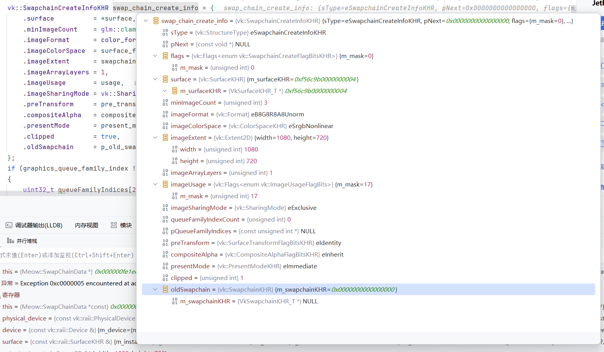

# Surface Data

## designated initialize 错误

从构造函数改成了 designated initialize 就出现了这样的错误

明明都是 null

但是就是出现了 Exception 0xc0000005 encountered at address 0x000000: User-mode data execution prevention (DEP) violation at location 0x00000000 的错误

于是 checkout 回 629c1652175b6558661a3466a85ce7b2ccaecc6b

看看之前的这个时候变量

完全一模一样的

但是为什么我这个就会出错呢

之后就放弃了