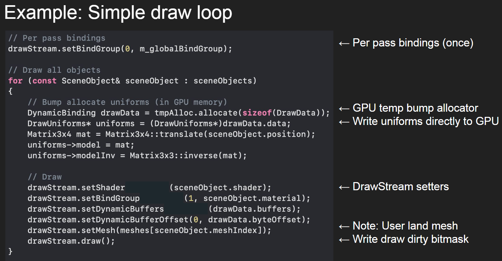
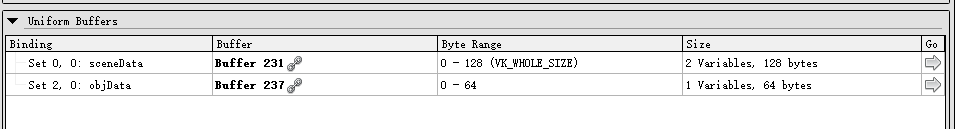

# uniform buffer

## 环形缓冲类 Ring Buffer

### 内存分配方法

Ring buffer 内部存储一个 offset，记录已经分配的内存的数据量

该数据量不一定是内存对齐值的整数倍

从 Ring buffer 分配内存的时候，返回当前的 offset 的对齐之后的值作为分配的内存的首地址，同时 Ring buffer 内部存储的 offset 是这个首地址 + 分配的 size

对齐的首地址 + 不一定是内存对齐值的整数倍的分配的 size，得到的值又不一定是内存对齐值的整数倍了

如果新的 offset 超出了 Ring buffer 内部的数据区的长度，那么就不返回当前的 offset 的对齐之后的值，而是直接返回

### 内存分配结构

理想情况下，在一帧的末尾，ring buffer 对应于这一帧分配的内存的结构是

```
[...] 

[global buffer] 

[object 1 local buffer 1] [object 1 local buffer 2] [...] [object 1 local buffer n1] 

[object 2 local buffer 1] [object 2 local buffer 2] [...] [object 2 local buffer n2] 

[...]

[object m local buffer 1] [object m local buffer 2] [...] [object m local buffer nm] 
```

实际内存是线性的，这里为了方便理解就做了换行

因为你无法确定在这一帧提交 local uniform buffer 的顺序，而每次提交都会线性分配 ring buffer

所以你只能保证 global uniform buffer 在所有 local uniform buffer 的前面，因为 global uniform buffer 是在这一帧开始之前就知道的；还有你可以确定序号小的 object 提交的 buffer 一定在序号大的 object 之前，其他的顺序无法保证

### 内存分配记录

所以你可能有

```
[...] [global buffer] [object 1 local buffer 3] [object 1 local buffer 1] [...] [object 2 local buffer 1] [object 2 local buffer 4] [...]
```

所以在后端，每一次提交时都要记录下当前分配的 ring buffer 首地址，最后提供给 `vkCmdBindDescriptorSets` 的 `pDynamicOffsets` 字段

这个字段接受一个指针，指向一个存储 uniform buffer 偏移量的数组。对于我们的数据结构，就是存储 ring buffer 分配的内存的首地址的数组。

也就是说，我们认为 `pDynamicOffsets` 指向的数组要存储所有 object 的 offset

这个数组在每帧开始时清空，然后接受每一个 object 的 uniform buffer 对应的 offset

因为这一个材质对应的所有 object 都共用同一个 shader，所以显然所有 object 的 uniform buffer 的 descriptor 的数量都是一样的

所以如果这一帧有 N 个 object，每一个 object 的 uniform buffer 的 descriptor 的数量是 `dynamicOffsetCount` 那么 `pDynamicOffsets` 指向的数组的大小就是 `N * dynamicOffsetCount`

在每一帧，这个数组的每个元素都必须分配到正确的偏移量，否则就说明对应的 uniform buffer 没有提交。

当然，可以添加一个机制，为每一个 local uniform buffer 缓存最后一次提交的数据，如果这一帧没有提交对应的 local uniform buffer，那么就提交缓存。或者是提交缺省值。

N 个 object 对应 N 次 `vkCmdBindDescriptorSets` 和 draw，假设不考虑优化。

第 i 次 `vkCmdBindDescriptorSets` 需要传入 `pDynamicOffsets` 指向的数组的第 i 段区间，那么 `Material` 类需要对此进行封装

是否能够将这个设计简化，现在我们 `pDynamicOffsets` 指向的数组不再是存储所有 object 的 offset，而仅仅是一个指向某一个 object 的所有 offset 的数组

那么现在它的大小为 `dynamicOffsetCount`，不再是在 `BeginFrame` 中初始化，而是在 `BeginObject` 中初始化

`vkCmdBindDescriptorSets` 的 `pDynamicOffsets` 字段接受的就直接是数组的首地址，而不需要计算某一个大数组的某个区间的首地址

这样当然可以，但是因为不管是 `BeginFrame` 还是 `BeginObject`，都是在 render pass 启动之前的

那么每一个 object 对应的 offset 数组都要缓存

最后还是要做一个 `vector<vector<uint32_t>> per_obj_dynamic_offsets` 来存储每个物体在 ring buffer 上分配的内存的首地址

但是这个 `per_obj_dynamic_offsets` 并不能直接传入 `vkCmdBindDescriptorSets` 的 `pDynamicOffsets` 字段

因为可能存在一种情况：某一个 `Material` 并不需要绘制网格，而只是单纯的接受 uniform 输入并输出

那么这时，外部并不会对这个 `Material` 类实例调用 `BeginObject()` `EndObject()`

这时，`per_obj_dynamic_offsets` 为空，如果还坚持要将 `per_obj_dynamic_offsets` 的元素赋给`vkCmdBindDescriptorSets` 的 `pDynamicOffsets` 字段，就会出错

所以应该有一个判断，当 `per_obj_dynamic_offsets` 为空时，给 `per_obj_dynamic_offsets` 添加一个元素，并且把 global 的 offset 复制进去

这时，外部在绑定描述符集的时候直接传入 `obj_index = 0` 就好了

## 超内存限制了

单独一个物体是正常的

于是要测试一下最多渲染多少个物体不会卡

一开始做 101 个物体的时候就包了超出内存限制的错误，然后等待几分钟才出现渲染截面，并且才 10 帧

```
[12:58:40] RUNTIME: Error: { Validation }:
        messageIDName   = <VUID-vkAllocateMemory-maxMemoryAllocationCount-04101>
        messageIdNumber = 1318213324
        message         = <Validation Error: [ VUID-vkAllocateMemory-maxMemoryAllocationCount-04101 ] | MessageID = 0x4e9256cc | vkAllocateMemory():  vkAllocateMemory: Number of currently valid memory objects is not less than maxMemoryAllocationCount (4096). The Vulkan spec states: There must be less than VkPhysicalDeviceLimits::maxMemoryAllocationCount device memory allocations currently allocated on the device (https://vulkan.lunarg.com/doc/view/1.3.275.0/windows/1.3-extensions/vkspec.html#VUID-vkAllocateMemory-maxMemoryAllocationCount-04101)>
```

这个 `memory object` 它也没告诉我具体是什么样的 object

搜了一下，别人说可能是 uniform buffer 的数量超出限制了

[https://www.reddit.com/r/vulkan/comments/10uqjpl/vulkan_memory_allocator_number_of_currently_valid/](https://www.reddit.com/r/vulkan/comments/10uqjpl/vulkan_memory_allocator_number_of_currently_valid/)

开 renderdoc 看了一下，与渲染一个背包相关的渲染指令有 (351-39)/4+1 = 79 个，每一个渲染指令创建两个 buffer

也就是说，这个背包也需要 160 个 buffer 左右

怪不得我会超出限制

所以我做环形 uniform buffer 的目的是减小 uniform buffer 的数量？

不是

## 为什么要用环形缓冲呢

好吧我承认我没多想

就是单纯看到博客就跟着做了

实际上并不需要环形啊……

因为你每一次分配内存肯定是，要一次把所有的数据都装到内存里

那么你的环形缓冲的最大内存量肯定是要大于每一次需要的最大内存

那么既然你的缓冲的大小都会大于每一次分配的内存大小了

那么为什么还要环形

直接每一次都复用那块内存就好了

环形内存应该是用在尾部不断增长，头部随着需要可以删除，并且不希望不断分配内存的场景

比如通信

这个 uniform buffer 确实不是这个场合
 
uniform buffer 并不是为了减小 uniform buffer 的数量……本身之前对一个物体创建一个 uniform buffer 的做法就是，仅仅适用于少量物体的

本身 uniform buffer 就是为了一个 buffer 用于多个物体

## Uniform Buffer offset debug

发现我每个物体绑定的 UBO 都是同一个……

于是输出一下我的 offset

```cpp
    void Material::BindDescriptorSets(vk::raii::CommandBuffer const& command_buffer, int32_t obj_index)
    {
        FUNCTION_TIMER();

        if (obj_index >= per_obj_dynamic_offsets.size())
        {
            return;
        }

        std::cout << "per_obj_dynamic_offsets[obj_index]" << std::endl;
        for (int i = 0; i < per_obj_dynamic_offsets[obj_index].size(); i++)
        {
            std::cout << "per_obj_dynamic_offsets[obj_index][i] = " << per_obj_dynamic_offsets[obj_index][i]
                      << std::endl;
        }

        std::cout << std::endl;

        command_buffer.bindDescriptorSets(vk::PipelineBindPoint::eGraphics,
                                          *shader_ptr->pipeline_layout,
                                          0,
                                          descriptor_sets,
                                          per_obj_dynamic_offsets[obj_index]);
    }
```

对应的 draw 是

```cpp
    void DeferredPass::Draw(vk::raii::CommandBuffer const& command_buffer)
    {
        FUNCTION_TIMER();

        m_obj2attachment_mat.BindPipeline(command_buffer);

        // Debug
        if (m_query_enabled)
            command_buffer.beginQuery(*query_pool, 0, {});

        std::shared_ptr<Level> level_ptr = g_runtime_global_context.level_system->GetCurrentActiveLevel().lock();
        const auto&            all_gameobjects_map = level_ptr->GetAllGameObjects();
        for (const auto& kv : all_gameobjects_map)
        {
            std::shared_ptr<GameObject>     model_go_ptr = kv.second;
            std::shared_ptr<ModelComponent> model_comp_ptr =
                model_go_ptr->TryGetComponent<ModelComponent>("ModelComponent").lock();

            if (!model_comp_ptr)
                continue;

            for (int32_t i = 0; i < model_comp_ptr->model_ptr.lock()->meshes.size(); ++i)
            {
                m_obj2attachment_mat.BindDescriptorSets(command_buffer, i);
                model_comp_ptr->model_ptr.lock()->meshes[i]->BindDrawCmd(command_buffer);

                ++m_render_stat[0].draw_call;
            }
        }
```

于是发现了问题在哪……输入的是 mesh 的序号还要加上 gameobject 的序号

于是改了

```cpp
    void DeferredPass::Draw(vk::raii::CommandBuffer const& command_buffer)
    {
        FUNCTION_TIMER();

        m_obj2attachment_mat.BindPipeline(command_buffer);

        // Debug
        if (m_query_enabled)
            command_buffer.beginQuery(*query_pool, 0, {});

        std::shared_ptr<Level> level_ptr = g_runtime_global_context.level_system->GetCurrentActiveLevel().lock();
        const auto&            all_gameobjects_map = level_ptr->GetAllGameObjects();
        for (const auto& kv : all_gameobjects_map)
        {
            std::shared_ptr<GameObject>     model_go_ptr = kv.second;
            std::shared_ptr<ModelComponent> model_comp_ptr =
                model_go_ptr->TryGetComponent<ModelComponent>("ModelComponent").lock();

            if (!model_comp_ptr)
                continue;

            for (int32_t i = 0; i < model_comp_ptr->model_ptr.lock()->meshes.size(); ++i)
            {
                m_obj2attachment_mat.BindDescriptorSets(command_buffer, m_render_stat[0].draw_call);
                model_comp_ptr->model_ptr.lock()->meshes[i]->BindDrawCmd(command_buffer);

                ++m_render_stat[0].draw_call;
            }
        }
```

但是输出还是不对

```cpp
    void Material::BindDescriptorSets(vk::raii::CommandBuffer const& command_buffer, int32_t obj_index)
    {
        FUNCTION_TIMER();

        if (obj_index >= per_obj_dynamic_offsets.size())
        {
            return;
        }

        std::cout << "obj_index = " << obj_index << std::endl;
        std::cout << "per_obj_dynamic_offsets[obj_index]" << std::endl;
        for (int i = 0; i < per_obj_dynamic_offsets[obj_index].size(); i++)
        {
            std::cout << "per_obj_dynamic_offsets[obj_index][i] = " << per_obj_dynamic_offsets[obj_index][i]
                      << std::endl;
        }

        std::cout << std::endl;

        command_buffer.bindDescriptorSets(vk::PipelineBindPoint::eGraphics,
                                          *shader_ptr->pipeline_layout,
                                          0,
                                          descriptor_sets,
                                          per_obj_dynamic_offsets[obj_index]);
    }
```

```
obj_index = 3
per_obj_dynamic_offsets[obj_index]
per_obj_dynamic_offsets[obj_index][i] = 0

obj_index = 4
per_obj_dynamic_offsets[obj_index]
per_obj_dynamic_offsets[obj_index][i] = 0

obj_index = 5
per_obj_dynamic_offsets[obj_index]
per_obj_dynamic_offsets[obj_index][i] = 0

obj_index = 6
per_obj_dynamic_offsets[obj_index]
per_obj_dynamic_offsets[obj_index][i] = 0

obj_index = 7
per_obj_dynamic_offsets[obj_index]
per_obj_dynamic_offsets[obj_index][i] = 0

obj_index = 8
per_obj_dynamic_offsets[obj_index]
per_obj_dynamic_offsets[obj_index][i] = 0

obj_index = 9
```

offset 还是都是 0

于是 debug 内存分配

```cpp
    void Material::SetLocalUniformBuffer(const std::string& name, void* dataPtr, uint32_t size)
    {
        FUNCTION_TIMER();

        auto buffer_meta_iter = shader_ptr->buffer_meta_map.find(name);
        if (buffer_meta_iter == shader_ptr->buffer_meta_map.end())
        {
            RUNTIME_ERROR("Uniform {} not found.", name);
            return;
        }

        if (buffer_meta_iter->second.bufferSize != size)
        {
            RUNTIME_WARN("Uniform {} size not match, dst={} src={}", name, buffer_meta_iter->second.bufferSize, size);
        }

        // copy local uniform buffer to ring buffer

        uint8_t* ringCPUData = (uint8_t*)(ring_buffer.mapped_data_ptr);
        uint64_t bufferSize  = buffer_meta_iter->second.bufferSize;
        uint64_t ringOffset  = ring_buffer.AllocateMemory(bufferSize);

        memcpy(ringCPUData + ringOffset, dataPtr, bufferSize);

        std::cout << "obj_count = " << obj_count << std::endl;
        std::cout << "size = " << size << std::endl;
        std::cout << "buffer_meta_iter->second.dynamic_offset_index = " << buffer_meta_iter->second.dynamic_offset_index
                  << std::endl;
        std::cout << "ringOffset = " << ringOffset << std::endl;

        per_obj_dynamic_offsets[obj_count][buffer_meta_iter->second.dynamic_offset_index] = (uint32_t)ringOffset;
    }
```

部分输出

```
obj_count = 15
size = 192
buffer_meta_iter->second.dynamic_offset_index = 0
ringOffset = 0
obj_count = 16
size = 192
buffer_meta_iter->second.dynamic_offset_index = 0
ringOffset = 0
obj_count = 17
size = 192
buffer_meta_iter->second.dynamic_offset_index = 0
ringOffset = 0
obj_count = 18
size = 192
buffer_meta_iter->second.dynamic_offset_index = 0
ringOffset = 0
obj_count = 19
size = 192
buffer_meta_iter->second.dynamic_offset_index = 0
ringOffset = 0
obj_count = 20
size = 192
buffer_meta_iter->second.dynamic_offset_index = 0
ringOffset = 0
obj_count = 0
size = 2048
buffer_meta_iter->second.dynamic_offset_index = 0
```

确实发现每次分配都返回 0……为什么呢

于是发现是我的 debug stat 这里人为给分配的地址赋值成 0 了

```cpp
    uint64_t RingUniformBuffer::AllocateMemory(uint64_t size)
    {
        uint64_t new_memory_start = Align<uint64_t>(allocated_memory, min_alignment);

        if (new_memory_start + size <= buffer_size)
        {
            allocated_memory = new_memory_start + size;

            // stat
            begin = new_memory_start;
            usage = size;

            return new_memory_start;
        }
```

现在改好了，之前是 `new_memory_start = 0`

## global uniform buffer 在干什么

这个 global uniform buffer 为什么是把输入的数据再复制到自己那里？

```cpp
    void Material::SetGlobalUniformBuffer(const std::string& name, void* dataPtr, uint32_t size)
    {
        FUNCTION_TIMER();

        auto buffer_meta_iter = shader_ptr->buffer_meta_map.find(name);
        if (buffer_meta_iter == shader_ptr->buffer_meta_map.end())
        {
            MEOW_ERROR("Uniform {} not found.", name);
            return;
        }

        if (buffer_meta_iter->second.bufferSize != size)
        {
            MEOW_WARN("Uniform {} size not match, dst={} src={}", name, buffer_meta_iter->second.bufferSize, size);
        }

        // store data into info class instance

        auto global_uniform_buffer_info_iter = std::find_if(
            global_uniform_buffer_infos.begin(), global_uniform_buffer_infos.end(), [&](auto& rhs) -> bool {
                return rhs.dynamic_offset_index == buffer_meta_iter->second.dynamic_offset_index;
            });

        if (global_uniform_buffer_info_iter == global_uniform_buffer_infos.end())
        {
            GlobalUniformBufferInfo global_uniform_buffer_info;
            global_uniform_buffer_info.dynamic_offset_index = buffer_meta_iter->second.dynamic_offset_index;
            memcpy(global_uniform_buffer_info.data.data(), dataPtr, size);

            global_uniform_buffer_infos.push_back(global_uniform_buffer_info);
        }
        else
        {
            memcpy(global_uniform_buffer_info_iter->data.data(), dataPtr, size);
        }
    }
```

假设先不管为什么还要复制

`global_uniform_buffer_infos` 是怎么填充的？
 
是先在 `buffer_meta_map` 里面找，找到了之后看看和 `global_uniform_buffer_infos` 里面存的偏移是不是一个东西

## 他的加载逻辑

可以设置 dynamic uniform 或者普通 uniform

我现在才发现

然后他似乎在同一个地方同时能够处理 dynamic 和 uniform 的

但是这两个 offset 又混合在一起

算了，放弃

感觉这个直接写死了绑定的就是有问题

于是看到别人说的是，要根据频率来更新不同的 set

[https://www.reddit.com/r/vulkan/comments/avv808/multiple_descriptor_sets_vs_multiple_bindings_in/](https://www.reddit.com/r/vulkan/comments/avv808/multiple_descriptor_sets_vs_multiple_bindings_in/)

原始文章

[https://developer.nvidia.com/vulkan-shader-resource-binding](https://developer.nvidia.com/vulkan-shader-resource-binding)

说得非常对啊……而我现在这个抄的这个算是粗暴的做法

现在这个混合在一起的我确实看的很乱

果然还是要根据这个来

然后去找别人有没有写现成的

看到一个人管理资源要处理很多依赖，还要考虑能不能合并成 subpass

[https://themaister.net/blog/2017/08/15/render-graphs-and-vulkan-a-deep-dive/](https://themaister.net/blog/2017/08/15/render-graphs-and-vulkan-a-deep-dive/)

这个确实好复杂啊

完全没有做过这些东西，所以想象不到他的应用场合

这里也提到了根据频率来渲染的

[https://zeux.io/2020/02/27/writing-an-efficient-vulkan-renderer/](https://zeux.io/2020/02/27/writing-an-efficient-vulkan-renderer/)

但是后面还有 bindless 的

根据频率来渲染的他说劣势是 mipmap 之类的……？我也不太懂

## 看 Acid 引擎

试试构建 Acid 引擎

下载 OpenAL SDK 配置 `OPENALDIR` 环境变量

然后是找不到 python

于是传入了 msvc 的

```bat
 -D@echo off

cls

REM Configure a debug build
cmake -S . -B build-debug/ -G "Visual Studio 17 2022" -A x64 -DCMAKE_EXPORT_COMPILE_COMMANDS=ON -DCMAKE_BUILD_TYPE=Debug -DPYTHON_EXECUTABLE="e:\software\Microsoft Visual Studio\2022\Community\Common7\IDE\CommonExtensions\Microsoft\VC\SecurityIssueAnalysis\python\python.exe"
cmake --build build-debug/ --parallel 8

pause
```

然后是 OpenAL 又有问题

```
-- Could NOT find OpenALSoft (missing: OPENALSOFT_LIBRARY OPENALSOFT_INCLUDE_DIR) 
CMake Error at Sources/CMakeLists.txt:31 (add_library):
  add_library cannot create imported target "OpenAL::OpenAL" because another
  target with the same name already exists.
```

是 openal target 重复

于是那个部分改成

```cmake
# OpenAL must be installed on the system, env "OPENALDIR" must be set
find_package(OpenALSoft)
find_package(OpenAL)
if(OPENALSOFT_FOUND)
	#if(OPENALSOFT_FOUND AND NOT TARGET OpenAL::OpenAL)
		add_library(OpenAL::OpenAL UNKNOWN IMPORTED)
		set_target_properties(OpenAL::OpenAL PROPERTIES
				IMPORTED_LOCATION "${OPENALSOFT_LIBRARY}"
				INTERFACE_INCLUDE_DIRECTORIES "${OPENALSOFT_INCLUDE_DIR}"
				)
	#endif()
elseif(OPENAL_FOUND)
	if(NOT TARGET OpenAL::OpenAL)
		add_library(OpenAL::OpenAL UNKNOWN IMPORTED)
	endif()
	set_target_properties(OpenAL::OpenAL PROPERTIES
	IMPORTED_LOCATION "${OPENAL_LIBRARY}"
	INTERFACE_INCLUDE_DIRECTORIES "${OPENAL_INCLUDE_DIR}"
	)
else()
	message(FATAL_ERROR "Could not find OpenAL or OpenAL-Soft")
endif()

```

就可以编译了

但是很多可执行文件都会报错

于是还是放弃了

直接看看他的源码

### descriptor

根据 pipeline 来创建的 descriptor

```cpp
DescriptorsHandler::DescriptorsHandler(const Pipeline &pipeline) :
	shader(pipeline.GetShader()),
	pushDescriptors(pipeline.IsPushDescriptors()),
	descriptorSet(std::make_unique<DescriptorSet>(pipeline)),
	changed(true) {
}
```

然后添加 descriptor 的时候就是根据 material 的 pipeline 来创建

更新数据的时候看上去是要先把数据堆在一个 `map` 里面

```cpp
void DescriptorsHandler::Push(const std::string &descriptorName, UniformHandler &uniformHandler, const std::optional<OffsetSize> &offsetSize) {
	if (shader) {
		uniformHandler.Update(shader->GetUniformBlock(descriptorName));
		Push(descriptorName, uniformHandler.GetUniformBuffer(), offsetSize);
	}
}

void DescriptorsHandler::Push(const std::string &descriptorName, StorageHandler &storageHandler, const std::optional<OffsetSize> &offsetSize) {
	if (shader) {
		storageHandler.Update(shader->GetUniformBlock(descriptorName));
		Push(descriptorName, storageHandler.GetStorageBuffer(), offsetSize);
	}
}

void DescriptorsHandler::Push(const std::string &descriptorName, PushHandler &pushHandler, const std::optional<OffsetSize> &offsetSize) {
	if (shader) {
		pushHandler.Update(shader->GetUniformBlock(descriptorName));
	}
}
```

底层就是这个 `map`

```cpp
	template<typename T>
	void Push(const std::string &descriptorName, const T &descriptor, const std::optional<OffsetSize> &offsetSize = std::nullopt) {
		if (!shader)
			return;

		// Finds the local value given to the descriptor name.
		auto it = descriptors.find(descriptorName);

		if (it != descriptors.end()) {
			// If the descriptor and size have not changed then the write is not modified.
			if (it->second.descriptor == to_address(descriptor) && it->second.offsetSize == offsetSize) {
				return;
			}

			descriptors.erase(it);
		}

		// Only non-null descriptors can be mapped.
		if (!to_address(descriptor)) {
			return;
		}

		// When adding the descriptor find the location in the shader.
		auto location = shader->GetDescriptorLocation(descriptorName);

		if (!location) {
#ifdef ACID_DEBUG
			if (shader->ReportedNotFound(descriptorName, true)) {
				Log::Error("Could not find descriptor in shader ", shader->GetName(), " of name ", std::quoted(descriptorName), '\n');
			}
#endif

			return;
		}

		auto descriptorType = shader->GetDescriptorType(*location);

		if (!descriptorType) {
#ifdef ACID_DEBUG
			if (shader->ReportedNotFound(descriptorName, true)) {
				Log::Error("Could not find descriptor in shader ", shader->GetName(), " of name ", std::quoted(descriptorName), " at location ", *location, '\n');
			}
#endif
			return;
		}

		// Adds the new descriptor value.
		auto writeDescriptor = to_address(descriptor)->GetWriteDescriptor(*location, *descriptorType, offsetSize);
		descriptors.emplace(descriptorName, DescriptorValue{to_address(descriptor), std::move(writeDescriptor), offsetSize, *location});
		changed = true;
	}
```

如果已经有值了，那么就删掉旧值 `descriptors.erase(it);`

更新新值就这个 `descriptors.emplace`

然后 descriptor 的 value 还做了封装 `DescriptorValue`

实际更新的时候

```cpp
bool DescriptorsHandler::Update(const Pipeline &pipeline) {
	if (shader != pipeline.GetShader()) {
		shader = pipeline.GetShader();
		pushDescriptors = pipeline.IsPushDescriptors();
		descriptors.clear();
		writeDescriptorSets.clear();

		if (!pushDescriptors) {
			descriptorSet = std::make_unique<DescriptorSet>(pipeline);
		}

		changed = false;
		return false;
	}

	if (changed) {
		writeDescriptorSets.clear();
		writeDescriptorSets.reserve(descriptors.size());

		for (const auto &[descriptorName, descriptor] : descriptors) {
			auto writeDescriptorSet = descriptor.writeDescriptor.GetWriteDescriptorSet();
			writeDescriptorSet.dstSet = VK_NULL_HANDLE;

			if (!pushDescriptors)
				writeDescriptorSet.dstSet = descriptorSet->GetDescriptorSet();

			writeDescriptorSets.emplace_back(writeDescriptorSet);
		}

		if (!pushDescriptors)
			descriptorSet->Update(writeDescriptorSets);

		changed = false;
	}

	return true;
}
```

是否是 push 的这个选项我还不太懂

然后这个 `descriptors` 变量就是之前 push 过的

看看他的接口是怎么使用的

```cpp
void DeferredSubrender::Render(const CommandBuffer &commandBuffer) {
	auto camera = Scenes::Get()->GetScene()->GetCamera();

	// TODO probably use a cubemap image directly instead of scene components.
	std::shared_ptr<ImageCube> skybox = nullptr;
	auto meshes = Scenes::Get()->GetScene()->QueryComponents<Mesh>();
	for (const auto &mesh : meshes) {
		if (auto materialSkybox = dynamic_cast<const SkyboxMaterial *>(mesh->GetMaterial())) {
			skybox = materialSkybox->GetImage();
			break;
		}
	}

	if (this->skybox != skybox) {
		this->skybox = skybox;
		irradiance = Resources::Get()->GetThreadPool().Enqueue(ComputeIrradiance, skybox, 64);
		prefiltered = Resources::Get()->GetThreadPool().Enqueue(ComputePrefiltered, skybox, 512);
	}

	// Updates uniforms.
	std::vector<DeferredLight> deferredLights(MAX_LIGHTS);
	uint32_t lightCount = 0;

	auto sceneLights = Scenes::Get()->GetScene()->QueryComponents<Light>();

	for (const auto &light : sceneLights) {
		//auto position = *light->GetPosition();
		//float radius = light->GetRadius();

		//if (radius >= 0.0f && !camera.GetViewFrustum()->SphereInFrustum(position, radius))
		//{
		//	continue;
		//}

		DeferredLight deferredLight = {};
		deferredLight.colour = light->GetColour();

		if (auto transform = light->GetEntity()->GetComponent<Transform>())
			deferredLight.position = transform->GetPosition();

		deferredLight.radius = light->GetRadius();
		deferredLights[lightCount] = deferredLight;
		lightCount++;

		if (lightCount >= MAX_LIGHTS)
			break;
	}

	// Updates uniforms.
	uniformScene.Push("view", camera->GetViewMatrix());
	if (auto shadows = Scenes::Get()->GetScene()->GetSystem<Shadows>())
		uniformScene.Push("shadowSpace", shadows->GetShadowBox().GetToShadowMapSpaceMatrix());
	uniformScene.Push("cameraPosition", camera->GetPosition());
	uniformScene.Push("lightsCount", lightCount);
	uniformScene.Push("fogColour", fog.GetColour());
	uniformScene.Push("fogDensity", fog.GetDensity());
	uniformScene.Push("fogGradient", fog.GetGradient());

	// Updates storage buffers.
	storageLights.Push(deferredLights.data(), sizeof(DeferredLight) * MAX_LIGHTS);

	// Updates descriptors.
	descriptorSet.Push("UniformScene", uniformScene);
	descriptorSet.Push("BufferLights", storageLights);
	descriptorSet.Push("samplerShadows", Graphics::Get()->GetAttachment("shadows"));
	descriptorSet.Push("samplerPosition", Graphics::Get()->GetAttachment("position"));
	descriptorSet.Push("samplerDiffuse", Graphics::Get()->GetAttachment("diffuse"));
	descriptorSet.Push("samplerNormal", Graphics::Get()->GetAttachment("normal"));
	descriptorSet.Push("samplerMaterial", Graphics::Get()->GetAttachment("material"));
	descriptorSet.Push("samplerBRDF", *brdf);
	descriptorSet.Push("samplerIrradiance", *irradiance);
	descriptorSet.Push("samplerPrefiltered", *prefiltered);

	if (!descriptorSet.Update(pipeline))
		return;

	// Draws the object.
	pipeline.BindPipeline(commandBuffer);

	descriptorSet.BindDescriptor(commandBuffer, pipeline);
	vkCmdDraw(commandBuffer, 3, 1, 0, 0);
}
```

那么这个就看上去很正常

但是还是没有按照频率来更新啊

fine，或许这些东西都是性能测量之后才需要做的事情

现在回过来看的话，我的 descriptor 都是直接一次绑定所有

所以我需要的也仅仅是单独绑定某些 set

这就真的需要我自己约定了

总之先试试

## 再看 global uniform buffer

这是加载数据

```cpp
    void Material::SetGlobalUniformBuffer(const std::string& name, void* dataPtr, uint32_t size)
    {
        FUNCTION_TIMER();

        auto buffer_meta_iter = shader_ptr->buffer_meta_map.find(name);
        if (buffer_meta_iter == shader_ptr->buffer_meta_map.end())
        {
            MEOW_ERROR("Uniform {} not found.", name);
            return;
        }

        if (buffer_meta_iter->second.bufferSize != size)
        {
            MEOW_WARN("Uniform {} size not match, dst={} src={}", name, buffer_meta_iter->second.bufferSize, size);
        }

        // store data into info class instance

        auto global_uniform_buffer_info_iter = std::find_if(
            global_uniform_buffer_infos.begin(), global_uniform_buffer_infos.end(), [&](auto& rhs) -> bool {
                return rhs.dynamic_offset_index == buffer_meta_iter->second.dynamic_offset_index;
            });

        if (global_uniform_buffer_info_iter == global_uniform_buffer_infos.end())
        {
            GlobalUniformBufferInfo global_uniform_buffer_info;
            global_uniform_buffer_info.dynamic_offset_index = buffer_meta_iter->second.dynamic_offset_index;
            memcpy(global_uniform_buffer_info.data.data(), dataPtr, size);

            global_uniform_buffer_infos.push_back(global_uniform_buffer_info);
        }
        else
        {
            memcpy(global_uniform_buffer_info_iter->data.data(), dataPtr, size);
        }
    }
```

这是在渲染之前的事情，把数据先自己存起来

渲染帧开始时，把存着的全局 uniform 数据存到 uniform 缓冲里面

```cpp
    void Material::BeginFrame()
    {
        FUNCTION_TIMER();

        if (actived)
        {
            return;
        }
        actived = true;

        // clear per obj data

        obj_count = 0;
        per_obj_dynamic_offsets.clear();

        // copy global uniform buffer data to ring buffer

        // global uniform buffer should be set before BeginFrame() is called
        // so copy global uniform buffer to ring buffer here
        // then it does not need to copy global uniform buffer later during this frame

        for (auto& global_uniform_buffer_info : global_uniform_buffer_infos)
        {
            uint8_t* ringCPUData = (uint8_t*)(ring_buffer.mapped_data_ptr);
            uint64_t bufferSize  = global_uniform_buffer_info.data.size();
            uint64_t ringOffset  = ring_buffer.AllocateMemory(bufferSize);

            memcpy(ringCPUData + ringOffset, global_uniform_buffer_info.data.data(), bufferSize);

            global_uniform_buffer_info.dynamic_offset = (uint32_t)ringOffset;
        }
    }
```

得到的 offset 只需要在这里一次了

这是对每一个物体都加载那个 global uniform buffer 的位置

```cpp
    void Material::BeginObject()
    {
        FUNCTION_TIMER();

        per_obj_dynamic_offsets.push_back(
            std::vector<uint32_t>(shader_ptr->uniform_buffer_count, std::numeric_limits<uint32_t>::max()));

        // copy global uniform buffer offset

        for (auto& global_uniform_buffer_info : global_uniform_buffer_infos)
        {
            per_obj_dynamic_offsets[obj_count][global_uniform_buffer_info.dynamic_offset_index] =
                global_uniform_buffer_info.dynamic_offset;
        }
    }
```

这是如果没有位置的时候，那么就只有全局 uniform

```cpp
    void Material::EndFrame()
    {
        FUNCTION_TIMER();

        actived = false;

        // if no object
        // all elements of per_obj_dynamic_offsets[0] are global uniform buffer offset

        if (per_obj_dynamic_offsets.size() == 0)
        {
            per_obj_dynamic_offsets.push_back(
                std::vector<uint32_t>(shader_ptr->uniform_buffer_count, std::numeric_limits<uint32_t>::max()));

            // copy global uniform buffer offset

            for (auto& global_uniform_buffer_info : global_uniform_buffer_infos)
            {
                per_obj_dynamic_offsets[0][global_uniform_buffer_info.dynamic_offset_index] =
                    global_uniform_buffer_info.dynamic_offset;
            }
        }
    }
```

所以这个和 dynamic 的 uniform 混合的方法还是，需要一段时间理解

之前我懂了，现在还是需要时间再想

然后想想还是不符合

于是删了

## 单独处理 uniform buffer

shader 里面要特别处理哪些是 dynamic

```cpp
    void Shader::GetUniformBuffersMeta(spirv_cross::Compiler&        compiler,
                                       spirv_cross::ShaderResources& resources,
                                       vk::ShaderStageFlags          stageFlags)
    {
        for (int32_t i = 0; i < resources.uniform_buffers.size(); ++i)
        {
            spirv_cross::Resource& res                        = resources.uniform_buffers[i];
            spirv_cross::SPIRType  type                       = compiler.get_type(res.type_id);
            spirv_cross::SPIRType  base_type                  = compiler.get_type(res.base_type_id);
            const std::string&     var_name                   = compiler.get_name(res.id);
            const std::string&     type_name                  = compiler.get_name(res.base_type_id);
            uint32_t               uniform_buffer_struct_size = (uint32_t)compiler.get_declared_struct_size(type);

            uint32_t set     = compiler.get_decoration(res.id, spv::DecorationDescriptorSet);
            uint32_t binding = compiler.get_decoration(res.id, spv::DecorationBinding);

            vk::DescriptorSetLayoutBinding set_layout_binding {binding,
                                                               (type_name.find("Dynamic") != std::string::npos) ?
                                                                   vk::DescriptorType::eUniformBufferDynamic :
                                                                   vk::DescriptorType::eUniformBuffer,
                                                               1,
                                                               stageFlags,
                                                               nullptr};
```

然后生成 uniform buffer 的 dynamic offset 时

加上 `if (descriptor_layout_binding.descriptorType == vk::DescriptorType::eUniformBufferDynamic)` 的条件判断

而不像之前那样直接认为所有的 uniform buffer 都是 dynamic

```cpp
    void Shader::GenerateDynamicUniformBufferOffset()
    {
        // metas has been sort acrroding to
        std::vector<DescriptorSetLayoutMeta>& metas = set_layout_metas.metas;

        // set uniform buffer offset index
        // for the use of dynamic uniform buffer
        // the offset index is related about set and binding
        // so it is wrong to iterate like:
        // for (auto& buffer_meta : buffer_meta_map)
        // instead, use double layer looping

        uniform_buffer_count = 0;
        for (auto& meta : metas)
        {
            for (auto& descriptor_layout_binding : meta.bindings)
            {
                if (descriptor_layout_binding.descriptorType == vk::DescriptorType::eUniformBufferDynamic)
                {
                    for (auto& buffer_meta : buffer_meta_map)
                    {
                        if (buffer_meta.second.set == meta.set &&
                            buffer_meta.second.binding == descriptor_layout_binding.binding &&
                            buffer_meta.second.descriptorType == descriptor_layout_binding.descriptorType &&
                            buffer_meta.second.stageFlags == descriptor_layout_binding.stageFlags)
                        {
                            buffer_meta.second.dynamic_offset_index = uniform_buffer_count;
                            uniform_buffer_count += 1;
                            break;
                        }
                    }
                }
            }
        }
    }
```

这个 `dynamic_offset_index` 并不是 vulkan 的，而是用来记录当前这个 dynamic uniform buffer 在所有的 dynamic uniform buffer 中排第几个

它的使用就是

```cpp
    void Material::PopulateDynamicUniformBuffer(const std::string& name, void* dataPtr, uint32_t size)
    {
        FUNCTION_TIMER();

        auto buffer_meta_iter = shader_ptr->buffer_meta_map.find(name);
        if (buffer_meta_iter == shader_ptr->buffer_meta_map.end())
        {
            MEOW_ERROR("Uniform {} not found.", name);
            return;
        }

        if (buffer_meta_iter->second.bufferSize != size)
        {
            MEOW_WARN("Uniform {} size not match, dst={} src={}", name, buffer_meta_iter->second.bufferSize, size);
        }

        // copy local uniform buffer to ring buffer

        uint8_t* ringCPUData = (uint8_t*)(ring_buffer.mapped_data_ptr);
        uint64_t bufferSize  = buffer_meta_iter->second.bufferSize;
        uint64_t ringOffset  = ring_buffer.AllocateMemory(bufferSize);

        memcpy(ringCPUData + ringOffset, dataPtr, bufferSize);

        per_obj_dynamic_offsets[obj_count][buffer_meta_iter->second.dynamic_offset_index] = (uint32_t)ringOffset;
    }
```

的

`per_obj_dynamic_offsets[obj_count][buffer_meta_iter->second.dynamic_offset_index] = (uint32_t)ringOffset;` 这里

这个每个物体的 offsets 最终的使用是

```cpp
    void Material::BindAllDescriptorSets(vk::raii::CommandBuffer const& command_buffer, int32_t obj_index)
    {
        FUNCTION_TIMER();

        if (obj_index >= per_obj_dynamic_offsets.size())
        {
            return;
        }

        command_buffer.bindDescriptorSets(vk::PipelineBindPoint::eGraphics,
                                          *shader_ptr->pipeline_layout,
                                          0,
                                          descriptor_sets,
                                          per_obj_dynamic_offsets[obj_index]);
    }
```

也就是说 vulkan 对于多个 dynamic uniform buffer 的使用就是这样的

`per_obj_dynamic_offsets[obj_index]` 的大小就是这个 shader 所有的 dynamic uniform buffer 的数量

根据规范

[https://docs.vulkan.org/spec/latest/chapters/descriptorsets.html#descriptorsets-binding]

> If any of the sets being bound include dynamic uniform or storage buffers, then pDynamicOffsets includes one element for each array element in each dynamic descriptor type binding in each set. Values are taken from pDynamicOffsets in an order such that all entries for set N come before set N+1; within a set, entries are ordered by the binding numbers in the descriptor set layouts; and within a binding array, elements are in order. dynamicOffsetCount must equal the total number of dynamic descriptors in the sets being bound.

他的意思就是，`pDynamicOffsets` 的取法是，多个集合之间，根据 `set` 从小到大排序，集合内根据 `binding` 从小到大排序

所以我们生成 `dynamic_offset_index` 也是这个顺序

## 在 material 外面负责 bind descriptor

之前就是，我自动在 material 内绑定了 uniform buffer

```cpp
        // bind ring buffer to descriptor set
        // There are two parts about binding resources to descriptor set
        // One is binding ring buffer. It is known by Material class, so it is done in Material ctor
        // The second is other's binding, such as image. It is done outside of Material ctor

        for (auto it = shader_ptr->buffer_meta_map.begin(); it != shader_ptr->buffer_meta_map.end(); ++it)
        {
            if (it->second.descriptorType == vk::DescriptorType::eUniformBuffer ||
                it->second.descriptorType == vk::DescriptorType::eUniformBufferDynamic)
            {
                shader_ptr->SetBuffer(
                    logical_device, it->first, ring_buffer.buffer_data_ptr->buffer, it->second.bufferSize);
            }
        }
```

然后 image 那些在外部绑定

最后还有一个对全体 descriptor 绑定的，但是他仅仅是为了 dynamic uniform buffer 一个人而绑定所有……

现在想想确实混乱了

还不如直接全部在外面绑定

并且如果要根据频率绑定的话

也是在外面决定的

那么 material 就剩下创建 pipeline 和绑定 dynamic uniform buffer 的 offset 这一个作用了

接口方面会有一些问题，比如我的 SetBuffer 是默认 whole size 的

```cpp
    void Shader::SetBuffer(const vk::raii::Device&     logical_device,
                           const std::string&          name,
                           const vk::raii::Buffer&     buffer,
                           vk::DeviceSize              range,
                           const vk::raii::BufferView* raii_buffer_view)
    {
        auto it = set_layout_metas.binding_meta_map.find(name);
        if (it == set_layout_metas.binding_meta_map.end())
        {
            MEOW_ERROR("Failed write buffer, {} not found!", name);
            return;
        }

        auto bindInfo = it->second;

        // Default is offset = 0, buffer size = whole size
        // Maybe it needs to be configurable?
        vk::DescriptorBufferInfo descriptor_buffer_info(*buffer, 0, range);
```

但是之前都是直接查找 size 的 `it->second.bufferSize`

于是这个完全可以在 shader 里面查找到

于是改成

```cpp
    void Shader::SetBuffer(const vk::raii::Device&     logical_device,
                           const std::string&          name,
                           const vk::raii::Buffer&     buffer,
                           vk::DeviceSize              range,
                           const vk::raii::BufferView* raii_buffer_view)
    {
        auto it = set_layout_metas.binding_meta_map.find(name);
        if (it == set_layout_metas.binding_meta_map.end())
        {
            MEOW_ERROR("Failed write buffer, {} not found!", name);
            return;
        }

        auto bindInfo = it->second;

        // If it is dynamic uniform buffer, then the buffer passed into can not use whole size
        for (auto it = buffer_meta_map.begin(); it != buffer_meta_map.end(); ++it)
        {
            if (it->first == name)
            {
                if (it->second.descriptorType == vk::DescriptorType::eUniformBufferDynamic)
                {
                    range = it->second.bufferSize;
                }
            }
        }
        vk::DescriptorBufferInfo descriptor_buffer_info(*buffer, 0, range);
```

然后 bug 是跟我说

```cpp
    uint64_t UniformBuffer::Populate(void* src, uint64_t size)
    {
        uint64_t new_memory_start = AllocateMemory(size);

        memcpy(mapped_data_ptr + new_memory_start, src, size);

        return new_memory_start;
    }
```

这个 void* 是未知的大小

确实……他可能原始指针是 float 或者 double 之类的，那么地址偏移会不一样

## 新 uniform buffer 的 bug

```
[MeowEngine][2024-11-16 10:07:39] Failed write buffer, lightDatas not found!
VUID-vkCmdBindDescriptorSets-descriptorSetCount-arraylength(ERROR / SPEC): msgNum: 1501678779 - Validation Error: [ VUID-vkCmdBindDescriptorSets-descriptorSetCount-arraylength ] | MessageID = 0x5981ccbb | vkCmdBindDescriptorSets(): descriptorSetCount must be greater than 0. The Vulkan spec states: descriptorSetCount must be greater than 0 (https://vulkan.lunarg.com/doc/view/1.3.275.0/windows/1.3-extensions/vkspec.html#VUID-vkCmdBindDescriptorSets-descriptorSetCount-arraylength)
    Objects: 0
VUID-vkCmdBindDescriptorSets-dynamicOffsetCount-00359(ERROR / SPEC): msgNum: -2106233772 - Validation Error: [ VUID-vkCmdBindDescriptorSets-dynamicOffsetCount-00359 ] Object 0: handle = 0x2c00555e1d0, type = VK_OBJECT_TYPE_COMMAND_BUFFER; | MessageID = 0x82756c54 | vkCmdBindDescriptorSets():  Attempting to bind 0 descriptorSets with 0 dynamic descriptors, but dynamicOffsetCount is 1. It should exactly match the number of dynamic descriptors. The Vulkan spec states: dynamicOffsetCount must be equal to the total number of dynamic descriptors in pDescriptorSets (https://vulkan.lunarg.com/doc/view/1.3.275.0/windows/1.3-extensions/vkspec.html#VUID-vkCmdBindDescriptorSets-dynamicOffsetCount-00359)
    Objects: 1
        [0] 0x2c00555e1d0, type: 6, name: NULL
VUID-vkCmdDrawIndexed-None-08600(ERROR / SPEC): msgNum: 941228658 - Validation Error: [ VUID-vkCmdDrawIndexed-None-08600 ] Object 0: handle = 0x9f9b41000000003c, type = VK_OBJECT_TYPE_PIPELINE; Object 1: handle = 0x944a2c0000000039, type = VK_OBJECT_TYPE_PIPELINE_LAYOUT; | MessageID = 0x381a0272 | vkCmdDrawIndexed():  The VkPipeline 0x9f9b41000000003c[] (created with VkPipelineLayout 0x944a2c0000000039[]) statically uses descriptor set (index #0) which is not compatible with the currently bound descriptor set's pipeline layout (VkPipelineLayout 0x944a2c0000000039[]). The Vulkan spec states: For each set n that is statically used by a bound shader, a descriptor set must have been bound to n at the same pipeline bind point, with a VkPipelineLayout that is compatible for set n, with the VkPipelineLayout used to create the current VkPipeline or the VkDescriptorSetLayout array used to create the current VkShaderEXT , as described in Pipeline Layout Compatibility (https://vulkan.lunarg.com/doc/view/1.3.275.0/windows/1.3-extensions/vkspec.html#VUID-vkCmdDrawIndexed-None-08600)
    Objects: 2
        [0] 0x9f9b41000000003c, type: 19, name: NULL
        [1] 0x944a2c0000000039, type: 17, name: NULL
VUID-vkCmdBindDescriptorSets-descriptorSetCount-arraylength(ERROR / SPEC): msgNum: 1501678779 - Validation Error: [ VUID-vkCmdBindDescriptorSets-descriptorSetCount-arraylength ] | MessageID = 0x5981ccbb | vkCmdBindDescriptorSets(): descriptorSetCount must be greater than 0. The Vulkan spec states: descriptorSetCount must be greater than 0 (https://vulkan.lunarg.com/doc/view/1.3.275.0/windows/1.3-extensions/vkspec.html#VUID-vkCmdBindDescriptorSets-descriptorSetCount-arraylength)
    Objects: 0
VUID-vkCmdBindDescriptorSets-dynamicOffsetCount-00359(ERROR / SPEC): msgNum: -2106233772 - Validation Error: [ VUID-vkCmdBindDescriptorSets-dynamicOffsetCount-00359 ] Object 0: handle = 0x2c00555e1d0, type = VK_OBJECT_TYPE_COMMAND_BUFFER; | MessageID = 0x82756c54 | vkCmdBindDescriptorSets():  Attempting to bind 0 descriptorSets with 0 dynamic descriptors, but dynamicOffsetCount is 1. It should exactly match the number of dynamic descriptors. The Vulkan spec states: dynamicOffsetCount must be equal to the total number of dynamic descriptors in pDescriptorSets (https://vulkan.lunarg.com/doc/view/1.3.275.0/windows/1.3-extensions/vkspec.html#VUID-vkCmdBindDescriptorSets-dynamicOffsetCount-00359)
    Objects: 1
        [0] 0x2c00555e1d0, type: 6, name: NULL
VUID-vkCmdDrawIndexed-None-08600(ERROR / SPEC): msgNum: 941228658 - Validation Error: [ VUID-vkCmdDrawIndexed-None-08600 ] Object 0: handle = 0x9f9b41000000003c, type = VK_OBJECT_TYPE_PIPELINE; Object 1: handle = 0x944a2c0000000039, type = VK_OBJECT_TYPE_PIPELINE_LAYOUT; | MessageID = 0x381a0272 | vkCmdDrawIndexed():  The VkPipeline 0x9f9b41000000003c[] (created with VkPipelineLayout 0x944a2c0000000039[]) statically uses descriptor set (index #0) which is not compatible with the currently bound descriptor set's pipeline layout (VkPipelineLayout 0x944a2c0000000039[]). The Vulkan spec states: For each set n that is statically used by a bound shader, a descriptor set must have been bound to n at the same pipeline bind point, with a VkPipelineLayout that is compatible for set n, with the VkPipelineLayout used to create the current VkPipeline or the VkDescriptorSetLayout array used to create the current VkShaderEXT , as described in Pipeline Layout Compatibility (https://vulkan.lunarg.com/doc/view/1.3.275.0/windows/1.3-extensions/vkspec.html#VUID-vkCmdDrawIndexed-None-08600)
    Objects: 2
        [0] 0x9f9b41000000003c, type: 19, name: NULL
        [1] 0x944a2c0000000039, type: 17, name: NULL
VUID-vkCmdBindDescriptorSets-descriptorSetCount-arraylength(ERROR / SPEC): msgNum: 1501678779 - Validation Error: [ VUID-vkCmdBindDescriptorSets-descriptorSetCount-arraylength ] | MessageID = 0x5981ccbb | vkCmdBindDescriptorSets(): descriptorSetCount must be greater than 0. The Vulkan spec states: descriptorSetCount must be greater than 0 (https://vulkan.lunarg.com/doc/view/1.3.275.0/windows/1.3-extensions/vkspec.html#VUID-vkCmdBindDescriptorSets-descriptorSetCount-arraylength)
    Objects: 0
VUID-vkCmdBindDescriptorSets-dynamicOffsetCount-00359(ERROR / SPEC): msgNum: -2106233772 - Validation Error: [ VUID-vkCmdBindDescriptorSets-dynamicOffsetCount-00359 ] Object 0: handle = 0x2c00555e1d0, type = VK_OBJECT_TYPE_COMMAND_BUFFER; | MessageID = 0x82756c54 | vkCmdBindDescriptorSets():  Attempting to bind 0 descriptorSets with 0 dynamic descriptors, but dynamicOffsetCount is 1. It should exactly match the number of dynamic descriptors. The Vulkan spec states: dynamicOffsetCount must be equal to the total number of dynamic descriptors in pDescriptorSets (https://vulkan.lunarg.com/doc/view/1.3.275.0/windows/1.3-extensions/vkspec.html#VUID-vkCmdBindDescriptorSets-dynamicOffsetCount-00359)
    Objects: 1
        [0] 0x2c00555e1d0, type: 6, name: NULL
VUID-vkCmdDrawIndexed-None-08600(ERROR / SPEC): msgNum: 941228658 - Validation Error: [ VUID-vkCmdDrawIndexed-None-08600 ] Object 0: handle = 0x9f9b41000000003c, type = VK_OBJECT_TYPE_PIPELINE; Object 1: handle = 0x944a2c0000000039, type = VK_OBJECT_TYPE_PIPELINE_LAYOUT; | MessageID = 0x381a0272 | vkCmdDrawIndexed():  The VkPipeline 0x9f9b41000000003c[] (created with VkPipelineLayout 0x944a2c0000000039[]) statically uses descriptor set (index #0) which is not compatible with the currently bound descriptor set's pipeline layout (VkPipelineLayout 0x944a2c0000000039[]). The Vulkan spec states: For each set n that is statically used by a bound shader, a descriptor set must have been bound to n at the same pipeline bind point, with a VkPipelineLayout that is compatible for set n, with the VkPipelineLayout used to create the current VkPipeline or the VkDescriptorSetLayout array used to create the current VkShaderEXT , as described in Pipeline Layout Compatibility (https://vulkan.lunarg.com/doc/view/1.3.275.0/windows/1.3-extensions/vkspec.html#VUID-vkCmdDrawIndexed-None-08600)
    Objects: 2
        [0] 0x9f9b41000000003c, type: 19, name: NULL
        [1] 0x944a2c0000000039, type: 17, name: NULL
VUID-vkCmdBindDescriptorSets-descriptorSetCount-arraylength(ERROR / SPEC): msgNum: 1501678779 - Validation Error: [ VUID-vkCmdBindDescriptorSets-descriptorSetCount-arraylength ] | MessageID = 0x5981ccbb | vkCmdBindDescriptorSets(): descriptorSetCount must be greater than 0. The Vulkan spec states: descriptorSetCount must be greater than 0 (https://vulkan.lunarg.com/doc/view/1.3.275.0/windows/1.3-extensions/vkspec.html#VUID-vkCmdBindDescriptorSets-descriptorSetCount-arraylength)
    Objects: 0
VUID-vkCmdBindDescriptorSets-dynamicOffsetCount-00359(ERROR / SPEC): msgNum: -2106233772 - Validation Error: [ VUID-vkCmdBindDescriptorSets-dynamicOffsetCount-00359 ] Object 0: handle = 0x2c00555e1d0, type = VK_OBJECT_TYPE_COMMAND_BUFFER; | MessageID = 0x82756c54 | vkCmdBindDescriptorSets():  Attempting to bind 0 descriptorSets with 0 dynamic descriptors, but dynamicOffsetCount is 1. It should exactly match the number of dynamic descriptors. The Vulkan spec states: dynamicOffsetCount must be equal to the total number of dynamic descriptors in pDescriptorSets (https://vulkan.lunarg.com/doc/view/1.3.275.0/windows/1.3-extensions/vkspec.html#VUID-vkCmdBindDescriptorSets-dynamicOffsetCount-00359)
    Objects: 1
        [0] 0x2c00555e1d0, type: 6, name: NULL
VUID-vkCmdDrawIndexed-None-08600(ERROR / SPEC): msgNum: 941228658 - Validation Error: [ VUID-vkCmdDrawIndexed-None-08600 ] Object 0: handle = 0x9f9b41000000003c, type = VK_OBJECT_TYPE_PIPELINE; Object 1: handle = 0x944a2c0000000039, type = VK_OBJECT_TYPE_PIPELINE_LAYOUT; | MessageID = 0x381a0272 | vkCmdDrawIndexed():  The VkPipeline 0x9f9b41000000003c[] (created with VkPipelineLayout 0x944a2c0000000039[]) statically uses descriptor set (index #0) which is not compatible with the currently bound descriptor set's pipeline layout (VkPipelineLayout 0x944a2c0000000039[]). The Vulkan spec states: For each set n that is statically used by a bound shader, a descriptor set must have been bound to n at the same pipeline bind point, with a VkPipelineLayout that is compatible for set n, with the VkPipelineLayout used to create the current VkPipeline or the VkDescriptorSetLayout array used to create the current VkShaderEXT , as described in Pipeline Layout Compatibility (https://vulkan.lunarg.com/doc/view/1.3.275.0/windows/1.3-extensions/vkspec.html#VUID-vkCmdDrawIndexed-None-08600)
    Objects: 2
        [0] 0x9f9b41000000003c, type: 19, name: NULL
        [1] 0x944a2c0000000039, type: 17, name: NULL
VUID-vkCmdBindDescriptorSets-descriptorSetCount-arraylength(ERROR / SPEC): msgNum: 1501678779 - Validation Error: [ VUID-vkCmdBindDescriptorSets-descriptorSetCount-arraylength ] | MessageID = 0x5981ccbb | vkCmdBindDescriptorSets(): descriptorSetCount must be greater than 0. The Vulkan spec states: descriptorSetCount must be greater than 0 (https://vulkan.lunarg.com/doc/view/1.3.275.0/windows/1.3-extensions/vkspec.html#VUID-vkCmdBindDescriptorSets-descriptorSetCount-arraylength)
    Objects: 0
VUID-vkCmdBindDescriptorSets-dynamicOffsetCount-00359(ERROR / SPEC): msgNum: -2106233772 - Validation Error: [ VUID-vkCmdBindDescriptorSets-dynamicOffsetCount-00359 ] Object 0: handle = 0x2c00555e1d0, type = VK_OBJECT_TYPE_COMMAND_BUFFER; | MessageID = 0x82756c54 | vkCmdBindDescriptorSets():  Attempting to bind 0 descriptorSets with 0 dynamic descriptors, but dynamicOffsetCount is 1. It should exactly match the number of dynamic descriptors. The Vulkan spec states: dynamicOffsetCount must be equal to the total number of dynamic descriptors in pDescriptorSets (https://vulkan.lunarg.com/doc/view/1.3.275.0/windows/1.3-extensions/vkspec.html#VUID-vkCmdBindDescriptorSets-dynamicOffsetCount-00359)
    Objects: 1
        [0] 0x2c00555e1d0, type: 6, name: NULL
VUID-vkCmdDrawIndexed-None-08600(ERROR / SPEC): msgNum: 941228658 - Validation Error: [ VUID-vkCmdDrawIndexed-None-08600 ] Object 0: handle = 0x9f9b41000000003c, type = VK_OBJECT_TYPE_PIPELINE; Object 1: handle = 0x944a2c0000000039, type = VK_OBJECT_TYPE_PIPELINE_LAYOUT; | MessageID = 0x381a0272 | vkCmdDrawIndexed():  The VkPipeline 0x9f9b41000000003c[] (created with VkPipelineLayout 0x944a2c0000000039[]) statically uses descriptor set (index #0) which is not compatible with the currently bound descriptor set's pipeline layout (VkPipelineLayout 0x944a2c0000000039[]). The Vulkan spec states: For each set n that is statically used by a bound shader, a descriptor set must have been bound to n at the same pipeline bind point, with a VkPipelineLayout that is compatible for set n, with the VkPipelineLayout used to create the current VkPipeline or the VkDescriptorSetLayout array used to create the current VkShaderEXT , as described in Pipeline Layout Compatibility (https://vulkan.lunarg.com/doc/view/1.3.275.0/windows/1.3-extensions/vkspec.html#VUID-vkCmdDrawIndexed-None-08600)
    Objects: 2
        [0] 0x9f9b41000000003c, type: 19, name: NULL
        [1] 0x944a2c0000000039, type: 17, name: NULL
[MeowEngine][2024-11-16 10:07:44] Error: { Validation }:
	messageIDName   = <VUID-vkCmdBindDescriptorSets-descriptorSetCount-arraylength>
	messageIdNumber = 1501678779
	message         = <Validation Error: [ VUID-vkCmdBindDescriptorSets-descriptorSetCount-arraylength ] | MessageID = 0x5981ccbb | vkCmdBindDescriptorSets(): descriptorSetCount must be greater than 0. The Vulkan spec states: descriptorSetCount must be greater than 0 (https://vulkan.lunarg.com/doc/view/1.3.275.0/windows/1.3-extensions/vkspec.html#VUID-vkCmdBindDescriptorSets-descriptorSetCount-arraylength)>

[MeowEngine][2024-11-16 10:07:44] Error: { Validation }:
	messageIDName   = <VUID-vkCmdBindDescriptorSets-dynamicOffsetCount-00359>
	messageIdNumber = -2106233772
	message         = <Validation Error: [ VUID-vkCmdBindDescriptorSets-dynamicOffsetCount-00359 ] Object 0: handle = 0x2c00555e1d0, type = VK_OBJECT_TYPE_COMMAND_BUFFER; | MessageID = 0x82756c54 | vkCmdBindDescriptorSets():  Attempting to bind 0 descriptorSets with 0 dynamic descriptors, but dynamicOffsetCount is 1. It should exactly match the number of dynamic descriptors. The Vulkan spec states: dynamicOffsetCount must be equal to the total number of dynamic descriptors in pDescriptorSets (https://vulkan.lunarg.com/doc/view/1.3.275.0/windows/1.3-extensions/vkspec.html#VUID-vkCmdBindDescriptorSets-dynamicOffsetCount-00359)>
	Objects:
		Object 0
			objectType   = CommandBuffer
			objectHandle = 3023746490832

[MeowEngine][2024-11-16 10:07:44] Error: { Validation }:
	messageIDName   = <VUID-vkCmdDrawIndexed-None-08600>
	messageIdNumber = 941228658
	message         = <Validation Error: [ VUID-vkCmdDrawIndexed-None-08600 ] Object 0: handle = 0x9f9b41000000003c, type = VK_OBJECT_TYPE_PIPELINE; Object 1: handle = 0x944a2c0000000039, type = VK_OBJECT_TYPE_PIPELINE_LAYOUT; | MessageID = 0x381a0272 | vkCmdDrawIndexed():  The VkPipeline 0x9f9b41000000003c[] (created with VkPipelineLayout 0x944a2c0000000039[]) statically uses descriptor set (index #0) which is not compatible with the currently bound descriptor set's pipeline layout (VkPipelineLayout 0x944a2c0000000039[]). The Vulkan spec states: For each set n that is statically used by a bound shader, a descriptor set must have been bound to n at the same pipeline bind point, with a VkPipelineLayout that is compatible for set n, with the VkPipelineLayout used to create the current VkPipeline or the VkDescriptorSetLayout array used to create the current VkShaderEXT , as described in Pipeline Layout Compatibility (https://vulkan.lunarg.com/doc/view/1.3.275.0/windows/1.3-extensions/vkspec.html#VUID-vkCmdDrawIndexed-None-08600)>
	Objects:
		Object 0
			objectType   = Pipeline
			objectHandle = 11500857541676499004
		Object 1
			objectType   = PipelineLayout
			objectHandle = 10685401444401545273

[MeowEngine][2024-11-16 10:07:44] Error: { Validation }:
	messageIDName   = <VUID-vkCmdBindDescriptorSets-descriptorSetCount-arraylength>
	messageIdNumber = 1501678779
	message         = <Validation Error: [ VUID-vkCmdBindDescriptorSets-descriptorSetCount-arraylength ] | MessageID = 0x5981ccbb | vkCmdBindDescriptorSets(): descriptorSetCount must be greater than 0. The Vulkan spec states: descriptorSetCount must be greater than 0 (https://vulkan.lunarg.com/doc/view/1.3.275.0/windows/1.3-extensions/vkspec.html#VUID-vkCmdBindDescriptorSets-descriptorSetCount-arraylength)>

[MeowEngine][2024-11-16 10:07:44] Error: { Validation }:
	messageIDName   = <VUID-vkCmdBindDescriptorSets-dynamicOffsetCount-00359>
	messageIdNumber = -2106233772
	message         = <Validation Error: [ VUID-vkCmdBindDescriptorSets-dynamicOffsetCount-00359 ] Object 0: handle = 0x2c00555e1d0, type = VK_OBJECT_TYPE_COMMAND_BUFFER; | MessageID = 0x82756c54 | vkCmdBindDescriptorSets():  Attempting to bind 0 descriptorSets with 0 dynamic descriptors, but dynamicOffsetCount is 1. It should exactly match the number of dynamic descriptors. The Vulkan spec states: dynamicOffsetCount must be equal to the total number of dynamic descriptors in pDescriptorSets (https://vulkan.lunarg.com/doc/view/1.3.275.0/windows/1.3-extensions/vkspec.html#VUID-vkCmdBindDescriptorSets-dynamicOffsetCount-00359)>
	Objects:
		Object 0
			objectType   = CommandBuffer
			objectHandle = 3023746490832

[MeowEngine][2024-11-16 10:07:44] Error: { Validation }:
	messageIDName   = <VUID-vkCmdDrawIndexed-None-08600>
	messageIdNumber = 941228658
	message         = <Validation Error: [ VUID-vkCmdDrawIndexed-None-08600 ] Object 0: handle = 0x9f9b41000000003c, type = VK_OBJECT_TYPE_PIPELINE; Object 1: handle = 0x944a2c0000000039, type = VK_OBJECT_TYPE_PIPELINE_LAYOUT; | MessageID = 0x381a0272 | vkCmdDrawIndexed():  The VkPipeline 0x9f9b41000000003c[] (created with VkPipelineLayout 0x944a2c0000000039[]) statically uses descriptor set (index #0) which is not compatible with the currently bound descriptor set's pipeline layout (VkPipelineLayout 0x944a2c0000000039[]). The Vulkan spec states: For each set n that is statically used by a bound shader, a descriptor set must have been bound to n at the same pipeline bind point, with a VkPipelineLayout that is compatible for set n, with the VkPipelineLayout used to create the current VkPipeline or the VkDescriptorSetLayout array used to create the current VkShaderEXT , as described in Pipeline Layout Compatibility (https://vulkan.lunarg.com/doc/view/1.3.275.0/windows/1.3-extensions/vkspec.html#VUID-vkCmdDrawIndexed-None-08600)>
	Objects:
		Object 0
			objectType   = Pipeline
			objectHandle = 11500857541676499004
		Object 1
			objectType   = PipelineLayout
			objectHandle = 10685401444401545273

[MeowEngine][2024-11-16 10:07:44] Error: { Validation }:
	messageIDName   = <VUID-vkCmdBindDescriptorSets-descriptorSetCount-arraylength>
	messageIdNumber = 1501678779
	message         = <Validation Error: [ VUID-vkCmdBindDescriptorSets-descriptorSetCount-arraylength ] | MessageID = 0x5981ccbb | vkCmdBindDescriptorSets(): descriptorSetCount must be greater than 0. The Vulkan spec states: descriptorSetCount must be greater than 0 (https://vulkan.lunarg.com/doc/view/1.3.275.0/windows/1.3-extensions/vkspec.html#VUID-vkCmdBindDescriptorSets-descriptorSetCount-arraylength)>

[MeowEngine][2024-11-16 10:07:44] Error: { Validation }:
	messageIDName   = <VUID-vkCmdBindDescriptorSets-dynamicOffsetCount-00359>
	messageIdNumber = -2106233772
	message         = <Validation Error: [ VUID-vkCmdBindDescriptorSets-dynamicOffsetCount-00359 ] Object 0: handle = 0x2c00555e1d0, type = VK_OBJECT_TYPE_COMMAND_BUFFER; | MessageID = 0x82756c54 | vkCmdBindDescriptorSets():  Attempting to bind 0 descriptorSets with 0 dynamic descriptors, but dynamicOffsetCount is 1. It should exactly match the number of dynamic descriptors. The Vulkan spec states: dynamicOffsetCount must be equal to the total number of dynamic descriptors in pDescriptorSets (https://vulkan.lunarg.com/doc/view/1.3.275.0/windows/1.3-extensions/vkspec.html#VUID-vkCmdBindDescriptorSets-dynamicOffsetCount-00359)>
	Objects:
		Object 0
			objectType   = CommandBuffer
			objectHandle = 3023746490832

[MeowEngine][2024-11-16 10:07:44] Error: { Validation }:
	messageIDName   = <VUID-vkCmdDrawIndexed-None-08600>
	messageIdNumber = 941228658
	message         = <Validation Error: [ VUID-vkCmdDrawIndexed-None-08600 ] Object 0: handle = 0x9f9b41000000003c, type = VK_OBJECT_TYPE_PIPELINE; Object 1: handle = 0x944a2c0000000039, type = VK_OBJECT_TYPE_PIPELINE_LAYOUT; | MessageID = 0x381a0272 | vkCmdDrawIndexed():  The VkPipeline 0x9f9b41000000003c[] (created with VkPipelineLayout 0x944a2c0000000039[]) statically uses descriptor set (index #0) which is not compatible with the currently bound descriptor set's pipeline layout (VkPipelineLayout 0x944a2c0000000039[]). The Vulkan spec states: For each set n that is statically used by a bound shader, a descriptor set must have been bound to n at the same pipeline bind point, with a VkPipelineLayout that is compatible for set n, with the VkPipelineLayout used to create the current VkPipeline or the VkDescriptorSetLayout array used to create the current VkShaderEXT , as described in Pipeline Layout Compatibility (https://vulkan.lunarg.com/doc/view/1.3.275.0/windows/1.3-extensions/vkspec.html#VUID-vkCmdDrawIndexed-None-08600)>
	Objects:
		Object 0
			objectType   = Pipeline
			objectHandle = 11500857541676499004
		Object 1
			objectType   = PipelineLayout
			objectHandle = 10685401444401545273

[MeowEngine][2024-11-16 10:07:44] Error: { Validation }:
	messageIDName   = <VUID-vkCmdBindDescriptorSets-descriptorSetCount-arraylength>
	messageIdNumber = 1501678779
	message         = <Validation Error: [ VUID-vkCmdBindDescriptorSets-descriptorSetCount-arraylength ] | MessageID = 0x5981ccbb | vkCmdBindDescriptorSets(): descriptorSetCount must be greater than 0. The Vulkan spec states: descriptorSetCount must be greater than 0 (https://vulkan.lunarg.com/doc/view/1.3.275.0/windows/1.3-extensions/vkspec.html#VUID-vkCmdBindDescriptorSets-descriptorSetCount-arraylength)>

[MeowEngine][2024-11-16 10:07:44] Error: { Validation }:
	messageIDName   = <VUID-vkCmdBindDescriptorSets-dynamicOffsetCount-00359>
	messageIdNumber = -2106233772
	message         = <Validation Error: [ VUID-vkCmdBindDescriptorSets-dynamicOffsetCount-00359 ] Object 0: handle = 0x2c00555e1d0, type = VK_OBJECT_TYPE_COMMAND_BUFFER; | MessageID = 0x82756c54 | vkCmdBindDescriptorSets():  Attempting to bind 0 descriptorSets with 0 dynamic descriptors, but dynamicOffsetCount is 1. It should exactly match the number of dynamic descriptors. The Vulkan spec states: dynamicOffsetCount must be equal to the total number of dynamic descriptors in pDescriptorSets (https://vulkan.lunarg.com/doc/view/1.3.275.0/windows/1.3-extensions/vkspec.html#VUID-vkCmdBindDescriptorSets-dynamicOffsetCount-00359)>
	Objects:
		Object 0
			objectType   = CommandBuffer
			objectHandle = 3023746490832

[MeowEngine][2024-11-16 10:07:44] Error: { Validation }:
	messageIDName   = <VUID-vkCmdDrawIndexed-None-08600>
	messageIdNumber = 941228658
	message         = <Validation Error: [ VUID-vkCmdDrawIndexed-None-08600 ] Object 0: handle = 0x9f9b41000000003c, type = VK_OBJECT_TYPE_PIPELINE; Object 1: handle = 0x944a2c0000000039, type = VK_OBJECT_TYPE_PIPELINE_LAYOUT; | MessageID = 0x381a0272 | vkCmdDrawIndexed():  The VkPipeline 0x9f9b41000000003c[] (created with VkPipelineLayout 0x944a2c0000000039[]) statically uses descriptor set (index #0) which is not compatible with the currently bound descriptor set's pipeline layout (VkPipelineLayout 0x944a2c0000000039[]). The Vulkan spec states: For each set n that is statically used by a bound shader, a descriptor set must have been bound to n at the same pipeline bind point, with a VkPipelineLayout that is compatible for set n, with the VkPipelineLayout used to create the current VkPipeline or the VkDescriptorSetLayout array used to create the current VkShaderEXT , as described in Pipeline Layout Compatibility (https://vulkan.lunarg.com/doc/view/1.3.275.0/windows/1.3-extensions/vkspec.html#VUID-vkCmdDrawIndexed-None-08600)>
	Objects:
		Object 0
			objectType   = Pipeline
			objectHandle = 11500857541676499004
		Object 1
			objectType   = PipelineLayout
			objectHandle = 10685401444401545273

[MeowEngine][2024-11-16 10:07:44] Error: { Validation }:
	messageIDName   = <VUID-vkCmdBindDescriptorSets-descriptorSetCount-arraylength>
	messageIdNumber = 1501678779
	message         = <Validation Error: [ VUID-vkCmdBindDescriptorSets-descriptorSetCount-arraylength ] | MessageID = 0x5981ccbb | vkCmdBindDescriptorSets(): descriptorSetCount must be greater than 0. The Vulkan spec states: descriptorSetCount must be greater than 0 (https://vulkan.lunarg.com/doc/view/1.3.275.0/windows/1.3-extensions/vkspec.html#VUID-vkCmdBindDescriptorSets-descriptorSetCount-arraylength)>

[MeowEngine][2024-11-16 10:07:44] Error: { Validation }:
	messageIDName   = <VUID-vkCmdBindDescriptorSets-dynamicOffsetCount-00359>
	messageIdNumber = -2106233772
	message         = <Validation Error: [ VUID-vkCmdBindDescriptorSets-dynamicOffsetCount-00359 ] Object 0: handle = 0x2c00555e1d0, type = VK_OBJECT_TYPE_COMMAND_BUFFER; | MessageID = 0x82756c54 | vkCmdBindDescriptorSets():  Attempting to bind 0 descriptorSets with 0 dynamic descriptors, but dynamicOffsetCount is 1. It should exactly match the number of dynamic descriptors. The Vulkan spec states: dynamicOffsetCount must be equal to the total number of dynamic descriptors in pDescriptorSets (https://vulkan.lunarg.com/doc/view/1.3.275.0/windows/1.3-extensions/vkspec.html#VUID-vkCmdBindDescriptorSets-dynamicOffsetCount-00359)>
	Objects:
		Object 0
			objectType   = CommandBuffer
			objectHandle = 3023746490832

[MeowEngine][2024-11-16 10:07:44] Error: { Validation }:
	messageIDName   = <VUID-vkCmdDrawIndexed-None-08600>
	messageIdNumber = 941228658
	message         = <Validation Error: [ VUID-vkCmdDrawIndexed-None-08600 ] Object 0: handle = 0x9f9b41000000003c, type = VK_OBJECT_TYPE_PIPELINE; Object 1: handle = 0x944a2c0000000039, type = VK_OBJECT_TYPE_PIPELINE_LAYOUT; | MessageID = 0x381a0272 | vkCmdDrawIndexed():  The VkPipeline 0x9f9b41000000003c[] (created with VkPipelineLayout 0x944a2c0000000039[]) statically uses descriptor set (index #0) which is not compatible with the currently bound descriptor set's pipeline layout (VkPipelineLayout 0x944a2c0000000039[]). The Vulkan spec states: For each set n that is statically used by a bound shader, a descriptor set must have been bound to n at the same pipeline bind point, with a VkPipelineLayout that is compatible for set n, with the VkPipelineLayout used to create the current VkPipeline or the VkDescriptorSetLayout array used to create the current VkShaderEXT , as described in Pipeline Layout Compatibility (https://vulkan.lunarg.com/doc/view/1.3.275.0/windows/1.3-extensions/vkspec.html#VUID-vkCmdDrawIndexed-None-08600)>
	Objects:
		Object 0
			objectType   = Pipeline
			objectHandle = 11500857541676499004
		Object 1
			objectType   = PipelineLayout
			objectHandle = 10685401444401545273

[MeowEngine][2024-11-16 10:07:44] Error: { Validation }:
	messageIDName   = <VUID-vkCmdBindDescriptorSets-descriptorSetCount-arraylength>
	messageIdNumber = 1501678779
	message         = <Validation Error: [ VUID-vkCmdBindDescriptorSets-descriptorSetCount-arraylength ] | MessageID = 0x5981ccbb | vkCmdBindDescriptorSets(): descriptorSetCount must be greater than 0. The Vulkan spec states: descriptorSetCount must be greater than 0 (https://vulkan.lunarg.com/doc/view/1.3.275.0/windows/1.3-extensions/vkspec.html#VUID-vkCmdBindDescriptorSets-descriptorSetCount-arraylength)>

[MeowEngine][2024-11-16 10:07:44] Error: { Validation }:
	messageIDName   = <VUID-vkCmdBindDescriptorSets-dynamicOffsetCount-00359>
	messageIdNumber = -2106233772
	message         = <Validation Error: [ VUID-vkCmdBindDescriptorSets-dynamicOffsetCount-00359 ] Object 0: handle = 0x2c00555e1d0, type = VK_OBJECT_TYPE_COMMAND_BUFFER; | MessageID = 0x82756c54 | vkCmdBindDescriptorSets():  Attempting to bind 0 descriptorSets with 0 dynamic descriptors, but dynamicOffsetCount is 1. It should exactly match the number of dynamic descriptors. The Vulkan spec states: dynamicOffsetCount must be equal to the total number of dynamic descriptors in pDescriptorSets (https://vulkan.lunarg.com/doc/view/1.3.275.0/windows/1.3-extensions/vkspec.html#VUID-vkCmdBindDescriptorSets-dynamicOffsetCount-00359)>
	Objects:
		Object 0
			objectType   = CommandBuffer
			objectHandle = 3023746490832

[MeowEngine][2024-11-16 10:07:44] Error: { Validation }:
	messageIDName   = <VUID-vkCmdDrawIndexed-None-08600>
	messageIdNumber = 941228658
	message         = <Validation Error: [ VUID-vkCmdDrawIndexed-None-08600 ] Object 0: handle = 0x9f9b41000000003c, type = VK_OBJECT_TYPE_PIPELINE; Object 1: handle = 0x944a2c0000000039, type = VK_OBJECT_TYPE_PIPELINE_LAYOUT; | MessageID = 0x381a0272 | vkCmdDrawIndexed():  The VkPipeline 0x9f9b41000000003c[] (created with VkPipelineLayout 0x944a2c0000000039[]) statically uses descriptor set (index #0) which is not compatible with the currently bound descriptor set's pipeline layout (VkPipelineLayout 0x944a2c0000000039[]). The Vulkan spec states: For each set n that is statically used by a bound shader, a descriptor set must have been bound to n at the same pipeline bind point, with a VkPipelineLayout that is compatible for set n, with the VkPipelineLayout used to create the current VkPipeline or the VkDescriptorSetLayout array used to create the current VkShaderEXT , as described in Pipeline Layout Compatibility (https://vulkan.lunarg.com/doc/view/1.3.275.0/windows/1.3-extensions/vkspec.html#VUID-vkCmdDrawIndexed-None-08600)>
	Objects:
		Object 0
			objectType   = Pipeline
			objectHandle = 11500857541676499004
		Object 1
			objectType   = PipelineLayout
			objectHandle = 10685401444401545273

[MeowEngine][2024-11-16 10:07:44] Error: { Validation }:
	messageIDName   = <VUID-vkCmdBindDescriptorSets-descriptorSetCount-arraylength>
	messageIdNumber = 1501678779
	message         = <Validation Error: [ VUID-vkCmdBindDescriptorSets-descriptorSetCount-arraylength ] | MessageID = 0x5981ccbb | vkCmdBindDescriptorSets(): descriptorSetCount must be greater than 0. The Vulkan spec states: descriptorSetCount must be greater than 0 (https://vulkan.lunarg.com/doc/view/1.3.275.0/windows/1.3-extensions/vkspec.html#VUID-vkCmdBindDescriptorSets-descriptorSetCount-arraylength)>

[MeowEngine][2024-11-16 10:07:44] Error: { Validation }:
	messageIDName   = <VUID-vkCmdBindDescriptorSets-dynamicOffsetCount-00359>
	messageIdNumber = -2106233772
	message         = <Validation Error: [ VUID-vkCmdBindDescriptorSets-dynamicOffsetCount-00359 ] Object 0: handle = 0x2c00555e1d0, type = VK_OBJECT_TYPE_COMMAND_BUFFER; | MessageID = 0x82756c54 | vkCmdBindDescriptorSets():  Attempting to bind 0 descriptorSets with 0 dynamic descriptors, but dynamicOffsetCount is 1. It should exactly match the number of dynamic descriptors. The Vulkan spec states: dynamicOffsetCount must be equal to the total number of dynamic descriptors in pDescriptorSets (https://vulkan.lunarg.com/doc/view/1.3.275.0/windows/1.3-extensions/vkspec.html#VUID-vkCmdBindDescriptorSets-dynamicOffsetCount-00359)>
	Objects:
		Object 0
			objectType   = CommandBuffer
			objectHandle = 3023746490832

[MeowEngine][2024-11-16 10:07:44] Error: { Validation }:
	messageIDName   = <VUID-vkCmdDrawIndexed-None-08600>
	messageIdNumber = 941228658
	message         = <Validation Error: [ VUID-vkCmdDrawIndexed-None-08600 ] Object 0: handle = 0x9f9b41000000003c, type = VK_OBJECT_TYPE_PIPELINE; Object 1: handle = 0x944a2c0000000039, type = VK_OBJECT_TYPE_PIPELINE_LAYOUT; | MessageID = 0x381a0272 | vkCmdDrawIndexed():  The VkPipeline 0x9f9b41000000003c[] (created with VkPipelineLayout 0x944a2c0000000039[]) statically uses descriptor set (index #0) which is not compatible with the currently bound descriptor set's pipeline layout (VkPipelineLayout 0x944a2c0000000039[]). The Vulkan spec states: For each set n that is statically used by a bound shader, a descriptor set must have been bound to n at the same pipeline bind point, with a VkPipelineLayout that is compatible for set n, with the VkPipelineLayout used to create the current VkPipeline or the VkDescriptorSetLayout array used to create the current VkShaderEXT , as described in Pipeline Layout Compatibility (https://vulkan.lunarg.com/doc/view/1.3.275.0/windows/1.3-extensions/vkspec.html#VUID-vkCmdDrawIndexed-None-08600)>
	Objects:
		Object 0
			objectType   = Pipeline
			objectHandle = 11500857541676499004
		Object 1
			objectType   = PipelineLayout
			objectHandle = 10685401444401545273

[MeowEngine][2024-11-16 10:07:44] Error: { Validation }:
	messageIDName   = <VUID-vkCmdBindDescriptorSets-descriptorSetCount-arraylength>
	messageIdNumber = 1501678779
	message         = <Validation Error: [ VUID-vkCmdBindDescriptorSets-descriptorSetCount-arraylength ] | MessageID = 0x5981ccbb | vkCmdBindDescriptorSets(): descriptorSetCount must be greater than 0. The Vulkan spec states: descriptorSetCount must be greater than 0 (https://vulkan.lunarg.com/doc/view/1.3.275.0/windows/1.3-extensions/vkspec.html#VUID-vkCmdBindDescriptorSets-descriptorSetCount-arraylength)>

[MeowEngine][2024-11-16 10:07:44] Error: { Validation }:
	messageIDName   = <VUID-vkCmdBindDescriptorSets-dynamicOffsetCount-00359>
	messageIdNumber = -2106233772
	message         = <Validation Error: [ VUID-vkCmdBindDescriptorSets-dynamicOffsetCount-00359 ] Object 0: handle = 0x2c00555e1d0, type = VK_OBJECT_TYPE_COMMAND_BUFFER; | MessageID = 0x82756c54 | vkCmdBindDescriptorSets():  Attempting to bind 0 descriptorSets with 0 dynamic descriptors, but dynamicOffsetCount is 1. It should exactly match the number of dynamic descriptors. The Vulkan spec states: dynamicOffsetCount must be equal to the total number of dynamic descriptors in pDescriptorSets (https://vulkan.lunarg.com/doc/view/1.3.275.0/windows/1.3-extensions/vkspec.html#VUID-vkCmdBindDescriptorSets-dynamicOffsetCount-00359)>
	Objects:
		Object 0
			objectType   = CommandBuffer
			objectHandle = 3023746490832

[MeowEngine][2024-11-16 10:07:44] Error: { Validation }:
	messageIDName   = <VUID-vkCmdDrawIndexed-None-08600>
	messageIdNumber = 941228658
	message         = <Validation Error: [ VUID-vkCmdDrawIndexed-None-08600 ] Object 0: handle = 0x9f9b41000000003c, type = VK_OBJECT_TYPE_PIPELINE; Object 1: handle = 0x944a2c0000000039, type = VK_OBJECT_TYPE_PIPELINE_LAYOUT; | MessageID = 0x381a0272 | vkCmdDrawIndexed():  The VkPipeline 0x9f9b41000000003c[] (created with VkPipelineLayout 0x944a2c0000000039[]) statically uses descriptor set (index #0) which is not compatible with the currently bound descriptor set's pipeline layout (VkPipelineLayout 0x944a2c0000000039[]). The Vulkan spec states: For each set n that is statically used by a bound shader, a descriptor set must have been bound to n at the same pipeline bind point, with a VkPipelineLayout that is compatible for set n, with the VkPipelineLayout used to create the current VkPipeline or the VkDescriptorSetLayout array used to create the current VkShaderEXT , as described in Pipeline Layout Compatibility (https://vulkan.lunarg.com/doc/view/1.3.275.0/windows/1.3-extensions/vkspec.html#VUID-vkCmdDrawIndexed-None-08600)>
	Objects:
		Object 0
			objectType   = Pipeline
			objectHandle = 11500857541676499004
		Object 1
			objectType   = PipelineLayout
			objectHandle = 10685401444401545273

[MeowEngine][2024-11-16 10:07:44] Error: { Validation }:
	messageIDName   = <VUID-vkCmdBindDescriptorSets-descriptorSetCount-arraylength>
	messageIdNumber = 1501678779
	message         = <Validation Error: [ VUID-vkCmdBindDescriptorSets-descriptorSetCount-arraylength ] | MessageID = 0x5981ccbb | vkCmdBindDescriptorSets(): descriptorSetCount must be greater than 0. The Vulkan spec states: descriptorSetCount must be greater than 0 (https://vulkan.lunarg.com/doc/view/1.3.275.0/windows/1.3-extensions/vkspec.html#VUID-vkCmdBindDescriptorSets-descriptorSetCount-arraylength)>
VUID-vkCmdBindDescriptorSets-descriptorSetCount-arraylength(ERROR / SPEC): msgNum: 1501678779 - Validation Error: [ VUID-vkCmdBindDescriptorSets-descriptorSetCount-arraylength ] | MessageID = 0x5981ccbb | vkCmdBindDescriptorSets(): descriptorSetCount must be greater than 0. The Vulkan spec states: descriptorSetCount must be greater than 0 (https://vulkan.lunarg.com/doc/view/1.3.275.0/windows/1.3-extensions/vkspec.html#VUID-vkCmdBindDescriptorSets-descriptorSetCount-arraylength)
    Objects: 0
VUID-vkCmdBindDescriptorSets-dynamicOffsetCount-00359(ERROR / SPEC): msgNum: -2106233772 - Validation Error: [ VUID-vkCmdBindDescriptorSets-dynamicOffsetCount-00359 ] Object 0: handle = 0x2c00555e1d0, type = VK_OBJECT_TYPE_COMMAND_BUFFER; | MessageID = 0x82756c54 | vkCmdBindDescriptorSets():  Attempting to bind 0 descriptorSets with 0 dynamic descriptors, but dynamicOffsetCount is 1. It should exactly match the number of dynamic descriptors. The Vulkan spec states: dynamicOffsetCount must be equal to the total number of dynamic descriptors in pDescriptorSets (https://vulkan.lunarg.com/doc/view/1.3.275.0/windows/1.3-extensions/vkspec.html#VUID-vkCmdBindDescriptorSets-dynamicOffsetCount-00359)
    Objects: 1
        [0] 0x2c00555e1d0, type: 6, name: NULL
VUID-vkCmdDrawIndexed-None-08600(ERROR / SPEC): msgNum: 941228658 - Validation Error: [ VUID-vkCmdDrawIndexed-None-08600 ] Object 0: handle = 0x9f9b41000000003c, type = VK_OBJECT_TYPE_PIPELINE; Object 1: handle = 0x944a2c0000000039, type = VK_OBJECT_TYPE_PIPELINE_LAYOUT; | MessageID = 0x381a0272 | vkCmdDrawIndexed():  The VkPipeline 0x9f9b41000000003c[] (created with VkPipelineLayout 0x944a2c0000000039[]) statically uses descriptor set (index #0) which is not compatible with the currently bound descriptor set's pipeline layout (VkPipelineLayout 0x944a2c0000000039[]). The Vulkan spec states: For each set n that is statically used by a bound shader, a descriptor set must have been bound to n at the same pipeline bind point, with a VkPipelineLayout that is compatible for set n, with the VkPipelineLayout used to create the current VkPipeline or the VkDescriptorSetLayout array used to create the current VkShaderEXT , as described in Pipeline Layout Compatibility (https://vulkan.lunarg.com/doc/view/1.3.275.0/windows/1.3-extensions/vkspec.html#VUID-vkCmdDrawIndexed-None-08600)
    Objects: 2
        [0] 0x9f9b41000000003c, type: 19, name: NULL
        [1] 0x944a2c0000000039, type: 17, name: NULL
VUID-vkCmdBindDescriptorSets-descriptorSetCount-arraylength(ERROR / SPEC): msgNum: 1501678779 - Validation Error: [ VUID-vkCmdBindDescriptorSets-descriptorSetCount-arraylength ] | MessageID = 0x5981ccbb | vkCmdBindDescriptorSets(): descriptorSetCount must be greater than 0. The Vulkan spec states: descriptorSetCount must be greater than 0 (https://vulkan.lunarg.com/doc/view/1.3.275.0/windows/1.3-extensions/vkspec.html#VUID-vkCmdBindDescriptorSets-descriptorSetCount-arraylength)
    Objects: 0
VUID-vkCmdBindDescriptorSets-dynamicOffsetCount-00359(ERROR / SPEC): msgNum: -2106233772 - Validation Error: [ VUID-vkCmdBindDescriptorSets-dynamicOffsetCount-00359 ] Object 0: handle = 0x2c00555e1d0, type = VK_OBJECT_TYPE_COMMAND_BUFFER; | MessageID = 0x82756c54 | vkCmdBindDescriptorSets():  Attempting to bind 0 descriptorSets with 0 dynamic descriptors, but dynamicOffsetCount is 1. It should exactly match the number of dynamic descriptors. The Vulkan spec states: dynamicOffsetCount must be equal to the total number of dynamic descriptors in pDescriptorSets (https://vulkan.lunarg.com/doc/view/1.3.275.0/windows/1.3-extensions/vkspec.html#VUID-vkCmdBindDescriptorSets-dynamicOffsetCount-00359)
    Objects: 1
        [0] 0x2c00555e1d0, type: 6, name: NULL
VUID-vkCmdDrawIndexed-None-08600(ERROR / SPEC): msgNum: 941228658 - Validation Error: [ VUID-vkCmdDrawIndexed-None-08600 ] Object 0: handle = 0x9f9b41000000003c, type = VK_OBJECT_TYPE_PIPELINE; Object 1: handle = 0x944a2c0000000039, type = VK_OBJECT_TYPE_PIPELINE_LAYOUT; | MessageID = 0x381a0272 | vkCmdDrawIndexed():  The VkPipeline 0x9f9b41000000003c[] (created with VkPipelineLayout 0x944a2c0000000039[]) statically uses descriptor set (index #0) which is not compatible with the currently bound descriptor set's pipeline layout (VkPipelineLayout 0x944a2c0000000039[]). The Vulkan spec states: For each set n that is statically used by a bound shader, a descriptor set must have been bound to n at the same pipeline bind point, with a VkPipelineLayout that is compatible for set n, with the VkPipelineLayout used to create the current VkPipeline or the VkDescriptorSetLayout array used to create the current VkShaderEXT , as described in Pipeline Layout Compatibility (https://vulkan.lunarg.com/doc/view/1.3.275.0/windows/1.3-extensions/vkspec.html#VUID-vkCmdDrawIndexed-None-08600)
    Objects: 2
        [0] 0x9f9b41000000003c, type: 19, name: NULL
        [1] 0x944a2c0000000039, type: 17, name: NULL
VUID-vkCmdBindDescriptorSets-descriptorSetCount-arraylength(ERROR / SPEC): msgNum: 1501678779 - Validation Error: [ VUID-vkCmdBindDescriptorSets-descriptorSetCount-arraylength ] | MessageID = 0x5981ccbb | vkCmdBindDescriptorSets(): descriptorSetCount must be greater than 0. The Vulkan spec states: descriptorSetCount must be greater than 0 (https://vulkan.lunarg.com/doc/view/1.3.275.0/windows/1.3-extensions/vkspec.html#VUID-vkCmdBindDescriptorSets-descriptorSetCount-arraylength)
    Objects: 0
VUID-vkCmdBindDescriptorSets-dynamicOffsetCount-00359(ERROR / SPEC): msgNum: -2106233772 - Validation Error: [ VUID-vkCmdBindDescriptorSets-dynamicOffsetCount-00359 ] Object 0: handle = 0x2c00555e1d0, type = VK_OBJECT_TYPE_COMMAND_BUFFER; | MessageID = 0x82756c54 | vkCmdBindDescriptorSets():  Attempting to bind 0 descriptorSets with 0 dynamic descriptors, but dynamicOffsetCount is 1. It should exactly match the number of dynamic descriptors. The Vulkan spec states: dynamicOffsetCount must be equal to the total number of dynamic descriptors in pDescriptorSets (https://vulkan.lunarg.com/doc/view/1.3.275.0/windows/1.3-extensions/vkspec.html#VUID-vkCmdBindDescriptorSets-dynamicOffsetCount-00359)
    Objects: 1
        [0] 0x2c00555e1d0, type: 6, name: NULL
VUID-vkCmdDrawIndexed-None-08600(ERROR / SPEC): msgNum: 941228658 - Validation Error: [ VUID-vkCmdDrawIndexed-None-08600 ] Object 0: handle = 0x9f9b41000000003c, type = VK_OBJECT_TYPE_PIPELINE; Object 1: handle = 0x944a2c0000000039, type = VK_OBJECT_TYPE_PIPELINE_LAYOUT; | MessageID = 0x381a0272 | vkCmdDrawIndexed():  The VkPipeline 0x9f9b41000000003c[] (created with VkPipelineLayout 0x944a2c0000000039[]) statically uses descriptor set (index #0) which is not compatible with the currently bound descriptor set's pipeline layout (VkPipelineLayout 0x944a2c0000000039[]). The Vulkan spec states: For each set n that is statically used by a bound shader, a descriptor set must have been bound to n at the same pipeline bind point, with a VkPipelineLayout that is compatible for set n, with the VkPipelineLayout used to create the current VkPipeline or the VkDescriptorSetLayout array used to create the current VkShaderEXT , as described in Pipeline Layout Compatibility (https://vulkan.lunarg.com/doc/view/1.3.275.0/windows/1.3-extensions/vkspec.html#VUID-vkCmdDrawIndexed-None-08600)
    Objects: 2
        [0] 0x9f9b41000000003c, type: 19, name: NULL
        [1] 0x944a2c0000000039, type: 17, name: NULL
VUID-vkCmdBindDescriptorSets-descriptorSetCount-arraylength(ERROR / SPEC): msgNum: 1501678779 - Validation Error: [ VUID-vkCmdBindDescriptorSets-descriptorSetCount-arraylength ] | MessageID = 0x5981ccbb | vkCmdBindDescriptorSets(): descriptorSetCount must be greater than 0. The Vulkan spec states: descriptorSetCount must be greater than 0 (https://vulkan.lunarg.com/doc/view/1.3.275.0/windows/1.3-extensions/vkspec.html#VUID-vkCmdBindDescriptorSets-descriptorSetCount-arraylength)
    Objects: 0
VUID-vkCmdBindDescriptorSets-dynamicOffsetCount-00359(ERROR / SPEC): msgNum: -2106233772 - Validation Error: [ VUID-vkCmdBindDescriptorSets-dynamicOffsetCount-00359 ] Object 0: handle = 0x2c00555e1d0, type = VK_OBJECT_TYPE_COMMAND_BUFFER; | MessageID = 0x82756c54 | vkCmdBindDescriptorSets():  Attempting to bind 0 descriptorSets with 0 dynamic descriptors, but dynamicOffsetCount is 1. It should exactly match the number of dynamic descriptors. The Vulkan spec states: dynamicOffsetCount must be equal to the total number of dynamic descriptors in pDescriptorSets (https://vulkan.lunarg.com/doc/view/1.3.275.0/windows/1.3-extensions/vkspec.html#VUID-vkCmdBindDescriptorSets-dynamicOffsetCount-00359)
    Objects: 1
        [0] 0x2c00555e1d0, type: 6, name: NULL
VUID-vkCmdDrawIndexed-None-08600(ERROR / SPEC): msgNum: 941228658 - Validation Error: [ VUID-vkCmdDrawIndexed-None-08600 ] Object 0: handle = 0x9f9b41000000003c, type = VK_OBJECT_TYPE_PIPELINE; Object 1: handle = 0x944a2c0000000039, type = VK_OBJECT_TYPE_PIPELINE_LAYOUT; | MessageID = 0x381a0272 | vkCmdDrawIndexed():  The VkPipeline 0x9f9b41000000003c[] (created with VkPipelineLayout 0x944a2c0000000039[]) statically uses descriptor set (index #0) which is not compatible with the currently bound descriptor set's pipeline layout (VkPipelineLayout 0x944a2c0000000039[]). The Vulkan spec states: For each set n that is statically used by a bound shader, a descriptor set must have been bound to n at the same pipeline bind point, with a VkPipelineLayout that is compatible for set n, with the VkPipelineLayout used to create the current VkPipeline or the VkDescriptorSetLayout array used to create the current VkShaderEXT , as described in Pipeline Layout Compatibility (https://vulkan.lunarg.com/doc/view/1.3.275.0/windows/1.3-extensions/vkspec.html#VUID-vkCmdDrawIndexed-None-08600)
    Objects: 2
        [0] 0x9f9b41000000003c, type: 19, name: NULL
        [1] 0x944a2c0000000039, type: 17, name: NULL
VUID-vkCmdBindDescriptorSets-descriptorSetCount-arraylength(ERROR / SPEC): msgNum: 1501678779 - Validation Error: [ VUID-vkCmdBindDescriptorSets-descriptorSetCount-arraylength ] | MessageID = 0x5981ccbb | vkCmdBindDescriptorSets(): descriptorSetCount must be greater than 0. The Vulkan spec states: descriptorSetCount must be greater than 0 (https://vulkan.lunarg.com/doc/view/1.3.275.0/windows/1.3-extensions/vkspec.html#VUID-vkCmdBindDescriptorSets-descriptorSetCount-arraylength)
    Objects: 0
VUID-vkCmdBindDescriptorSets-dynamicOffsetCount-00359(ERROR / SPEC): msgNum: -2106233772 - Validation Error: [ VUID-vkCmdBindDescriptorSets-dynamicOffsetCount-00359 ] Object 0: handle = 0x2c00555e1d0, type = VK_OBJECT_TYPE_COMMAND_BUFFER; | MessageID = 0x82756c54 | vkCmdBindDescriptorSets():  Attempting to bind 0 descriptorSets with 0 dynamic descriptors, but dynamicOffsetCount is 1. It should exactly match the number of dynamic descriptors. The Vulkan spec states: dynamicOffsetCount must be equal to the total number of dynamic descriptors in pDescriptorSets (https://vulkan.lunarg.com/doc/view/1.3.275.0/windows/1.3-extensions/vkspec.html#VUID-vkCmdBindDescriptorSets-dynamicOffsetCount-00359)
    Objects: 1
        [0] 0x2c00555e1d0, type: 6, name: NULL
VUID-vkCmdDrawIndexed-None-08600(ERROR / SPEC): msgNum: 941228658 - Validation Error: [ VUID-vkCmdDrawIndexed-None-08600 ] Object 0: handle = 0x9f9b41000000003c, type = VK_OBJECT_TYPE_PIPELINE; Object 1: handle = 0x944a2c0000000039, type = VK_OBJECT_TYPE_PIPELINE_LAYOUT; | MessageID = 0x381a0272 | vkCmdDrawIndexed():  The VkPipeline 0x9f9b41000000003c[] (created with VkPipelineLayout 0x944a2c0000000039[]) statically uses descriptor set (index #0) which is not compatible with the currently bound descriptor set's pipeline layout (VkPipelineLayout 0x944a2c0000000039[]). The Vulkan spec states: For each set n that is statically used by a bound shader, a descriptor set must have been bound to n at the same pipeline bind point, with a VkPipelineLayout that is compatible for set n, with the VkPipelineLayout used to create the current VkPipeline or the VkDescriptorSetLayout array used to create the current VkShaderEXT , as described in Pipeline Layout Compatibility (https://vulkan.lunarg.com/doc/view/1.3.275.0/windows/1.3-extensions/vkspec.html#VUID-vkCmdDrawIndexed-None-08600)
    Objects: 2
        [0] 0x9f9b41000000003c, type: 19, name: NULL
        [1] 0x944a2c0000000039, type: 17, name: NULL

[MeowEngine][2024-11-16 10:07:44] Error: { Validation }:
	messageIDName   = <VUID-vkCmdBindDescriptorSets-dynamicOffsetCount-00359>
	messageIdNumber = -2106233772
	message         = <Validation Error: [ VUID-vkCmdBindDescriptorSets-dynamicOffsetCount-00359 ] Object 0: handle = 0x2c00555e1d0, type = VK_OBJECT_TYPE_COMMAND_BUFFER; | MessageID = 0x82756c54 | vkCmdBindDescriptorSets():  Attempting to bind 0 descriptorSets with 0 dynamic descriptors, but dynamicOffsetCount is 1. It should exactly match the number of dynamic descriptors. The Vulkan spec states: dynamicOffsetCount must be equal to the total number of dynamic descriptors in pDescriptorSets (https://vulkan.lunarg.com/doc/view/1.3.275.0/windows/1.3-extensions/vkspec.html#VUID-vkCmdBindDescriptorSets-dynamicOffsetCount-00359)>
	Objects:
		Object 0
			objectType   = CommandBuffer
			objectHandle = 3023746490832

[MeowEngine][2024-11-16 10:07:44] Error: { Validation }:
	messageIDName   = <VUID-vkCmdDrawIndexed-None-08600>
	messageIdNumber = 941228658
	message         = <Validation Error: [ VUID-vkCmdDrawIndexed-None-08600 ] Object 0: handle = 0x9f9b41000000003c, type = VK_OBJECT_TYPE_PIPELINE; Object 1: handle = 0x944a2c0000000039, type = VK_OBJECT_TYPE_PIPELINE_LAYOUT; | MessageID = 0x381a0272 | vkCmdDrawIndexed():  The VkPipeline 0x9f9b41000000003c[] (created with VkPipelineLayout 0x944a2c0000000039[]) statically uses descriptor set (index #0) which is not compatible with the currently bound descriptor set's pipeline layout (VkPipelineLayout 0x944a2c0000000039[]). The Vulkan spec states: For each set n that is statically used by a bound shader, a descriptor set must have been bound to n at the same pipeline bind point, with a VkPipelineLayout that is compatible for set n, with the VkPipelineLayout used to create the current VkPipeline or the VkDescriptorSetLayout array used to create the current VkShaderEXT , as described in Pipeline Layout Compatibility (https://vulkan.lunarg.com/doc/view/1.3.275.0/windows/1.3-extensions/vkspec.html#VUID-vkCmdDrawIndexed-None-08600)>
	Objects:
		Object 0
			objectType   = Pipeline
			objectHandle = 11500857541676499004
		Object 1
			objectType   = PipelineLayout
			objectHandle = 10685401444401545273

[MeowEngine][2024-11-16 10:07:44] Error: { Validation }:
	messageIDName   = <VUID-vkCmdBindDescriptorSets-descriptorSetCount-arraylength>
	messageIdNumber = 1501678779
	message         = <Validation Error: [ VUID-vkCmdBindDescriptorSets-descriptorSetCount-arraylength ] | MessageID = 0x5981ccbb | vkCmdBindDescriptorSets(): descriptorSetCount must be greater than 0. The Vulkan spec states: descriptorSetCount must be greater than 0 (https://vulkan.lunarg.com/doc/view/1.3.275.0/windows/1.3-extensions/vkspec.html#VUID-vkCmdBindDescriptorSets-descriptorSetCount-arraylength)>

[MeowEngine][2024-11-16 10:07:44] Error: { Validation }:
	messageIDName   = <VUID-vkCmdBindDescriptorSets-dynamicOffsetCount-00359>
	messageIdNumber = -2106233772
	message         = <Validation Error: [ VUID-vkCmdBindDescriptorSets-dynamicOffsetCount-00359 ] Object 0: handle = 0x2c00555e1d0, type = VK_OBJECT_TYPE_COMMAND_BUFFER; | MessageID = 0x82756c54 | vkCmdBindDescriptorSets():  Attempting to bind 0 descriptorSets with 0 dynamic descriptors, but dynamicOffsetCount is 1. It should exactly match the number of dynamic descriptors. The Vulkan spec states: dynamicOffsetCount must be equal to the total number of dynamic descriptors in pDescriptorSets (https://vulkan.lunarg.com/doc/view/1.3.275.0/windows/1.3-extensions/vkspec.html#VUID-vkCmdBindDescriptorSets-dynamicOffsetCount-00359)>
	Objects:
		Object 0
			objectType   = CommandBuffer
			objectHandle = 3023746490832

[MeowEngine][2024-11-16 10:07:44] Error: { Validation }:
	messageIDName   = <VUID-vkCmdDrawIndexed-None-08600>
	messageIdNumber = 941228658
	message         = <Validation Error: [ VUID-vkCmdDrawIndexed-None-08600 ] Object 0: handle = 0x9f9b41000000003c, type = VK_OBJECT_TYPE_PIPELINE; Object 1: handle = 0x944a2c0000000039, type = VK_OBJECT_TYPE_PIPELINE_LAYOUT; | MessageID = 0x381a0272 | vkCmdDrawIndexed():  The VkPipeline 0x9f9b41000000003c[] (created with VkPipelineLayout 0x944a2c0000000039[]) statically uses descriptor set (index #0) which is not compatible with the currently bound descriptor set's pipeline layout (VkPipelineLayout 0x944a2c0000000039[]). The Vulkan spec states: For each set n that is statically used by a bound shader, a descriptor set must have been bound to n at the same pipeline bind point, with a VkPipelineLayout that is compatible for set n, with the VkPipelineLayout used to create the current VkPipeline or the VkDescriptorSetLayout array used to create the current VkShaderEXT , as described in Pipeline Layout Compatibility (https://vulkan.lunarg.com/doc/view/1.3.275.0/windows/1.3-extensions/vkspec.html#VUID-vkCmdDrawIndexed-None-08600)>
	Objects:
		Object 0
			objectType   = Pipeline
			objectHandle = 11500857541676499004
		Object 1
			objectType   = PipelineLayout
			objectHandle = 10685401444401545273
```

看上去是我没有 dynamic descriptor

于是在这 debug

```cpp
    void ForwardPass::DrawOnly(const vk::raii::CommandBuffer& command_buffer)
    {
        FUNCTION_TIMER();

        std::shared_ptr<Level> level_ptr           = g_runtime_context.level_system->GetCurrentActiveLevel().lock();
        const auto&            all_gameobjects_map = level_ptr->GetAllVisibles();
        for (const auto& kv : all_gameobjects_map)
        {
            std::shared_ptr<GameObject>     model_go_ptr = kv.second.lock();
            std::shared_ptr<ModelComponent> model_comp_ptr =
                model_go_ptr->TryGetComponent<ModelComponent>("ModelComponent");

            if (!model_comp_ptr)
                continue;

            for (int32_t i = 0; i < model_comp_ptr->model_ptr.lock()->meshes.size(); ++i)
            {
                m_forward_mat.BindDynamicUniformPerObject(command_buffer, "uboMVP", draw_call);
```

发现居然报错

```
[MeowEngine][2024-11-16 10:12:34] Failed write buffer, lightDatas not found!
```

但是这是 forward 不应该 write 这个的

哦，记起来了，是我之前的地方没有改

```cpp
        m_obj2attachment_mat.GetShader()->SetBuffer(device, "lightDatas", m_light_data_uniform_buffer->buffer);
        m_quad_mat.GetShader()->SetBuffer(device, "lightDatas", m_light_data_uniform_buffer->buffer);
```

应该是

```cpp
        m_obj2attachment_mat.GetShader()->SetBuffer(device, "uboMVP", m_dynamic_uniform_buffer->buffer);
        m_quad_mat.GetShader()->SetBuffer(device, "lightDatas", m_light_data_uniform_buffer->buffer);
```

然后就发现确实我在 forward 里面少了 `SetBuffer`

于是补充

```cpp
    void ForwardPass::CreateMaterial(const vk::raii::PhysicalDevice& physical_device,
                                     const vk::raii::Device&         device,
                                     DescriptorAllocatorGrowable&    m_descriptor_allocator)
    {
        auto mesh_shader_ptr = std::make_shared<Shader>(physical_device,
                                                        device,
                                                        m_descriptor_allocator,
                                                        "builtin/shaders/mesh.vert.spv",
                                                        "builtin/shaders/mesh.frag.spv");

        m_forward_mat = Material(physical_device, device, mesh_shader_ptr);
        m_forward_mat.CreatePipeline(device, render_pass, vk::FrontFace::eClockwise, true);

        input_vertex_attributes = m_forward_mat.shader_ptr->per_vertex_attributes;

        m_dynamic_uniform_buffer = std::make_shared<UniformBuffer>(physical_device,
                                                                   device,
                                                                   32 * 1024,
                                                                   vk::BufferUsageFlagBits::eUniformBuffer |
                                                                       vk::BufferUsageFlagBits::eTransferDst);

        m_forward_mat.GetShader()->SetBuffer(device, "uboMVP", m_dynamic_uniform_buffer->buffer);
    }
```

然后又记起来，现在我不希望 material 拥有 descriptor 了

descriptor 应该是 shader 负责的

但是旧代码有一个函数还是从 material 那里取 descriptor 来绑定

可能是这个函数的问题，所以他报错说绑定的 descriptor 为 0

参考

```cpp
    void ForwardPass::DrawOnly(const vk::raii::CommandBuffer& command_buffer)
    {
        FUNCTION_TIMER();

        std::shared_ptr<Level> level_ptr           = g_runtime_context.level_system->GetCurrentActiveLevel().lock();
        const auto&            all_gameobjects_map = level_ptr->GetAllVisibles();
        for (const auto& kv : all_gameobjects_map)
        {
            std::shared_ptr<GameObject>     model_go_ptr = kv.second.lock();
            std::shared_ptr<ModelComponent> model_comp_ptr =
                model_go_ptr->TryGetComponent<ModelComponent>("ModelComponent");

            if (!model_comp_ptr)
                continue;

            for (int32_t i = 0; i < model_comp_ptr->model_ptr.lock()->meshes.size(); ++i)
            {
                m_forward_mat.BindDynamicUniformPerObject(command_buffer, "uboMVP", draw_call);
                model_comp_ptr->model_ptr.lock()->meshes[i]->BindDrawCmd(command_buffer);

                ++draw_call;
            }
        }
    }
```

```cpp
    void Material::BindDynamicUniformPerObject(const vk::raii::CommandBuffer& command_buffer,
                                               const std::string&             name,
                                               int32_t                        obj_index)
    {
        FUNCTION_TIMER();

        if (obj_index >= per_obj_dynamic_offsets.size())
        {
            return;
        }

        command_buffer.bindDescriptorSets(vk::PipelineBindPoint::eGraphics,
                                          *shader_ptr->pipeline_layout,
                                          0,
                                          descriptor_sets,
                                          per_obj_dynamic_offsets[obj_index]);
    }
```

确实是这个函数的问题

我当时想着改来着但是还没做完

因为本来是要 `shader_ptr->SetBuffer()` 来着

但是我这个接口没有接受 dynamic 参数的地方

因为 set buffer 他是调用 `logical_device.updateDescriptorSets`

但是更新 descriptor……

坏了，我以前一直以为我的 set 和我的 update 是类似的，原来不是

`logical_device.updateDescriptorSets` 是用来绑定资源的

`command_buffer.bindDescriptorSets` 是用来更新资源的

看上去很反常识

查找整个代码库，确实只有我这一个 material 的地方用了 `command_buffer.bindDescriptorSets`

然后改成了 shader 的接口

然后仍然是 `dynamic_seq` 越界

```cpp
    void Material::PopulateDynamicUniformBuffer(std::shared_ptr<UniformBuffer> buffer,
                                                const std::string&             name,
                                                void*                          dataPtr,
                                                uint32_t                       size)
    {
        FUNCTION_TIMER();

        auto it = shader_ptr->buffer_meta_map.find(name);
        if (it == shader_ptr->buffer_meta_map.end())
        {
            MEOW_ERROR("Uniform {} not found.", name);
            return;
        }

        if (it->second.size != size)
        {
            MEOW_WARN("Uniform {} size not match, dst={} src={}", name, it->second.size, size);
        }

        per_obj_dynamic_offsets[obj_count][it->second.dynamic_seq] =
            static_cast<uint32_t>(buffer->Populate(dataPtr, it->second.size));
    }
```

看上去是 dynamic 又识别不到

但是对 deferred 的 shader debug 的话又可以看到 map 里面是有的

于是看看是不是 push 错了

```cpp
    void Material::BeginPopulatingDynamicUniformBufferPerObject()
    {
        FUNCTION_TIMER();

        per_obj_dynamic_offsets.push_back(
            std::vector<uint32_t>(shader_ptr->dynamic_uniform_buffer_count, std::numeric_limits<uint32_t>::max()));
    }
```

好吧，这个时候的 `shader_ptr->dynamic_uniform_buffer_count` 是 0

哦，记起来了，灯光不是 uniform dynamic

```cpp
        m_quad_mat.BeginPopulatingDynamicUniformBufferPerFrame();
        m_quad_mat.BeginPopulatingDynamicUniformBufferPerObject();
        m_quad_mat.PopulateDynamicUniformBuffer(
            m_dynamic_uniform_buffer, "lightDatas", &m_LightDatas, sizeof(m_LightDatas));
        m_quad_mat.EndPopulatingDynamicUniformBufferPerObject();
        m_quad_mat.EndPopulatingDynamicUniformBufferPerFrame();
```

所以这一段是不必要的

改成

```cpp
        m_dynamic_uniform_buffer->Reset();
        m_dynamic_uniform_buffer->Populate(&m_LightDatas, sizeof(m_LightDatas));
```

然后是异常

```
VUID-vkCmdDrawIndexed-None-08600(ERROR / SPEC): msgNum: 941228658 - Validation Error: [ VUID-vkCmdDrawIndexed-None-08600 ] Object 0: handle = 0xb097c90000000027, type = VK_OBJECT_TYPE_PIPELINE; | MessageID = 0x381a0272 | vkCmdDrawIndexed():  The VkPipeline 0xb097c90000000027[] (created with VkPipelineLayout 0xb991fa0000000024[]) statically uses descriptor set (index #0) which is not compatible with the currently bound descriptor set's pipeline layout (VkPipelineLayout 0x0[]). The Vulkan spec states: For each set n that is statically used by a bound shader, a descriptor set must have been bound to n at the same pipeline bind point, with a VkPipelineLayout that is compatible for set n, with the VkPipelineLayout used to create the current VkPipeline or the VkDescriptorSetLayout array used to create the current VkShaderEXT , as described in Pipeline Layout Compatibility (https://vulkan.lunarg.com/doc/view/1.3.275.0/windows/1.3-extensions/vkspec.html#VUID-vkCmdDrawIndexed-None-08600)
    Objects: 1
        [0] 0xb097c90000000027, type: 19, name: NULL
[MeowEngine][2024-11-16 16:03:23] Error: { Validation }:
	messageIDName   = <VUID-vkCmdDrawIndexed-None-08600>
	messageIdNumber = 941228658
	message         = <Validation Error: [ VUID-vkCmdDrawIndexed-None-08600 ] Object 0: handle = 0xb097c90000000027, type = VK_OBJECT_TYPE_PIPELINE; | MessageID = 0x381a0272 | vkCmdDrawIndexed():  The VkPipeline 0xb097c90000000027[] (created with VkPipelineLayout 0xb991fa0000000024[]) statically uses descriptor set (index #0) which is not compatible with the currently bound descriptor set's pipeline layout (VkPipelineLayout 0x0[]). The Vulkan spec states: For each set n that is statically used by a bound shader, a descriptor set must have been bound to n at the same pipeline bind point, with a VkPipelineLayout that is compatible for set n, with the VkPipelineLayout used to create the current VkPipeline or the VkDescriptorSetLayout array used to create the current VkShaderEXT , as described in Pipeline Layout Compatibility (https://vulkan.lunarg.com/doc/view/1.3.275.0/windows/1.3-extensions/vkspec.html#VUID-vkCmdDrawIndexed-None-08600)>
	Objects:
		Object 0
			objectType   = Pipeline
			objectHandle = 12724860273995808807

VUID-vkCmdDrawIndexed-None-08600(ERROR / SPEC): msgNum: 941228658 - Validation Error: [ VUID-vkCmdDrawIndexed-None-08600 ] Object 0: handle = 0xb097c90000000027, type = VK_OBJECT_TYPE_PIPELINE; Object 1: handle = 0x908683000000001d, type = VK_OBJECT_TYPE_PIPELINE_LAYOUT; | MessageID = 0x381a0272 | vkCmdDrawIndexed():  The VkPipeline 0xb097c90000000027[] (created with VkPipelineLayout 0xb991fa0000000024[]) statically uses descriptor set (index #0) which is not compatible with the currently bound descriptor set's pipeline layout (VkPipelineLayout 0x908683000000001d[]). The Vulkan spec states: For each set n that is statically used by a bound shader, a descriptor set must have been bound to n at the same pipeline bind point, with a VkPipelineLayout that is compatible for set n, with the VkPipelineLayout used to create the current VkPipeline or the VkDescriptorSetLayout array used to create the current VkShaderEXT , as described in Pipeline Layout Compatibility (https://vulkan.lunarg.com/doc/view/1.3.275.0/windows/1.3-extensions/vkspec.html#VUID-vkCmdDrawIndexed-None-08600)
    Objects: 2
        [0] 0xb097c90000000027, type: 19, name: NULL
        [1] 0x908683000000001d, type: 17, name: NULL
[MeowEngine][2024-11-16 16:03:23] Error: { Validation }:
	messageIDName   = <VUID-vkCmdDrawIndexed-None-08600>
	messageIdNumber = 941228658
	message         = <Validation Error: [ VUID-vkCmdDrawIndexed-None-08600 ] Object 0: handle = 0xb097c90000000027, type = VK_OBJECT_TYPE_PIPELINE; Object 1: handle = 0x908683000000001d, type = VK_OBJECT_TYPE_PIPELINE_LAYOUT; | MessageID = 0x381a0272 | vkCmdDrawIndexed():  The VkPipeline 0xb097c90000000027[] (created with VkPipelineLayout 0xb991fa0000000024[]) statically uses descriptor set (index #0) which is not compatible with the currently bound descriptor set's pipeline layout (VkPipelineLayout 0x908683000000001d[]). The Vulkan spec states: For each set n that is statically used by a bound shader, a descriptor set must have been bound to n at the same pipeline bind point, with a VkPipelineLayout that is compatible for set n, with the VkPipelineLayout used to create the current VkPipeline or the VkDescriptorSetLayout array used to create the current VkShaderEXT , as described in Pipeline Layout Compatibility (https://vulkan.lunarg.com/doc/view/1.3.275.0/windows/1.3-extensions/vkspec.html#VUID-vkCmdDrawIndexed-None-08600)>
	Objects:
		Object 0
			objectType   = Pipeline
			objectHandle = 12724860273995808807
		Object 1
			objectType   = PipelineLayout
			objectHandle = 10414155224364089373
```

这个我理解了……就是我上一个材质的绑定的 descriptor set 和我现在的冲突了

或许应用程序内部可以维护一个东西，记录每一个 set 和 binding 都绑定的是什么东西，和 shader 的 pipeline 兼不兼容

但是这个暂时先这样吧

于是发现我的问题是第二个 subpass 绑错了

```cpp
    void DeferredPass::DrawQuadOnly(const vk::raii::CommandBuffer& command_buffer)
    {
        FUNCTION_TIMER();

        for (int32_t i = 0; i < m_quad_model.meshes.size(); ++i)
        {
            m_quad_mat.UpdateDynamicUniformPerObject(command_buffer, "uboMVP", draw_call[1]);
            m_quad_model.meshes[i]->BindDrawCmd(command_buffer);

            ++draw_call[1];
        }
    }
```

这里不是绑 MVP

之前创建的时候绑 lightdata 也错

```cpp
    void DeferredPass::CreateMaterial(const vk::raii::PhysicalDevice& physical_device,
                                      const vk::raii::Device&         device,
                                      const vk::raii::CommandPool&    command_pool,
                                      const vk::raii::Queue&          queue,
                                      DescriptorAllocatorGrowable&    m_descriptor_allocator)
    {
        ...

        OneTimeSubmit(device, command_pool, queue, [&](vk::raii::CommandBuffer& command_buffer) {
            m_quad_mat.GetShader()->BindUniformBufferToPipeline(command_buffer, "lightDatas");
        });
    }
```

并不是在这里绑

实际上应该写

```cpp
    void DeferredPass::DrawQuadOnly(const vk::raii::CommandBuffer& command_buffer)
    {
        FUNCTION_TIMER();

        for (int32_t i = 0; i < m_quad_model.meshes.size(); ++i)
        {
            m_quad_mat.GetShader()->BindUniformBufferToPipeline(command_buffer, "lightDatas");
            m_quad_model.meshes[i]->BindDrawCmd(command_buffer);

            ++draw_call[1];
        }
    }
```

于是解决了这个问题

## uniform 为空的问题

用延迟渲染试了

结果是全灰

查看发现 lightdata 是全 0

难道是我绑定还是有问题吗

好吧发现似乎是又写错了

```cpp
    void DeferredPass::UpdateUniformBuffer()
    {
        ...

        m_dynamic_uniform_buffer->Reset();
        m_dynamic_uniform_buffer->Populate(&m_LightDatas, sizeof(m_LightDatas));
    }
```

这个 buffer 用错了

## dynamic uniform buffer 全为相同的值

发现我的延迟渲染的结果是大部分东西都看不到

但是前向渲染就可以看到

开了 render doc 发现是延迟渲染的 ubo 都是相同的值

前向渲染的 ubo 都是正常的值

难道是我的前向渲染的 populate 没问题，而延迟渲染的有问题？

好的……原来是我 reset 放错位置了

## uniform buffer 的安排

然后还发现我之前没有把 image 和 ubo 的 uniform buffer 的 set 分开

然后看到 [https://zoo.dev/blog/vulkan-resource-binding-2023](https://zoo.dev/blog/vulkan-resource-binding-2023)

还是看到了有人真的是按照频率来写的

```glsl
layout(set = 0, binding = 0) uniform Scene
{
  mat4 viewProjection;
  vec3 cameraPosition;
  //...
} scene;

layout(set = 1, binding = 0) uniform Material
{
  vec4 albedo;
  float metalness;
  float roughness;
  float ao;
  //...
} material;
layout(set = 1, binding = 1) uniform sampler2D textures[];

layout(set = 2, binding = 0) uniform Draw
{
  mat4 model;
  //...
} draw;
```

果然是 V P 放在最前，M 放最后，很好啊……

或许理想的应该是

V P

shader paras

material paras

obj paras, such as M

## API 设计

现在的 API 都是这样的

```cpp
    void Shader::BindUniformBufferToPipeline(const vk::raii::CommandBuffer& command_buffer, const std::string& name)
    {
        BufferMeta* meta = nullptr;
        for (auto it = buffer_meta_map.begin(); it != buffer_meta_map.end(); ++it)
        {
            if (it->first == name)
            {
                if (it->second.descriptorType == vk::DescriptorType::eUniformBuffer)
                {
                    meta = &it->second;
                    break;
                }
            }
        }

        if (meta == nullptr)
        {
            MEOW_ERROR("Updating buffer failed, {} not found!", name);
            return;
        }

        command_buffer.bindDescriptorSets(
            vk::PipelineBindPoint::eGraphics, *pipeline_layout, meta->set, *descriptor_sets[meta->set], {});
    }

    void Shader::BindDynamicUniformBufferToPipeline(const vk::raii::CommandBuffer& command_buffer,
                                                    const std::string&             name,
                                                    const std::vector<uint32_t>&   dynamic_offsets)
    {
        BufferMeta* meta = nullptr;
        for (auto it = buffer_meta_map.begin(); it != buffer_meta_map.end(); ++it)
        {
            if (it->first == name)
            {
                if (it->second.descriptorType == vk::DescriptorType::eUniformBufferDynamic)
                {
                    meta = &it->second;
                    break;
                }
            }
        }

        if (meta == nullptr)
        {
            MEOW_ERROR("Updating buffer failed, {} not found!", name);
            return;
        }

        command_buffer.bindDescriptorSets(vk::PipelineBindPoint::eGraphics,
                                          *pipeline_layout,
                                          meta->set,
                                          *descriptor_sets[meta->set],
                                          dynamic_offsets);
    }
```

这个用于 uniform buffer 的话还将就，但是如果是

如果要多一个 bind image 的话，API 就像是对于一个 name 就绑定一整个 descriptor set

但是如果多个 texture 都是同一个 set 的不同 binding，那么就会很怪，会出现重复绑定 descriptor set 的情况

如果不想这样的话

要么回退到手工版本。就对于每一个材质，都 hard code 绑定 descriptor set 的过程

但是这样完全不适合游戏引擎需要材质快速迭代更改的场景

或许会有一些什么方法……

看上去还是会想到 bindless 那些东西，但是我完全不想要那些

或者可以做一个

```cpp
    void Shader::BindPerSceneDescriptorSetToPipeline(const vk::raii::CommandBuffer& command_buffer)
    {
        command_buffer.bindDescriptorSets(
            vk::PipelineBindPoint::eGraphics, *pipeline_layout, 0, *descriptor_sets[0], {});
    }

    void Shader::BindPerShaderDescriptorSetToPipeline(const vk::raii::CommandBuffer& command_buffer)
    {
        command_buffer.bindDescriptorSets(
            vk::PipelineBindPoint::eGraphics, *pipeline_layout, 1, *descriptor_sets[1], {});
    }

    void Shader::BindPerMaterialDescriptorSetToPipeline(const vk::raii::CommandBuffer& command_buffer)
    {
        command_buffer.bindDescriptorSets(
            vk::PipelineBindPoint::eGraphics, *pipeline_layout, 2, *descriptor_sets[2], {});
    }

    void Shader::BindPerObjectDescriptorSetToPipeline(const vk::raii::CommandBuffer& command_buffer)
    {
        command_buffer.bindDescriptorSets(
            vk::PipelineBindPoint::eGraphics, *pipeline_layout, 3, *descriptor_sets[3], {});
    }
```

这何尝不是一种 hard code

如果要这么写的话，那么各个 shader 就要跟着改了

为了做个材质的似乎有点多余

但是毕竟是玩具……就试试吧

## per material 的绑定

以前 per material 的我都是绑在 draw 前面

现在改了根据 set 分类

严格来说我的延迟渲染的两个 pass 的 pipeline layout 应该是兼容的

所以我在第一个 pass 的时候就绑定 per material 的 descriptor，之后迭代循环的时候不再绑定

也就是试试放在开头

```cpp
    void DeferredPass::RefreshFrameBuffers(const vk::raii::PhysicalDevice&   physical_device,
                                           const vk::raii::Device&           logical_device,
                                           const vk::raii::CommandPool&      command_pool,
                                           const vk::raii::Queue&            queue,
                                           const std::vector<vk::ImageView>& output_image_views,
                                           const vk::Extent2D&               extent)
    {
        ...

        // Update descriptor set

        m_quad_mat.GetShader()->BindImageToDescriptor(logical_device, "inputColor", *m_color_attachment);
        m_quad_mat.GetShader()->BindImageToDescriptor(logical_device, "inputNormal", *m_normal_attachment);
        m_quad_mat.GetShader()->BindImageToDescriptor(logical_device, "inputPosition", *m_position_attachment);
        m_quad_mat.GetShader()->BindImageToDescriptor(logical_device, "inputDepth", *m_depth_attachment);

        OneTimeSubmit(logical_device, command_pool, queue, [&](const vk::raii::CommandBuffer& command_buffer) {
            m_quad_mat.GetShader()->BindPerMaterialDescriptorSetToPipeline(command_buffer);
        });
    }
```

然后是错误

```
UID-VkGraphicsPipelineCreateInfo-layout-07988(ERROR / SPEC): msgNum: 559874765 - Validation Error: [ VUID-VkGraphicsPipelineCreateInfo-layout-07988 ] Object 0: handle = 0x95a125000000001a, type = VK_OBJECT_TYPE_SHADER_MODULE; Object 1: handle = 0xcfcda0000000001e, type = VK_OBJECT_TYPE_PIPELINE_LAYOUT; | MessageID = 0x215f02cd | vkCreateGraphicsPipelines(): pCreateInfos[0].pStages[0] SPIR-V (VK_SHADER_STAGE_VERTEX_BIT) uses descriptor slot [Set 4 Binding 0] (type `VK_DESCRIPTOR_TYPE_UNIFORM_BUFFER or VK_DESCRIPTOR_TYPE_UNIFORM_BUFFER_DYNAMIC or VK_DESCRIPTOR_TYPE_INLINE_UNIFORM_BLOCK`) but was not declared in the pipeline layout. The Vulkan spec states: If a resource variables is declared in a shader, a descriptor slot in layout must match the shader stage (https://vulkan.lunarg.com/doc/view/1.3.275.0/windows/1.3-extensions/vkspec.html#VUID-VkGraphicsPipelineCreateInfo-layout-07988)
    Objects: 2
        [0] 0x95a125000000001a, type: 15, name: NULL
        [1] 0xcfcda0000000001e, type: 17, name: NULL
[MeowEngine][2024-11-19 11:37:36] Error: { Validation }:
	messageIDName   = <VUID-VkGraphicsPipelineCreateInfo-layout-07988>
	messageIdNumber = 559874765
	message         = <Validation Error: [ VUID-VkGraphicsPipelineCreateInfo-layout-07988 ] Object 0: handle = 0x95a125000000001a, type = VK_OBJECT_TYPE_SHADER_MODULE; Object 1: handle = 0xcfcda0000000001e, type = VK_OBJECT_TYPE_PIPELINE_LAYOUT; | MessageID = 0x215f02cd | vkCreateGraphicsPipelines(): pCreateInfos[0].pStages[0] SPIR-V (VK_SHADER_STAGE_VERTEX_BIT) uses descriptor slot [Set 4 Binding 0] (type `VK_DESCRIPTOR_TYPE_UNIFORM_BUFFER or VK_DESCRIPTOR_TYPE_UNIFORM_BUFFER_DYNAMIC or VK_DESCRIPTOR_TYPE_INLINE_UNIFORM_BLOCK`) but was not declared in the pipeline layout. The Vulkan spec states: If a resource variables is declared in a shader, a descriptor slot in layout must match the shader stage (https://vulkan.lunarg.com/doc/view/1.3.275.0/windows/1.3-extensions/vkspec.html#VUID-VkGraphicsPipelineCreateInfo-layout-07988)>
	Objects:
		Object 0
			objectType   = ShaderModule
			objectHandle = 10781939664831905818
		Object 1
			objectType   = PipelineLayout
			objectHandle = 14973800257937211422

VUID-VkGraphicsPipelineCreateInfo-layout-07988(ERROR / SPEC): msgNum: 559874765 - Validation Error: [ VUID-VkGraphicsPipelineCreateInfo-layout-07988 ] Object 0: handle = 0xb991fa0000000024, type = VK_OBJECT_TYPE_SHADER_MODULE; Object 1: handle = 0xa2eb680000000026, type = VK_OBJECT_TYPE_PIPELINE_LAYOUT; | MessageID = 0x215f02cd | vkCreateGraphicsPipelines(): pCreateInfos[0].pStages[1] SPIR-V (VK_SHADER_STAGE_FRAGMENT_BIT) uses descriptor slot [Set 1 Binding 4] (type `VK_DESCRIPTOR_TYPE_UNIFORM_BUFFER or VK_DESCRIPTOR_TYPE_UNIFORM_BUFFER_DYNAMIC or VK_DESCRIPTOR_TYPE_INLINE_UNIFORM_BLOCK`) but was not declared in the pipeline layout. The Vulkan spec states: If a resource variables is declared in a shader, a descriptor slot in layout must match the shader stage (https://vulkan.lunarg.com/doc/view/1.3.275.0/windows/1.3-extensions/vkspec.html#VUID-VkGraphicsPipelineCreateInfo-layout-07988)
    Objects: 2
        [0] 0xb991fa0000000024, type: 15, name: NULL
        [1] 0xa2eb680000000026, type: 17, name: NULL
VUID-VkGraphicsPipelineCreateInfo-layout-07988(ERROR / SPEC): msgNum: 559874765 - Validation Error: [ VUID-VkGraphicsPipelineCreateInfo-layout-07988 ] Object 0: handle = 0xb991fa0000000024, type = VK_OBJECT_TYPE_SHADER_MODULE; Object 1: handle = 0xa2eb680000000026, type = VK_OBJECT_TYPE_PIPELINE_LAYOUT; | MessageID = 0x215f02cd | vkCreateGraphicsPipelines(): pCreateInfos[0].pStages[1] SPIR-V (VK_SHADER_STAGE_FRAGMENT_BIT) uses descriptor slot [Set 1 Binding 0] (type `VK_DESCRIPTOR_TYPE_INPUT_ATTACHMENT`) but was not declared in the pipeline layout. The Vulkan spec states: If a resource variables is declared in a shader, a descriptor slot in layout must match the shader stage (https://vulkan.lunarg.com/doc/view/1.3.275.0/windows/1.3-extensions/vkspec.html#VUID-VkGraphicsPipelineCreateInfo-layout-07988)
    Objects: 2
        [0] 0xb991fa0000000024, type: 15, name: NULL
        [1] 0xa2eb680000000026, type: 17, name: NULL
VUID-VkGraphicsPipelineCreateInfo-layout-07988(ERROR / SPEC): msgNum: 559874765 - Validation Error: [ VUID-VkGraphicsPipelineCreateInfo-layout-07988 ] Object 0: handle = 0xb991fa0000000024, type = VK_OBJECT_TYPE_SHADER_MODULE; Object 1: handle = 0xa2eb680000000026, type = VK_OBJECT_TYPE_PIPELINE_LAYOUT; | MessageID = 0x215f02cd | vkCreateGraphicsPipelines(): pCreateInfos[0].pStages[1] SPIR-V (VK_SHADER_STAGE_FRAGMENT_BIT) uses descriptor slot [Set 1 Binding 1] (type `VK_DESCRIPTOR_TYPE_INPUT_ATTACHMENT`) but was not declared in the pipeline layout. The Vulkan spec states: If a resource variables is declared in a shader, a descriptor slot in layout must match the shader stage (https://vulkan.lunarg.com/doc/view/1.3.275.0/windows/1.3-extensions/vkspec.html#VUID-VkGraphicsPipelineCreateInfo-layout-07988)
    Objects: 2
        [0] 0xb991fa0000000024, type: 15, name: NULL
        [1] 0xa2eb680000000026, type: 17, name: NULL
VUID-VkGraphicsPipelineCreateInfo-layout-07988(ERROR / SPEC): msgNum: 559874765 - Validation Error: [ VUID-VkGraphicsPipelineCreateInfo-layout-07988 ] Object 0: handle = 0xb991fa0000000024, type = VK_OBJECT_TYPE_SHADER_MODULE; Object 1: handle = 0xa2eb680000000026, type = VK_OBJECT_TYPE_PIPELINE_LAYOUT; | MessageID = 0x215f02cd | vkCreateGraphicsPipelines(): pCreateInfos[0].pStages[1] SPIR-V (VK_SHADER_STAGE_FRAGMENT_BIT) uses descriptor slot [Set 1 Binding 2] (type `VK_DESCRIPTOR_TYPE_INPUT_ATTACHMENT`) but was not declared in the pipeline layout. The Vulkan spec states: If a resource variables is declared in a shader, a descriptor slot in layout must match the shader stage (https://vulkan.lunarg.com/doc/view/1.3.275.0/windows/1.3-extensions/vkspec.html#VUID-VkGraphicsPipelineCreateInfo-layout-07988)
    Objects: 2
        [0] 0xb991fa0000000024, type: 15, name: NULL
        [1] 0xa2eb680000000026, type: 17, name: NULL
[MeowEngine][2024-11-19 11:37:36] Error: { Validation }:
	messageIDName   = <VUID-VkGraphicsPipelineCreateInfo-layout-07988>
	messageIdNumber = 559874765
	message         = <Validation Error: [ VUID-VkGraphicsPipelineCreateInfo-layout-07988 ] Object 0: handle = 0xb991fa0000000024, type = VK_OBJECT_TYPE_SHADER_MODULE; Object 1: handle = 0xa2eb680000000026, type = VK_OBJECT_TYPE_PIPELINE_LAYOUT; | MessageID = 0x215f02cd | vkCreateGraphicsPipelines(): pCreateInfos[0].pStages[1] SPIR-V (VK_SHADER_STAGE_FRAGMENT_BIT) uses descriptor slot [Set 1 Binding 4] (type `VK_DESCRIPTOR_TYPE_UNIFORM_BUFFER or VK_DESCRIPTOR_TYPE_UNIFORM_BUFFER_DYNAMIC or VK_DESCRIPTOR_TYPE_INLINE_UNIFORM_BLOCK`) but was not declared in the pipeline layout. The Vulkan spec states: If a resource variables is declared in a shader, a descriptor slot in layout must match the shader stage (https://vulkan.lunarg.com/doc/view/1.3.275.0/windows/1.3-extensions/vkspec.html#VUID-VkGraphicsPipelineCreateInfo-layout-07988)>
	Objects:
		Object 0
			objectType   = ShaderModule
			objectHandle = 13371743646546657316
		Object 1
			objectType   = PipelineLayout
			objectHandle = 11739591202880618534

[MeowEngine][2024-11-19 11:37:36] Error: { Validation }:
	messageIDName   = <VUID-VkGraphicsPipelineCreateInfo-layout-07988>
	messageIdNumber = 559874765
	message         = <Validation Error: [ VUID-VkGraphicsPipelineCreateInfo-layout-07988 ] Object 0: handle = 0xb991fa0000000024, type = VK_OBJECT_TYPE_SHADER_MODULE; Object 1: handle = 0xa2eb680000000026, type = VK_OBJECT_TYPE_PIPELINE_LAYOUT; | MessageID = 0x215f02cd | vkCreateGraphicsPipelines(): pCreateInfos[0].pStages[1] SPIR-V (VK_SHADER_STAGE_FRAGMENT_BIT) uses descriptor slot [Set 1 Binding 0] (type `VK_DESCRIPTOR_TYPE_INPUT_ATTACHMENT`) but was not declared in the pipeline layout. The Vulkan spec states: If a resource variables is declared in a shader, a descriptor slot in layout must match the shader stage (https://vulkan.lunarg.com/doc/view/1.3.275.0/windows/1.3-extensions/vkspec.html#VUID-VkGraphicsPipelineCreateInfo-layout-07988)>
	Objects:
		Object 0
			objectType   = ShaderModule
			objectHandle = 13371743646546657316
		Object 1
			objectType   = PipelineLayout
			objectHandle = 11739591202880618534

[MeowEngine][2024-11-19 11:37:36] Error: { Validation }:
	messageIDName   = <VUID-VkGraphicsPipelineCreateInfo-layout-07988>
	messageIdNumber = 559874765
	message         = <Validation Error: [ VUID-VkGraphicsPipelineCreateInfo-layout-07988 ] Object 0: handle = 0xb991fa0000000024, type = VK_OBJECT_TYPE_SHADER_MODULE; Object 1: handle = 0xa2eb680000000026, type = VK_OBJECT_TYPE_PIPELINE_LAYOUT; | MessageID = 0x215f02cd | vkCreateGraphicsPipelines(): pCreateInfos[0].pStages[1] SPIR-V (VK_SHADER_STAGE_FRAGMENT_BIT) uses descriptor slot [Set 1 Binding 1] (type `VK_DESCRIPTOR_TYPE_INPUT_ATTACHMENT`) but was not declared in the pipeline layout. The Vulkan spec states: If a resource variables is declared in a shader, a descriptor slot in layout must match the shader stage (https://vulkan.lunarg.com/doc/view/1.3.275.0/windows/1.3-extensions/vkspec.html#VUID-VkGraphicsPipelineCreateInfo-layout-07988)>
	Objects:
		Object 0
			objectType   = ShaderModule
			objectHandle = 13371743646546657316
		Object 1
			objectType   = PipelineLayout
			objectHandle = 11739591202880618534

[MeowEngine][2024-11-19 11:37:36] Error: { Validation }:
	messageIDName   = <VUID-VkGraphicsPipelineCreateInfo-layout-07988>
	messageIdNumber = 559874765
	message         = <Validation Error: [ VUID-VkGraphicsPipelineCreateInfo-layout-07988 ] Object 0: handle = 0xb991fa0000000024, type = VK_OBJECT_TYPE_SHADER_MODULE; Object 1: handle = 0xa2eb680000000026, type = VK_OBJECT_TYPE_PIPELINE_LAYOUT; | MessageID = 0x215f02cd | vkCreateGraphicsPipelines(): pCreateInfos[0].pStages[1] SPIR-V (VK_SHADER_STAGE_FRAGMENT_BIT) uses descriptor slot [Set 1 Binding 2] (type `VK_DESCRIPTOR_TYPE_INPUT_ATTACHMENT`) but was not declared in the pipeline layout. The Vulkan spec states: If a resource variables is declared in a shader, a descriptor slot in layout must match the shader stage (https://vulkan.lunarg.com/doc/view/1.3.275.0/windows/1.3-extensions/vkspec.html#VUID-VkGraphicsPipelineCreateInfo-layout-07988)>
	Objects:
		Object 0
			objectType   = ShaderModule
			objectHandle = 13371743646546657316
		Object 1
			objectType   = PipelineLayout
			objectHandle = 11739591202880618534

异常: Exception 0x80000003 encountered at address 0x7ff76a41c863
```

好奇怪啊，我居然还会出现 pipeline layout 没出现的 descriptor

噢，我知道了，就是一开始额外绑定了 descriptor 导致的

看来还是不能浪

于是写回

```cpp
    void DeferredPass::DrawQuadOnly(const vk::raii::CommandBuffer& command_buffer)
    {
        FUNCTION_TIMER();

        m_quad_mat.GetShader()->BindPerMaterialDescriptorSetToPipeline(command_buffer);
        for (int32_t i = 0; i < m_quad_model.meshes.size(); ++i)
        {
            m_quad_model.meshes[i]->BindDrawCmd(command_buffer);

            ++draw_call[1];
        }
    }
```

解决了这个之后还有问题

```
VUID-VkGraphicsPipelineCreateInfo-layout-07988(ERROR / SPEC): msgNum: 559874765 - Validation Error: [ VUID-VkGraphicsPipelineCreateInfo-layout-07988 ] Object 0: handle = 0x95a125000000001a, type = VK_OBJECT_TYPE_SHADER_MODULE; Object 1: handle = 0xcfcda0000000001e, type = VK_OBJECT_TYPE_PIPELINE_LAYOUT; | MessageID = 0x215f02cd | vkCreateGraphicsPipelines(): pCreateInfos[0].pStages[0] SPIR-V (VK_SHADER_STAGE_VERTEX_BIT) uses descriptor slot [Set 4 Binding 0] (type `VK_DESCRIPTOR_TYPE_UNIFORM_BUFFER or VK_DESCRIPTOR_TYPE_UNIFORM_BUFFER_DYNAMIC or VK_DESCRIPTOR_TYPE_INLINE_UNIFORM_BLOCK`) but was not declared in the pipeline layout. The Vulkan spec states: If a resource variables is declared in a shader, a descriptor slot in layout must match the shader stage (https://vulkan.lunarg.com/doc/view/1.3.275.0/windows/1.3-extensions/vkspec.html#VUID-VkGraphicsPipelineCreateInfo-layout-07988)
    Objects: 2
        [0] 0x95a125000000001a, type: 15, name: NULL
        [1] 0xcfcda0000000001e, type: 17, name: NULL
VUID-VkGraphicsPipelineCreateInfo-layout-07988(ERROR / SPEC): msgNum: 559874765 - Validation Error: [ VUID-VkGraphicsPipelineCreateInfo-layout-07988 ] Object 0: handle = 0xb991fa0000000024, type = VK_OBJECT_TYPE_SHADER_MODULE; Object 1: handle = 0xa2eb680000000026, type = VK_OBJECT_TYPE_PIPELINE_LAYOUT; | MessageID = 0x215f02cd | vkCreateGraphicsPipelines(): pCreateInfos[0].pStages[1] SPIR-V (VK_SHADER_STAGE_FRAGMENT_BIT) uses descriptor slot [Set 1 Binding 4] (type `VK_DESCRIPTOR_TYPE_UNIFORM_BUFFER or VK_DESCRIPTOR_TYPE_UNIFORM_BUFFER_DYNAMIC or VK_DESCRIPTOR_TYPE_INLINE_UNIFORM_BLOCK`) but was not declared in the pipeline layout. The Vulkan spec states: If a resource variables is declared in a shader, a descriptor slot in layout must match the shader stage (https://vulkan.lunarg.com/doc/view/1.3.275.0/windows/1.3-extensions/vkspec.html#VUID-VkGraphicsPipelineCreateInfo-layout-07988)
    Objects: 2
        [0] 0xb991fa0000000024, type: 15, name: NULL
        [1] 0xa2eb680000000026, type: 17, name: NULL
VUID-VkGraphicsPipelineCreateInfo-layout-07988(ERROR / SPEC): msgNum: 559874765 - Validation Error: [ VUID-VkGraphicsPipelineCreateInfo-layout-07988 ] Object 0: handle = 0xb991fa0000000024, type = VK_OBJECT_TYPE_SHADER_MODULE; Object 1: handle = 0xa2eb680000000026, type = VK_OBJECT_TYPE_PIPELINE_LAYOUT; | MessageID = 0x215f02cd | vkCreateGraphicsPipelines(): pCreateInfos[0].pStages[1] SPIR-V (VK_SHADER_STAGE_FRAGMENT_BIT) uses descriptor slot [Set 1 Binding 0] (type `VK_DESCRIPTOR_TYPE_INPUT_ATTACHMENT`) but was not declared in the pipeline layout. The Vulkan spec states: If a resource variables is declared in a shader, a descriptor slot in layout must match the shader stage (https://vulkan.lunarg.com/doc/view/1.3.275.0/windows/1.3-extensions/vkspec.html#VUID-VkGraphicsPipelineCreateInfo-layout-07988)
    Objects: 2
        [0] 0xb991fa0000000024, type: 15, name: NULL
        [1] 0xa2eb680000000026, type: 17, name: NULL
VUID-VkGraphicsPipelineCreateInfo-layout-07988(ERROR / SPEC): msgNum: 559874765 - Validation Error: [ VUID-VkGraphicsPipelineCreateInfo-layout-07988 ] Object 0: handle = 0xb991fa0000000024, type = VK_OBJECT_TYPE_SHADER_MODULE; Object 1: handle = 0xa2eb680000000026, type = VK_OBJECT_TYPE_PIPELINE_LAYOUT; | MessageID = 0x215f02cd | vkCreateGraphicsPipelines(): pCreateInfos[0].pStages[1] SPIR-V (VK_SHADER_STAGE_FRAGMENT_BIT) uses descriptor slot [Set 1 Binding 1] (type `VK_DESCRIPTOR_TYPE_INPUT_ATTACHMENT`) but was not declared in the pipeline layout. The Vulkan spec states: If a resource variables is declared in a shader, a descriptor slot in layout must match the shader stage (https://vulkan.lunarg.com/doc/view/1.3.275.0/windows/1.3-extensions/vkspec.html#VUID-VkGraphicsPipelineCreateInfo-layout-07988)
    Objects: 2
        [0] 0xb991fa0000000024, type: 15, name: NULL
        [1] 0xa2eb680000000026, type: 17, name: NULL
VUID-VkGraphicsPipelineCreateInfo-layout-07988(ERROR / SPEC): msgNum: 559874765 - Validation Error: [ VUID-VkGraphicsPipelineCreateInfo-layout-07988 ] Object 0: handle = 0xb991fa0000000024, type = VK_OBJECT_TYPE_SHADER_MODULE; Object 1: handle = 0xa2eb680000000026, type = VK_OBJECT_TYPE_PIPELINE_LAYOUT; | MessageID = 0x215f02cd | vkCreateGraphicsPipelines(): pCreateInfos[0].pStages[1] SPIR-V (VK_SHADER_STAGE_FRAGMENT_BIT) uses descriptor slot [Set 1 Binding 2] (type `VK_DESCRIPTOR_TYPE_INPUT_ATTACHMENT`) but was not declared in the pipeline layout. The Vulkan spec states: If a resource variables is declared in a shader, a descriptor slot in layout must match the shader stage (https://vulkan.lunarg.com/doc/view/1.3.275.0/windows/1.3-extensions/vkspec.html#VUID-VkGraphicsPipelineCreateInfo-layout-07988)
    Objects: 2
        [0] 0xb991fa0000000024, type: 15, name: NULL
        [1] 0xa2eb680000000026, type: 17, name: NULL
[MeowEngine][2024-11-19 14:16:10] Error: { Validation }:
	messageIDName   = <VUID-VkGraphicsPipelineCreateInfo-layout-07988>
	messageIdNumber = 559874765
	message         = <Validation Error: [ VUID-VkGraphicsPipelineCreateInfo-layout-07988 ] Object 0: handle = 0x95a125000000001a, type = VK_OBJECT_TYPE_SHADER_MODULE; Object 1: handle = 0xcfcda0000000001e, type = VK_OBJECT_TYPE_PIPELINE_LAYOUT; | MessageID = 0x215f02cd | vkCreateGraphicsPipelines(): pCreateInfos[0].pStages[0] SPIR-V (VK_SHADER_STAGE_VERTEX_BIT) uses descriptor slot [Set 4 Binding 0] (type `VK_DESCRIPTOR_TYPE_UNIFORM_BUFFER or VK_DESCRIPTOR_TYPE_UNIFORM_BUFFER_DYNAMIC or VK_DESCRIPTOR_TYPE_INLINE_UNIFORM_BLOCK`) but was not declared in the pipeline layout. The Vulkan spec states: If a resource variables is declared in a shader, a descriptor slot in layout must match the shader stage (https://vulkan.lunarg.com/doc/view/1.3.275.0/windows/1.3-extensions/vkspec.html#VUID-VkGraphicsPipelineCreateInfo-layout-07988)>
	Objects:
		Object 0
			objectType   = ShaderModule
			objectHandle = 10781939664831905818
		Object 1
			objectType   = PipelineLayout
			objectHandle = 14973800257937211422

[MeowEngine][2024-11-19 14:16:10] Error: { Validation }:
	messageIDName   = <VUID-VkGraphicsPipelineCreateInfo-layout-07988>
	messageIdNumber = 559874765
	message         = <Validation Error: [ VUID-VkGraphicsPipelineCreateInfo-layout-07988 ] Object 0: handle = 0xb991fa0000000024, type = VK_OBJECT_TYPE_SHADER_MODULE; Object 1: handle = 0xa2eb680000000026, type = VK_OBJECT_TYPE_PIPELINE_LAYOUT; | MessageID = 0x215f02cd | vkCreateGraphicsPipelines(): pCreateInfos[0].pStages[1] SPIR-V (VK_SHADER_STAGE_FRAGMENT_BIT) uses descriptor slot [Set 1 Binding 4] (type `VK_DESCRIPTOR_TYPE_UNIFORM_BUFFER or VK_DESCRIPTOR_TYPE_UNIFORM_BUFFER_DYNAMIC or VK_DESCRIPTOR_TYPE_INLINE_UNIFORM_BLOCK`) but was not declared in the pipeline layout. The Vulkan spec states: If a resource variables is declared in a shader, a descriptor slot in layout must match the shader stage (https://vulkan.lunarg.com/doc/view/1.3.275.0/windows/1.3-extensions/vkspec.html#VUID-VkGraphicsPipelineCreateInfo-layout-07988)>
	Objects:
		Object 0
			objectType   = ShaderModule
			objectHandle = 13371743646546657316
		Object 1
			objectType   = PipelineLayout
			objectHandle = 11739591202880618534

[MeowEngine][2024-11-19 14:16:10] Error: { Validation }:
	messageIDName   = <VUID-VkGraphicsPipelineCreateInfo-layout-07988>
	messageIdNumber = 559874765
	message         = <Validation Error: [ VUID-VkGraphicsPipelineCreateInfo-layout-07988 ] Object 0: handle = 0xb991fa0000000024, type = VK_OBJECT_TYPE_SHADER_MODULE; Object 1: handle = 0xa2eb680000000026, type = VK_OBJECT_TYPE_PIPELINE_LAYOUT; | MessageID = 0x215f02cd | vkCreateGraphicsPipelines(): pCreateInfos[0].pStages[1] SPIR-V (VK_SHADER_STAGE_FRAGMENT_BIT) uses descriptor slot [Set 1 Binding 0] (type `VK_DESCRIPTOR_TYPE_INPUT_ATTACHMENT`) but was not declared in the pipeline layout. The Vulkan spec states: If a resource variables is declared in a shader, a descriptor slot in layout must match the shader stage (https://vulkan.lunarg.com/doc/view/1.3.275.0/windows/1.3-extensions/vkspec.html#VUID-VkGraphicsPipelineCreateInfo-layout-07988)>
	Objects:
		Object 0
			objectType   = ShaderModule
			objectHandle = 13371743646546657316
		Object 1
			objectType   = PipelineLayout
			objectHandle = 11739591202880618534

[MeowEngine][2024-11-19 14:16:10] Error: { Validation }:
	messageIDName   = <VUID-VkGraphicsPipelineCreateInfo-layout-07988>
	messageIdNumber = 559874765
	message         = <Validation Error: [ VUID-VkGraphicsPipelineCreateInfo-layout-07988 ] Object 0: handle = 0xb991fa0000000024, type = VK_OBJECT_TYPE_SHADER_MODULE; Object 1: handle = 0xa2eb680000000026, type = VK_OBJECT_TYPE_PIPELINE_LAYOUT; | MessageID = 0x215f02cd | vkCreateGraphicsPipelines(): pCreateInfos[0].pStages[1] SPIR-V (VK_SHADER_STAGE_FRAGMENT_BIT) uses descriptor slot [Set 1 Binding 1] (type `VK_DESCRIPTOR_TYPE_INPUT_ATTACHMENT`) but was not declared in the pipeline layout. The Vulkan spec states: If a resource variables is declared in a shader, a descriptor slot in layout must match the shader stage (https://vulkan.lunarg.com/doc/view/1.3.275.0/windows/1.3-extensions/vkspec.html#VUID-VkGraphicsPipelineCreateInfo-layout-07988)>
	Objects:
		Object 0
			objectType   = ShaderModule
			objectHandle = 13371743646546657316
		Object 1
			objectType   = PipelineLayout
			objectHandle = 11739591202880618534

[MeowEngine][2024-11-19 14:16:10] Error: { Validation }:
	messageIDName   = <VUID-VkGraphicsPipelineCreateInfo-layout-07988>
	messageIdNumber = 559874765
	message         = <Validation Error: [ VUID-VkGraphicsPipelineCreateInfo-layout-07988 ] Object 0: handle = 0xb991fa0000000024, type = VK_OBJECT_TYPE_SHADER_MODULE; Object 1: handle = 0xa2eb680000000026, type = VK_OBJECT_TYPE_PIPELINE_LAYOUT; | MessageID = 0x215f02cd | vkCreateGraphicsPipelines(): pCreateInfos[0].pStages[1] SPIR-V (VK_SHADER_STAGE_FRAGMENT_BIT) uses descriptor slot [Set 1 Binding 2] (type `VK_DESCRIPTOR_TYPE_INPUT_ATTACHMENT`) but was not declared in the pipeline layout. The Vulkan spec states: If a resource variables is declared in a shader, a descriptor slot in layout must match the shader stage (https://vulkan.lunarg.com/doc/view/1.3.275.0/windows/1.3-extensions/vkspec.html#VUID-VkGraphicsPipelineCreateInfo-layout-07988)>
	Objects:
		Object 0
			objectType   = ShaderModule
			objectHandle = 13371743646546657316
		Object 1
			objectType   = PipelineLayout
			objectHandle = 11739591202880618534

异常: Exception 0x80000003 encountered at address 0x7ff6f2b6c863

```

看上去问题完全没有变啊

于是再细看

是

```cpp
        m_obj2attachment_mat.GetShader()->BindBufferToDescriptor(
            logical_device, "objData", m_dynamic_uniform_buffer->buffer);
```

的问题

然后 pipeline 创建还报错……？我的 pipeline 和 shader 不匹配？我都是用反射得到的啊

单步调试

在

```cpp
    void DeferredPass::CreateMaterial(const vk::raii::PhysicalDevice& physical_device,
                                      const vk::raii::Device&         logical_device,
                                      const vk::raii::CommandPool&    command_pool,
                                      const vk::raii::Queue&          queue,
                                      DescriptorAllocatorGrowable&    m_descriptor_allocator)
    {
        auto obj_shader_ptr = std::make_shared<Shader>(physical_device,
                                                       logical_device,
                                                       m_descriptor_allocator,
                                                       "builtin/shaders/obj.vert.spv",
                                                       "builtin/shaders/obj.frag.spv");

        m_obj2attachment_mat                        = Material(physical_device, logical_device, obj_shader_ptr);
        m_obj2attachment_mat.color_attachment_count = 3;
        m_obj2attachment_mat.CreatePipeline(logical_device, render_pass, vk::FrontFace::eClockwise, true);

```

的

```cpp
m_obj2attachment_mat.CreatePipeline(logical_device, render_pass, vk::FrontFace::eClockwise, true);
```

出现问题

```
VUID-VkGraphicsPipelineCreateInfo-layout-07988(ERROR / SPEC): msgNum: 559874765 - Validation Error: [ VUID-VkGraphicsPipelineCreateInfo-layout-07988 ] Object 0: handle = 0x95a125000000001a, type = VK_OBJECT_TYPE_SHADER_MODULE; Object 1: handle = 0xcfcda0000000001e, type = VK_OBJECT_TYPE_PIPELINE_LAYOUT; | MessageID = 0x215f02cd | vkCreateGraphicsPipelines(): pCreateInfos[0].pStages[0] SPIR-V (VK_SHADER_STAGE_VERTEX_BIT) uses descriptor slot [Set 4 Binding 0] (type `VK_DESCRIPTOR_TYPE_UNIFORM_BUFFER or VK_DESCRIPTOR_TYPE_UNIFORM_BUFFER_DYNAMIC or VK_DESCRIPTOR_TYPE_INLINE_UNIFORM_BLOCK`) but was not declared in the pipeline layout. The Vulkan spec states: If a resource variables is declared in a shader, a descriptor slot in layout must match the shader stage (https://vulkan.lunarg.com/doc/view/1.3.275.0/windows/1.3-extensions/vkspec.html#VUID-VkGraphicsPipelineCreateInfo-layout-07988)
    Objects: 2
        [0] 0x95a125000000001a, type: 15, name: NULL
        [1] 0xcfcda0000000001e, type: 17, name: NULL
[MeowEngine][2024-11-19 14:22:33] Error: { Validation }:
	messageIDName   = <VUID-VkGraphicsPipelineCreateInfo-layout-07988>
	messageIdNumber = 559874765
	message         = <Validation Error: [ VUID-VkGraphicsPipelineCreateInfo-layout-07988 ] Object 0: handle = 0x95a125000000001a, type = VK_OBJECT_TYPE_SHADER_MODULE; Object 1: handle = 0xcfcda0000000001e, type = VK_OBJECT_TYPE_PIPELINE_LAYOUT; | MessageID = 0x215f02cd | vkCreateGraphicsPipelines(): pCreateInfos[0].pStages[0] SPIR-V (VK_SHADER_STAGE_VERTEX_BIT) uses descriptor slot [Set 4 Binding 0] (type `VK_DESCRIPTOR_TYPE_UNIFORM_BUFFER or VK_DESCRIPTOR_TYPE_UNIFORM_BUFFER_DYNAMIC or VK_DESCRIPTOR_TYPE_INLINE_UNIFORM_BLOCK`) but was not declared in the pipeline layout. The Vulkan spec states: If a resource variables is declared in a shader, a descriptor slot in layout must match the shader stage (https://vulkan.lunarg.com/doc/view/1.3.275.0/windows/1.3-extensions/vkspec.html#VUID-VkGraphicsPipelineCreateInfo-layout-07988)>
	Objects:
		Object 0
			objectType   = ShaderModule
			objectHandle = 10781939664831905818
		Object 1
			objectType   = PipelineLayout
			objectHandle = 14973800257937211422
```

那么还是 shader 创建 pipeline layout 的问题

```cpp
    void Shader::GenerateLayout(const vk::raii::Device& raii_logical_device)
    {
        std::vector<DescriptorSetLayoutMeta>& metas = set_layout_metas.metas;

        // first sort according to set
        std::sort(
            metas.begin(), metas.end(), [](const DescriptorSetLayoutMeta& a, const DescriptorSetLayoutMeta& b) -> bool {
                return a.set < b.set;
            });

        // first sort according to binding
        for (int32_t i = 0; i < metas.size(); ++i)
        {
            std::vector<vk::DescriptorSetLayoutBinding>& bindings = metas[i].bindings;
            std::sort(bindings.begin(),
                      bindings.end(),
                      [](const vk::DescriptorSetLayoutBinding& a, const vk::DescriptorSetLayoutBinding& b) -> bool {
                          return a.binding < b.binding;
                      });
        }

        // support multiple descriptor set layout
        for (int32_t i = 0; i < metas.size(); ++i)
        {
            DescriptorSetLayoutMeta& set_layout_meta = metas[i];

            vk::DescriptorSetLayoutCreateInfo descriptor_set_layout_create_info(vk::DescriptorSetLayoutCreateFlags {},
                                                                                set_layout_meta.bindings);

            vk::DescriptorSetLayout setLayout;
            raii_logical_device.getDispatcher()->vkCreateDescriptorSetLayout(
                static_cast<VkDevice>(*raii_logical_device),
                reinterpret_cast<const VkDescriptorSetLayoutCreateInfo*>(&descriptor_set_layout_create_info),
                nullptr,
                reinterpret_cast<VkDescriptorSetLayout*>(&setLayout));

            descriptor_set_layouts.push_back(setLayout);
        }

        vk::PipelineLayoutCreateInfo pipeline_layout_create_info(
            {}, static_cast<uint32_t>(descriptor_set_layouts.size()), descriptor_set_layouts.data());
        pipeline_layout = vk::raii::PipelineLayout(raii_logical_device, pipeline_layout_create_info);
    }
```

这里的创建不会报错，但是可能是缺东西了

绑定 set 和 binding 关系的在

```cpp
        // support multiple descriptor set layout
        for (int32_t i = 0; i < metas.size(); ++i)
        {
            DescriptorSetLayoutMeta& set_layout_meta = metas[i];

            vk::DescriptorSetLayoutCreateInfo descriptor_set_layout_create_info(vk::DescriptorSetLayoutCreateFlags {},
                                                                                set_layout_meta.bindings);

            vk::DescriptorSetLayout setLayout;
            raii_logical_device.getDispatcher()->vkCreateDescriptorSetLayout(
                static_cast<VkDevice>(*raii_logical_device),
                reinterpret_cast<const VkDescriptorSetLayoutCreateInfo*>(&descriptor_set_layout_create_info),
                nullptr,
                reinterpret_cast<VkDescriptorSetLayout*>(&setLayout));

            descriptor_set_layouts.push_back(setLayout);
        }
```

乍一看没问题啊，为什么会缺呢

坏了……这里没有传入 set 的编号，只传入了 binding 的数组

那么他是怎么知道 set 的，不会是根据我的写法默认从 0 安排吧……

可能就是根据 `descriptor_set_layouts` 递增的

或许可以看一下 `vk::PipelineLayoutCreateInfo`

这个也没什么好看的，就是直接把传入的参数存起来

传入的 pipeline layout 也是直接做的

看上去我需要研究 vulkan spec 的 `vkCreatePipelineLayout`

看到一个帖子是 [https://community.khronos.org/t/descriptor-declared-in-layout-but-not-being-recognised/110935](https://community.khronos.org/t/descriptor-declared-in-layout-but-not-being-recognised/110935)

说问题在于他没有 update descriptor set

很奇怪

但是在我这里，我明确是创建 pipeline 时的错误

我还是觉得就是 `vk::PipelineLayoutCreateInfo` 没有传入 set 编号，所以是默认递增的

于是生成 empty descriptor 的 layout

```cpp
    void Shader::GenerateLayout(const vk::raii::Device& raii_logical_device)
    {
        std::vector<DescriptorSetLayoutMeta>& metas = set_layout_metas.metas;

        // first sort according to set
        std::sort(
            metas.begin(), metas.end(), [](const DescriptorSetLayoutMeta& a, const DescriptorSetLayoutMeta& b) -> bool {
                return a.set < b.set;
            });

        // first sort according to binding
        for (int32_t i = 0; i < metas.size(); ++i)
        {
            std::vector<vk::DescriptorSetLayoutBinding>& bindings = metas[i].bindings;
            std::sort(bindings.begin(),
                      bindings.end(),
                      [](const vk::DescriptorSetLayoutBinding& a, const vk::DescriptorSetLayoutBinding& b) -> bool {
                          return a.binding < b.binding;
                      });
        }

        if (metas.size() == 0)
        {
            vk::PipelineLayoutCreateInfo pipeline_layout_create_info({}, 0, nullptr);
            pipeline_layout = vk::raii::PipelineLayout(raii_logical_device, pipeline_layout_create_info);
        }
        else
        {
            uint32_t max_set_number = metas[0].set;
            for (int32_t i = 0; i < metas.size(); ++i)
                max_set_number = max_set_number < metas[i].set ? metas[i].set : max_set_number;

            for (int32_t i = 0, j = 0; i <= max_set_number; ++i)
            {
                if (j >= metas.size())
                {
                    MEOW_ERROR("DescriptorSetLayoutMeta index out of range.");
                    break;
                }

                DescriptorSetLayoutMeta& set_layout_meta = metas[j];

                // There may be empty descriptor set
                vk::DescriptorSetLayoutCreateInfo descriptor_set_layout_create_info;
                if (set_layout_meta.set == i)
                {
                    descriptor_set_layout_create_info = vk::DescriptorSetLayoutCreateInfo(
                        vk::DescriptorSetLayoutCreateFlags {}, set_layout_meta.bindings);
                    j++;
                }
                else
                {
                    descriptor_set_layout_create_info =
                        vk::DescriptorSetLayoutCreateInfo(vk::DescriptorSetLayoutCreateFlags {}, nullptr);
                }

                vk::DescriptorSetLayout setLayout;
                raii_logical_device.getDispatcher()->vkCreateDescriptorSetLayout(
                    static_cast<VkDevice>(*raii_logical_device),
                    reinterpret_cast<const VkDescriptorSetLayoutCreateInfo*>(&descriptor_set_layout_create_info),
                    nullptr,
                    reinterpret_cast<VkDescriptorSetLayout*>(&setLayout));

                descriptor_set_layouts.push_back(setLayout);
            }

            vk::PipelineLayoutCreateInfo pipeline_layout_create_info(
                {}, static_cast<uint32_t>(descriptor_set_layouts.size()), descriptor_set_layouts.data());
            pipeline_layout = vk::raii::PipelineLayout(raii_logical_device, pipeline_layout_create_info);
        }
    }
```

然后把一些索引上的问题解决

剩下的就是 empty descriptor set 没有 bound 的问题

```
VUID-vkCmdDrawIndexed-None-08600(ERROR / SPEC): msgNum: 941228658 - Validation Error: [ VUID-vkCmdDrawIndexed-None-08600 ] Object 0: handle = 0x27b2ca77850, type = VK_OBJECT_TYPE_COMMAND_BUFFER; Object 1: handle = 0xa2eb680000000026, type = VK_OBJECT_TYPE_PIPELINE; | MessageID = 0x381a0272 | vkCmdDrawIndexed():  VkPipeline 0xa2eb680000000026[] uses set #0 but that set is not bound. The Vulkan spec states: For each set n that is statically used by a bound shader, a descriptor set must have been bound to n at the same pipeline bind point, with a VkPipelineLayout that is compatible for set n, with the VkPipelineLayout used to create the current VkPipeline or the VkDescriptorSetLayout array used to create the current VkShaderEXT , as described in Pipeline Layout Compatibility (https://vulkan.lunarg.com/doc/view/1.3.275.0/windows/1.3-extensions/vkspec.html#VUID-vkCmdDrawIndexed-None-08600)
    Objects: 2
        [0] 0x27b2ca77850, type: 6, name: NULL
        [1] 0xa2eb680000000026, type: 19, name: NULL
VUID-vkCmdDrawIndexed-None-08600(ERROR / SPEC): msgNum: 941228658 - Validation Error: [ VUID-vkCmdDrawIndexed-None-08600 ] Object 0: handle = 0x27b2ca77850, type = VK_OBJECT_TYPE_COMMAND_BUFFER; Object 1: handle = 0xa2eb680000000026, type = VK_OBJECT_TYPE_PIPELINE; | MessageID = 0x381a0272 | vkCmdDrawIndexed():  VkPipeline 0xa2eb680000000026[] uses set #0 but that set is not bound. The Vulkan spec states: For each set n that is statically used by a bound shader, a descriptor set must have been bound to n at the same pipeline bind point, with a VkPipelineLayout that is compatible for set n, with the VkPipelineLayout used to create the current VkPipeline or the VkDescriptorSetLayout array used to create the current VkShaderEXT , as described in Pipeline Layout Compatibility (https://vulkan.lunarg.com/doc/view/1.3.275.0/windows/1.3-extensions/vkspec.html#VUID-vkCmdDrawIndexed-None-08600)
    Objects: 2
        [0] 0x27b2ca77850, type: 6, name: NULL
        [1] 0xa2eb680000000026, type: 19, name: NULL
VUID-vkCmdDrawIndexed-None-08600(ERROR / SPEC): msgNum: 941228658 - Validation Error: [ VUID-vkCmdDrawIndexed-None-08600 ] Object 0: handle = 0x27b2ca77850, type = VK_OBJECT_TYPE_COMMAND_BUFFER; Object 1: handle = 0xa2eb680000000026, type = VK_OBJECT_TYPE_PIPELINE; | MessageID = 0x381a0272 | vkCmdDrawIndexed():  VkPipeline 0xa2eb680000000026[] uses set #0 but that set is not bound. The Vulkan spec states: For each set n that is statically used by a bound shader, a descriptor set must have been bound to n at the same pipeline bind point, with a VkPipelineLayout that is compatible for set n, with the VkPipelineLayout used to create the current VkPipeline or the VkDescriptorSetLayout array used to create the current VkShaderEXT , as described in Pipeline Layout Compatibility (https://vulkan.lunarg.com/doc/view/1.3.275.0/windows/1.3-extensions/vkspec.html#VUID-vkCmdDrawIndexed-None-08600)
    Objects: 2
        [0] 0x27b2ca77850, type: 6, name: NULL
        [1] 0xa2eb680000000026, type: 19, name: NULL
VUID-vkCmdDrawIndexed-None-08600(ERROR / SPEC): msgNum: 941228658 - Validation Error: [ VUID-vkCmdDrawIndexed-None-08600 ] Object 0: handle = 0x27b2ca77850, type = VK_OBJECT_TYPE_COMMAND_BUFFER; Object 1: handle = 0xa2eb680000000026, type = VK_OBJECT_TYPE_PIPELINE; | MessageID = 0x381a0272 | vkCmdDrawIndexed():  VkPipeline 0xa2eb680000000026[] uses set #0 but that set is not bound. The Vulkan spec states: For each set n that is statically used by a bound shader, a descriptor set must have been bound to n at the same pipeline bind point, with a VkPipelineLayout that is compatible for set n, with the VkPipelineLayout used to create the current VkPipeline or the VkDescriptorSetLayout array used to create the current VkShaderEXT , as described in Pipeline Layout Compatibility (https://vulkan.lunarg.com/doc/view/1.3.275.0/windows/1.3-extensions/vkspec.html#VUID-vkCmdDrawIndexed-None-08600)
    Objects: 2
        [0] 0x27b2ca77850, type: 6, name: NULL
        [1] 0xa2eb680000000026, type: 19, name: NULL
VUID-vkCmdDrawIndexed-None-08600(ERROR / SPEC): msgNum: 941228658 - Validation Error: [ VUID-vkCmdDrawIndexed-None-08600 ] Object 0: handle = 0x27b2ca77850, type = VK_OBJECT_TYPE_COMMAND_BUFFER; Object 1: handle = 0xa2eb680000000026, type = VK_OBJECT_TYPE_PIPELINE; | MessageID = 0x381a0272 | vkCmdDrawIndexed():  VkPipeline 0xa2eb680000000026[] uses set #0 but that set is not bound. The Vulkan spec states: For each set n that is statically used by a bound shader, a descriptor set must have been bound to n at the same pipeline bind point, with a VkPipelineLayout that is compatible for set n, with the VkPipelineLayout used to create the current VkPipeline or the VkDescriptorSetLayout array used to create the current VkShaderEXT , as described in Pipeline Layout Compatibility (https://vulkan.lunarg.com/doc/view/1.3.275.0/windows/1.3-extensions/vkspec.html#VUID-vkCmdDrawIndexed-None-08600)
    Objects: 2
        [0] 0x27b2ca77850, type: 6, name: NULL
        [1] 0xa2eb680000000026, type: 19, name: NULL
VUID-vkCmdDrawIndexed-None-08600(ERROR / SPEC): msgNum: 941228658 - Validation Error: [ VUID-vkCmdDrawIndexed-None-08600 ] Object 0: handle = 0x27b2ca77850, type = VK_OBJECT_TYPE_COMMAND_BUFFER; Object 1: handle = 0xa2eb680000000026, type = VK_OBJECT_TYPE_PIPELINE; | MessageID = 0x381a0272 | vkCmdDrawIndexed():  VkPipeline 0xa2eb680000000026[] uses set #0 but that set is not bound. The Vulkan spec states: For each set n that is statically used by a bound shader, a descriptor set must have been bound to n at the same pipeline bind point, with a VkPipelineLayout that is compatible for set n, with the VkPipelineLayout used to create the current VkPipeline or the VkDescriptorSetLayout array used to create the current VkShaderEXT , as described in Pipeline Layout Compatibility (https://vulkan.lunarg.com/doc/view/1.3.275.0/windows/1.3-extensions/vkspec.html#VUID-vkCmdDrawIndexed-None-08600)
    Objects: 2
        [0] 0x27b2ca77850, type: 6, name: NULL
        [1] 0xa2eb680000000026, type: 19, name: NULL
VUID-vkCmdDrawIndexed-None-08600(ERROR / SPEC): msgNum: 941228658 - Validation Error: [ VUID-vkCmdDrawIndexed-None-08600 ] Object 0: handle = 0x27b2ca77850, type = VK_OBJECT_TYPE_COMMAND_BUFFER; Object 1: handle = 0xa2eb680000000026, type = VK_OBJECT_TYPE_PIPELINE; | MessageID = 0x381a0272 | vkCmdDrawIndexed():  VkPipeline 0xa2eb680000000026[] uses set #0 but that set is not bound. The Vulkan spec states: For each set n that is statically used by a bound shader, a descriptor set must have been bound to n at the same pipeline bind point, with a VkPipelineLayout that is compatible for set n, with the VkPipelineLayout used to create the current VkPipeline or the VkDescriptorSetLayout array used to create the current VkShaderEXT , as described in Pipeline Layout Compatibility (https://vulkan.lunarg.com/doc/view/1.3.275.0/windows/1.3-extensions/vkspec.html#VUID-vkCmdDrawIndexed-None-08600)
    Objects: 2
        [0] 0x27b2ca77850, type: 6, name: NULL
        [1] 0xa2eb680000000026, type: 19, name: NULL
[MeowEngine][2024-11-19 18:04:23] Error: { Validation }:
	messageIDName   = <VUID-vkCmdDrawIndexed-None-08600>
	messageIdNumber = 941228658
	message         = <Validation Error: [ VUID-vkCmdDrawIndexed-None-08600 ] Object 0: handle = 0x27b2ca77850, type = VK_OBJECT_TYPE_COMMAND_BUFFER; Object 1: handle = 0xa2eb680000000026, type = VK_OBJECT_TYPE_PIPELINE; | MessageID = 0x381a0272 | vkCmdDrawIndexed():  VkPipeline 0xa2eb680000000026[] uses set #0 but that set is not bound. The Vulkan spec states: For each set n that is statically used by a bound shader, a descriptor set must have been bound to n at the same pipeline bind point, with a VkPipelineLayout that is compatible for set n, with the VkPipelineLayout used to create the current VkPipeline or the VkDescriptorSetLayout array used to create the current VkShaderEXT , as described in Pipeline Layout Compatibility (https://vulkan.lunarg.com/doc/view/1.3.275.0/windows/1.3-extensions/vkspec.html#VUID-vkCmdDrawIndexed-None-08600)>
	Objects:
		Object 0
			objectType   = CommandBuffer
			objectHandle = 2728053405776
		Object 1
			objectType   = Pipeline
			objectHandle = 11739591202880618534

[MeowEngine][2024-11-19 18:04:23] Error: { Validation }:
	messageIDName   = <VUID-vkCmdDrawIndexed-None-08600>
	messageIdNumber = 941228658
	message         = <Validation Error: [ VUID-vkCmdDrawIndexed-None-08600 ] Object 0: handle = 0x27b2ca77850, type = VK_OBJECT_TYPE_COMMAND_BUFFER; Object 1: handle = 0xa2eb680000000026, type = VK_OBJECT_TYPE_PIPELINE; | MessageID = 0x381a0272 | vkCmdDrawIndexed():  VkPipeline 0xa2eb680000000026[] uses set #0 but that set is not bound. The Vulkan spec states: For each set n that is statically used by a bound shader, a descriptor set must have been bound to n at the same pipeline bind point, with a VkPipelineLayout that is compatible for set n, with the VkPipelineLayout used to create the current VkPipeline or the VkDescriptorSetLayout array used to create the current VkShaderEXT , as described in Pipeline Layout Compatibility (https://vulkan.lunarg.com/doc/view/1.3.275.0/windows/1.3-extensions/vkspec.html#VUID-vkCmdDrawIndexed-None-08600)>
	Objects:
		Object 0
			objectType   = CommandBuffer
			objectHandle = 2728053405776
		Object 1
			objectType   = Pipeline
			objectHandle = 11739591202880618534

[MeowEngine][2024-11-19 18:04:23] Error: { Validation }:
	messageIDName   = <VUID-vkCmdDrawIndexed-None-08600>
	messageIdNumber = 941228658
	message         = <Validation Error: [ VUID-vkCmdDrawIndexed-None-08600 ] Object 0: handle = 0x27b2ca77850, type = VK_OBJECT_TYPE_COMMAND_BUFFER; Object 1: handle = 0xa2eb680000000026, type = VK_OBJECT_TYPE_PIPELINE; | MessageID = 0x381a0272 | vkCmdDrawIndexed():  VkPipeline 0xa2eb680000000026[] uses set #0 but that set is not bound. The Vulkan spec states: For each set n that is statically used by a bound shader, a descriptor set must have been bound to n at the same pipeline bind point, with a VkPipelineLayout that is compatible for set n, with the VkPipelineLayout used to create the current VkPipeline or the VkDescriptorSetLayout array used to create the current VkShaderEXT , as described in Pipeline Layout Compatibility (https://vulkan.lunarg.com/doc/view/1.3.275.0/windows/1.3-extensions/vkspec.html#VUID-vkCmdDrawIndexed-None-08600)>
	Objects:
		Object 0
			objectType   = CommandBuffer
			objectHandle = 2728053405776
		Object 1
			objectType   = Pipeline
			objectHandle = 11739591202880618534

[MeowEngine][2024-11-19 18:04:23] Error: { Validation }:
	messageIDName   = <VUID-vkCmdDrawIndexed-None-08600>
	messageIdNumber = 941228658
	message         = <Validation Error: [ VUID-vkCmdDrawIndexed-None-08600 ] Object 0: handle = 0x27b2ca77850, type = VK_OBJECT_TYPE_COMMAND_BUFFER; Object 1: handle = 0xa2eb680000000026, type = VK_OBJECT_TYPE_PIPELINE; | MessageID = 0x381a0272 | vkCmdDrawIndexed():  VkPipeline 0xa2eb680000000026[] uses set #0 but that set is not bound. The Vulkan spec states: For each set n that is statically used by a bound shader, a descriptor set must have been bound to n at the same pipeline bind point, with a VkPipelineLayout that is compatible for set n, with the VkPipelineLayout used to create the current VkPipeline or the VkDescriptorSetLayout array used to create the current VkShaderEXT , as described in Pipeline Layout Compatibility (https://vulkan.lunarg.com/doc/view/1.3.275.0/windows/1.3-extensions/vkspec.html#VUID-vkCmdDrawIndexed-None-08600)>
	Objects:
		Object 0
			objectType   = CommandBuffer
			objectHandle = 2728053405776
		Object 1
			objectType   = Pipeline
			objectHandle = 11739591202880618534

[MeowEngine][2024-11-19 18:04:23] Error: { Validation }:
	messageIDName   = <VUID-vkCmdDrawIndexed-None-08600>
	messageIdNumber = 941228658
	message         = <Validation Error: [ VUID-vkCmdDrawIndexed-None-08600 ] Object 0: handle = 0x27b2ca77850, type = VK_OBJECT_TYPE_COMMAND_BUFFER; Object 1: handle = 0xa2eb680000000026, type = VK_OBJECT_TYPE_PIPELINE; | MessageID = 0x381a0272 | vkCmdDrawIndexed():  VkPipeline 0xa2eb680000000026[] uses set #0 but that set is not bound. The Vulkan spec states: For each set n that is statically used by a bound shader, a descriptor set must have been bound to n at the same pipeline bind point, with a VkPipelineLayout that is compatible for set n, with the VkPipelineLayout used to create the current VkPipeline or the VkDescriptorSetLayout array used to create the current VkShaderEXT , as described in Pipeline Layout Compatibility (https://vulkan.lunarg.com/doc/view/1.3.275.0/windows/1.3-extensions/vkspec.html#VUID-vkCmdDrawIndexed-None-08600)>
	Objects:
		Object 0
			objectType   = CommandBuffer
			objectHandle = 2728053405776
		Object 1
			objectType   = Pipeline
			objectHandle = 11739591202880618534

[MeowEngine][2024-11-19 18:04:23] Error: { Validation }:
	messageIDName   = <VUID-vkCmdDrawIndexed-None-08600>
	messageIdNumber = 941228658
	message         = <Validation Error: [ VUID-vkCmdDrawIndexed-None-08600 ] Object 0: handle = 0x27b2ca77850, type = VK_OBJECT_TYPE_COMMAND_BUFFER; Object 1: handle = 0xa2eb680000000026, type = VK_OBJECT_TYPE_PIPELINE; | MessageID = 0x381a0272 | vkCmdDrawIndexed():  VkPipeline 0xa2eb680000000026[] uses set #0 but that set is not bound. The Vulkan spec states: For each set n that is statically used by a bound shader, a descriptor set must have been bound to n at the same pipeline bind point, with a VkPipelineLayout that is compatible for set n, with the VkPipelineLayout used to create the current VkPipeline or the VkDescriptorSetLayout array used to create the current VkShaderEXT , as described in Pipeline Layout Compatibility (https://vulkan.lunarg.com/doc/view/1.3.275.0/windows/1.3-extensions/vkspec.html#VUID-vkCmdDrawIndexed-None-08600)>
	Objects:
		Object 0
			objectType   = CommandBuffer
			objectHandle = 2728053405776
		Object 1
			objectType   = Pipeline
			objectHandle = 11739591202880618534

[MeowEngine][2024-11-19 18:04:23] Error: { Validation }:
	messageIDName   = <VUID-vkCmdDrawIndexed-None-08600>
	messageIdNumber = 941228658
	message         = <Validation Error: [ VUID-vkCmdDrawIndexed-None-08600 ] Object 0: handle = 0x27b2ca77850, type = VK_OBJECT_TYPE_COMMAND_BUFFER; Object 1: handle = 0xa2eb680000000026, type = VK_OBJECT_TYPE_PIPELINE; | MessageID = 0x381a0272 | vkCmdDrawIndexed():  VkPipeline 0xa2eb680000000026[] uses set #0 but that set is not bound. The Vulkan spec states: For each set n that is statically used by a bound shader, a descriptor set must have been bound to n at the same pipeline bind point, with a VkPipelineLayout that is compatible for set n, with the VkPipelineLayout used to create the current VkPipeline or the VkDescriptorSetLayout array used to create the current VkShaderEXT , as described in Pipeline Layout Compatibility (https://vulkan.lunarg.com/doc/view/1.3.275.0/windows/1.3-extensions/vkspec.html#VUID-vkCmdDrawIndexed-None-08600)>
	Objects:
		Object 0
			objectType   = CommandBuffer
			objectHandle = 2728053405776
		Object 1
			objectType   = Pipeline
			objectHandle = 11739591202880618534

VUID-vkCmdDrawIndexed-None-08600(ERROR / SPEC): msgNum: 941228658 - Validation Error: [ VUID-vkCmdDrawIndexed-None-08600 ] Object 0: handle = 0x27b284acc90, type = VK_OBJECT_TYPE_COMMAND_BUFFER; Object 1: handle = 0xa2eb680000000026, type = VK_OBJECT_TYPE_PIPELINE; | MessageID = 0x381a0272 | vkCmdDrawIndexed():  VkPipeline 0xa2eb680000000026[] uses set #0 but that set is not bound. The Vulkan spec states: For each set n that is statically used by a bound shader, a descriptor set must have been bound to n at the same pipeline bind point, with a VkPipelineLayout that is compatible for set n, with the VkPipelineLayout used to create the current VkPipeline or the VkDescriptorSetLayout array used to create the current VkShaderEXT , as described in Pipeline Layout Compatibility (https://vulkan.lunarg.com/doc/view/1.3.275.0/windows/1.3-extensions/vkspec.html#VUID-vkCmdDrawIndexed-None-08600)
    Objects: 2
        [0] 0x27b284acc90, type: 6, name: NULL
        [1] 0xa2eb680000000026, type: 19, name: NULL
VUID-vkCmdDrawIndexed-None-08600(ERROR / SPEC): msgNum: 941228658 - Validation Error: [ VUID-vkCmdDrawIndexed-None-08600 ] Object 0: handle = 0x27b284acc90, type = VK_OBJECT_TYPE_COMMAND_BUFFER; Object 1: handle = 0xa2eb680000000026, type = VK_OBJECT_TYPE_PIPELINE; | MessageID = 0x381a0272 | vkCmdDrawIndexed():  VkPipeline 0xa2eb680000000026[] uses set #0 but that set is not bound. The Vulkan spec states: For each set n that is statically used by a bound shader, a descriptor set must have been bound to n at the same pipeline bind point, with a VkPipelineLayout that is compatible for set n, with the VkPipelineLayout used to create the current VkPipeline or the VkDescriptorSetLayout array used to create the current VkShaderEXT , as described in Pipeline Layout Compatibility (https://vulkan.lunarg.com/doc/view/1.3.275.0/windows/1.3-extensions/vkspec.html#VUID-vkCmdDrawIndexed-None-08600)
    Objects: 2
        [0] 0x27b284acc90, type: 6, name: NULL
        [1] 0xa2eb680000000026, type: 19, name: NULL
VUID-vkCmdDrawIndexed-None-08600(ERROR / SPEC): msgNum: 941228658 - Validation Error: [ VUID-vkCmdDrawIndexed-None-08600 ] Object 0: handle = 0x27b284acc90, type = VK_OBJECT_TYPE_COMMAND_BUFFER; Object 1: handle = 0xa2eb680000000026, type = VK_OBJECT_TYPE_PIPELINE; | MessageID = 0x381a0272 | vkCmdDrawIndexed():  VkPipeline 0xa2eb680000000026[] uses set #0 but that set is not bound. The Vulkan spec states: For each set n that is statically used by a bound shader, a descriptor set must have been bound to n at the same pipeline bind point, with a VkPipelineLayout that is compatible for set n, with the VkPipelineLayout used to create the current VkPipeline or the VkDescriptorSetLayout array used to create the current VkShaderEXT , as described in Pipeline Layout Compatibility (https://vulkan.lunarg.com/doc/view/1.3.275.0/windows/1.3-extensions/vkspec.html#VUID-vkCmdDrawIndexed-None-08600)
    Objects: 2
        [0] 0x27b284acc90, type: 6, name: NULL
        [1] 0xa2eb680000000026, type: 19, name: NULL
[MeowEngine][2024-11-19 18:04:23] Error: { Validation }:
	messageIDName   = <VUID-vkCmdDrawIndexed-None-08600>
	messageIdNumber = 941228658
	message         = <Validation Error: [ VUID-vkCmdDrawIndexed-None-08600 ] Object 0: handle = 0x27b284acc90, type = VK_OBJECT_TYPE_COMMAND_BUFFER; Object 1: handle = 0xa2eb680000000026, type = VK_OBJECT_TYPE_PIPELINE; | MessageID = 0x381a0272 | vkCmdDrawIndexed():  VkPipeline 0xa2eb680000000026[] uses set #0 but that set is not bound. The Vulkan spec states: For each set n that is statically used by a bound shader, a descriptor set must have been bound to n at the same pipeline bind point, with a VkPipelineLayout that is compatible for set n, with the VkPipelineLayout used to create the current VkPipeline or the VkDescriptorSetLayout array used to create the current VkShaderEXT , as described in Pipeline Layout Compatibility (https://vulkan.lunarg.com/doc/view/1.3.275.0/windows/1.3-extensions/vkspec.html#VUID-vkCmdDrawIndexed-None-08600)>
	Objects:
		Object 0
			objectType   = CommandBuffer
			objectHandle = 2727980223632
		Object 1
			objectType   = Pipeline
			objectHandle = 11739591202880618534

[MeowEngine][2024-11-19 18:04:23] Error: { Validation }:
	messageIDName   = <VUID-vkCmdDrawIndexed-None-08600>
	messageIdNumber = 941228658
	message         = <Validation Error: [ VUID-vkCmdDrawIndexed-None-08600 ] Object 0: handle = 0x27b284acc90, type = VK_OBJECT_TYPE_COMMAND_BUFFER; Object 1: handle = 0xa2eb680000000026, type = VK_OBJECT_TYPE_PIPELINE; | MessageID = 0x381a0272 | vkCmdDrawIndexed():  VkPipeline 0xa2eb680000000026[] uses set #0 but that set is not bound. The Vulkan spec states: For each set n that is statically used by a bound shader, a descriptor set must have been bound to n at the same pipeline bind point, with a VkPipelineLayout that is compatible for set n, with the VkPipelineLayout used to create the current VkPipeline or the VkDescriptorSetLayout array used to create the current VkShaderEXT , as described in Pipeline Layout Compatibility (https://vulkan.lunarg.com/doc/view/1.3.275.0/windows/1.3-extensions/vkspec.html#VUID-vkCmdDrawIndexed-None-08600)>
	Objects:
		Object 0
			objectType   = CommandBuffer
			objectHandle = 2727980223632
		Object 1
			objectType   = Pipeline
			objectHandle = 11739591202880618534

[MeowEngine][2024-11-19 18:04:23] Error: { Validation }:
	messageIDName   = <VUID-vkCmdDrawIndexed-None-08600>
	messageIdNumber = 941228658
	message         = <Validation Error: [ VUID-vkCmdDrawIndexed-None-08600 ] Object 0: handle = 0x27b284acc90, type = VK_OBJECT_TYPE_COMMAND_BUFFER; Object 1: handle = 0xa2eb680000000026, type = VK_OBJECT_TYPE_PIPELINE; | MessageID = 0x381a0272 | vkCmdDrawIndexed():  VkPipeline 0xa2eb680000000026[] uses set #0 but that set is not bound. The Vulkan spec states: For each set n that is statically used by a bound shader, a descriptor set must have been bound to n at the same pipeline bind point, with a VkPipelineLayout that is compatible for set n, with the VkPipelineLayout used to create the current VkPipeline or the VkDescriptorSetLayout array used to create the current VkShaderEXT , as described in Pipeline Layout Compatibility (https://vulkan.lunarg.com/doc/view/1.3.275.0/windows/1.3-extensions/vkspec.html#VUID-vkCmdDrawIndexed-None-08600)>
	Objects:
		Object 0
			objectType   = CommandBuffer
			objectHandle = 2727980223632
		Object 1
			objectType   = Pipeline
			objectHandle = 11739591202880618534

异常: Exception 0xe06d7363 encountered at address 0x7ffb9a59fe4c

```

实际上这个问题确实可以解决，就用那个 `VK_DESCRIPTOR_BINDING_PARTIALLY_BOUND_BIT`

但是这样为了我的一个想法而开启拓展，是否会麻烦……

想想还是算了，自己相当于限制死了 0 1 2 3 分别是 per scene、per shader、per material、per obj

那么如果之后出现更多 set 的话，要相容到这个体系又要花时间

所以现在觉得 shader 确实，如果要按照频率绑定，只能显式写了

## 放弃利用 shader 反射来管理 descriptor set 的方式

于是根据上述结论，似乎 shader 就是不能管理 descriptor set 的

descriptor set 应该跟着资源来走？

但是这会很怪

因为 descriptor set 是多个资源的集合

单个资源拥有他实在是太乖了

比如一个 set 里面有 diffuse normal specular

然后我对这三个贴图各自都创建一个 descriptor set

那肯定浪费

而且这些纹理可能还会用在别的材质

那就是一个灾难

于是搜了 [https://www.reddit.com/r/vulkan/comments/86tna1/question_about_descriptor_sets/](https://www.reddit.com/r/vulkan/comments/86tna1/question_about_descriptor_sets/)

别人的意思似乎是，要么一个纹理一个 descriptor set 要么就在 glsl 中用纹理数组，然后 push constant 加载索引

我又想到了别人的做法，就是，资源和 material 是绑定的

我感觉这似乎确实是正确的思路

当然其实别人也有做这种写死 set 编号的东西，比如 hypehype



但是我确实是累了

## 绑定 set 0 的时刻

虽然理论上是 render pass 创建的时候最好

但是实际上 render pass 之间还会切换

那么还是 draw 开始的时候绑定吧

本来是为了多个 render pass 之间切换的

但是现在先不像那些组合怎么实现

## 单独绑定一个 buffer 的问题

突然发现，现在的材质对偏移量的记录存在一个问题，就是，所有的 dynamic buffer 需要公用绑定一个 vulkan buffer

## 相同的值的 debug

在遍历的时候输出是不同的位置

```cpp
        for (const auto& kv : all_gameobjects_map)
        {
            std::shared_ptr<GameObject>           gameobject_ptr = kv.second.lock();
            std::shared_ptr<Transform3DComponent> transfrom_comp_ptr2 =
                gameobject_ptr->TryGetComponent<Transform3DComponent>("Transform3DComponent");
            std::shared_ptr<ModelComponent> model_ptr =
                gameobject_ptr->TryGetComponent<ModelComponent>("ModelComponent");

            if (!transfrom_comp_ptr2 || !model_ptr)
                continue;

#ifdef MEOW_DEBUG
            if (!gameobject_ptr)
                MEOW_ERROR("shared ptr is invalid!");
            if (!transfrom_comp_ptr2)
                MEOW_ERROR("shared ptr is invalid!");
            if (!model_ptr)
                MEOW_ERROR("shared ptr is invalid!");
#endif

            auto model    = transfrom_comp_ptr2->GetTransform();
            auto position = transfrom_comp_ptr2->position;

            MEOW_INFO("Position = ({}, {}, {})",
                      transfrom_comp_ptr2->position.x,
                      transfrom_comp_ptr2->position.y,
                      transfrom_comp_ptr2->position.z);
            MEOW_INFO("model[3] = ({}, {}, {}, {})", model[3][0], model[3][1], model[3][2], model[3][3]);
```

但是 render doc 里面看到的就是 uniform 全部都是相同的值

于是先把一个 Dynamic 删了

```glsl
#version 450

layout (location = 0) in vec3 inPosition;
layout (location = 1) in vec3 inNormal;
layout (location = 2) in vec2 inUV0;

layout (set = 1, binding = 0) uniform LightData 
{
	vec3 pos[4];
	vec3 color[4];
    vec3 camPos;
} lights;

layout (set = 3, binding = 0) uniform PBRParamDynamic
{
    vec3 albedo;
    float metallic;
    float roughness;
    float ao;
} pbrParam;

layout (location = 0) out vec4 outFragColor;

const float PI = 3.14159265359;
// ----------------------------------------------------------------------------
float DistributionGGX(vec3 N, vec3 H, float roughness)
{
    float a = roughness*roughness;
    float a2 = a*a;
    float NdotH = max(dot(N, H), 0.0);
    float NdotH2 = NdotH*NdotH;

    float nom   = a2;
    float denom = (NdotH2 * (a2 - 1.0) + 1.0);
    denom = PI * denom * denom;

    return nom / denom;
}
// ----------------------------------------------------------------------------
float GeometrySchlickGGX(float NdotV, float roughness)
{
    float r = (roughness + 1.0);
    float k = (r*r) / 8.0;

    float nom   = NdotV;
    float denom = NdotV * (1.0 - k) + k;

    return nom / denom;
}
// ----------------------------------------------------------------------------
float GeometrySmith(vec3 N, vec3 V, vec3 L, float roughness)
{
    float NdotV = max(dot(N, V), 0.0);
    float NdotL = max(dot(N, L), 0.0);
    float ggx2 = GeometrySchlickGGX(NdotV, roughness);
    float ggx1 = GeometrySchlickGGX(NdotL, roughness);

    return ggx1 * ggx2;
}
// ----------------------------------------------------------------------------
vec3 fresnelSchlick(float cosTheta, vec3 F0)
{
    return F0 + (1.0 - F0) * pow(clamp(1.0 - cosTheta, 0.0, 1.0), 5.0);
}
// ----------------------------------------------------------------------------
void main()
{		
    vec3 N = inNormal;
    vec3 V = normalize(lights.camPos - inPosition);

    // calculate reflectance at normal incidence; if dia-electric (like plastic) use F0 
    // of 0.04 and if it's a metal, use the albedo color as F0 (metallic workflow)    
    vec3 F0 = vec3(0.04); 
    F0 = mix(F0, pbrParam.albedo, pbrParam.metallic);

    // reflectance equation
    vec3 Lo = vec3(0.0);
    for(int i = 0; i < 4; ++i) 
    {
        // calculate per-light radiance
        vec3 L = normalize(lights.pos[i] - inPosition);
        vec3 H = normalize(V + L);
        float distance = length(lights.pos[i] - inPosition);
        float attenuation = 1.0 / (distance * distance);
        vec3 radiance = lights.color[i] * attenuation;

        // Cook-Torrance BRDF
        float NDF = DistributionGGX(N, H, pbrParam.roughness);   
        float G   = GeometrySmith(N, V, L, pbrParam.roughness);      
        vec3 F    = fresnelSchlick(clamp(dot(H, V), 0.0, 1.0), F0);
           
        vec3 numerator    = NDF * G * F; 
        float denominator = 4.0 * max(dot(N, V), 0.0) * max(dot(N, L), 0.0) + 0.0001; // + 0.0001 to prevent divide by zero
        vec3 specular = numerator / denominator;
        
        // kS is equal to Fresnel
        vec3 kS = F;
        // for energy conservation, the diffuse and specular light can't
        // be above 1.0 (unless the surface emits light); to preserve this
        // relationship the diffuse component (kD) should equal 1.0 - kS.
        vec3 kD = vec3(1.0) - kS;
        // multiply kD by the inverse metalness such that only non-metals 
        // have diffuse lighting, or a linear blend if partly metal (pure metals
        // have no diffuse light).
        kD *= 1.0 - pbrParam.metallic;	  

        // scale light by NdotL
        float NdotL = max(dot(N, L), 0.0);        

        // add to outgoing radiance Lo
        Lo += (kD * pbrParam.albedo / PI + specular) * radiance * NdotL;  // note that we already multiplied the BRDF by the Fresnel (kS) so we won't multiply by kS again
    }   
    
    // ambient lighting (note that the next IBL tutorial will replace 
    // this ambient lighting with environment lighting).
    vec3 ambient = vec3(0.03) * pbrParam.albedo * pbrParam.ao;

    vec3 color = ambient + Lo;

    // HDR tonemapping
    color = color / (color + vec3(1.0));
    // gamma correct
    color = pow(color, vec3(1.0/2.2)); 

    outFragColor = vec4(color, 1.0);
}

```

变成

```glsl
#version 450

layout (location = 0) in vec3 inPosition;
layout (location = 1) in vec3 inNormal;
layout (location = 2) in vec2 inUV0;

layout (set = 1, binding = 0) uniform LightData 
{
	vec3 pos[4];
	vec3 color[4];
    vec3 camPos;
} lights;

layout (location = 0) out vec4 outFragColor;

const float PI = 3.14159265359;
// ----------------------------------------------------------------------------
float DistributionGGX(vec3 N, vec3 H, float roughness)
{
    float a = roughness*roughness;
    float a2 = a*a;
    float NdotH = max(dot(N, H), 0.0);
    float NdotH2 = NdotH*NdotH;

    float nom   = a2;
    float denom = (NdotH2 * (a2 - 1.0) + 1.0);
    denom = PI * denom * denom;

    return nom / denom;
}
// ----------------------------------------------------------------------------
float GeometrySchlickGGX(float NdotV, float roughness)
{
    float r = (roughness + 1.0);
    float k = (r*r) / 8.0;

    float nom   = NdotV;
    float denom = NdotV * (1.0 - k) + k;

    return nom / denom;
}
// ----------------------------------------------------------------------------
float GeometrySmith(vec3 N, vec3 V, vec3 L, float roughness)
{
    float NdotV = max(dot(N, V), 0.0);
    float NdotL = max(dot(N, L), 0.0);
    float ggx2 = GeometrySchlickGGX(NdotV, roughness);
    float ggx1 = GeometrySchlickGGX(NdotL, roughness);

    return ggx1 * ggx2;
}
// ----------------------------------------------------------------------------
vec3 fresnelSchlick(float cosTheta, vec3 F0)
{
    return F0 + (1.0 - F0) * pow(clamp(1.0 - cosTheta, 0.0, 1.0), 5.0);
}
// ----------------------------------------------------------------------------
void main()
{	
    vec3 albedo = vec3(0.5, 0.0, 0.0);
    float metallic = 0.5;
    float roughness = 0.5;
    float ao = 1.0;

    vec3 N = inNormal;
    vec3 V = normalize(lights.camPos - inPosition);

    // calculate reflectance at normal incidence; if dia-electric (like plastic) use F0 
    // of 0.04 and if it's a metal, use the albedo color as F0 (metallic workflow)    
    vec3 F0 = vec3(0.04); 
    F0 = mix(F0, albedo, metallic);

    // reflectance equation
    vec3 Lo = vec3(0.0);
    for(int i = 0; i < 4; ++i) 
    {
        // calculate per-light radiance
        vec3 L = normalize(lights.pos[i] - inPosition);
        vec3 H = normalize(V + L);
        float distance = length(lights.pos[i] - inPosition);
        float attenuation = 1.0 / (distance * distance);
        vec3 radiance = lights.color[i] * attenuation;

        // Cook-Torrance BRDF
        float NDF = DistributionGGX(N, H, roughness);   
        float G   = GeometrySmith(N, V, L, roughness);      
        vec3 F    = fresnelSchlick(clamp(dot(H, V), 0.0, 1.0), F0);
           
        vec3 numerator    = NDF * G * F; 
        float denominator = 4.0 * max(dot(N, V), 0.0) * max(dot(N, L), 0.0) + 0.0001; // + 0.0001 to prevent divide by zero
        vec3 specular = numerator / denominator;
        
        // kS is equal to Fresnel
        vec3 kS = F;
        // for energy conservation, the diffuse and specular light can't
        // be above 1.0 (unless the surface emits light); to preserve this
        // relationship the diffuse component (kD) should equal 1.0 - kS.
        vec3 kD = vec3(1.0) - kS;
        // multiply kD by the inverse metalness such that only non-metals 
        // have diffuse lighting, or a linear blend if partly metal (pure metals
        // have no diffuse light).
        kD *= 1.0 - metallic;	  

        // scale light by NdotL
        float NdotL = max(dot(N, L), 0.0);        

        // add to outgoing radiance Lo
        Lo += (kD * albedo / PI + specular) * radiance * NdotL;  // note that we already multiplied the BRDF by the Fresnel (kS) so we won't multiply by kS again
    }   
    
    // ambient lighting (note that the next IBL tutorial will replace 
    // this ambient lighting with environment lighting).
    vec3 ambient = vec3(0.03) * albedo * ao;

    vec3 color = ambient + Lo;

    // HDR tonemapping
    color = color / (color + vec3(1.0));
    // gamma correct
    color = pow(color, vec3(1.0/2.2)); 

    outFragColor = vec4(color, 1.0);
}

```

即使如此，绑定仍然是没有变化

于是 checkout 了 9b97e0c2da68f5d9f508fbcf9ba783c655d1d693

看看我之前做的正常的 dynamic uniform buffer 的 range 是不是会变的



我现在这个出错的就是 range 没变

于是旧代码的 range 确实是会变的

那就说明是我的 range 的问题

旧代码的绑定是

```cpp
    void Shader::BindDynamicUniformBufferToPipeline(const vk::raii::CommandBuffer& command_buffer,
                                                    const std::string&             name,
                                                    const std::vector<uint32_t>&   dynamic_offsets)
    {
        BufferMeta* meta = nullptr;
        for (auto it = buffer_meta_map.begin(); it != buffer_meta_map.end(); ++it)
        {
            if (it->first == name)
            {
                if (it->second.descriptorType == vk::DescriptorType::eUniformBufferDynamic)
                {
                    meta = &it->second;
                    break;
                }
            }
        }

        if (meta == nullptr)
        {
            MEOW_ERROR("Updating buffer failed, {} not found!", name);
            return;
        }

        command_buffer.bindDescriptorSets(
            vk::PipelineBindPoint::eGraphics, *pipeline_layout, 0, *descriptor_sets[meta->set], dynamic_offsets);
    }
```

我现在的绑定是

好吧，我发现了

```cpp
for (uint32_t i = 0; i < model_res_ptr->meshes.size(); ++i)
{
    // command_buffer.bindDescriptorSets(vk::PipelineBindPoint::eGraphics,
    //                                   *m_forward_mat.GetShader()->pipeline_layout,
    //                                   2,
    //                                   {*m_forward_descriptor_sets[2], *m_forward_descriptor_sets[3]},
    //                                   m_forward_mat.GetDynamicOffsets(i));
    command_buffer.bindDescriptorSets(vk::PipelineBindPoint::eGraphics,
                                        *m_forward_mat.GetShader()->pipeline_layout,
                                        2,
                                        *m_forward_descriptor_sets[2],
                                        m_forward_mat.GetDynamicOffsets(i));
    model_res_ptr->meshes[i]->BindDrawCmd(command_buffer);

    ++draw_call;
}
```

这个 i 一直是 0 啊

我服了，我以前是怎么写的

应该是

```cpp
command_buffer.bindDescriptorSets(vk::PipelineBindPoint::eGraphics,
                                    *m_forward_mat.GetShader()->pipeline_layout,
                                    2,
                                    *m_forward_descriptor_sets[2],
                                    m_forward_mat.GetDynamicOffsets(draw_call));
```

才对